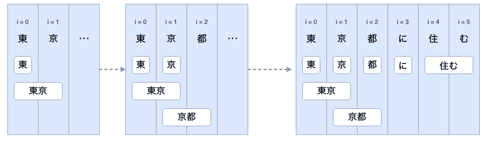
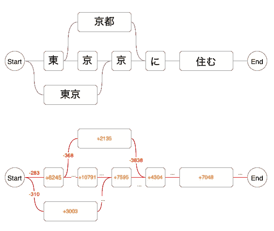

# 日语标记器是如何工作的

> 原文：<https://towardsdatascience.com/how-japanese-tokenizers-work-87ab6b256984?source=collection_archive---------19----------------------->

## 通过开源库示例深入探讨日语标记化及其组件(字典、点阵、维特比算法等)

我最近一直在研究 Kotori 和日本的 NLP 工具。我写这篇文章是为了分享我到目前为止对日语标记化及其组成部分的了解。

*如果你没听说过，* [*Kotori 是用 Kotlin*](https://github.com/wanasit/kotori) *编写的日语分词器和词法分析引擎。如果你喜欢这篇文章，请在 Github 上查看 Kotori 并给它一些星星。*


照片由 [Hiroshi Tsubono](https://unsplash.com/@hiro7jp?utm_source=medium&utm_medium=referral) 在 [Unsplash](https://unsplash.com?utm_source=medium&utm_medium=referral) 上拍摄

## 日本标记化者

在其他 NLP 任务(例如，文本分类)之前，标记化或者将文本分解成单词列表是重要的步骤。在英语中，单词通常由空格或其他符号分隔，这样更容易标记。然而，在日语中，单词之间通常没有任何空格。日语标记化需要阅读/分析整个句子，识别单词，并在没有任何显式分隔符的情况下确定单词边界。

大多数日语记号化器使用 ***基于点阵的*记号化**。顾名思义，基于格的记号赋予器构建一个*格*(或者一个类似图形的数据结构)，它由输入文本上出现的所有可能的记号(术语或者子串)组成。它使用 ***维特比*** 算法来寻找通过格的最佳连通路径。

最流行的基于格的记号赋予器是 [MeCab](https://taku910.github.io/mecab/) (用 C++编写)。大多数开源的日语标记器库要么只是 MeCab 的包装器，要么是在不同平台上基于格的标记化的重新实现。

例如:

*   [Kotori](https://github.com/wanasit/kotori) 中的 *Kotlin*
*   [Sudachi](https://github.com/WorksApplications/Sudachi) 和 [Kuromoji](https://github.com/atilika/kuromoji) 在 *Java* 中
*   [Janome](https://mocobeta.github.io/janome/en/) 和 *Python* 中的 [SudachiPy](https://github.com/WorksApplications/SudachiPy)
*   [戈薇](https://github.com/ikawaha/kagome)在*走*。

[MeCab 的 IPA 字典](https://taku910.github.io/mecab/#download) (IPADIC)也是最受欢迎的字典。它被用作大多数分词器的基线或主词典。

在本文中，我将通过简化版的 Kotori 代码和 MeCab 参考资料详细解释基于格的字典和标记化是如何工作的。

# 词典

对于基于格的记号化器来说，*字典*是一个对象或数据结构，它提供关于可用的*术语*的信息，以及根据日语语法或概率这些术语应该如何彼此相邻出现。

尽管不同的记号赋予器库使用不同的内存数据结构并读取不同的字典文件格式，但所有基于格的记号赋予器字典共享几乎相同的接口或逻辑结构。

在本文中，我们将研究 [MeCab 的字典格式](http://taku910.github.io/mecab/dic.html)。具体是 MeCab 的 IPADIC，你可以在这里下载[(自己看内容和笔记对比)。](https://drive.google.com/uc?export=download&id=0B4y35FiV1wh7MWVlSDBCSXZMTXM)

记号赋予器字典由两个重要部分组成:

## 术语词典

Term-Dictionary (単語辞書 or *Lexicon*) is a list of known terms (or words). In MeCab’s dictionary directory, **all CSV files** together make up this term dictionary part.

例如，在 *Noun.place.csv* 中，您可以找到这样的行:

```
**東京,1293,1293,3003**,名詞,固有名詞,地域,一般,*,*,東京,トウキョウ,トーキョー

**京都,1293,1293,2135**,名詞,固有名詞,地域,一般,*,*,京都,キョウト,キョート

**札幌,1293,1293,3440**,名詞,固有名詞,地域,一般,*,*,札幌,サッポロ,サッポロ

**渋谷,1293,1293,4310**,名詞,固有名詞,地域,一般,*,*,渋谷,シブヤ,シブヤ
```

每个*术语*(或*行*)由多个*列*(或*字段*)组成，但只有**的前四列**对标记化很重要。

*   **Surface Form** (表層形): The string or term that should appear in the text.
*   **Left/Right Context ID** (左/右-文脈 ID): This is used for determining connection cost or how likely it is for a term to follow other terms.
*   **成本**:拥有这个术语的成本。成本取决于该术语被使用的可能性。成本越高，该术语使用频率越低或越罕见。

剩余的列是关于术语的附加特征(例如，*词性*、*规范化形式*、*发音*、…，等等)

注意事项:

*   实际上，术语词典又大又全。它通常包含几十万个术语(例如，在 IPADIC 中大约有 290，000 个术语)
*   Please don’t confuse *Dictionary* (辞書) with *Term-Dictionary (*単語辞書*)*. Throughout this article, I will use the *term-dictionary* to mean the table of terms part, while the *dictionary* would refer to the whole (term-dictionary + connection cost + others).

## 连接成本

Connection Cost (連接コース) is a cost structure to measure how likely it is for a term to be before or after one another.

连接可能性被解释为连接**前一单词的右上下文 ID** 和**后一单词的左上下文 ID** 的成本。

```
(Prev term's rightID, Next term's leftID) -> Cost
```

与术语的成本类似，连接成本越高，给定术语被连接的可能性就越小。

这个映射是 MeCab 字典中的`matrix.def`文件。文件结构非常简单。第一行是可能的 rightID 和 leftID 的数量(在本例中均为 1316)，后面是一列**(rigid，left id，cost)** 元组。

```
1316 1316
0 0 -434
0 1 1
0 2 -1630
0 3 -1671...1315 1313 -4369
1315 1314 -1712
1315 1315 -129
```

## 未知术语处理

除了*术语字典*和*连接成本*之外，另一个在实践中对标记化至关重要的字典组件是*未知术语*(或*超出词汇表*)处理策略。它用于识别术语词典之外的一些单词、子字符串或符号(例如人名)，并允许分词器跳过或分词它们。

在 MeCab 中，未知术语的处理是通过基于字符类型的启发式规则完成的(例如，连续的片假名字符可能是一个名词)。规则和字符类型在`unk.def`和`char.def`文件中定义。

在本文中，我将留下未知单词处理的细节，并假设术语词典包括文本中的每个术语。

# 基于格的记号化

如前所述，基于格的标记化是构建一个术语格，并通过该格找到最佳路径。

给定字典，记号赋予器将文本上“出现”的所有术语识别为子串，将它们连同它们的子串开始/结束位置一起添加到格中，然后运行算法来寻找连接术语的最佳路径。

简化的代码如下所示:

```
val lattice = Lattice.create()for i in 0..text.length { val terms = **findAllTermStartingAt**(text, i) for term in terms { lattice.add(term, startIndex=i, endIndex=i+term.length) }
    ...
}
...return lattice.findTheBestPath()
```

在示例代码中，我们使用`findAllTermStartingAt(..)`来查找字典中从该位置开始具有表面形式的所有术语。

For example, if `text="東京都に住む"`:

*   `findAllTermStartingAt(text, 0)` should return 東 (East), 東京 (Tokyo)
*   `findAllTermStartingAt(text, 1)` should return 京 (Capital), 京都 (Kyoto)
*   …



*作者图片*

注意:

*   拥有一个快速的`findAllTermStartingAt(..)`对于记号赋予器的性能非常重要。因此，该功能通常通过高效的字符串匹配/查找数据结构来实现，例如 *Trie* 或*有限状态转换器(FST)* 。我将把这些数据结构的实现细节留给以后的文章。
*   在所示的版本中，我们识别可能的术语，并在运行算法找到最终的最佳路径之前将它们全部保存在内存中。有些记号赋予器使用贪婪的或基于窗口的方法来主动删除不必要的术语，以保持较低的内存使用率。Kotori 使用所示的方法，因为我发现它更有效(又名。更快)，而且内存使用在实践中从来都不是问题。

`Lattice`是一个图结构，包含所有作为*节点*出现的术语。图的边连接从每个位置开始的节点(或术语)和在相同位置结束的节点。

For example, 東 (ending at index=1) connected to 京 and 京都 (starting at index=1).



*作者图片*

每个节点和连接都有与之相关联成本:

*   **节点**的成本(橙色)是其**术语的成本**(在*术语字典*中定义)
*   **连接的成本**(红色)是结束项的**右上下文 ID** 和开始项的**左上下文 ID** 之间的连接成本(定义见*连接成本*)。

请注意，除了表面术语中的节点，我们还需要在网格中包含两个特殊的节点。

*   一个特殊的*开始*节点`index=0, rightID=0, cost=0`
*   一个特殊的*端*节点`index=text.length, leftID=0, cost=0`

术语成本和连接成本代表了它们的使用频率。成本越低，术语和连接的可能性就越大。因此，分词器的目标是从头到尾找到**最小成本路径**(或“最佳”路径)。这样做将产生最有可能出现在日语中的标记序列。

## **维特比算法**

维特比算法是一种通过图寻找*最优路径*(或*最可能路径*，或*最小代价路径*等)的算法。大多数维特比算法的例子都来自于它与*隐马尔可夫模型*的应用(例如*词性标注*)。然而，我发现维特比算法在标记化中的用法非常不同。

我对基于格的符号化应用的维特比算法的解释如下:

> 为了找到从起点到 *tᵗʰ* 节点的最小路径，我们需要通过计算每条路径的总成本来考虑通过每个 *(t-1)ᵗʰ* 节点到 *tᵗʰ* 节点的路径，并从中挑选最小路径。

对于每个 *(t-1)ᵗʰ* 节点通向 *tᵗʰ* 节点:

*   (递归地)找出从*开始*到那个 *(t-1)ᵗʰ* 节点的最小成本/路径。
*   找出连接那个 *(t-1)ᵗʰ* 节点到 *tᵗʰ* 节点的成本
*   找到 *tᵗʰ* 节点本身的成本
*   把它们加在一起。这是从*开始*到 *tᵗʰ* 节点通过 *(t-1)ᵗʰ* 节点的**总成本**

然后，在通过不同 *(t-1)ᵗʰ* 节点到 *tᵗʰ* 节点的路径中，挑选总成本最小的路径。

实现这个算法的一个有效方法是**动态规划**。我们可以从最靠近起点的节点开始寻找最小路径，并重用它们到跟随它们的节点的最小路径。不断重复，直到我们计算出每个节点的最小路径。

```
for i in 0..text.length { for node in nodes.startingAt(i) { for prevNode in nodes.endingAt(i) { val prevTotalCost = prevNode.totalCost
      val termCost = node.cost
      val connectionCost = getConnectionCost(prevNode.rightId, node.leftId) val totalCost = prevTotalCost + connectionCost + termCost

      if (totalCost < node.totalCost) {

        node.totalCost = totalCost
        node.prevNode = prevNode }
    }
  }
}
```

执行算法后，可以找到从*开始*到*结束*的最短路径，即*结束*节点。我们只需要跟随`prevNode`指针回到*开始*节点。

这篇文章总结了我从零开始构建日语分词器所学到的知识。同样，如果你喜欢这篇文章或者想了解更多关于日语标记化的知识，请在 Github 上查看 [Kotori。](https://github.com/wanasit/kotori)

注意:Kotori 深受其他开源库的影响。特别感谢[阿蒂里卡](https://www.atilika.org/)(黑次)[工作申请人](https://github.com/WorksApplications)(须田)[外川智子内田](https://github.com/mocobeta)(贾诺梅)。

其他资源(日语):

*   Manabu Okumura, 自然言語処理の基礎 (book)
*   Cookpad Developers’ Blog, [日本語形態素解析の裏側を覗く！MeCab はどのように形態素解析しているか](https://techlife.cookpad.com/entry/2016/05/11/170000)