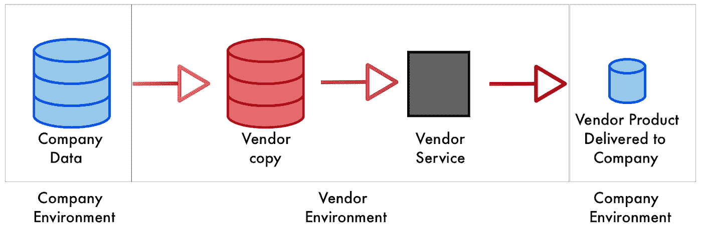
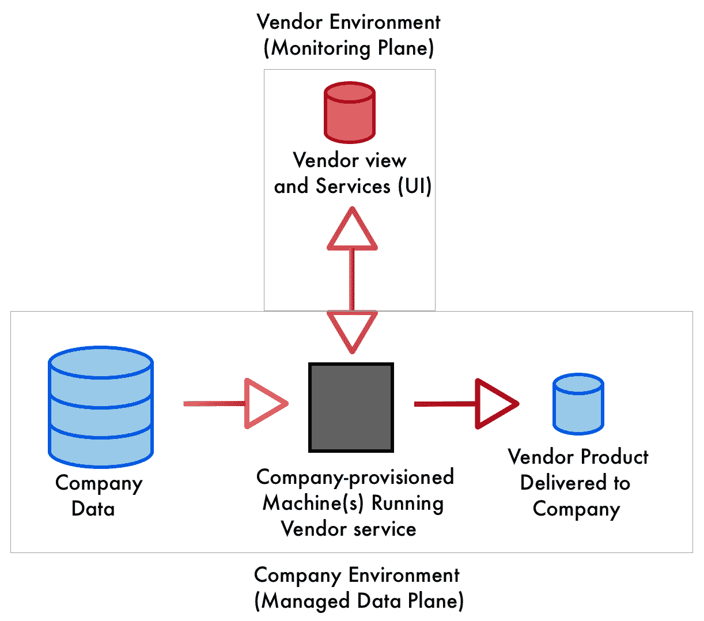

# Kubernetes 将如何为企业创造一种新的供应商类型

> 原文：<https://towardsdatascience.com/how-kubernetes-will-enable-a-new-genre-of-vendor-to-the-enterprise-3468dab2fc3f?source=collection_archive---------60----------------------->

来源:Pixabay

公司需要成为核心业务的专家，所以他们很少能成为其他领域的领导者。想象一下一家大型银行或航空公司每天处理的问题。他们的注意力应该完全放在对冲当前的金融风险状态以战胜市场或为他们的车队和客户处理物流上，而不是设计下一代数据系统、人力资源系统或招聘软件。对于大多数非核心业务应用程序，公司不觉得有必要重新发明轮子，但当涉及到数据处理和集成等技术基础设施时，企业还没有能力利用专家和创新者——“购买”与“构建”的选项还不真正存在。

**付钱给别人建造只对少数人有效**

为了利用专家，企业可以外包或与供应商合作。外包会将城堡的钥匙交给第三方，从而带来严重的隐私和安全风险。我亲眼目睹了与他们中最优秀的人(例如麦肯锡)导致 7 位数以上的账单和 B 级可交付物/技术的组合，这使得路线不太理想。

**供应商整合— SaaS 需要信任**

大多数公司负担不起麦肯锡，因此需要建立或与供应商合作，这两者的前景都不太乐观。大多数数据处理和编排供应商都是在 SaaS 模式下运营的，在这种模式下，最先进的技术包括复制数据，将其发送给供应商，然后让他们处理数据，并将其连同派生资产(例如“产品”)一起发送回其所有者。报告、机器学习等。对于企业来说，这可能会令人望而却步；合同和政策可能会阻止数据向外部发送。即使他们不这样做，复制数据的整个概念也限制了你可以用它做什么，因为它的血统在被复制后不能被保留。最后，每次向外部公司提供数据时，安全风险都会增加。当数据被复制并存储在第二个位置时，网络攻击的范围立即扩大了一倍。

来源:作者

想象一下，一家大型公共银行向一家小型初创公司提供账户数据，这可能有助于他们更快地收集见解——这几乎不可能。在一个对错误零容忍的领域，依靠一家初创公司来管理复杂的隐私和监管环境基本上是行不通的。更不用说将数据复制给第三方会带来的安全风险了。

**On Prem 解决方案？**

这是一个几乎没有内部替代方案的空间。因此，还没有一整类工具来满足注重安全性和隐私的企业。任何不能在内部托管的东西都不可能被使用。一些尚未突破到企业的技术示例包括 ELT 提供商( [FiveTran](https://fivetran.com/) 、 [Stitch](http://stitchdata.com) )、大多数转换工具([雪花](https://www.snowflake.com/)、 [dbt](https://www.getdbt.com/) )、机器学习( [Alteryx](http://www.alteryx.com) 、 [BigSquid](http://www.bigsquid.com) )等等，但基本上是数据处理和管道领域中任何无法托管的公司。

**企业在远离核心业务的地方浪费时间**

重要的是，这意味着企业无法利用这些领域的专家。公司没有使用定制的解决方案来充分而周到地解决问题，而是被迫成为专家来选择、组合、组合、调整和操作复制现有解决方案所需的各种不同的开源堆栈。实际上，几乎每个公司都应该专注于自己的核心业务，而不是重新发明轮子。

**Kubernetes 可以实现云的易用性以及本地的私密性和安全性**

供应商集成历史上只有几个变种:a) SaaS，供应商从客户端复制数据，并在供应商的环境中处理数据；b)本地，供应商提供在本地运行的应用程序(例如 GitHub 企业)。从技术角度来看，新技术只是在最近才使得公司从(a)获得监控、控制和可见性，同时从(b)保护隐私和安全成为可能。例如， [Kubernetes](https://kubernetes.io/) 有能力允许供应商管理公司服务器上存在并运行的服务。一种服务，其中所有数据都单独保存在由您的公司完全控制和保护的环境中，同时仍然为供应商提供丰富的可见性和监控。

来源:作者

拥有数据处理专业知识的供应商首次可以打包、交付、监控和维护托管服务，这是一种在公司的 Kubernetes 环境中运行的数据平面。所有公司数据都可以驻留在托管数据平面内，并且永远不会离开。除此之外，供应商能够将典型的云管理 SaaS 的所有优势作为供应商运行的外部服务来提供。随着控制平面与客户安装的数据平面配对，公司仍将能够享受精美的 UI 和整合的管理，从而提供与当前行业标准几乎相同的客户体验。

使用这种由 Kubernetes 推动的方法来创建托管数据平面的好处是多方面的:

*   **成本和时间**与其将昂贵且耗时的数据传输到基础设施之外的第三方，不如就地处理。数据传输通常是云账单中最大的项目。
*   **隐私和安全**所有数据都驻留在公司的基础设施中，绝不会离开。企业将能够高枕无忧，因为它知道自己能够完全控制其数据的安全性和隐私。
*   **工程时间**不再需要成为操作复杂、分布式处理引擎的专家，外包给专家现在是可能的。
*   **与基础设施无关**以这种方式构建的解决方案将在托管和云环境中不受基础设施的影响。

此外，Kubernetes 为您的基础设施上存在的低延迟应用提供了新的可能性。想象一下，能够插入立即发生的新服务(提供托管机器学习、报告或分析)，而无需通过互联网传输的费用。测试供应商变得简单而轻松。

这种方法存在挑战。对于供应商来说，这种运营模式需要深思熟虑的应用程序工具和整合监控方法。供应商必须拥有可扩展的流程来管理和监控*成千上万*的外部客户数据平面，而不是管理一个或几个供应商托管的多租户环境。所有好的范式转换都有一定的复杂性。

毫无疑问，下一代技术基础设施供应商将利用像 Kubernetes 这样的工具来构建可供最大的企业使用的技术，而没有运营或业务风险。唯一真正的问题是，哪些行业和供应商将首先支持这种新模式。河口致力于援引这些隐私，安全和客户信心的设计原则。