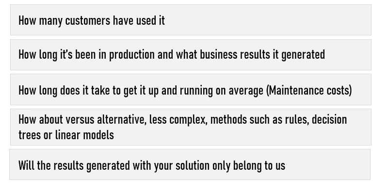
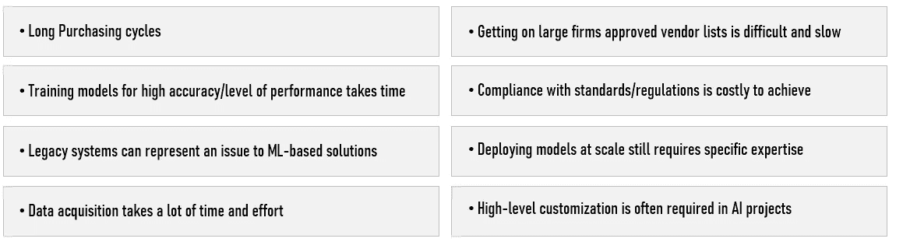
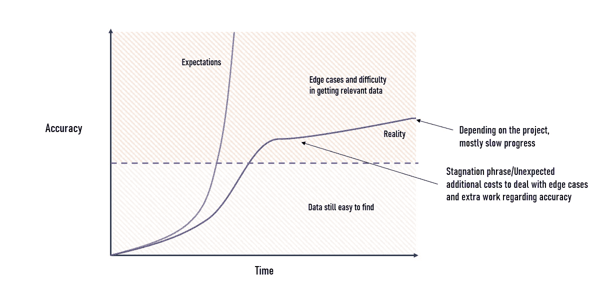
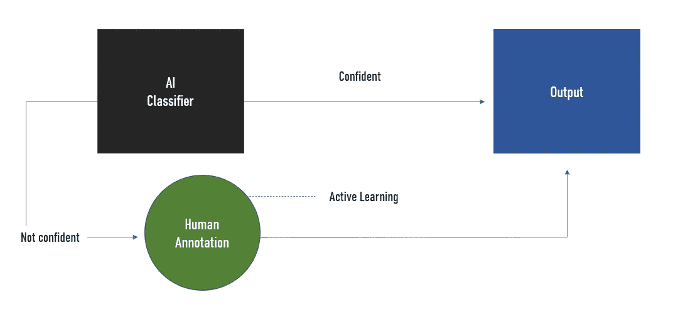

# 大公司如何评价 AI 创业公司

> 原文：<https://towardsdatascience.com/how-large-companies-evaluate-ai-startups-ef0f5f8da40e?source=collection_archive---------18----------------------->

## 我在一家大型国际公司的 ML 项目中与几家初创公司合作的经历。

由 [Startaê Team](https://unsplash.com/@startaeteam?utm_source=unsplash&utm_medium=referral&utm_content=creditCopyText) 在 [Unsplash](https://unsplash.com/?utm_source=unsplash&utm_medium=referral&utm_content=creditCopyText) 上拍摄的照片

作为一名人工智能顾问，我经常需要评估人工智能初创公司，以确定他们的解决方案对我们是否有意义，以及他们是否能成为长期的真正商业伙伴。我们评估初创公司的过程或多或少类似于风投所谓的**尽职调查**。

这种评估 ML 初创公司的需求来自于这样一个事实，即我们既需要将我们的流程数字化，以保持我们在行业中的地位，也需要初创公司的增加，这些公司的口号通常是人工智能、算法、深度学习、平台、部署等词的混合...

在几次成功的合作之后，我开始更好地注意到失败的 ML 创业的早期迹象，并理解机器学习的问题。在本文中，我将介绍我遇到的一些最常见的问题。

> 尽管大肆宣传，依赖机器学习并不总是商业问题的最佳解决方案。在很多情况下，我们对创业公司感到失望…

在进入细节之前，我想更好地定义我所说的**失败**是什么意思。我对初创公司的定义是，要么由于机器学习的性质而无法实现预期，要么无法成长为一个可行且自我可持续的企业，并且永远不会真正找到一个好的商业模式。然而，他们仍然可能被更大的公司收购，但他们不会作为独立的公司生存下来。

# 商业问题

从技术的角度来看，我看到越来越多的初创公司使用“新”人工智能方法来开发令人兴奋的商业应用程序，如 **Zero-shot learning、GANs 或联邦学习**，但当涉及到让企业更有利可图时，他们就像非科技初创公司一样挣扎。

**机器学习 vs …** 我首先想到的是，相当多的人工智能初创公司倾向于低估非人工智能和人工智能的竞争。事实上，对于许多重要的商业问题，竞争非常激烈，当涉及到应用于特定商业问题的人工智能时，行业已经不堪重负(例如，预测客户流失的机器学习)。

老实说，机器学习本身并没有给你太多的优势，因为主要目标是把它卖给用户，并完美地满足他们的需求。大多数公司将需要一个定制的解决方案，无法将额外的财务和时间资源用于管理所谓的“易于处理的人工智能解决方案”。

我注意到的另一个问题是，大多数人工智能团队从试点客户开始，这已经是一个相当大的挑战。**我可以向你保证，说服一家大公司相信一家随机的初创公司是极其困难的**。

在接受与 ML 初创公司建立 PoC 之前，我们会询问以下问题:

投资通常很高**(通常在 2 万到 15 万美元+维护成本)**原因很明显，因为解决方案可能是定制的。对于初创公司来说，这是一个长期资助产品开发的好方法，并且可以获得更多至关重要的数据。

> 文思海辉科技发布的一份[白皮书](https://www.prnewswire.com/news-releases/pactera-white-paper-reveals-85-percent-of-ai-projects-ultimately-fail-300871826.html)称 85%的人工智能项目失败。哎呀。

**然而，这些试点项目通常解决非常具体的问题，这些问题很难转移到其他公司和用例。**不幸的是，大多数大公司都需要高水平的定制，这对于初创公司来说很难实现。让试点项目适应其他客户的困难可能会成为一个真正的问题。的确，没有多少创业公司可以在没有定期“出货”的情况下生存下来。

基于 ML 的解决方案通常需要定期重新培训，以适应数据的动态特性，并针对特定的客户或应用程序工作负载编写和调整算法。

**当谈到项目本身时，初创公司通常很难超越 PoC 阶段……许多原因可以解释人工智能项目的失败，但我将重点关注准确性预期、生产、管理成本、边缘案例管理和决策管理。**

*我通常对以下创业公司持怀疑态度:*

1.  承诺 100%准确率的 AI 创业公司往往令人生疑。我建议你不要期望完美的准确性，尤其是对于任何复杂的决策。此外，不要忘记准确性会随着时间和市场/社会的变化而下降(**例如:新冠肺炎对你的数据集的影响…** )。
2.  人工智能初创公司没有考虑到需要确定限制条件，以确定何时允许人工智能自主决策，何时由人类监督，以及何时它将简单地指导人类做出决策。
3.  人工智能初创公司没有试图预测/更好地理解边缘案例。根据您的业务问题，您可能会遇到边缘情况。对他们来说，所需要的努力在资源方面是巨大的，最终会毁掉你的项目。
4.  AI 创业公司很少提到 AI 应用一旦投入生产后的管理。缺乏处理数据漂移、黑天鹅事件(新冠肺炎)或在其有效域之外使用人工智能的计划可能是一个重大挫折。对模型进行频繁更新并引入新的竞争模型是至关重要的。与部署和警报相关的治理也是需要重点考虑的。
5.  人工智能初创公司无法回答以下问题:解决方案多久更新一次？随着时间的推移，他们打算何时集成新数据以使解决方案更加准确？

除了这些因素，失败的人工智能初创公司往往低估了这个词的重要性:**可扩展性**。我同意 Invoke Capital 创始人[迈克·林奇](https://www.wired.co.uk/article/artificial-intelligence-startups-investment)的观点，他说当前人工智能炒作的现实是，许多成功获得资金的公司对他们问题的困难性质以及如何在现实世界中测试其人工智能的鲁棒性缺乏理解。

太多次了，我看到有前途的人工智能初创公司设法与一家大公司开展了一个有趣的试点项目，但后来未能创建一个可靠的商业模式，一支出色的销售团队，或理解向大公司/大规模销售的困难。

大公司漫长的采购周期会给人工智能初创公司的生命带来风险。我见过许多首席执行官，他们等不起大公司来决定他们是否需要人工智能解决方案。下面，我列出了人工智能初创公司最常见的威胁。

因此，我接触过的大多数人工智能初创公司都很难在为早期客户做项目和投资一个**可扩展**产品(高收入)之间找到正确的平衡。我同意 Starsky Robotics 首席执行官 Stefan Seltz-Axmacher 的观点，他说“许多人工智能团队最终成为工程顾问”。他们从客户那里获得了丰厚的收入，但最终并没有真正卖出一件产品。”

除了我对人工智能创业公司前景的看法之外，我非常清楚风投并不积极评价这种情况。**他们的目标是看到实施成本有限的可扩展产品。**

事实上，云操作可能比传统方法更加复杂和昂贵，特别是因为没有好的工具来在全球范围内扩展人工智能模型。

我再次同意迈克·林奇的观点，他说“虽然人工智能技术在解决某些问题时很有用，但它们并不是在所有情况下都适用。**给旧软件添加一个现成的算法不一定能教会它新的技巧。”**

**财务利润率 vs SaaS** 另一个有趣的方面是人工智能创业公司的平均利润率相对较低。事实上，这一比例通常在 50%至 60%之间，远低于 SaaS 同类企业 60%至 80%的基准。

**也许这种“低”利润可以解释为 ML 的云计算时间的高成本，以及清理训练和维护人工智能系统准确性所需的数据所需的人力资源。**

尽管清理培训数据所需的人工方面可以外包给第三方，但这些服务可能是一项重大投资，即使外包给低收入国家也是如此，并成为隐私挑战。

也意识到 AI 项目中数据准备步骤往往被低估。与收集和清理数据相关的简单任务可能会变成漫长而令人沮丧的过程。这可以用沟通不畅和不良预期设定来解释。

部署也往往被低估…

# 机器学习与期望

我们在 ML 方面最大的问题与边缘案例、人为干预和可解释性有关。在一个项目的开始，我们可能认为边缘情况或解释结果的需要永远不会成为一个重要的问题，然而…

> **边缘案例:**每个人工智能应用都不可避免地会遇到解决方案不能按预期执行的场景。

您的模型变得越精确，就越难找到对项目整体性能至关重要的特定边缘案例的数据集。此外，模型越好，改进模型所需的数据就越准确。

> 双方通常都低估了对数据的持续需求。

一个容易犯的错误是期望 ML 性能有指数级的提高。在我管理的大多数计算机视觉项目中，随着时间的推移，提高精确度的成本总是在增加，遵循一条 S 曲线。由于有监督的机器学习，人工智能初创公司往往会在几周后向你承诺 100%的准确率，但最终往往表现不佳。

**最终精度步骤的问题**

对数据的需求也是一个问题。事实上，大型神经网络通常比线性模型需要更多的训练数据。通常，当模型中的要素数量很大时，所需的数据量往往会呈指数级增长。

Stefan Seltz-Axmacher 概述的另一个关键方面是，随着模型的进展，人类监督的必要性必然会下降。然而，根据你选择的领域，可能需要几年时间。从人工智能创业的角度来看，你的错误率越低，就越难改进，这又会成为一个问题，这取决于领域。

**回路中的人类**

另一个重要的问题是人工智能过程中经常需要人的参与。尽管有精确标记的训练数据(这很少)和非常好的模型，“人在循环中”的必要性永远不会完全消失。

从成本角度来看，需要有人来保持您的解决方案产生准确的结果，这可以使您重新考虑与其他更依赖于更好的界面的成本更低的解决方案相比，人工智能实现的相关性。

**可解释性**

在许多行业或用例中，理解结果背后的逻辑是关键。如果你的客户非常依赖传统的统计方法，他们不太可能接受一个模型不可解释的解决方案。解释你的算法如何工作的能力也是你专业知识的证明。

> 实际上，如果结果可以解释，产品经理更有可能接受 ML 建议。

**我们经常遇到人工智能初创公司在解释我们的概念验证中可用的结果时遇到问题。不用说，正因为如此，我们对生产的发展没有信心。**

我相信，要么你是在建立你的模型来解释或预测什么。大多数时候，一个更擅长解释现象的模型并不擅长预测它。

此外，准确预测结果的模型通常具有非常明显的特征，并且构成了预测能力的很大一部分，因此这并没有给它们很大的解释能力。

除了上面提到的与 ML 相关的问题，我还可以解释与基于 ML 的迁移学习能力差相关的问题。

# 掌握商业基础

**除了机器学习，人工智能创业公司为什么失败的根本问题大多与商业基础有关。**人工智能初创公司需要控制走向市场的机制，创造产品的价值主张，找出他们真正的竞争优势/可防御能力、可扩展性、客户吸引力等。

技术差异化在 AI 行业很难实现。事实上，新的模型架构大多是在开放的学术环境中开发的。此外，可以从开源库中获得预训练模型，并且可以自动优化模型参数。

最后，数据是人工智能产品最重要的方面，然而，它通常归其他公司所有，在公共领域可用(开放数据)，或者最终成为商品。

作为一家人工智能初创公司，取得成功极其困难。特别是对于机器学习需要以 100%的准确率执行的用例...