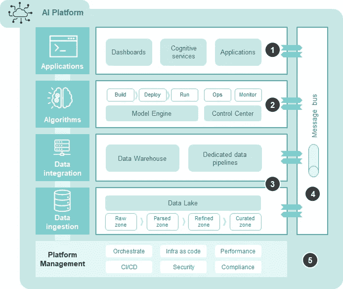
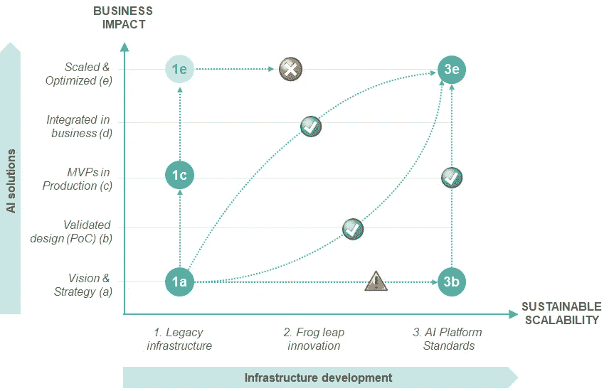

# 领先公司如何扩展人工智能

> 原文：<https://towardsdatascience.com/how-leading-companies-scale-ai-4626189faed2?source=collection_archive---------22----------------------->

## 构建人工智能生产平台的五个关键原则

ID 43061079 康斯坦丁·沙克莱因| Dreamstime.com

人工智能超越了炒作，进入了产业化阶段。关于人工智能的必要性的信念非常普遍——在各行各业都是如此。然而，只有大约 5%的全球企业为人工智能的工业化增长做好了准备(根据这项[研究](https://www.accenture.com/us-en/insights/artificial-intelligence/ai-investments))。为了获得真正的好处，组织需要能够扩展人工智能解决方案。这听起来很明显:每个人都在谈论人工智能，而缩放是游戏的名字。

但是 scaling AI 到底是什么意思呢？这对组织的数据和技术堆栈提出了什么要求？这与大多数传统基础设施有何不同？您如何构建技术能力来满足这些新的需求？

反思我自己支持大型组织的人工智能之旅的经历，我将试图阐明这些问题。

# **缩放 AI**

人工智能的采用展示了与过去任何其他重大技术革命相同的模式。普遍电气化用了 30-40 年。AI 也不会有什么不同。根据阿马拉定律，一项新创新的影响在短期内通常会被高估，但在长期内会被低估。潜在的原因是，在技术的真正潜力出现之前，应用技术的环境需要改变。对于人工智能来说，这种现象被称为人工智能生产率悖论。为人工智能建立一个概念证明并展示其所有令人惊叹的壮举似乎很容易。但是在整个企业的运营过程中实施和扩展人工智能是完全不同的事情。我们来看看 scaling AI 到底是什么意思。

***规模***
假设一家全球化学品生产商使用来自机器的传感器数据来预测故障并实施预防性维护措施。泵或压缩机是一个典型的例子。他们在世界各地的不同植物上有数千个这样的基因。有不同类型的压缩机，具有不同的故障模式和相应的预测数据模式。为这种类型的机会开发人工智能解决方案将从一种特定类型的设备的机器学习模型开始，并测试不同的机器学习技术。缩放意味着在全球范围内为相同的设备推出这些模型，随后为每种不同类型的泵或压缩机重复这些步骤。您甚至可以通过构建一个系统来自动训练、实现和缩放不同类型设备的模型，从而实现这些步骤的自动化。包括影子模型在内，这可能相当于成千上万的算法全部在生产中运行。

***范围***
另一种形式的规模化 AI 是指 AI 在不同团队、部门、针对不同用例的无孔不入的使用。大规模部署人工智能意味着组织中的任何人都可以使用机器学习来优化工作流程——也就是人工智能的民主化。尽管人工智能的影响并非不受帕累托原则的影响——80%的价值将与 20%的潜在用例坐在一起——但最终机器学习的使用将随处可见。允许这种情况发生显然需要一些标准化和结构化的能力。

***速度***
也许最微不足道的可伸缩性形式都与基础设施资源有关。根据人工智能解决方案的类型，需要易于扩展的存储、内存或计算资源。例如，训练深度神经网络可能需要大量的内存和计算能力。运行算法来产生预测(也称为推断)通常比训练需要更少的计算能力，但同时需要提供低延迟。也就是说，如果你想向一个在线浏览的顾客推荐下一个要购买的产品，这必须在几毫秒内完成。当你的网站同时与数以百万计的客户互动时(想想亚马逊)，每一次互动都会引发必须同时进行计算的推论。

能够大规模产业化人工智能的领先组织在以下三方面做得特别好:

*   他们设定方向并遵循路线。人工智能的采用是一个循序渐进的过程。它需要愿景、战略和一个将快速取胜与规模化路线相结合的游戏计划。高层领导的持续承诺是长期成功的关键。你必须全力以赴，但要有聪明的专注和毅力。
*   **他们有人工智能解决方案开发和实施的剧本。**人工智能驱动的商业创新遵循一个典型的生命周期，从想法或概念证明到经过测试的原型、MVP 以及最终实施的生产级解决方案。一个行之有效的方法来重复做这件事，使逐渐发展和扩大新的人工智能机会领域，并成为一个真正的人工智能驱动的组织。
*   他们有一个支持大规模人工智能的技术平台。 AI 解决方案对技术架构提出新要求。设法扩大人工智能规模的公司已经开发了标准化平台，允许以稳健和可持续的方式快速开发人工智能解决方案。

接下来的章节将探讨构建一个允许扩展人工智能解决方案的技术平台的五个原则。

# 构建可扩展人工智能平台的五个原则

在最高级别上，人工智能的可扩展性需要平台功能，将数据架构中两个以前分离的领域结合起来:数据的操作或交易方面，以及用于分析或建模的数据的分析使用。人工智能平台构成了桥梁:它消耗数据来产生经过训练的机器学习算法，这些算法随后被部署为运营领域的生产级服务，供应用程序和用户用于决策。就这么简单。以下是构建可扩展人工智能堆栈的五个原则。

人工智能平台的高级参考架构

## 1.作为微服务的算法

将机器学习模型投入生产的经典方法是建立一个管道，该管道接收最新的输入数据，使用该输入运行模型，并将输出存储在数据库中。使用预测的应用程序随后可以从该数据库中获取数据。虽然这种方法本身没有什么问题，但是它的可伸缩性不是很好。现代 ML 用例需要按需预测，每秒钟可能有数千个请求。因此预测流水线不能被提前调度。此外，它需要能够根据工作负载快速扩展。

部署 ML 模型的新兴最佳实践是将它们与构建在其上的 API 一起打包成带有容器的微服务(如 Docker)。容器化是应用程序开发的最新范式，具有许多也适用于人工智能应用程序或认知服务的优势:

*   **可重用性和松耦合**。将 ML 模型部署为容器允许任何其他应用程序在没有任何依赖性的情况下利用这种预测服务。模型变得独立。基于松散耦合的微服务，共享相同的算法，构建多个人工智能系统变得非常容易。预测是按需完成的——因此有了术语*认知服务*。
*   **自动缩放&调度。**一旦模型被部署为容器，所需的资源(如计算)就可以根据工作负载通过容器编排服务(如 Kubernetes、AWS Elastic Beanstalk 或 Azure App Services)进行扩展。
*   **便携性。**由于算法被打包成一个可以在任何地方执行的通用容器，算法在操作过程中的使用不再依赖于特定的工具。此外，容器是平台无关的。它们可以很容易地从一个云移动到另一个云，并以高度分布式的方式运行。这使得在接近数据的位置公开算法变得容易(例如在边缘应用中)。

结合起来，容器化为将算法投入生产提供了一种高度标准化、灵活且可扩展的方法。

例如，考虑一家开发了违约概率(PoD)模型的金融服务公司。该算法用于新客户的核保流程。但它也可以作为定期资产风险评估的一部分应用于现有客户。该模型作为独立的服务运行，可以调用该服务来基于不同的输入数据进行预测。因此，它已经成为一种非常可扩展的认知服务，可以跨不同的应用程序和流程使用。

## 2.构建和管理算法的工厂方法

将算法作为微服务来生产需要一条具有适当质量管理和控制机制的流水线。产生算法的一种*六西格玛*方法:

*   **标准化&自动化工作流程**。需要一个标准化的工作流(装配线)来实现算法的可扩展生产，而不是为每个单独的用例构建特定的工作流。考虑到模型不是一次性开发的，而是需要持续的维护和再培训。因此，对数千种型号重复进行这种大规模操作需要完全标准化和自动化的装配线，可以复制用于任何新的人工智能解决方案。装配线获取源数据，将其转换为机器学习训练的格式，开发模型，设置验证集，在测试集上测试模型性能，最后将模型部署为容器。
*   **性能监控&发明。**六个西格玛旨在减少制造过程中的差异:质量的上限和下限必须超过标准偏差的 6 倍，这意味着缺陷率为百万分之 3.4。类似地，模型预测将落入一个带宽内。监控这种*样本外的*性能，即模型在实践中而非历史数据上的表现，对于检查算法至关重要。例如，这包括提高预测能力、减少偏差和触发再训练以减轻概念漂移。
*   **可追溯性。**在欧洲，新法规要求组织能够解释影响客户的算法决策。负责任的人工智能正在成为一个热门话题。因此，追溯模型版本的能力，包括附带的训练数据，正在成为一个必要条件。就像设备和制造零件有序列号一样，算法需要透明和可追溯的生产流程。因此，模型装配线需要以一种有组织的方式存储所有相关的工件(输入、输出和废料)。

对于许多渴望大规模使用人工智能的组织来说，迈向模型生产的标准化装配线是一个巨大的挑战。尽管在这方面有巨大的行业创新，并且许多组件都可以作为标准化(云原生)服务获得——例如用于 AWS 的 Sagemaker，或者 Azure ML——但是仍然需要相当多的专业工程来将所有部分组合在一起。

## 3.多条数据集成路线

前两个原则是全新的，是人工智能到来所固有的。第三个原则与数据管理有关，这通常是与传统环境斗争的根源。

人工智能的创新需要比大多数传统数据架构更大的数据集成灵活性。
企业数据仓库的建立是为了提供一个*真实的单一来源*，在此基础上可以构建数据产品。数据的高度完整性和高效重用是以僵化和高额前期投资为代价的。这适用于稳定的用例，这些用例可以提前很好地定义，并且基于结构化的和缓慢移动的数据——例如企业报告。人工智能解决方案有更广泛的需求，介于传统的 BI 产品和商业应用之间。如上所述，它们结合了数据的操作和分析用途。因此，需要一种更加通用的数据管理方法:

*   人工智能需要在生产中进行实验。MVP 上线后，人工智能解决方案将进入下一个生命周期的持续改进阶段。这通常会导致添加新功能(数据)来优化性能。dwh 的长开发周期与人工智能驱动的创新的敏捷和迭代性质不匹配。
*   **AI 需要大数据**。基于机器学习的新创新通常来自于使用新的数据源，潜在的海量和非结构化数据。传统的数据集成平台不能满足这些需求。

为了促进快速的人工智能驱动的商业创新，你的人工智能平台需要支持数据集成实践，在灵活性/创新和鲁棒性/稳定性之间取得正确的平衡。这可以通过允许本地数据集成路线来实现:

*   **仅用于核心数据(ETL)的数据仓库。**DWH 概念并未消亡，但需要从企业级的*一刀切*解决方案重新构建为针对最重要数据资产的基于领域的数据集成。拥有一个坚实的数据仓库仍然是有意义的，例如客户和产品数据，它被所有信息产品用作单一的真实来源。
*   **直接数据管道(ELT)** 。对于用例特定的数据，需要第二条路线，该路线没有被指定用于 DWH 集成。许多人工智能解决方案需要核心数据(可以从 DWH 获得)和来自多个来源的非常具体的数据(例如点击流数据)的组合。与使用预处理集成步骤(ETL)构建大型 DWH 不同，所讨论的特定解决方案的数据管道在从多个源位置加载数据后处理数据集成(例如，用于核心数据的 DWH 和用于其他解决方案特定数据的数据湖)。
*   **分层数据湖。**为了支持特定于解决方案的数据管道，可以使用数据湖来存储包含不同区域或层的源数据，这些区域或层具有不同程度的数据预处理。这些区域为集成层的不同组件提供信息，例如为 DWH 或开发沙盒提供原始数据。可以建立一个包含精选数据的区域，为特定于解决方案的 ELT 数据管道提供数据。

## 4.多模式数据交换:从批处理到基于事件

可扩展 AI 部署的数据架构的另一个关键特性是支持多种数据交换模式，特别是支持实时数据的使用。这是 IT 集成的传统数据架构(连接应用程序环境)与用于分析目的的现代数据使用(提供实时 BI 或 AI)相融合的地方。

实时数据交换的主要范例是使用基于例如 Kafka 消息平台的事件驱动架构(EDA)。EDA 对于将模型部署为微服务来说是理想的，正如上面在#1 中所描述的，但是它是一个更广泛的概念，可以作为所有数据交换的主干。源数据中的任何更新都作为单独的事件发布，这些事件可以由数据集成平台和管道处理，它们*实时监听*这些事件。人工智能平台连接到 EDA 以获取数据，并反过来部署经过充分训练的算法，这些算法可以通过按需提供预测来对事件做出反应。

## 5.利用云组件进行敏捷开发

第五个原则是将敏捷开发方法应用于您的平台基础设施。传统数据架构和基础设施的特点是基于供应商的整体系统，这些系统旨在作为一种通用的平台运行。众所周知，这些基础设施落后于形势，甚至在完全实施之前就迅速变得过时甚至过时。以 nirvana 最终状态视图结束平台迁移已成为常态。

平台开发的现代方法是使用最佳组件构建更灵活的架构。这既是必要的，也是可能的。

**有必要**。有两个原因。首先，可替代性。构建一个针对不同组件使用不同技术的平台可以防止供应商锁定。第二，敏捷。技术发展的速度往往比任何人都快。构建一个由不同技术组件组成的平台，可以防止在单一提供商或技术上押下大赌注。交换技术和从多种创新来源中获益变得更加容易。

**有可能。**云原生技术和开源技术的结合使得将不同的平台组件缝合在一起成为可能。云创造了一个提供无缝集成的生态系统:它往往只是工作。标准乐高积木的使用允许一种 DIY 方法，而不会产生(太多)技术债务和定制基础设施，这些都必须在以后清理(因此循环是连续的)。

# 如何着手建立一个人工智能平台

一旦你同意了目的地，就该考虑旅程了。平台开发中最大的陷阱是由一个专门的平台团队孤立地进行开发。相反，应用敏捷开发原则#5，利用前端运行用例的需求来创新平台。参考下图，通过在两个轴上同步前进，从 1a 到 3e:开发解决方案和平台，这是一个很好的协同行动。

你对人工智能的愿景和战略需要从高层次的价值池转化为具体的人工智能解决方案设计。随后，最有前途的解决方案将经历一个结构化的开发周期——从构思一直到大规模优化解决方案。同时，这些第一解决方案对平台提出了要求。这提供了一个以非常实用的方式构建新平台组件的机会，可以立即在实际解决方案上应用和测试新功能。这是一个严格管理快速上市时间(y 轴)和构建高平台标准(x 轴)之间的权衡的问题。

替代方案是有风险的。业务团队最终构建难以扩展的单点解决方案(1c)，或者 It 团队花费数年时间构建几乎不被使用的平台(3b)，这不会是第一次。

很好奇听听大家对 scaling AI 的看法和体验！

沃特·惠根
mico company 的管理合伙人