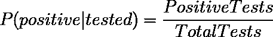

# 你遇到冠状病毒感染者的可能性有多大？

> 原文：<https://towardsdatascience.com/how-likely-are-you-to-meet-someone-with-coronavirus-4522d39487b7?source=collection_archive---------26----------------------->

最近，我看到一个帖子，问一个人在一定规模的人群中遇到新冠肺炎的可能性有多大。在这篇简短的文章中，我想描述两种计算这个数字的方法。

假设我们知道群体中随机个体为阳性的概率`P(positive)`，我们可以使用以下公式计算一组大小为 **N** 的个体中至少有一个为阳性的概率:

等式 1。

上面的等式表明，在一组大小为 **N** 的个体中，至少一个个体为阳性的概率等于 1 减去 **N** 个个体为阴性的概率。现在的问题是，如何估计`P(positive)`。

## 1.频率论者

一种简单的方法是将当前活跃病例数除以人口规模。

等式 2。

对于我居住的国家捷克共和国来说，在我写这篇文章的时候，这个值大约为 *P(正)= 0.867%* 。图一。显示了在人数为 **N** 的群体中遇到至少一个积极的人的概率，作为群体人数的函数。

图一。

## **2。贝叶斯**

如果我们要测试人群中的每一个人，那么频率主义方法没有任何问题，因为`P(positive)`会收敛到它的真实值。然而，事实并非如此。幸运的是，我们可以使用贝叶斯公式，通过插入以下公式来获得对`P(positive)`的更好估计:

等式 3。

等式 4。

等式 5。

计算条件概率`P(positive|tested)`很简单，因为它只是阳性测试的数量除以所有测试的数量。类似地，随机个体被测试的概率`P(tested)`是所有测试的数量除以群体大小。一个阳性个体被检测到的概率`P(tested|positive)`有点复杂，因为我们并不知道人群中阳性者的真实数量。这也取决于给定国家的测试策略，他们是否只测试有症状的人，等等。我决定对此不做任何假设，并将值设置为 0.5。同样，对于捷克共和国，贝叶斯估计得出 P(正)= 3.075%。

现在我们有了所有的数字，让我们把它们代入等式 1。画出在一个规模为 **N** 的群体中遇到一个积极的人的概率，作为群体规模的函数。

图二。

如图 2 所示。显示，现在有问题的概率要高得多，对于一个 50 人的小组来说，一个人有大约 80%的机会遇到一个积极的人。

现在让我们将`P(positive|tested)`设置为过去 7 天的平均测试阳性率。我们现在得到 *P(阳性)= 8.687* %,在 50 个随机人群中遇到 COVID19 阳性者的概率几乎是 100%。

图 3。

**关于 P 的一个注记(tested|positive)** 前面提到过，我们无法真正知道测试一个阳性的人的概率。让我们画出等式 3。作为`P(tested|positive)`的函数，看看我们能学到什么。

图 4。

对于 *P(tested|positive)=1 的情况，*即我们测试每个人，概率`P(positive)`收敛于频率估计。随着`P(tested|positive)`变小，`P(positive)`的贝叶斯估计变得越来越大。这在直觉上是有道理的，因为一个阳性的人接受检测的机会越小，已知的阳性病例就越少，因此频率主义者的方法低估了`P(positive)`的真实价值。它还表明，尽可能多的检测是至关重要的，鉴于可能有许多无症状的病例，尽可能一致地进行检测，以便最大限度地提高检测阳性者的概率。否则，对阳性病例的简单频率估计会给我们一种错误的安全感。

## 假设

为了本文的目的，我对这个世界做了一些假设。首先，我假设人们在随机的群体中相遇，因此任何一个个体都有同等的可能遇见群体中的另一个个体。这显然是不正确的，因为人们更有可能遇到来自同一个城市/地区/学校/工作场所的人，而不是来自国家另一边的人。第二，我假设阳性人群不会被从人群中移除，也就是说，他们不会隔离、康复或死亡。第三，我假设每个个体只被测试一次，群体之外的人不被测试。

***保持安全，戴口罩，避开大群人群。***

如果你喜欢这篇文章，请把它推荐给其他人，展示一下❤。此外，如果您有任何问题或意见，请在下面留下您的意见。