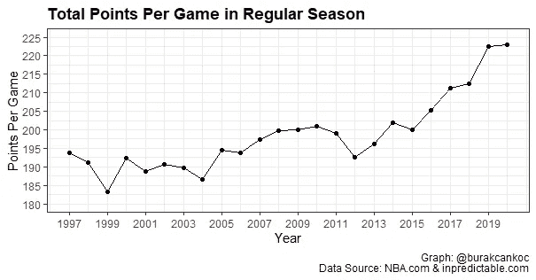
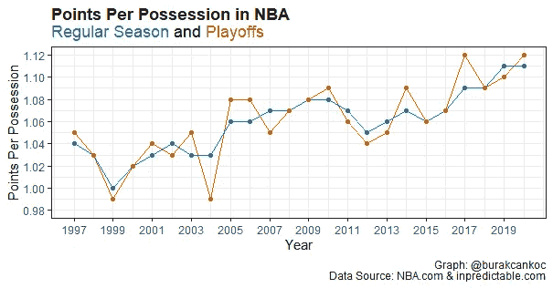
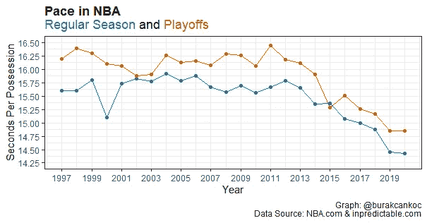
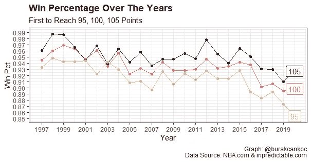
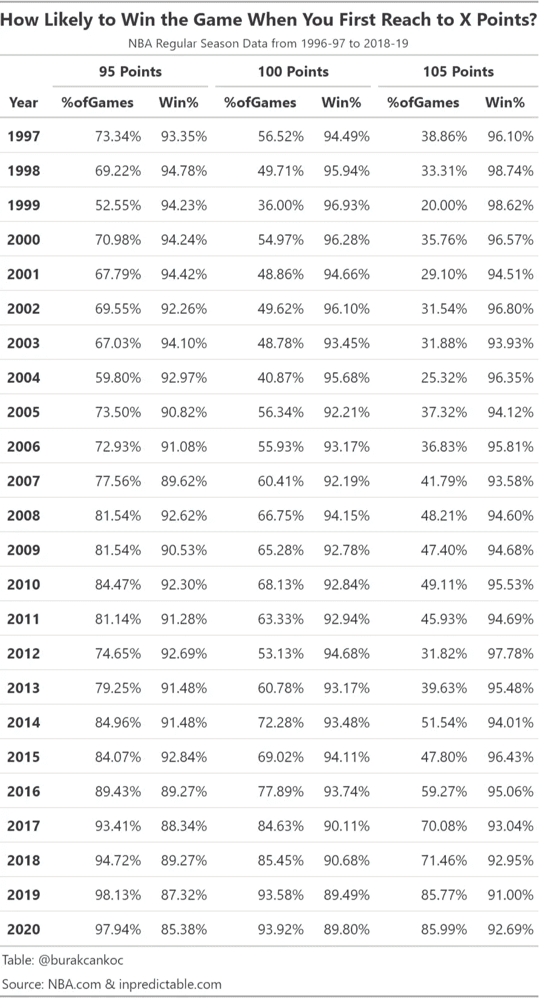

# 当一个球队在 NBA 第一次达到 X 分时，赢得比赛的可能性有多大？

> 原文：<https://towardsdatascience.com/how-likely-to-win-the-game-when-a-team-first-reach-to-x-points-in-nba-f9de84eb6966?source=collection_archive---------52----------------------->

正如我在之前的博客文章中所讨论的那样，NBA 的进攻是围绕着超级巨星展开的。这些年来，随着人才库的增加，比赛也发生了变化，联盟也从这种变化中受益。

由[阿琳·德·戴娜](https://unsplash.com/@alinedenadai)在 [Unsplash](https://unsplash.com/photos/j6brni7fpvs) 上拍摄的照片

这篇文章的灵感来自哈佛体育分析的一篇文章。我想把它延长几个赛季，并探索 NBA 进攻发展背后的原因。这也可能让人们理解为什么最近几年比以往任何时候都有更多的回归。

前面已经说了，有一个非官方的定律， [**劳勒定律**](https://lawlerslawtracker.com/) ，是洛杉矶快船播音员拉尔夫·劳勒(Ralph Lawler)创造的，几年前以他的名字命名。显然，对于这种分析来说，100 是一个任意的数字，但是当我们检查 NBA 一场比赛的总得分时，它似乎是一个合理的数字。

在这里，最好从评分随着时间的推移是如何变化的开始。下图代表了从逐场比赛时代(1996-97 赛季)开始到 2019-20 赛季的得分输出。

NBA 每场比赛的总得分——作者图片

公平地说，这是一种趋势，特别是在 2014-2015 年之后，得分总数大幅增加。这种变化得到了统计方法 t 检验的支持，我们可以说在 NBA 最近的历史上有两个不同的时代。t 检验给出的 p 值为 0.00228，使我们可以说两个时代的平均值之间存在显著的统计差异。

为了理解这种变化背后的原因，我深入研究了几个数据:过去 24 年的每场得分和速度。毫不奇怪，比赛变得比以前更快，由于速度和人才储备的增加，NBA 的进攻比以前获得了更多的分数。

1996-97 年至 2019-20 年 NBA 每球得分-作者图片

在这里，下面的图表代表了占有所花费的时间。所以，你每次控球花的时间越少，比赛就越快。大致可以估算一下:

->速度= 2880(总分钟)/(每次控球时间)/ 2(球队)

在分析的几年间，结果在 88-101 之间。

NBA 的步伐，1996-97 至 2019-20-作者图片

正如我在开始时提到的，在这篇文章中，我将会看看当一个队伍第一个到达某一点时，赢得比赛的可能性有多大。为了简单起见，我检查了 95，100 和 105 分阈值的情况，结果与 NBA 进攻的其他方面非常一致。

一队的胜率达到 95、100 和 105 分——图片由作者提供

在逐场比赛时代的早期(从 1996 年到 1997 年赛季)，首先达到 105 分几乎可以保证( **96.1%，98.74%和 98.62%** )获胜。然而，在过去的几年里，随着游戏的变化和加速，复出的机会大大增加了。首先达到 105 分显然给了球队巨大的优势，但这并不像上世纪 90 年代末那样多。详细的表格可以在下面找到，在赛季中至少有一支球队在单场比赛中达到给定分数的比赛百分比的附加列。

作者图片

表格还显示了我在本文开头提到的得分跳跃。当我们回顾 2014-2015 赛季时，至少有一支球队分别在 **59.27%、70.08%、71.46%、85.77%和 85.99%** 的比赛中获得了 105 分。

如果你想知道 NBA 的复出和比赛中的波动，你肯定需要查看迈克·布罗伊的网站:[**【inpredictable.com】**](https://www.inpredictable.com/)，特别是[，在顶级比赛](http://stats.inpredictable.com/nba/topGame.php)的这一部分，迈克允许我们根据他定义的几个条件找到顶级比赛:*兴奋*，*紧张*和*复出*。

随着 NBA 进攻的发展，得分爆炸的大门将会打开，这使得在未来的比赛中更有可能卷土重来。在下一篇文章中，我会试着看看 NBA 历史上势均力敌的比赛。