# 线性混合模型如何工作

> 原文：<https://towardsdatascience.com/how-linear-mixed-model-works-350950a82911?source=collection_archive---------0----------------------->

## [生命科学的数理统计和机器学习](https://towardsdatascience.com/tagged/stats-ml-life-sciences)

## 以及如何通过贝叶斯透镜理解 LMM

[图片来源:维基百科辛普森悖论](https://en.wikipedia.org/wiki/Simpson%27s_paradox)

这是我的专栏 [**生命科学的数理统计和机器学习**](https://towardsdatascience.com/tagged/stats-ml-life-sciences?source=post_page---------------------------) 中的第十七篇文章，我试图以简单的方式解释生物信息学和计算生物学中使用的一些神秘的分析技术。**线性混合模型(LMM)** 又称线性混合效应模型，是传统[频数统计](https://en.wikipedia.org/wiki/Frequentist_inference)中的关键技术之一。在这里，我将尝试**通过优化固定和随机效应的均值和方差参数，从最大似然原理** 中从头开始推导 LMM 解 [**。然而，在深入推导之前，我将在这篇文章中从介绍**何时以及如何在技术上运行 LMM** 开始。我将从 Frequentist 和 Bayesian 框架中讨论线性建模的例子。**](/linear-mixed-model-from-scratch-f29b2e45f0a4)

# 数据的非独立性问题

传统的数理统计在很大程度上是基于**假设**的**极大似然**主分布和正态分布。例如，在多元线性回归的情况下，如果数据中存在**非独立性**，则可能违反这些假设。假设数据表示为 p 乘 n 矩阵，其中 p 是变量的数量，n 是观察值的数量，则数据中可能存在两种类型的非独立性:

*   非独立变量/特征([多重共线性](https://en.wikipedia.org/wiki/Multicollinearity))
*   非独立统计观察(样本分组)

在这两种情况下，线性模型求解所需的**逆**数据矩阵都是**奇异**，因为其行列式由于相关变量或观测值而接近于零。这个问题在处理一个**高维**数据(p > > n)时表现得尤为明显，其中变量可能变得冗余和相关，这被称为**维数灾难**。

维数灾难:线性模型解在高维空间发散，p >> n 极限

为了克服非独立变量的问题，例如，可以使用 [**【套索】**](https://web.stanford.edu/~hastie/glmnet/glmnet_alpha.html) 、岭或弹性网回归来选择最具信息性的变量，同时可以通过**线性混合模型**内的**随机效应**建模来考虑统计观测值之间的非独立性。

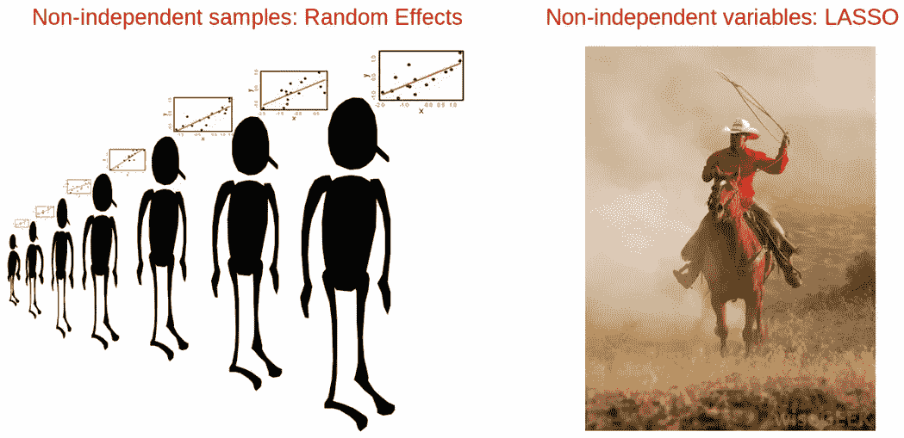

克服数据非独立性的方法:套索和随机效果建模，[图像来源](http://anythingbutrbitrary.blogspot.com/2012/06/random-regression-coefficients-using.html)

在我的文章[为组学集成选择特征](/select-features-for-omics-integration-511390b7e7fd)中，我介绍了一些变量选择方法，包括 LASSO。在下一节中，我们将看到一个纵向数据的例子，其中数据点的分组应通过随机效应建模来解决。

**LMM 和随机效应**建模广泛应用于生命科学中的各类数据分析。一个例子是 [**GCTA 工具**](https://www.ncbi.nlm.nih.gov/pmc/articles/PMC3014363/) ，它对长期存在的**缺失遗传力**问题的研究做出了很大贡献。GCTA 的想法是在 LMM 框架内，将所有影响小的基因变异作为随机效应组合在一起。多亏了 GCTA 模型，缺失遗传率的问题似乎至少对于人类身高来说 [**解决了**](https://www.biorxiv.org/content/10.1101/588020v1) 。

摘自 [B.Maher《自然》2008 年第 456 期](https://www.nature.com/news/2008/081105/pdf/456018a.pdf)

计算生物学的另一个流行的例子是使用[**DESeq**](https://genomebiology.biomedcentral.com/articles/10.1186/gb-2010-11-10-r106)**/**[**DESeq 2**](http://bioconductor.org/packages/devel/bioc/vignettes/DESeq2/inst/doc/DESeq2.html)R 包的差异基因表达分析，它并不真正运行 LMM，而是执行**方差稳定化**/收缩，这是 LMM 的要点之一。这种方法的优点是低表达的基因可以从高表达的基因中借用一些信息，这使得它们的测试更加稳定和可靠。

最后，LMM 是进化科学和生态学中最受欢迎的分析技术之一，他们使用最先进的 [**MCMCglmm**](https://cran.r-project.org/web/packages/MCMCglmm/index.html) 软件包来估计例如**性状遗传率**。

# 数据非独立性的例子

正如我们之前得出的结论，当统计观测值/样本之间存在某种聚类时，应该使用 LMM。例如，这可能是由于采集样本的**地理位置**不同，或者产生样本的**实验方案**不同。生物医学科学中的**批效应**就是这种**分组因子**的一个例子，它导致了统计观察之间的非独立性。如果不进行适当的校正，RNAseq 数据中的批量效应会导致两个基因之间**完全相反的共表达**模式([辛普森悖论](https://en.wikipedia.org/wiki/Simpson's_paradox))。

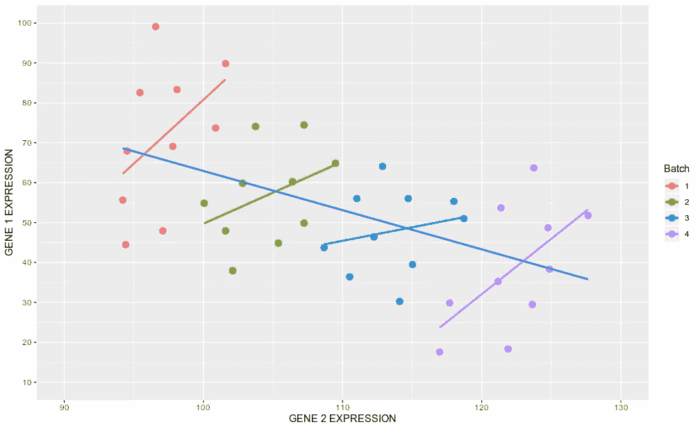

另一个例子可以是个体之间的**遗传关系**。最后，这可以是在不同时间点对**相同个体**执行的**重复测量**，即技术(非生物)复制。

作为这种聚类的一个例子，我们将考虑一项睡眠剥夺研究**，其中 18 个人的睡眠时间受到限制，并且在 10 天内测量了他们的有机体在一系列测试中的**反应**。数据包括三个变量:1)反应，2)天数，3)受试者，即在 10 天内跟踪同一个人。为了检查个体对睡眠剥夺的总体反应如何变化，我们将使用 **lm** 拟合一个**普通最小二乘(OLS)线性回归**，将反应作为反应变量，将天数作为预测/解释变量，并用 **ggplot** 显示。**

**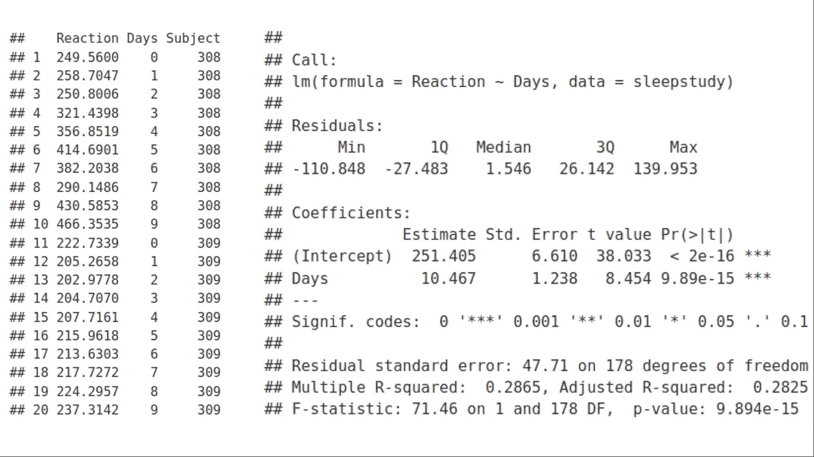****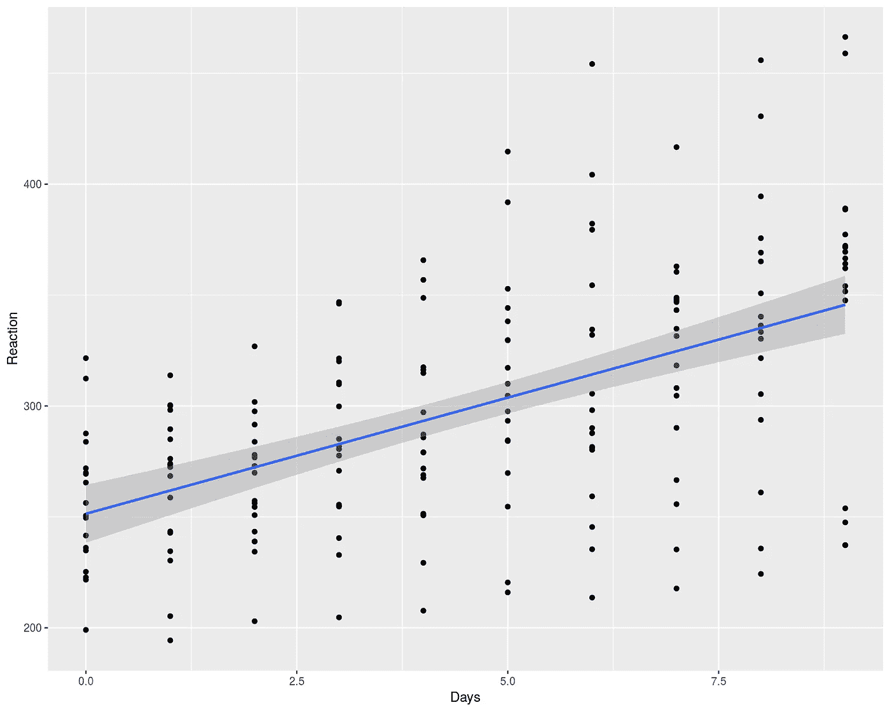**

**我们可以观察到反应对天数有增加的趋势，但是在天数和个体之间有很大的差异。查看线性回归拟合的总结，我们得出的结论是斜率与零有显著的****差异，即反应与天数之间存在统计上显著的递增关系。根据以下公式，拟合线周围的灰色区域代表 95%的置信区间:******

******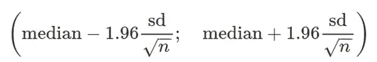******

******幻数 1.96 源自高斯分布，反映了覆盖分布中 95%数据的 **Z 得分**值。为了演示如何通过 **ggplot** 计算置信区间，我们将使用 **predict** 函数在 plain R 中实现相同的线性回归拟合。******

****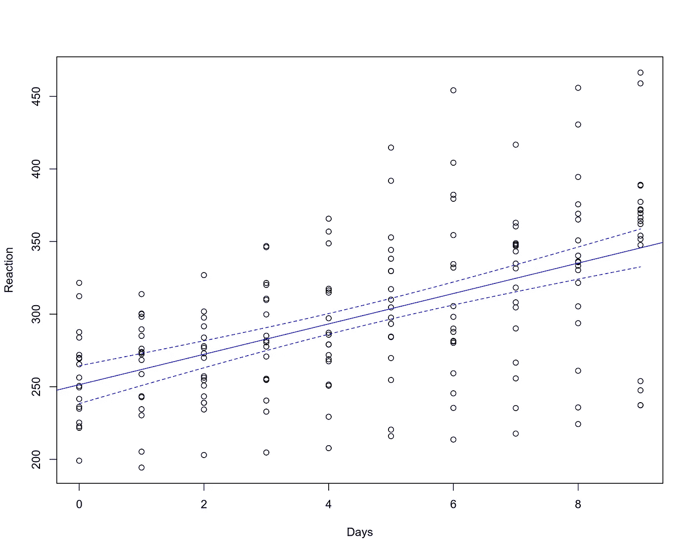****

******然而** **上面的**贴合有问题。普通最小二乘法(OLS)假设所有的观测值都是**独立的**，这将导致**不相关的**，因此**是正态分布的残差**。但是，我们知道图上的数据点属于 18 个个体(每个个体 10 个)，即数据点**在个体内聚集**，因此**不是独立的**。作为替代方法，我们可以分别为每个个体拟合线性模型( **lm** )。****

****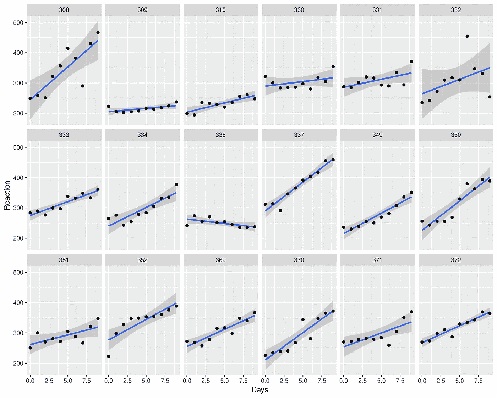****

****我们可以看到，大多数人的反应曲线呈上升趋势，而一些人的反应曲线呈**中性甚至** **下降趋势**。整体反应增加，而个别斜率可能降低，这看起来不奇怪吗？上面的贴合真的足够好吗？****

> ****我们是否用简单的普通最小二乘(OLS)线性回归模型捕获了数据中的所有变化？****

****答案是**否**因为我们没有考虑数据点之间的非独立性。正如我们将在后面看到的，我们可以用线性混合模型(LMM)做得更好，它通过随机效应解释了样本之间的非独立性。尽管术语“随机效应”可能听起来很神秘，但我们将在下面展示它本质上等同于在最大似然优化中引入**多一个拟合参数**。****

# ****频率主义线性混合模型****

****我们上面使用的**简单线性拟合**被称为**固定效应** **建模**，因为它固定了线性回归的系数:斜率和截距。相反，随机效应建模考虑到了**个体水平**的斜率和截距，即线性回归的参数**不再是固定的**，而是围绕其平均值有一个**变化**。****

****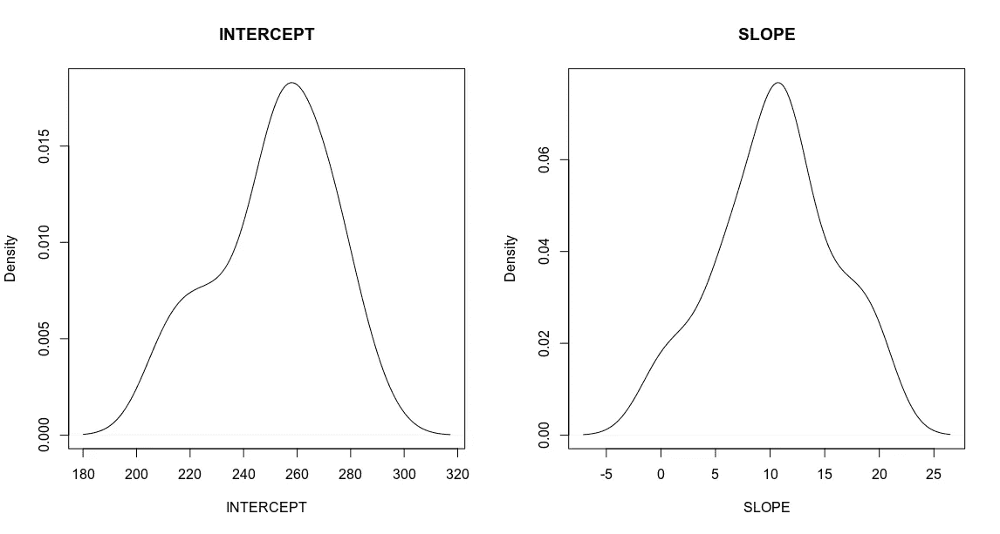****

****睡眠研究中个体间截距和斜率的变化****

****这个概念让我们想起了很多关于[贝叶斯统计](https://en.wikipedia.org/wiki/Bayesian_probability)的东西，其中模型的参数是**随机的**而数据是固定的，与[频率主义者](https://en.wikipedia.org/wiki/Frequentist_inference)的方法形成对比，后者的参数是固定的，但数据是随机的。事实上，稍后我们将表明，我们使用**频率主义线性混合模型**和**贝叶斯** **分层模型**获得了相似的结果。LMM 和随机效果的另一个优势是，在彼此的背景下同时对所有个体进行拟合**，即所有个体拟合**“了解”彼此**。因此，单个拟合的斜率、截距和置信区间受到它们的共同统计量**共享方差**的影响，这被称为**向均值收缩**，我们将在下一篇文章[中从头推导 LMM 时更详细地介绍它。](/linear-mixed-model-from-scratch-f29b2e45f0a4)******

****我们将使用 **lme4** R 包中的 **lmer** 函数，为每个个体(受试者)的天数效应用**随机斜率和截距**拟合 LMM。这相当于将**(天数|主题)**项添加到之前在 **lm** 函数中使用的线性模型反应天数中。****

****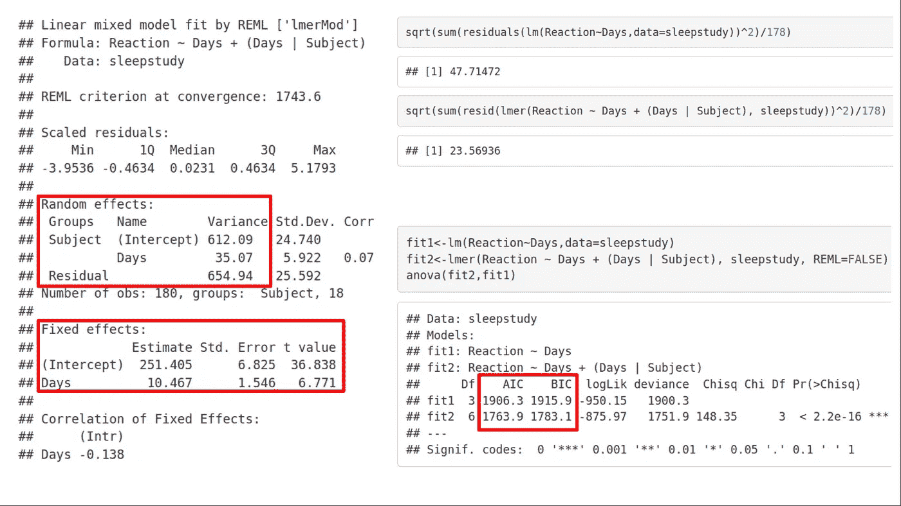****

****我们可以立即看到两种类型的统计报告:**固定效应和随机效应**。固定效应的斜率和截距值看起来**相当** **类似于上面用 OLS 线性回归得到的值**。另一方面，随机效应统计是样本间**非独立性**调整发生的地方。我们可以看到**报告的两种类型的方差**:跨斜率和截距共享的方差**，Name =(截距)和 Name = Days，它反映了按主题对数据点进行分组，以及保持未建模的剩余方差，即我们**不能在给定模型内进一步减少**该方差。此外，比较固定( **lm** )和随机( **lmer** )效应模型之间的残差，我们可以看到随机效应模型的残差**减少了**，这意味着**我们捕捉到了随机效应模型的响应变量**中的** **更多的变化。通过比较[**【AIC】**](https://en.wikipedia.org/wiki/Akaike_information_criterion)**和**[**【BIC】**](https://en.wikipedia.org/wiki/Bayesian_information_criterion)**两个模型的值，可以得出同样的结论，同样，带有随机效应的 LMM 更符合数据。现在让我们想象一下固定效果模型和 LMM 模型之间的区别。********

****为此，我们需要可视化 LMM 模型的**置信区间**。在频率/最大似然框架中建立置信区间的标准方法是通过**引导**。我们将从群体水平(总体/平均)拟合开始，并使用替换的**重采样和每次迭代随机移除 75%的样本来重新运行多次。在每次迭代中，我将保存 LMM 拟合统计数据。积累了自举统计数据后，我将绘制两个图:首先，显示自举 LMM 拟合与上一节中使用的朴素固定效应拟合的对比；第二，根据累积的自举 LMM 拟合，我将计算**中值**，即 **50%** 百分位数，以及 **5%和 95%** 百分位数，它们将确定**人口水平 LMM 拟合**的置信区间，这将再次相对于原始固定效应拟合进行绘制。******

**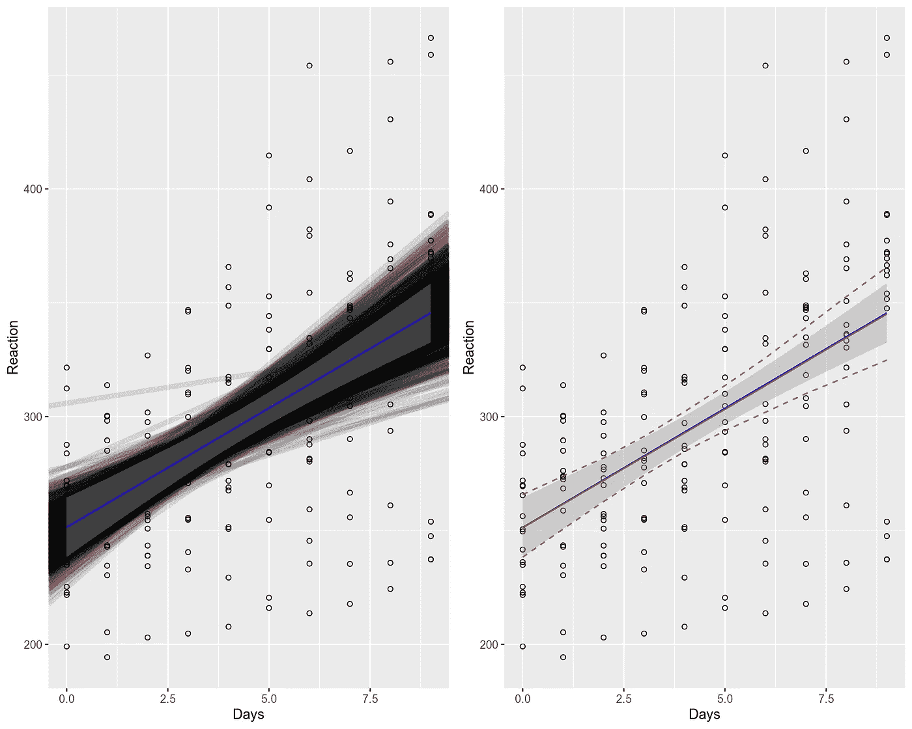**

**固定效果(蓝线，灰色区域)与自举 LMM(黑线和红线)。**

**上面，固定效应拟合(蓝线+灰色 95%置信区间区域)与计算的自举 LMM 拟合(左图)和自举 LMM 拟合(右图)的汇总统计(百分位数)一起显示。我们可以观察到，人口水平的 LMM 拟合(lmer，红线，右图)与固定效应拟合(lm，蓝线，两幅图)非常相似，差异几乎不明显，它们**与**很好地重叠。然而，计算出的 LMM 的自举拟合(黑色粗线，左图)和置信区间(红色虚线，右图)比固定效应拟合(两张图上的灰色区域)的**宽一点**。这种差异部分是由于固定效应拟合不能解释个体水平的变化，而 LMM 却能解释群体和个体水平的变化。**

**另一件有趣的事情是，我们观察到斜率和截距在其平均值附近的变化:**

**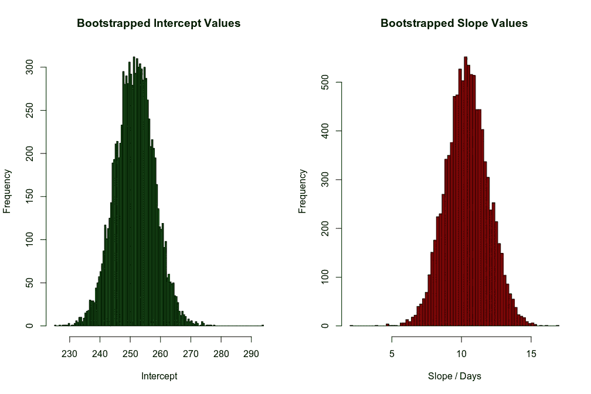**

**因此，我们可以假设，在 Frequentist 框架内构建置信区间的自举过程可以被视为允许斜率和截距遵循一些初始(**先验**)分布，然后从这些分布中采样它们的似是而非的值。这听起来很像贝叶斯统计。事实上，bootstrapping 非常类似于贝叶斯统计的工作马**马尔可夫链蒙特卡罗(MCMC)** 。换句话说，使用 bootstrapping 的频率分析在很大程度上等同于贝叶斯分析，我们将在后面更详细地讨论这个问题。**

**睡眠剥夺研究中的 18 个人的斜率、截距和置信区间如何？在这里，我们再次将他们的固定效应统计数据与 LMM 统计数据一起绘制出来。**

****

**同样，红色实线和虚线对应于 LMM 拟合，而蓝色实线和灰色区域描绘了固定效果模型。我们可以看到，个体 LMM 拟合(lmer)及其置信区间可能**与固定效应(lm)模型**非常不同。换句话说，个体拟合朝着它们共同的群体水平均值/中值**【缩小】**，所有拟合相互帮助，以获得更稳定和相似的群体水平斜率、截距和置信区间。在下一篇[文章](/linear-mixed-model-from-scratch-f29b2e45f0a4)中，当从零开始推导 LMM 时，我们将理解，这种**向均值**效应的收缩是通过在最大似然优化过程中再增加**一个拟合参数(共享方差)**来实现的。**

# **频繁/最大似然与贝叶斯拟合**

**在进入贝叶斯多层模型之前，让我们简单介绍一下频率主义者和贝叶斯方法之间的主要区别。LMM 通过 lme4 / lmer 使用的 Frequentist fit 是基于**最大似然**原理，其中我们最大化观察数据 y 的**似然 L(y)，这相当于最小化模型的残差，普通的最小二乘法。相比之下，贝叶斯线性模型基于**最大后验概率**原理，我们假设数据以某种似然 L(y)分布，并在线性模型的参数上增加了一个**先验**假设。****

**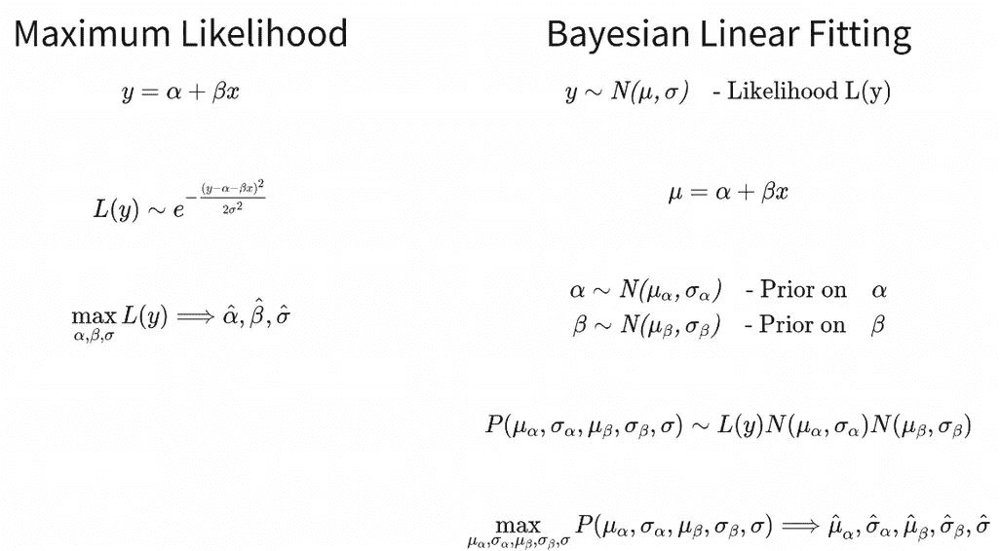**

**在这里，我们计算模型参数(而不是数据)的概率分布，这自动给我们参数的不确定性(可信区间)。**

# **贝叶斯多水平模型**

**将**贝叶斯** **先验**分布应用于参数的线性混合模型(LMM)称为**贝叶斯多级模型**或**贝叶斯分层模型**。这里，为了实现贝叶斯拟合，我们将使用与 lme4 / lmer 语法相同的 [**brms**](https://cran.r-project.org/web/packages/brms/vignettes/brms_overview.pdf) R 包。然而，需要记住的一个重要区别是，通过 lme4 / lmer 拟合 LMM 应用了最大似然(ML)原则，即它不使用关于参数的先验假设(或者在一种情况下，它使用平坦先验)，而 [**brms**](https://cran.r-project.org/web/packages/brms/vignettes/brms_overview.pdf) 中的贝叶斯多级模型设置了反映数据的合理先验。另外值得一提的是 [brms](https://cran.r-project.org/web/packages/brms/vignettes/brms_overview.pdf) 在引擎盖下使用概率编程语言 [Stan](https://mc-stan.org/) 。我们从使用 [**brms**](https://cran.r-project.org/web/packages/brms/vignettes/brms_overview.pdf) 的贝叶斯总体水平拟合开始，并显示结果:**

**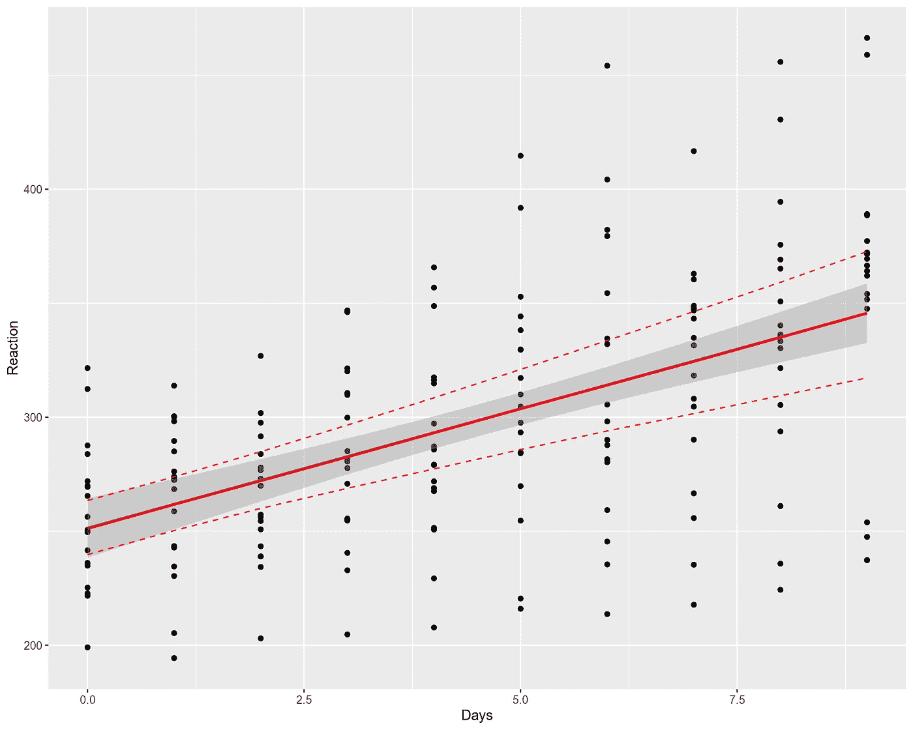**

**在上面，我们再次用蓝线和灰色区域绘制了固定效应人口水平拟合置信区间，我们还添加了人口水平**贝叶斯多水平模型**，使用红色实线表示中位数，红色虚线表示**可信区间**。至于自举 LMM 拟合的情况，我们可以得出结论，总体水平贝叶斯多水平拟合与固定效应拟合完全重叠，而贝叶斯可信区间比固定效应拟合的 95%置信区间宽一些。个人适合度呢？**

**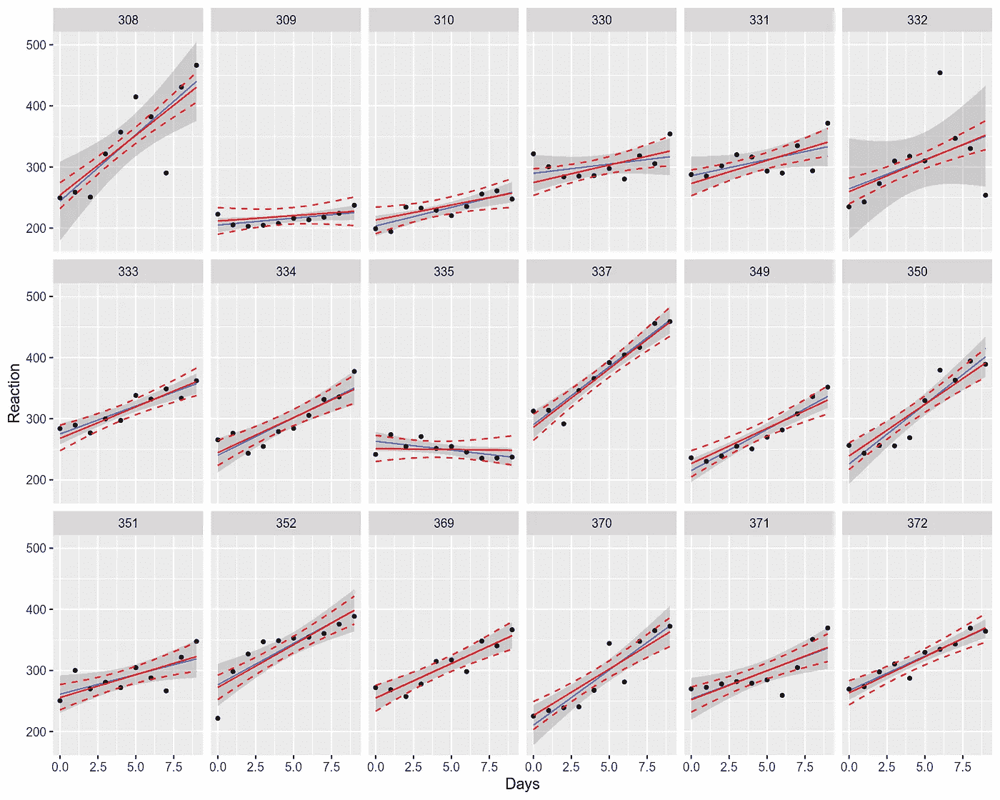**

**与个体自助频率主义者 LMM 拟合类似，我们可以看到，具有 brms(红色实线)的个体贝叶斯拟合并不总是收敛到固定效应频率主义者拟合(蓝色实线)，而是**【尝试】** **将**与总体水平拟合(先前的图)对齐，以便彼此尽可能**相似**。与频率主义者的固定效应置信区间相比，贝叶斯可信区间有时看起来又非常不同。这是使用**贝叶斯先验**并通过多层建模说明**数据中的非正态性和非独立性**的结果。**

# **摘要**

**在这篇文章中，我们了解到频率主义线性混合模型(LMM)和贝叶斯多级(分层)模型被用来解释**非独立性**以及数据点的非正态性。与普通的最小二乘(OLS)线性回归模型(固定效应)相比，这些模型通常提供更好的拟合，并解释数据中更多的变化。虽然模型的总体水平平均拟合通常收敛于固定效应模型，但个体拟合以及可信区间和置信区间可能会有很大不同，从而更好地反映了数据中的非正态性。**

**在下面的评论中，让我知道哪些来自生命科学的分析技术对你来说似乎是 T2 特别神秘的，我会在以后的文章中介绍它们。在我的 [Github](https://github.com/NikolayOskolkov/HowLinearMixedModelWorks) 上查看帖子中的代码。在 Medium [关注我，在 Twitter @NikolayOskolkov 关注我，在 Linkedin](https://medium.com/u/8570b484f56c?source=post_page-----350950a82911--------------------------------) 关注我。在下一篇帖子中，我们将从最大似然 出发 [**推导出线性混合模型并从头编程，敬请期待。**](/linear-mixed-model-from-scratch-f29b2e45f0a4)**