# 机器学习如何帮助留住客户

> 原文：<https://towardsdatascience.com/how-machine-learning-can-help-with-customer-retention-6b5bf654e822?source=collection_archive---------9----------------------->

布莱克·维斯兹在 [Unsplash](https://unsplash.com/s/photos/customers?utm_source=unsplash&utm_medium=referral&utm_content=creditCopyText) 上的照片

## 基本方法

## 建立一个客户流失模型来理解客户离开的原因

*“…您的支付无法完成…”—*邮件中写道

我很沮丧

*“又来了！！！！…”*——我喊道

这是我的订阅连续第三个月出现这种情况。

我试着给客服打电话，发信息，但是没有人接，也没有解决办法。

我想过退订。要是我不那么喜欢这个产品就好了。

我开始寻找其他提供同样服务但客户服务更好的公司。

C 对于电子商务和在线业务来说，这是一个重要且具有挑战性的问题。

对于任何一个企业来说，在一段时间内，客户可以分为三大类:新获得的客户、现有客户和流失的客户。

被搅动的顾客是那些决定结束与公司关系的人。

因为它们可以转化为收入的直接损失，所以预先预测可能流失的客户可以帮助公司挽回这一损失。

我们可以通过将案例分为不同类别来对客户流失进行分类:

*合同流失*:此类流失适用于提供不同服务的企业，如有线电视公司。当客户决定不再继续他们到期的合同时，就会发生这种情况。

*自愿流失*:指客户决定取消现有服务的情况，适用于提供非固定期限服务的公司，如预付费手机或流媒体订阅。

*非契约性流失*:这种类型的流失适用于依赖零售场所或在线商店的企业，例如，可能与消费者在未完成交易的情况下离开可能的购买相关。

*非自愿流失*:当客户不再与信用卡公司合作或无法支付信用卡账单时，就会发生这种情况。

每个顾客都是不同的。所以，客户流失有几个完全不同的原因。

其中，我们可以发现产品使用不足、服务差，或者其他类似服务的定价更好。

然而，有一点适用于所有行业:

> 获得新客户的成本高于留住现有客户的成本

因为获得它们的成本很高，所以努力留住它们是明智的。

公司通过了解客户来避免客户流失。实现这一点的最佳方法之一是通过分析历史和新的客户数据。

跟踪客户流失的指标之一是保留率，这是产品满足强大市场需求程度的指标，称为产品-市场匹配度。

如果产品与市场的匹配不令人满意，公司可能会经历客户流失。

分析和提高留存率的有力工具是流失预测；一种帮助找出在给定时间段内哪个客户更有可能流失的技术。

## 我们如何建立一个预测流失模型？

预测流失模型是一种分类工具。一种模型，它着眼于不同客户的特征，并了解哪些特征对确定客户是否会流失很重要。

在用于预测流失的最常见的分类模型中，我们发现支持向量机(SVM)、逻辑回归、随机森林、人工神经网络和朴素贝叶斯算法。

假设我们有一个[数据集](https://www.kaggle.com/adammaus/predicting-churn-for-bank-customers)，包含从银行提取账户的 10000 名客户的数据。这些数据描述了这些客户的一些属性，例如他们居住的国家、他们的信用评分、年龄、余额等等。

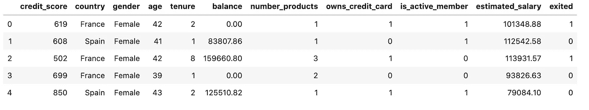

我们的模型应该预测客户是否会流失。所以我们的目标变量将是`exited`。

我们应该分析数据，重点关注不同的特征如何与客户流失状态相关联。

但首先，让我们看看有多少客户流失。

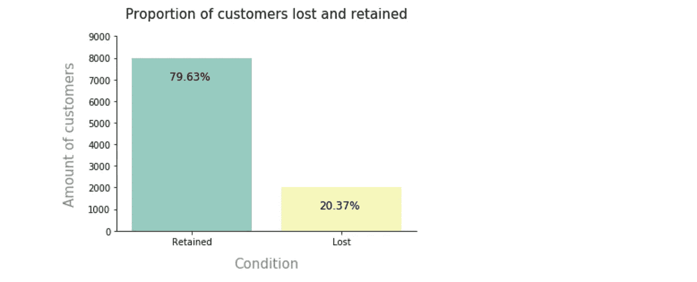

我们可以观察到 **20.37%** 的客户发生了流失。

这些信息很有价值，因为对于分类模型，我们需要确认我们的数据集没有遭受数据不平衡，这通常反映了数据集中类的不平等分布。

即使阶级分布不均，我们也可以说它并没有遭受高阶级的不平衡。

之后，我们可以分析分类变量和目标变量之间的关系

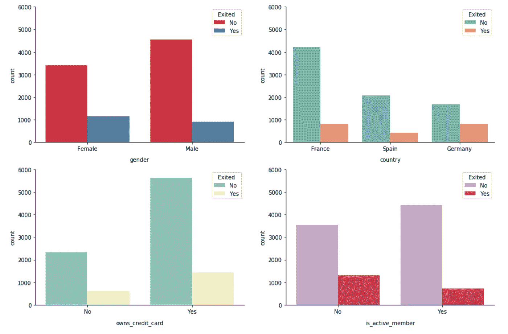

从这些情节中，我们了解到几件事:

a.流失的女性客户比例大于男性客户比例。

b.大多数顾客来自法国。然而，德国和西班牙的客户流失比例更高。

c.流失的非活跃成员的比例高于活跃成员的比例。

现在，我们可以关注连续变量和目标变量之间的关系。

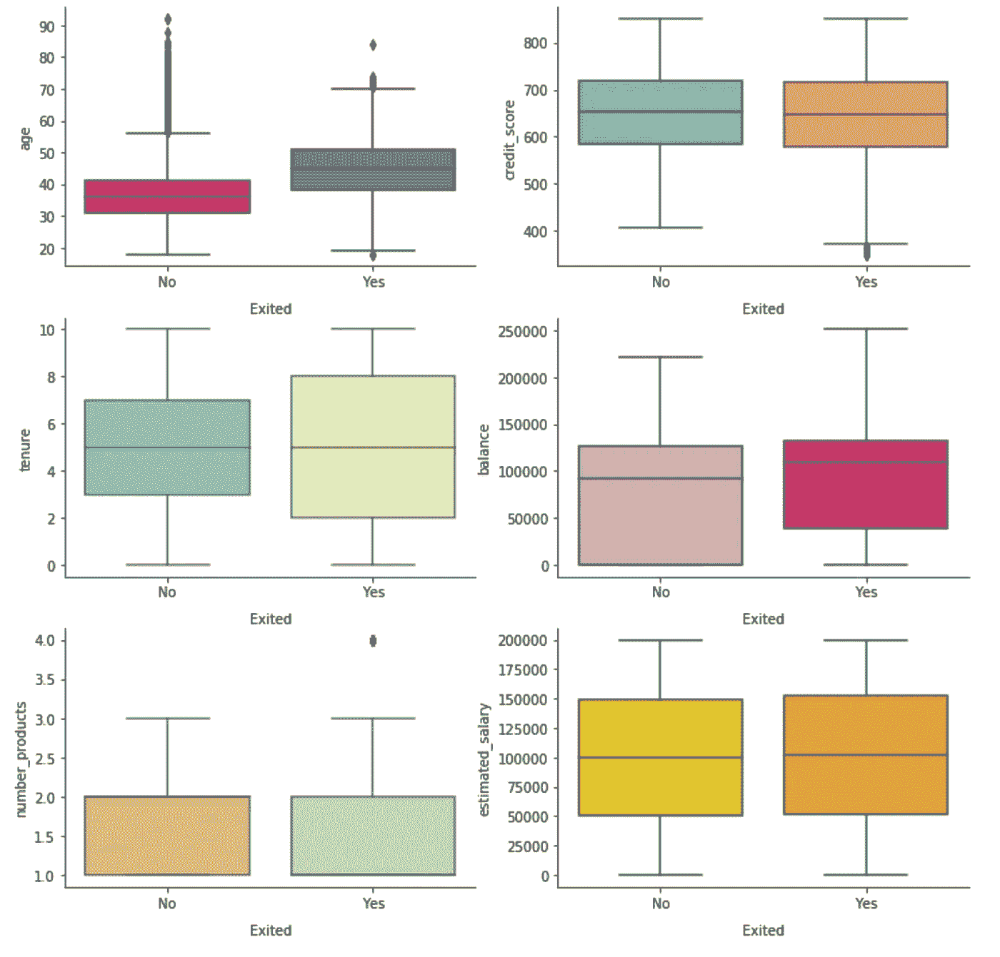

从这些情节中，我们了解到几件事:

a.流失的顾客比保留的顾客年龄大。

b.流失客户和保留客户之间的信用评分或任期中位数没有差异。

c.在流失的客户中，大多数人的银行账户似乎仍有可观的余额。

d.无论是估计的工资还是产品的数量似乎对客户流失都没有影响

在我们开始寻找预测客户流失的模型之前，我们需要做一些特性工程。

首先，我们将创建新功能。

我们拥有的一些变量可以结合到新功能中，以便更好地描述客户。

我们之前看到，信用评分对交易量没有影响，因为信用评分通常会随着时间的推移而增加(因此，随着年龄的增长)，我们将创建一个新的特征来说明年龄对信用评分行为的影响。

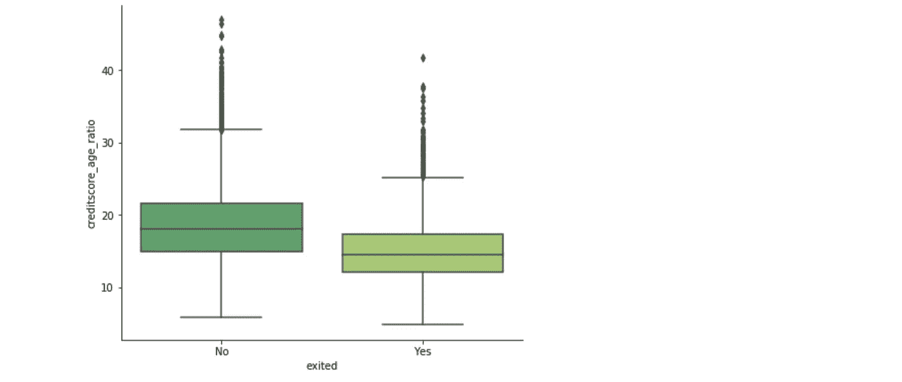

从年龄比例来看，频繁交易的客户似乎信用评分较低。

我们已经看到，预计工资对客户流失的可能性没有影响。

然而，一个有趣的探索特征是余额和工资之间的比率，因为这可以估计客户花费他们工资的百分比，并且可以是客户流失的可能指标。

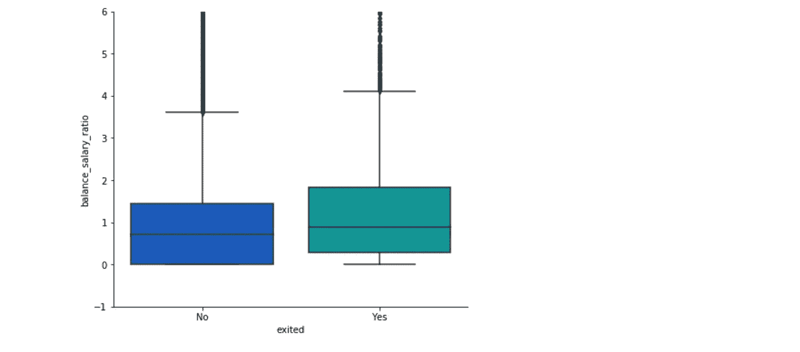

我们已经使用`age`、`credit score`和`balance`创建了新的变量。因此，我们将把它们排除在分析之外。它们将与我们的新变量相关联。

之后，我们将对分类变量进行编码。

为了训练和测试我们的模型，我们需要将数据集分成两个子数据集:训练数据集和测试数据集。

通常使用 80%-20%的规则来分割原始数据集。

使用可靠的方法分割数据集以避免数据泄漏是很重要的；这是存在于测试集中的例子，它们也存在于训练集中，并且可能导致过度拟合。

我们准备建立不同的模型，寻找最适合的。预测客户流失是一个**二元分类问题**:在给定的一段时间内，客户要么流失，要么保留。

我们将测试:

1.  [逻辑回归分类器](https://scikit-learn.org/stable/modules/generated/sklearn.linear_model.LogisticRegression.html)
2.  [支持向量机](https://scikit-learn.org/stable/modules/generated/sklearn.svm.SVC.html)采用径向基函数核
3.  [随机森林](https://scikit-learn.org/stable/modules/generated/sklearn.ensemble.RandomForestClassifier.html?highlight=random%20forest#sklearn.ensemble.RandomForestClassifier)

对于每个模型，我们将遵循以下步骤:

***参数搜索* :** 我们将确定我们要在每个模型中搜索的参数和值。然后，我们将执行`GridSearchCV`并设置在我们的模型中获得的最佳参数。

***最佳模型拟合:*** 找到最佳估计量后，我们将使用训练数据集对其进行训练。

***性能评估:*** 用我们的训练数据集训练出最好的模型后，我们要看看它们用我们的测试集表现如何。

1 **逻辑回归** : 逻辑回归是最简单的机器学习模型之一，但却是非常有用的一种。

它创建了一个模型，解释自变量如何对二元因变量产生影响。

换句话说，它定义了一个等式，其中包含了被认为会影响客户流失的特征，并试图为已经流失或没有流失的客户估计每个变量的最佳系数。

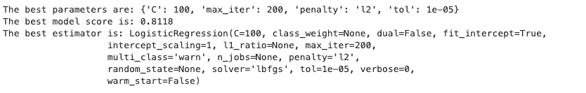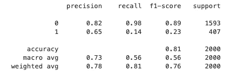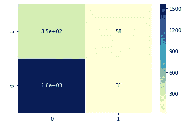

当我们计算这个模型的准确性时，结果是 81%。然而，召回率和 f1 分数在 50%左右，并且有很多假阴性，这是我们应该避免的情况。

2

为了将这些点分为两组，无论客户是否有交易，它都试图找到一个超平面，尽可能大的间隔将两组分开。

SVM 模型为每个数据点生成一个预测，并预测客户是否在流失群体中。

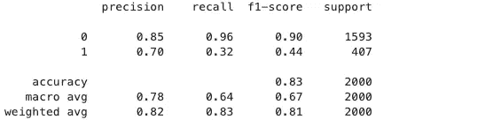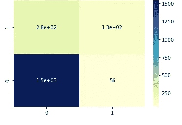

当我们计算这个模型的准确性时，结果是 83%。召回率和 f1 值从 50%提高到 64%。还是有很多假阴性。

3随机森林分类器:随机森林是一种基于集成的算法。它包含大量随机化的决策树。

这些决策树中的每一个都将对一个点进行分类，最终，所有树所达成的决策的多数票将被采用。这种技术有助于避免过度拟合。

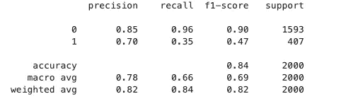

当我们计算模型的精确度时，它是 84%。召回率和 f1 评分提高了一点，达到 66%。还是有很多假阴性。

## 三种模型的 ROC 曲线比较

我们可以使用 ROC 曲线并计算曲线下的面积来进一步研究假阳性率和真阳性率，曲线下的面积也是我们模型预测能力的度量。

如果该值更接近 1，意味着我们的模型在将随机样本分成两类方面做得很好。

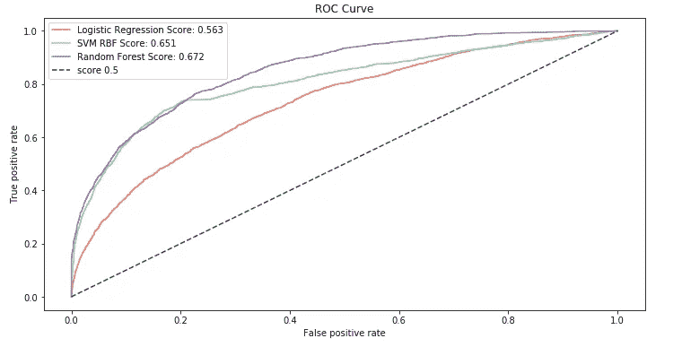

比较三种模型的曲线下面积值，我们看到随机森林比逻辑回归模型表现更好。

## 特征重要性

我们将分析不同的功能如何影响客户流失。为此，我们将检查变量的重要性。那就是量化每个变量对我们的模型有多有用。

这是一个重要的分析。我们可以确定哪些特征使客户更有可能流失，并制定有针对性的策略。

因为 SVM 不可能得到特征重要性。因为算法像黑盒一样工作。

对于逻辑回归，我们可以使用来自`sklearn.feature_selection`的函数`SelectFromModel`。该函数将根据重要性权重选择功能。

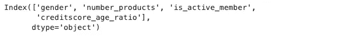

我们可以看到，`gender`、`number of products`、`member status`和`credit score by age`比率是预测客户是否会流失的四个最重要的特征。

另一方面，从`RandomForest`中获得特性重要性很容易。scikit-learn 实现有一个方法`.feature_importances_`，它会告诉我们每个特性的重要性。

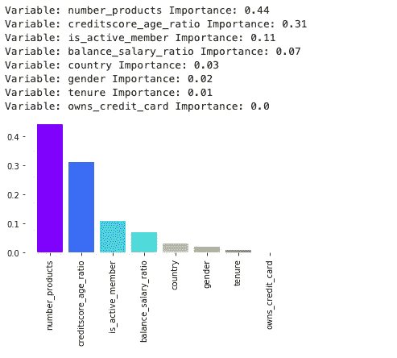

我们可以看到`number of products`、`member status`和`credit score by age`比率再次成为预测客户是否会流失的最重要特征。此外，`balance salario ratio`在这种情况下也很重要。

总之，这些模型显示出一些改进的余地。因为我们想发现会流失的客户，所以我们应该避免假阴性。

从特征重要性中，我们可以观察到产品数量和按年龄比例的信用评分对两个模型都很重要。

活跃成员离开的事实令该公司担忧，它应该发出警报。

如果你想看到完整的代码，请查看我的 ***GitHub repo*** :

 [## UGIS 22/churn _ 模型

### 客户流失，也称为客户流失，或客户流动，是客户的损失，它是一个重要的…

github.com](https://github.com/ugis22/churn_model) 

如果您想了解更多关于客户流失模型的信息，这里有更多资源:

*   [https://towards data science . com/machine-learning-powered-churn-analysis-for-modern-day-business-leaders-ad 2177 E1 cb0d](/machine-learning-powered-churn-analysis-for-modern-day-business-leaders-ad2177e1cb0d)
*   [https://medium . com/@ rohit lal/customer-churn-prediction-model-using-logistic-regression-490525 a 78074](https://medium.com/@rohitlal/customer-churn-prediction-model-using-logistic-regression-490525a78074)
*   [https://towards data science . com/churn-prediction-3a 4a 36 c 2129 a](/churn-prediction-3a4a36c2129a)
*   [https://towards data science . com/customer-churn-analysis-4 f 77 cc 70 B3 BD](/customer-churn-analysis-4f77cc70b3bd)