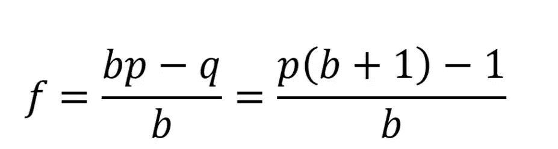

# 如何利用机器学习在体育博彩上赚钱

> 原文：<https://towardsdatascience.com/how-machine-learning-could-help-on-horse-racing-betting-part-1-7aa363f75ca2?source=collection_archive---------14----------------------->

## 机器学习在赛马博彩策略中的应用

***编者注:*** *本文仅供教育娱乐之用。如果你想用给出的模型进行真钱下注，你要自担风险。请确保它符合您的博彩公司的条款和条件。*

机器学习已经广泛应用于许多时间序列分析和预测中。借助于大量的历史数据和当今的计算能力，ML 模型有时可以对体育博彩决策产生极其有用的洞察力和指导。

Julia Joppien 在 [Unsplash](https://unsplash.com?utm_source=medium&utm_medium=referral) 上的照片

这篇文章阐述了机器学习如何帮助赛马博彩策略。我们将使用从香港赛马会主页上抓取的数据，香港赛马会是世界上最古老和最大的赛马机构之一。为了避免数据泄露和评估模型的真实性能，我们将只使用 2007 年初至 2019 年秋季的匹配数据来建立模型，并使用它来押注新的即将到来的比赛。我们利用该模型，建立了一个独特的投资策略，在两个月的时间内(2019/09-2019/11)下注，并在实验中获得正回报。

# **数据集**

正如我们之前提到的，我们将使用 2007 年至 2019 年在香港举行的所有比赛作为训练和验证集。以及用于测试集的 2019 年冬季数据，以评估整体博彩组合的表现。在包含关于每场比赛的各种信息的训练数据中有 109085 行和 61 列。

**列**

*索引
Rdate:比赛日期
Rid:比赛 ID
Hid:马 ID
地点:比赛场地(HV，ST)
赛道:赛道(TURF， AWT)
进行:赛道状况
过程:赛道(AWT 将没有具体的赛道描述)
级别:比赛的赛道级别
距离
rfinism:以百分之一秒(1/100 秒)为单位的比赛结束时间
Rm1:比赛第一段终点时间秒
Rm2:比赛第二段终点时间秒
Rm3:比赛第三段终点时间秒
Rm4:比赛第四段终点时间秒
Rm5:比赛第五段终点时间秒
Rm6:比赛第六段终点时间秒
Horsenum:马的马号
jname:Jockey
Tname:Trainer
Exweight:马所承载的残疾人重量
Bardraw: draw
档位:档位上马
等级:马的等级
等级 chg:马与前一场比赛的等级变化
马的重量
马的重量 chg:马与前一场比赛的重量变化
Besttime:马在相同场地、距离和赛道的比赛中的最佳完成时间(分钟。 第二。centi second)
年龄:马的年龄
优先权:驯马师给的马参加比赛的优先权。
Lastsix:前 6 场比赛的名次
Rank:本次比赛的名次
Runpos:该马在比赛中各分段的名次。
P1:马的第一段成绩
P2:马的第二段成绩
P3:马的第三段成绩
P4:马的第四段成绩
P5:马的第五段成绩
P6:马的第六段成绩
M1:马的第一段成绩第二的完成时间
M2:马的完成时间 岑体二马第二段
M3:岑体二马第三段终点时间
M4:岑体二马第四段终点时间
M5:岑体二马第五段终点时间
M6:岑体二马第六段终点时间
Finishm:岑体二马比赛终点时间
D1:第一段 1 号马的距离(0.25 表示距离在 1 马之内)
D2:第二段 1 号马的距离(0.25 表示距离在 1 马之内)
D3:第三段 1 号马的距离(0.25 表示距离在 1 马之内)
D4:第 4 区与 1 号马的距离(0.25 表示距离在 1 马之内)
D5:第 5 区与 1 号马的距离(0.25 表示距离在 1 马之内)
D6:第 6 区与 1 号马的距离(0.25 表示距离在 1 马之内)
Datediff:该马上一场比赛与当前比赛的日期差
Pricemoney:比赛的价格
Win_t5:赛前 5 分钟马的胜率
Win:马的最终胜率
Place_t5:赛前 5 分钟马的胜率
Place:马的最终胜率
Ind_win:比赛获胜者的指标(1 代表获胜者，否则为 0)
Ind _ PLA:比赛前 3 名的指标(1 代表前 3 名，否则为 0)*

功能的更正热图

# 特征工程和建模

原始数据包含大量信息，我们需要筛选出其中有用的信息，并尝试从数据中构建新的特征来帮助预测结果。我不会提供太多关于特性工程的细节，但是如果你想自己尝试的话，这里有一些关键的见解。

*   马的年龄、抽签和赛前 5 分钟的赔率与获胜概率的相关性很弱。
*   从过去的表现中产生的新特征(例如:过去 5 场比赛的表现，过去的赔率，过去 180 天的总胜率，完成时间等)可能相对有用。
*   像天气、温度、马的产地和骑师的信息这样的外部数据将提高基于树的模型的性能。
*   建立不同的二元分类模型来预测赢得第一名的可能性和赢得前 3 名产生更好的结果。
*   模型堆叠(神经网络、XGBT、GBRT、线性等)显著提高了性能。
*   预测结果(可能获胜)应该根据同一场比赛中的其他马匹进行调整和标准化。
*   对马和骑师执行目标编码极大地提高了模型性能。
*   作为时间序列类型的问题，只使用基于时间的交叉验证来验证性能和调整参数。

# **投注策略**

在建立了一个相对有用的模型后，预测每场比赛的前 1 名和前 3 名的获胜概率。我花了很多时间试验和研究如何从模型中获得正回报。赛马有很多不确定性，需要人为消除任何潜在的不公平优势。下注策略变得极其重要。在用真实比赛运行模型的多次实验之后，我想出了一个包含三个基本概念的策略。

*   **期望回报率**
*   **最低风险下注**
*   **凯利准则**

由 [Alexander Mils](https://unsplash.com/@alexandermils?utm_source=medium&utm_medium=referral) 在 [Unsplash](https://unsplash.com?utm_source=medium&utm_medium=referral) 上拍摄的照片

首先说一下预期收益率。最常见的最简单的投注策略就是设置一个回报阈值，只有当回报比率(赢奇数*中奖概率)高于阈值时才投注。我们只需要利用模型预测结果计算出每匹马在单场比赛上的获胜概率和回报率，并在回报率高于阈值时下注。然而，如何选择门槛成为一个大问题，低门槛通常会导致激进的投注和大的资本损益。由于赛马的不确定性很大，因此高低阈值的结果相差很大。

仅仅使用回报率是不够的，作为一个赛车游戏，我们还需要考虑每匹马与同一场比赛中其他马相比的表现。换句话说，我们需要找到一匹在同一场比赛中与所有其他马相比获胜几率最高的马。为了扩展这个概念，我们还可以找到不仅在一场比赛中，而且在一天的所有比赛中最有可能获胜的马。我们只在那些马身上下注，以大大降低风险。我称之为最低风险赌博。您可以通过在原始预测结果的 **log 转换** sum 观察值上构建另一个模型来找到这些马。

现在我们有了所有低风险的马以及它们的回报率，我们应该在每匹马身上赌多少钱。事实证明，凯利准则产生了最好的结果。

凯利准则公式

对于有两个结果的简单赌注，一个涉及输掉全部赌注，另一个涉及赢得赌注金额乘以支付赔率，凯利赌注是:

*   **f** 是要下注的当前资金的分数；(即下注多少，以分数表示)
*   **b** 是在赌注上收到的净分数赔率；(例如，下注 10 美元，赢了，奖励 4 美元加赌注；那么 b=0.4)
*   p 是获胜的概率
*   1-p 是损失的概率

最后，我们将这三个概念结合在一起。首先过滤掉当天所有的低风险马，计算它们的回报率。基于模拟的过去投资结果来设置最佳回报阈值。当回报率高于阈值时，使用凯利标准来确定基金应该下注的百分比。

我们花了两个月的时间，在真实的游戏中应用最终的模型和下注策略。结果相当令人满意，我们对 76%的游戏下了赌注，并在两个月结束时取得了正回报。我不会透露实现的细节，但是如果你有任何问题或者对我的发现感兴趣，请在下面留言。

**感谢您的阅读，我期待听到您的问题和想法。如果你想了解更多关于数据科学和云计算的知识，可以在**[**Linkedin**](https://www.linkedin.com/in/andrewngai9255/)**上找我。**

照片由 [Alfons Morales](https://unsplash.com/@alfonsmc10?utm_source=medium&utm_medium=referral) 在 [Unsplash](https://unsplash.com?utm_source=medium&utm_medium=referral) 拍摄