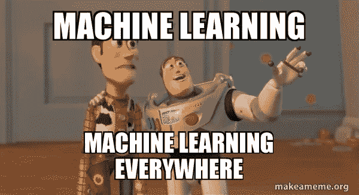

# 机器学习如何让 AI 忘记知识表示和推理

> 原文：<https://towardsdatascience.com/how-machine-learning-made-ai-forget-about-knowledge-representation-and-reasoning-cbec128aff56?source=collection_archive---------43----------------------->

## 我如何了解人工智能被遗忘的核心的简史。

在我作为人工智能数据科学家工作的早期，我学到了一件最重要的事情:你需要更多更好的数据来喂你的学习系统。我致力于寻找这些数据。

我在试图发现人工智能世界的同时，被引诱到了机器学习的世界。我承认，让一台计算机做我喜欢的复杂事情，而不用说它应该如何做，这是令人兴奋的。我在这个世界上狂奔，在研究如何准备数据、设计功能和建立深度网络时，早已忘记了自己的最初目标。

[https://media . make ame me . org/created/machine-learning-machine-884d 19 c 7 BD . jpg](https://media.makeameme.org/created/machine-learning-machine-884d19c7bd.jpg)

然而，在一些案例中，当我被要求自动化和优化一个业务问题时，相关数据的可用性、数量和质量的问题通常仍然是欠缺的。此外，该行业对人工智能的日益接受也引发了恐惧、怀疑和怨恨。人们认为他们正被一个黑匣子取代。这不是事实。但是我理解当你试图用一个不透明的盒子代替多年的专业知识时的阻力。

> 人工智能通常被描述为计算机感知、推理和行动的学科。
> 
> 我错过了推理。

约翰·麦卡锡在 1955 年创造了“人工智能”这个术语，并在 1956 年夏天组织了[达特茅斯研究项目](https://en.wikipedia.org/wiki/Dartmouth_workshop)——这是人工智能作为一个领域的开始。他说:*“这项研究是在这样一个假设的基础上进行的，即学习的每一个方面或智力的任何其他特征在原则上都可以如此精确地描述，以至于可以制造一台机器来模拟它。人们将试图发现如何让机器使用语言，形成抽象概念，解决现在留给人类的各种问题，并自我完善。”*

他在 1958 年开发了 Lisp，并彻底改变了我们如何通过编程来创造思维机器。其他人紧随其后，例如阿兰·科尔莫劳尔和菲利普·罗塞尔，他们在 1972 年提出了[序言](https://en.wikipedia.org/wiki/Prolog)。Prolog 的部分动机是希望将作为声明性知识表示语言的逻辑的使用与知识的过程化表示相协调。
因此，知识表示和推理(KRR)成为人工智能的一个关键领域，它关注的是如何用符号表示知识，并通过推理程序以自动化的方式操纵知识。换句话说，代理如何使用它所知道的来决定做什么。

考虑一下烤蛋糕的任务。当然，我可以收集配料的数量和它们通常混合的顺序的数据，以达到最佳效果。但是不管怎样，我最喜欢祖母的蛋糕，而且我非常了解它的制作方法。那么，我为什么不马上向系统解释在混合配料时必须遵守哪些规则，以及必须创造哪些基本条件呢？当我们研究工业中的复杂过程时，也会发生同样的情况。通常，人们首先本能地要求现有的数据，并权衡为了一个成功的项目应该收集哪些额外的数据。只有少数精明的人对问题背后的过程细节感兴趣。结果往往是自动化或优化只是一个组合问题，尽管是一个非常复杂的问题。

> 当我想到一个新问题时，我的第一个问题不再是指数据，而是指问题本身。

一个过程的开发，通常需要很多年，并且需要丰富的经验和专家知识，这使得它变得越来越复杂。新的依赖关系正在增加，不断增长的需求要求更精确，尤其是更快的结果。一项人类大脑再也无法完成的任务。通过对现有知识以及详细的流程步骤和约束条件进行数字化和系统化记录，KRR 不仅可以实现流程自动化，还可以优化流程。例如轮班计划、无线电频率拍卖、时间表等等。

> 从数据中学习非常受欢迎——但不是你的唯一选择。

有了机器学习的所有知识，回头看看在 AI 领域已经取得的成就，我们应该始终使用我们最强、最像人类的能力之一:**创造力**。跳出框框思考，不要因为一种方法听起来最好或者吸引注意力而选择它。选择最适合你的问题的方法。

安迪·凯利在 [Unsplash](https://unsplash.com?utm_source=medium&utm_medium=referral) 上的照片

## **底线**

不要让一个黑箱自然地决定如何设计过程。与专家交谈并绘制他们的流程图。有了必要的透明度，我们就能建立信任，并为社会更高程度地接受人工智能铺平道路。

在本文的[中了解更多关于知识表示和答案集编程的知识。](/knowledge-representation-and-reasoning-with-answer-set-programming-376e3113a421)