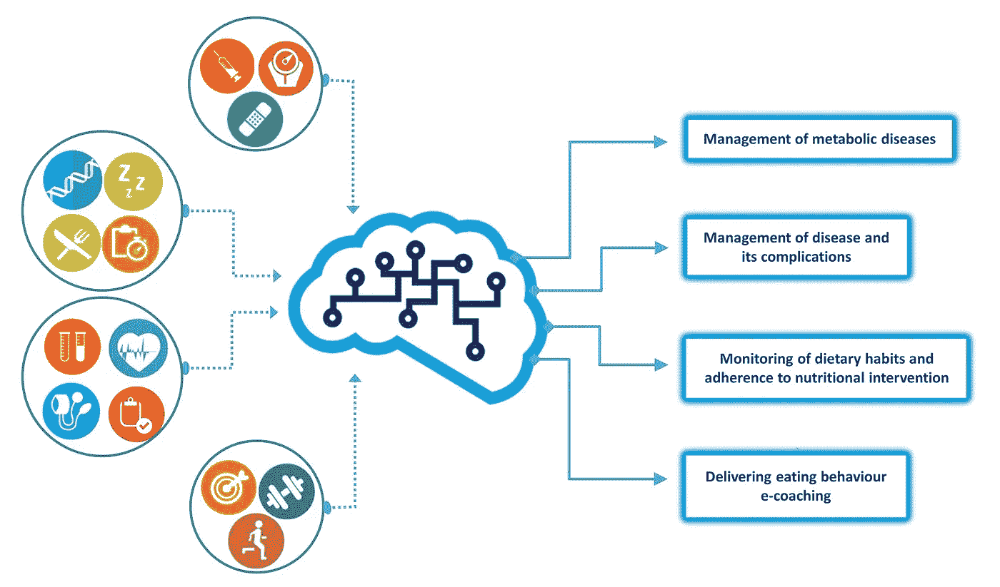
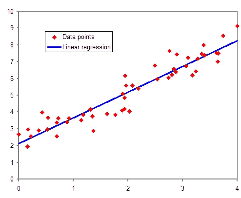
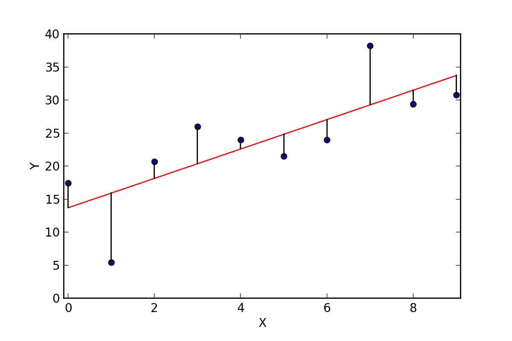
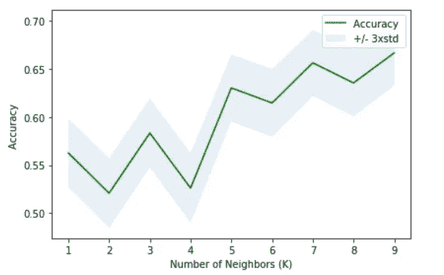
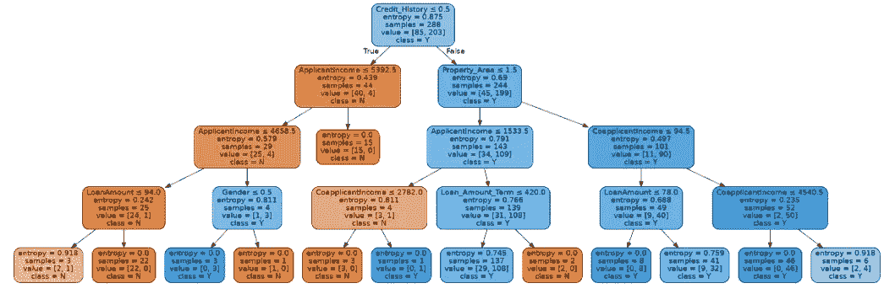
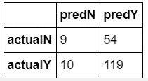

# 机器学习是如何工作的！

> 原文：<https://towardsdatascience.com/how-machine-learning-works-b801303b1a19?source=collection_archive---------17----------------------->

## 以回归和分类为中心的机器学习术语介绍

图片鸣谢:[https://upload . wikimedia . org/Wikipedia/commons/4/41/Machine _ learning . jpg](https://upload.wikimedia.org/wikipedia/commons/4/41/Machine_learning.jpg)

机器学习是一种数据分析技术，它在数据集上建立预测模型，以提供有用的答案，这些答案可用于做出重要决策。它利用统计概念和数学方法，通过 python 和 r 等编码语言来处理大数据。有多种机器学习技术。然而，本文将涉及回归和分类。

# 回归

回归用于预测连续的数字数据。这是一个广泛使用的统计概念，可以手动应用于大约两个变量和几个元素的小数据集。当处理具有多个变量和元素负载的大型数据集时，通过将包含数据集的文件上传到编码平台并运行一堆代码来进行回归。

有不同种类的回归技术，例如线性回归、多项式回归、多元线性回归和多元多项式回归。它们的应用因预测因变量所用的自变量的多少而异。以下是一些与回归相关的有用术语:

## 回归方程式

回归方程是使用自变量预测因变量的方程。可以分别表示为 *y=mx + b* 、 *y = ax^n + bx^n-1 + …+ c、y = ax+ bx2 +…+ c* 或 *y = ax^n + bx^n-1 + …+ c* 用于线性回归、多项式回归、多元线性回归、多元多项式回归。

散点图的典型图像，显示用于构建线性回归方程的回归线。图片鸣谢:[https://commons . wikimedia . org/wiki/File:norm dist _ regression . png](https://commons.wikimedia.org/wiki/File:Normdist_regression.png)

## 回归系数

回归系数是应用于线性回归或多元线性回归的常数值。它可以对因变量产生增加或减少的影响。让我们举一个例子，用年龄和身高(cm)等变量来确定体重(磅)。

对于线性回归，要么可以表示为*权重= 5 *年龄+ 30。这个等式表明，年龄每增加 1 岁，体重就会增加 5 磅。*

对于多元线性回归，可以表示为*体重= 4 *年龄+2.5 *身高+ 30* 。这个等式意味着，假设年龄为零，身高每增加 1 厘米，体重将增加 2.5 磅；假设身高为零，年龄增加 1 岁，体重将增加 4 磅。

## y 轴截距

假设回归系数或 x 设置为零，这可以描述为因变量的值。可以表示为 *y=c* 。它也是回归线与 y 轴相交的点。

## 培训模型和测试模型

数据集被分成两组:训练数据集和测试数据集。在将数据集分成组之后，使用训练数据集生成回归方程。一旦开发完成，回归方程将应用于测试数据集以创建预测。

预测值可以与实际值进行比较，以测试准确性。评估预测的标准如下所述:

## 决定系数

决定系数，r 平方，是一个有用的机制来解释如何准确的回归方程是作出预测。这是通过比较预测值和实际值来完成的。它提供了一个值，表明自变量解释了因变量的多大比例。为了提高 r 平方得分，可以从一种回归方式切换到另一种。

## 相关系数

这是另一个非常有用的值，它描述了实际结果和预测结果中的值之间的关系。它的范围从-1 到 1。如果相关系数为负，那么预测结果会随着实际结果的减少而增加，反之亦然。如果为正，则预测结果随着实际结果的增加而增加。值越接近|1|，关系越完美。

## 均方根误差

均方误差是每个数据点的预测值和实际值之间的总平方差的平均值。该值衡量数据集平均与回归线的接近程度。这个值的平方根称为均方根误差。目标是使均方根误差接近 0，以获得最佳拟合。

显示实际值与回归线差异的图表。图片鸣谢:[https://commons . wikimedia . org/wiki/File:Residuals _ for _ Linear _ Regression _ fit . png](https://commons.wikimedia.org/wiki/File:Residuals_for_Linear_Regression_Fit.png)

# 分类

分类是另一种伟大的机器学习算法，可用于预测分类数据集。自变量可以是连续的或分类的，而因变量是分类的。分类可用于建立一个提供是(1)或否(0)答案的模型或多个类别(0，1，2…)取决于用户的议程是什么。它像回归一样利用训练和测试数据集。

使用我以前的一个[项目](https://github.com/MUbarak123-56/DataBEL/blob/master/LOAN%20PREDICTOR.ipynb)的结果，我在该项目中预测了贷款申请状态，分类方法，如 K-最近邻和决策树分类器及其度量将在下面解释:

## k-最近邻

这是一种分类方法，它使用与特定数据点最接近的数据点来预测该数据点应属于哪个类别。通过评估每个数据点的自变量和因变量，并将其与 k 个最接近的变量进行比较，它使用训练数据集创建预测模型。该模型用于预测测试数据集中每个数据点的类别，并测量其准确性。

通过将 k 值设置为 1，测量其精度并增加 k 值，直到达到峰值精度，从而完成多次迭代。

一个图表，显示随着 K 值的增加，K 最近邻的精确度。

该 k-max 值预测模型用于通过用训练模型拟合预测模型并使用预测模型对测试数据集中的数据点进行分类来进一步分析数据集。

## 决策树分类器

决策树分类器使用与 K-最近邻不同的方法。它首先查看训练模型中的所有数据点，并评估一个独立变量，然后根据该变量的值为其分配一个是(1)或否(0)标签。然后，它根据前面的独立变量的输出继续处理其他独立变量，以达到作为预测结果的 Y 或 N 的最终标记。

决策树分类器的图像，显示它如何到达最终标签。

从决策树分类器训练数据集生成的预测模型可用于预测测试数据集中数据点的类别。

## 混淆矩阵

混淆矩阵是在分类中使用的表，用于显示有多少值被正确预测，有多少值被错误预测。错误有两种类型:第一类错误和第二类错误。类型 I 错误被认为是假阳性，即被归类为阳性的负值。第二类错误是假阴性，即被归类为阴性的正值。

一个混淆矩阵的例子，显示了有多少值被正确和错误地预测。

分类性能可以使用精度、召回率等指标来衡量，而准确度可以使用混淆矩阵来计算。

## 精确

精度用于查看记录的正值中有多少实际上是正的。它的公式是 *TP/(TP +FP)。*对于上面的混淆矩阵，精度为:119/(119+54) = 0.69

## 回忆

回忆也是一种所谓的真实阳性率。它计算实际正值中真正正值的比例。其公式为 *TP/(TP +FN)* 。上面混淆矩阵中的回忆是 119/(119+10) = 0.92

## 真实负利率

真负值比率衡量实际负值中真负值的比例。它的公式是 *TN/(TN +FP)。*对于*以上的混淆矩阵，*为 9/(9+54) = 0.15。

## 准确(性)

精度就是所有精确记录值的总和除以所有记录值的总和。其公式为 *(TP + TN)/(TP +TN + FP+FN)。上面混淆矩阵中的精度是* (119 + 9)/(119 + 9 +54 + 10) = 0.67。

## F-1 分数

F-1 分数类似于 r 平方分数。它是自变量解释因变量的程度的一种度量。这是通过比较预测值和实际值来完成的。越接近 1，预测模型越强。可以测量不同分类方法的预测模型的 F-1 分数，以决定使用哪一种。

# 结论

机器学习是一个能够指导我们在日常活动中做出有效决策的领域。这将非常有助于帮助人类和公司在未来做出明智的决策。例如，分类可以告诉我们是否投资某项业务，回归可以告诉我们如果投资该业务，我们可能会赚多少钱。