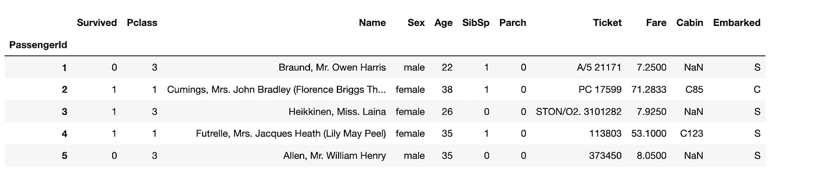
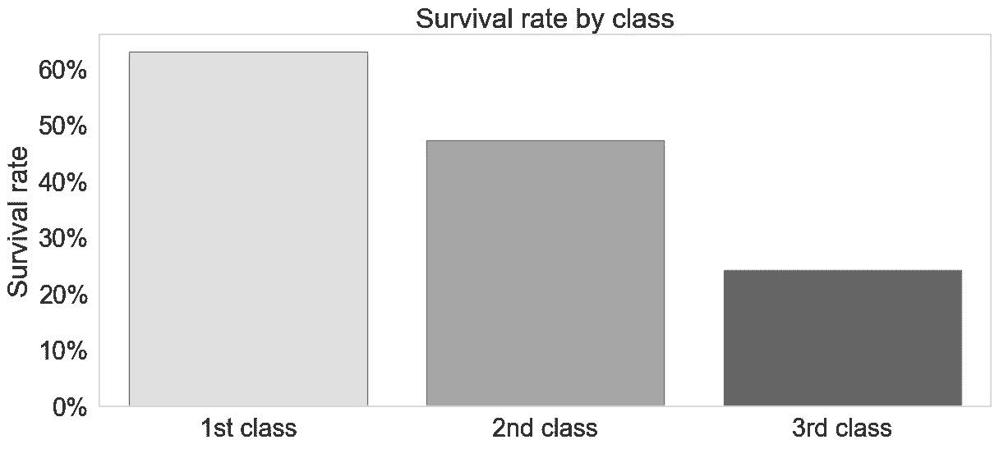
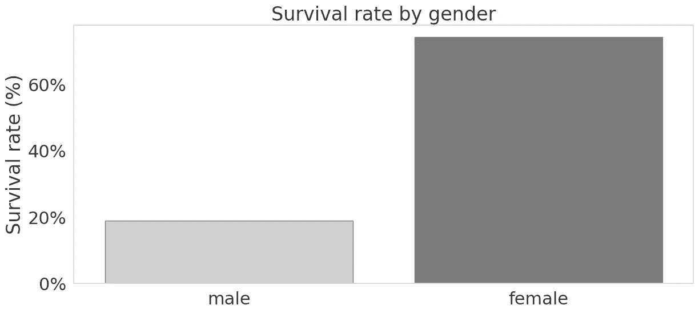
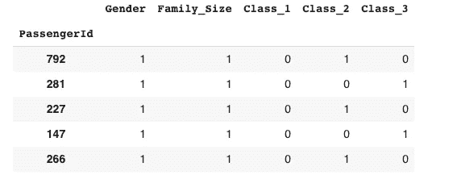
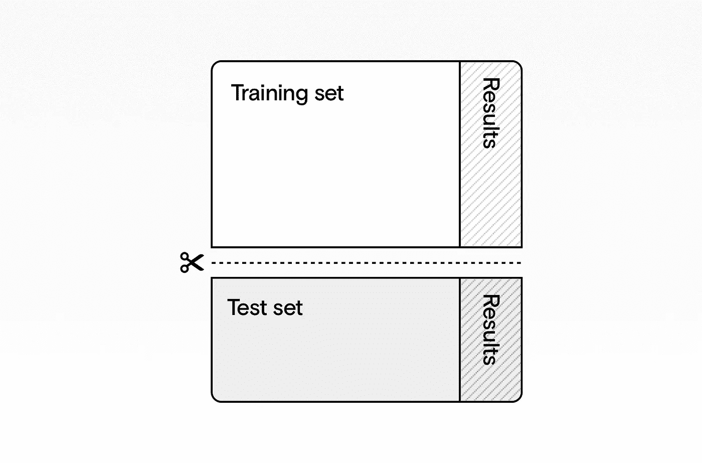
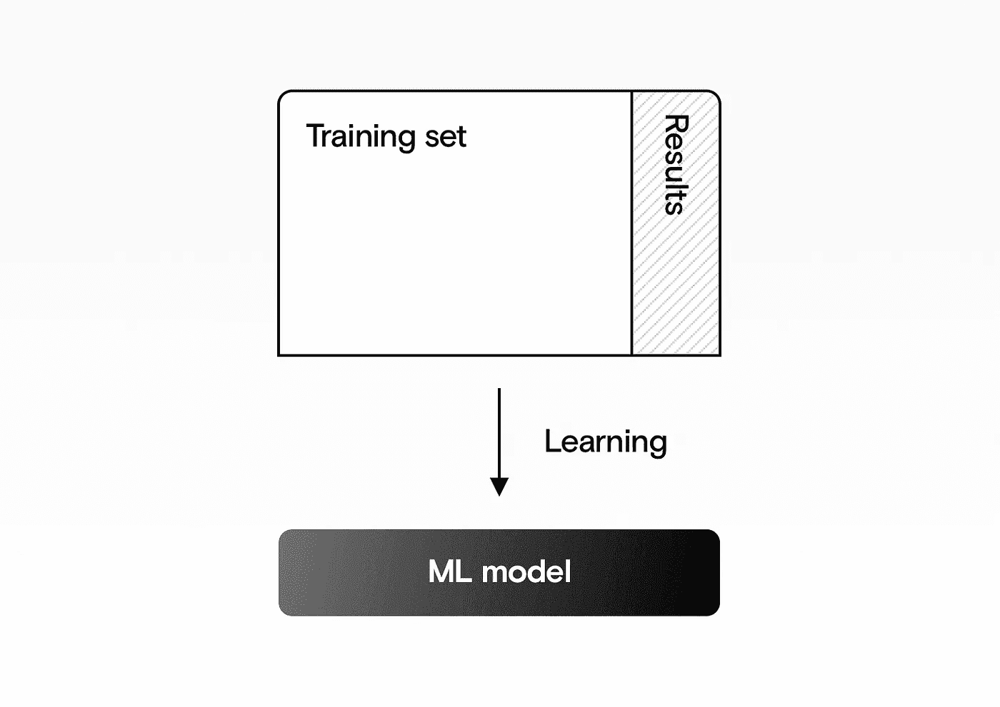
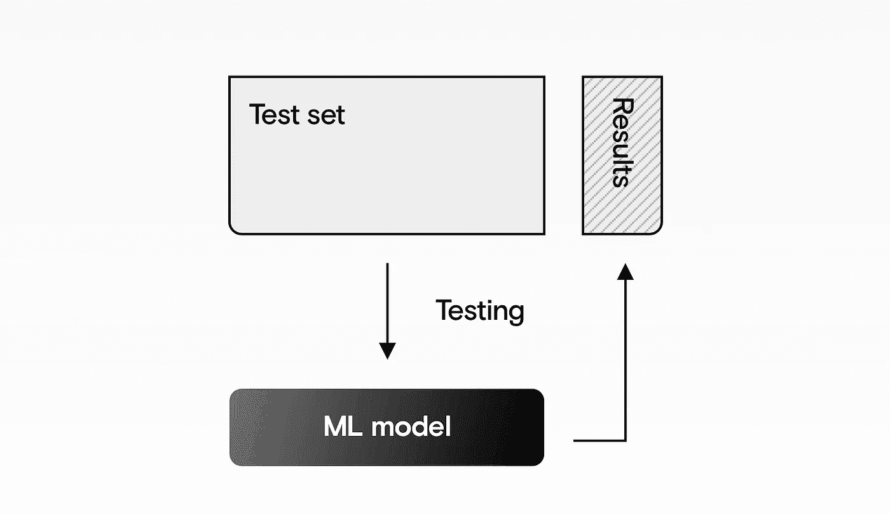
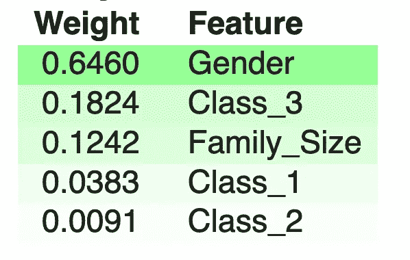
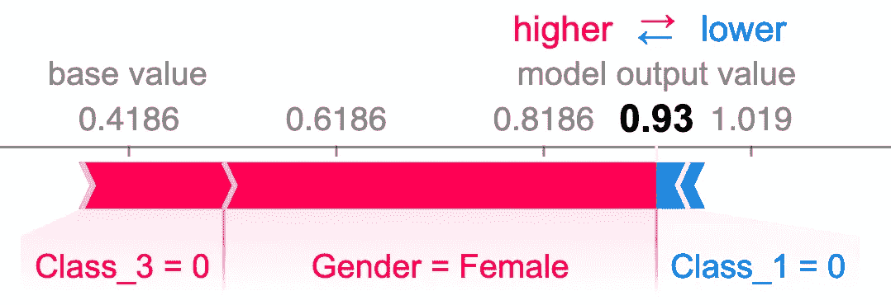
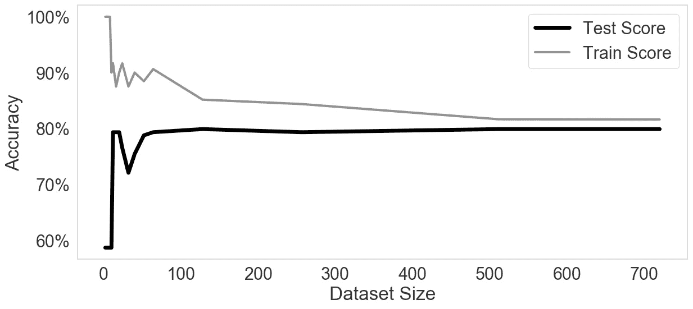

# 机器学习是如何工作的——以代码示例为例

> 原文：<https://towardsdatascience.com/how-machine-learning-works-with-code-example-c2492baffced?source=collection_archive---------63----------------------->

## 训练一个模型来预测泰坦尼克号的幸存者。

[ **注意:**自己构建模型 [**在这里使用我们的全交互笔记本**](https://mybinder.org/v2/gh/datarevenue-berlin/ml_example/master?filepath=how-machine-learning-works-code-example.ipynb) 。不需要以前的编码经验。]

如果你像我一样，你需要玩一些东西并“自己做”来真正理解它。在这里，我们将举例解释机器学习是如何真正工作的。

您将构建自己的**机器学习模型**来预测泰坦尼克号上乘客存活的可能性。该模型将自己学习模式，只需查看数据。

# 了解进行机器学习的步骤

继续执行以下操作:

1.  加载数据并以可视化方式进行探索；
2.  为机器学习算法准备数据；
3.  训练模型——让算法从数据中学习；
4.  评估模型——看看它在以前从未见过的数据上表现如何；
5.  分析模型，看看它需要多少数据才能运行良好。

要自己构建机器学习模型，请打开[笔记本。您将运行真正的机器学习代码，而不需要任何设置——它就是工作。](https://mybinder.org/v2/gh/sixhobbits/machine-learning-by-example/master?filepath=how-machine-learning-works-code-example.ipynb)

# 了解机器学习的工具

机器学习工具有很多选择。在本指南中，我们使用了一些最流行和最强大的机器学习库，即:

*   **Python** :一种以可读性著称的高级编程语言，也是全球最流行的机器学习语言。
*   **熊猫**:一个 Python 库，为该语言带来了类似电子表格的功能。
*   **Seaborn** :用于绘制图表和其他图形的库。
*   **Scikit learn**:Python 的机器学习库，提供用于预测数据分析的简单工具。
*   **DRLearn** :我们自己的[数据收益](https://docs.google.com/document/d/1GJPi4ghFvFna0z6jPS4NFv9pewnuhTyqFCpIL6lB74o/edit#) Learn 模块，就是为这个数据集构建的。

这些都是很好的工具，因为初学者和大公司(如摩根大通)都使用它们。

# 探索我们的数据集

我们将使用著名的“泰坦尼克号”数据集——一个有点病态但迷人的数据集，包含泰坦尼克号乘客的细节。我们有每位乘客的一系列数据，包括:

*   名字，
*   性别，
*   年龄，
*   机票等级。

我们的数据采用行和列的标准形式，其中每行代表一名乘客，每列代表该乘客的一个属性。这里有一个例子:

泰坦尼克号数据集中的一些乘客。来源:作者

泰坦尼克号数据集中的一些乘客

# 可视化我们的数据集

机器学习模型很聪明，但它们只能和我们提供给它们的数据一样聪明。因此，重要的第一步是获得对数据集的高层次理解。

说到分析数据，一个好的起点是测试一个假设。拥有**头等舱机票**的人可能更有可能幸存，所以让我们看看数据是否支持这一点。

你可以在[配套笔记本](https://docs.google.com/document/d/1GJPi4ghFvFna0z6jPS4NFv9pewnuhTyqFCpIL6lB74o/edit#)中看到并运行代码来生成这个可视化效果。

三等舱乘客存活率最低，一等舱乘客存活率最高。来源:作者

三等舱乘客存活率最低，一等舱乘客存活率最高。

一等舱超过 60%的人幸存下来，而三等舱只有不到 30%的人幸存下来。

你可能也听说过“妇女和儿童优先”这句话我们来看看**性别**和**存活率**是如何相互作用的。

女性比男性更有可能存活下来。来源:作者

女性比男性更有可能存活下来。

我们再次看到我们的假设是正确的。超过 70%的女性幸存下来，而只有大约 20%的男性幸存下来。

就这样，我们创建了数据集的两个基本可视化。我们在这里可以做得更多(对于生产机器学习项目，我们肯定会这样做)。例如，[多变量分析](https://www.kaggle.com/benhamner/python-data-visualizations)将显示当我们一次查看多个变量时会发生什么。

# 准备我们的数据

在我们将数据输入机器学习算法来训练我们的模型之前，我们需要让它对我们的算法更有意义。我们可以通过**忽略** **某些** **列**和**重新格式化**其他列来做到这一点。

# 忽略无用的列

我们已经知道乘客的**票号**和他们的**生存几率**之间没有关联，所以我们可以明确忽略这一列。在将数据输入模型之前，我们会将其删除。

# 重新格式化我们的数据

有些功能是有用的，但不是原始形式。例如,“男性”和“女性”的标签对人类来说是有意义的，但对喜欢数字的机器来说却不是。因此，我们可以将这些标记分别编码为“0”和“1”。

一旦我们准备好数据集，这种格式对机器更加友好。我们在下面提供了一个例子:我们去掉了许多无用的列，剩下的列都使用数字。

准备好数据集后，事情就简单了，现在可以进行机器学习了。来源:作者

准备好数据集后，事情就简单了，现在可以进行机器学习了。

# 将我们的数据集一分为二

现在我们需要**训练**我们的模型，然后**测试**它。就像学校的孩子们被给予作为家庭作业的测试问题的例子，然后在考试条件下**看不见的**问题，我们将在一些数据上训练机器学习算法，然后看看它在其余数据上的表现如何。

我们分割数据集:一部分用于训练模型，一部分用于测试模型。来源:作者

我们分割数据集:一部分用于训练模型，一部分用于测试模型。

# 让我们训练我们的模型！

现在是有趣的部分！我们将把训练数据输入到我们的模型中，并要求它找出模式。在这一步，我们给模型**数据和想要的答案(乘客是否幸存)。)**

模型从这些数据中学习模式。

我们的机器学习模型是在训练集上训练的。来源:作者

我们的机器学习模型是在训练集上训练的。

# 测试我们的模型

现在我们可以测试我们的模型，只给它**另一半数据集中的**乘客的详细信息，而不给出答案。该算法不知道这些乘客是否幸存，但它会根据从训练集中学习到的内容进行猜测。

通过要求机器学习模型预测测试数据的结果来测试我们的机器学习模型工作得有多好。来源:作者

通过要求机器学习模型预测测试数据的结果来测试我们的机器学习模型工作得有多好。

# 我们的模特‍Analyzing

为了更好地理解我们的模型是如何工作的，我们可以:

*   看看它最依赖哪些特征来进行预测；
*   如果我们使用更少的数据，看看它的精度如何变化。

第一个帮助我们更好地理解我们的数据，第二个帮助我们理解是否值得尝试获取更大的数据集。

# 理解我们的模型发现什么是重要的

机器学习知道不是所有的数据都同样有趣。通过对特定细节进行不同的加权，它可以做出更好的预测。下面的权重显示性别是目前预测存活率最重要的因素。

我们的模型主要依赖于性别，也有一点依赖于乘客是否在三等舱，以及他们的家庭规模。来源:作者

我们的模型主要依赖于性别，也有一点依赖于乘客是否在三等舱，以及他们的家庭规模。

我们还可以看看该算法在预测特定乘客的存活率时关注了数据的哪些方面。下面我们看到一名乘客，算法认为他很有可能幸存。它特别注意到以下事实:

*   三等舱的乘客**是** **不是**；
*   乘客**是**女性。

由于乘客也不在头等舱，这略微降低了生还的可能性，导致最终的生还预测为 93%。

这个模型是如何对一个特定的乘客做出预测的。她有很高的存活率，因为她是女性，而不是三等兵。来源:作者

这个模型是如何对一个特定的乘客做出预测的。她有很高的存活率，因为她是女性，而不是三等兵。

# 了解数据量如何影响我们的模型

让我们对模型进行多次训练，看看它在更多数据的情况下提高了多少。这里我们绘制了**培训分数**和**测试分数。**后者更有趣，因为它告诉我们该模型在看不见的数据上表现如何。

训练分数可以被认为是一个“开卷”测试:模型已经看到了答案，因此它看起来比“测试分数”高，但模型更容易在训练阶段看到的数据上表现良好。

更多的数据使我们的模型更好(测试分数)。但是在大约 500 个数据点之后，改进是最小的。来源:作者

更多的数据使我们的模型更好(测试分数)。但是在大约 500 个数据点之后，改进是最小的。

这里我们看到，模型的数据越多，它的性能就越好。这在开始时更加明显，此后添加更多的数据只会带来很小的改进。

机器学习模型不一定是“黑盒”算法。模型分析帮助我们理解它们是如何工作的，以及如何改进它们。

# 结论

就是这样——你已经建立了自己的机器学习模型。现在，您将能够:

*   **了解**数据科学团队的日常工作；
*   **与你的数据科学或机器学习团队更好地沟通**；
*   **知道**机器学习最擅长解决哪类问题；
*   意识到机器学习并没有那么可怕。

机器学习的复杂部分是进入构建和扩展定制解决方案的所有本质细节。这正是我们的专长。因此，如果你在接下来的步骤中需要帮助，请告诉我们。