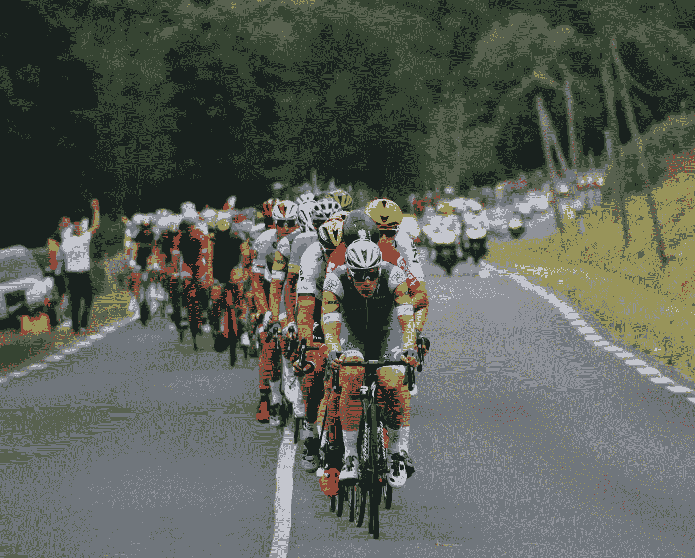
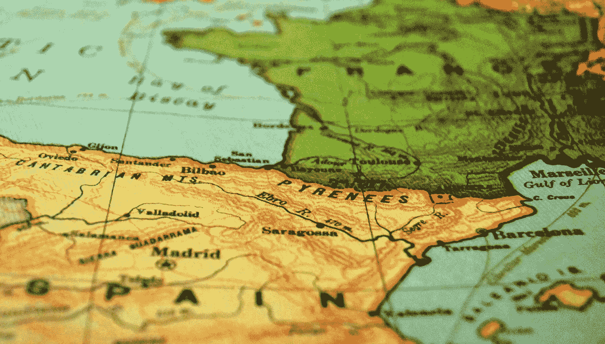
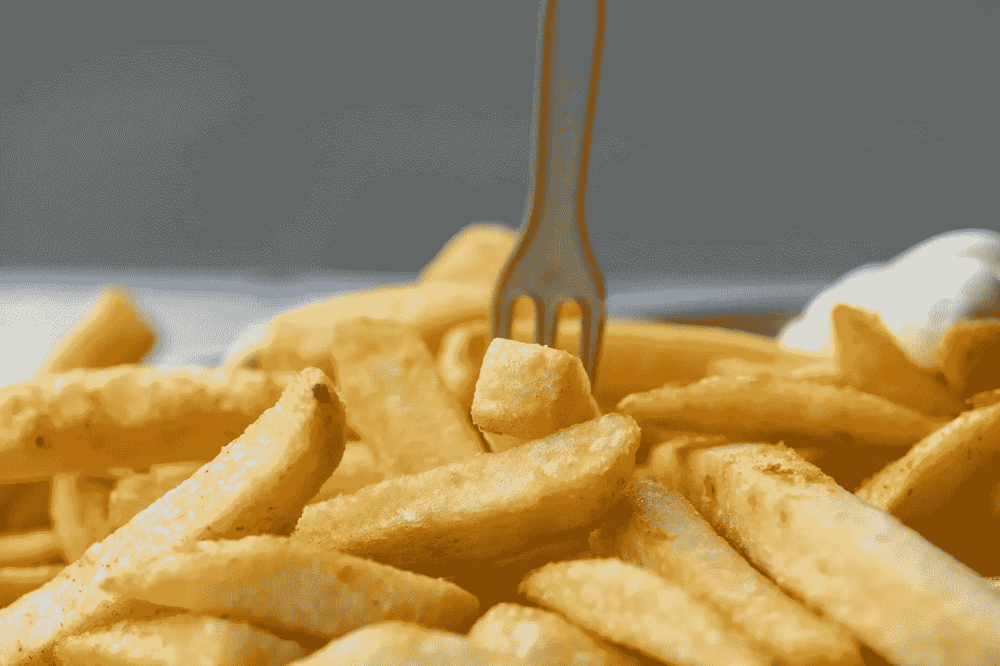
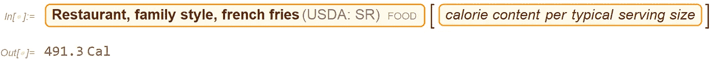
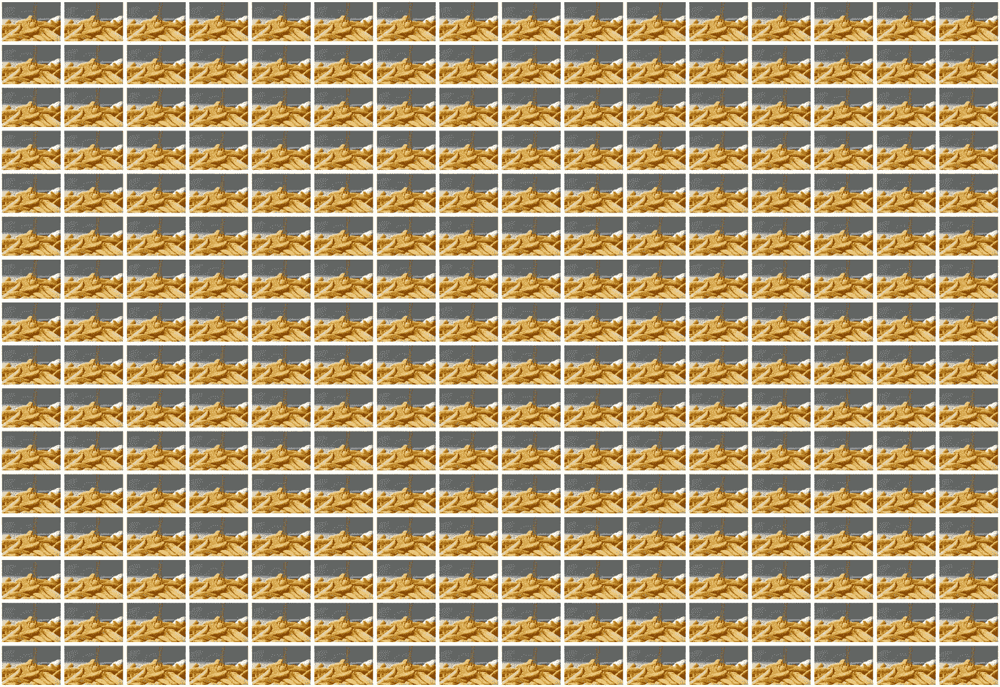

# 你要吃多少薯条才能完成环法自行车赛？

> 原文：<https://towardsdatascience.com/how-many-french-fries-do-you-have-to-eat-to-finish-the-tour-de-france-d8450ed0a2e3?source=collection_archive---------37----------------------->

## 在 Wolfram|Alpha 的帮助下找到答案

罗布·温盖特在 [Unsplash](https://unsplash.com/s/photos/tour-de-france?utm_source=unsplash&utm_medium=referral&utm_content=creditCopyText) 上的照片

我喜欢[环法](https://www.letour.fr/en/)。不，事实上:我喜欢环法自行车赛。我在荷兰长大，每年有三个星期，这将是荷兰电视的主要事件。那时我们只有两个频道，所以，是的，没什么别的节目。但还是。荷兰公共电视组织“ [NOS](https://nos.nl/) ”每天都会在舞台结束前的最后一两个小时播放。

环法自行车赛是一项为期多天的自行车比赛，终点在巴黎市中心的一条非常大的街道香榭丽舍大街。它通常每年在不同的地方开始，有时甚至在邻近的国家开始。最具挑战性和最受欢迎的赛段通常是在阿尔卑斯山和比利牛斯山脉的山区。

[Ian](https://unsplash.com/@travelsnips?utm_source=unsplash&utm_medium=referral&utm_content=creditCopyText) 在 [Unsplash](https://unsplash.com/s/photos/pyrenees?utm_source=unsplash&utm_medium=referral&utm_content=creditCopyText) 上的照片

环法自行车赛的长度每年都不一样，但通常都超过 2000 英里。或者根据 [Wolfram|Alpha](https://www.wolframalpha.com/about/) 超过[3219 公里](https://www.wolframalpha.com/input/?i=2000+miles)。或月球赤道长度的 0.29 倍。或者说是纽约到洛杉矶距离的 0.82 倍。

骑自行车走这么长的距离需要能量。精力充沛。我很好奇这种能量有多少，并将它与我喜欢的已知食物的量进行比较。我喜欢吃很多东西，但我最喜欢的主食之一是土豆。水煮，捣碎，或者以薯条的形式，都是好的。所以，既然说的是法国，那就用薯条吧。是的，我应该在这里指出，炸薯条很可能是在比利时发明的，通常也被称为 pommes frites。

[吉利](https://unsplash.com/@gillyberlin?utm_source=unsplash&utm_medium=referral&utm_content=creditCopyText)在 [Unsplash](https://unsplash.com/s/photos/pommes-frites?utm_source=unsplash&utm_medium=referral&utm_content=creditCopyText) 上拍摄的照片

环法自行车赛中一名自行车手燃烧的卡路里量(1“膳食卡路里”相当于 1 千卡)因阶段而异，但通常估计在轻松的一天 5000 卡路里到艰难的一天 7000 卡路里之间。根据 Wolfram|Alpha 的说法，以每小时 25 英里的速度骑一个小时的自行车会燃烧大约[2000 卡路里](https://www.wolframalpha.com/input/?i=biking+one+hour&assumption=%22FSelect%22+-%3E+%7B%7B%22Bicycling%22%7D%7D&assumption=%7B%22FS%22%7D+-%3E+%7B%7B%22Bicycling%22%2C+%22d%22%7D%7D&assumption=%7B%22F%22%2C+%22Bicycling%22%2C+%22W%22%7D+-%3E%22159+lb%22&assumption=%7B%22F%22%2C+%22Bicycling%22%2C+%22v%22%7D+-%3E%2225+mph%22&assumption=%7B%22FP%22%2C+%22Bicycling%22%2C+%22S%22%7D+-%3E+%22Male%22)。

所以让我们以 6000 卡路里的“平均日”为例。今年的环法自行车赛持续 23 天，但其中两天是休息日，所以 21 个骑行日。这给了我们高达 126000 卡路里的热量。

现在让我们来计算一份炸薯条的热量。炸薯条有很多种，所以我会用“餐厅式”炸薯条:

(图片由作者提供)

用 126，000 卡路里的总热量除以一份食物的热量，我们得到了食物的数量，大约是 256 份。还挺多的！这是一张显示 256 份炸薯条的图片，网格为 16x16:

(图片由作者根据 [Gilly](https://unsplash.com/@gillyberlin?utm_source=unsplash&utm_medium=referral&utm_content=creditCopyText) 在 [Unsplash](https://unsplash.com/s/photos/french-fries?utm_source=unsplash&utm_medium=referral&utm_content=creditCopyText) 上拍摄的照片提供)

环法自行车赛参赛者的实际饮食可能更加多样和健康，但它显示了在巴黎完成比赛所需的大量卡路里。现在我饿了。🙂