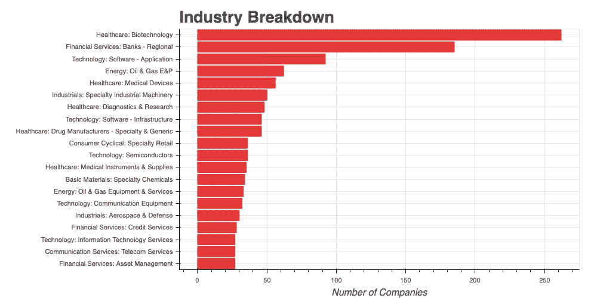

# 有多少个行业？

> 原文：<https://towardsdatascience.com/how-many-industries-are-there-74890132581b?source=collection_archive---------5----------------------->

## 亨尼投资

## 现代企业工业概况的定量分析

[图片](https://stock.adobe.com/ca/images/container-truck-in-ship-port-for-business-logistics-and-transportation-of-container-cargo-ship-and-cargo-plane-with-working-crane-bridge-in-shipyard-at-sunrise-logistic-import-export-and-transport/313735618)作者[那利](https://stock.adobe.com/ca/contributor/207041160/thatree?load_type=author&prev_url=detail)

作为一名股市投资者，我经常发现自己在自己熟悉的行业中发现有吸引力的证券。作为一名数据科学家，在过去的两年里，我接触了比一般投资银行家更多的信息技术公司。与打算收购一家石油公司的普通资本经理相比，我的化学工程学位也让我在选择石油天然气公司时拥有了优势。

我们许多个人投资者都倾向于自己喜欢或了解的行业。与此同时，我们可能没有意识到行业幽灵到底有多广。大多数人知道的几个热门行业包括航空、石油和天然气、建筑、消费品和金融服务。

我错过了什么吗？事实上，我有！一百或两百个其他人。

在本文中，我将分解行业幽灵，找出它们在多大程度上被业务所代表，以及行业概况可以有多细粒度。

# 部门与行业

与传统的误解不同，许多人所谓的“一个行业”实际上被称为“一个行业”。根据[全球行业分类标准](https://en.wikipedia.org/wiki/Global_Industry_Classification_Standard) (GICS)，共有 11 个行业:

*   活力
*   材料
*   工业
*   非必需消费品
*   消费品
*   卫生保健
*   金融
*   信息技术
*   通信服务
*   公用事业
*   房地产

这些行业又进一步细分为 **24** 行业组、 **69** 行业和 **158** 子行业。

分类标准更多，如[行业分类基准](https://en.wikipedia.org/wiki/Industry_Classification_Benchmark)(ICB)[标准产业分类法](https://en.wikipedia.org/wiki/Standard_Industrial_Classification)(原文如此)[北美行业分类体系](https://en.wikipedia.org/wiki/North_American_Industry_Classification_System) (NAICS)等。它们对业务部门的划分略有不同，导致业务活动的粒度表示。

在 [Vhinny](https://www.vhinny.com) ，我使用 GICS 作为核心分类系统。因此，我将进一步讨论 GICS。

# **财务数据**

在这项研究中，我使用来自 www.vhinny.com[的 **Alpha 数据集**。我手上的版本包含了 2448 家美国上市公司。虽然这不是美国所有上市公司的完整列表，但它是在 2019 年**向 **SEC** 备案的所有**6777**公司的一个相当有代表性的子集。**](http://www.vhinny.com)

# **哪些板块参与度最高？**

**下面的柱状图显示了各个行业所代表的公司数量。**

****

**每个部门的公司数量**

**Y 轴有 GICS 分类的 **11** 扇区。X 轴显示了在这些部门经营的公司数量。**

**从公司数量来看，最大的行业是医疗保健。至少有 500 家美国上市公司正忙于开发解决方案，通过发现新药、改善运营和开发尖端研究技术来提高我们的生活质量。**

**第二大行业是金融服务业。而普通大众对该领域的主要参与者都很了解，如 Visa、Mastercard、美国银行、美国运通、摩根大通等。小公司在确保我们的日常需求得到妥善处理方面发挥着至关重要的作用。350 多家上市公司自豪地服务于这一领域。**

**第三大领域是**技术，**代表在美国舞台上至少有 300 名玩家。在苹果、微软和英特尔等科技巨头的带领下，**科技公司**确保我们的互联网正常工作，手机响起，电视打开，并实现 21 世纪所有其他种类的标志性乐趣**。****

# ****哪些行业参与度最高？****

****现在让我们来看看美国排名前 20 的行业。****

********

****每个行业的公司数量****

****按照行业分布，榜单中的前 10 个行业来自**医疗**、**金融服务**和**科技行业。**几个领先行业的例外被大胆宣称为**石油&天然气**行业来自**能源行业**(前四)**特种工业机械**(前六)来自**工业**行业，**特种零售**(前十)来自**消费周期性**行业。****

****医疗保健领域最繁忙的**行业**是**生物技术** (250+公司)**医疗器械** (50+公司)**诊断&研究** (40+公司)**药品制造商** (40+公司)。****

****地区性银行(160 多家公司)代表了金融服务行业的半壁江山。其余的**金融服务**行业没有进入公司数量排名前十的行业。****

******技术**部门将其行业中的两(2)个放在这份十大名单的首位:**软件—应用** (90 多家公司)和**软件基础设施** (40 多家公司)。****

# ****为什么它很重要****

****对我来说，理解行业分类以及企业如何在不同行业中分布，是建立可靠的机器学习模型以识别潜在投资机会的基础。正如 [Calson Sheng](https://medium.com/u/dbaff478aac0?source=post_page-----74890132581b--------------------------------) 在他最近关于[公司估值](https://medium.com/@ksheng/equity-analysis-b6ef9c4a122a)的文章中解释的那样，我们需要知道**我们在哪里**以及**我们面对的** **是谁**才能对一家公司的未来做出强有力的假设。****

****让我们再看一张图，显示每个行业下的行业数量。****

********

****每个部门的行业数量****

****我们在这里看到的行业细分与之前显示的公司数量细分有很大不同。**工业**和**消费周期性**板块的行业数量都在 20 家以上，而板块本身分别有~ **300 家**和~ **250 家**公司。做一个简单的假设，每个行业每个部门的规模分布相等，我们得出每个行业有 10 家公司。****

****在进行如下研究时，记住这一点很重要:****

**** [## 用机器学习预测股市。调查结果。

### 用机器学习识别高收入成长股

towardsdatascience.com](/predicting-the-stock-market-with-machine-learning-findings-135f0b3a26cf) 

在**机器学习**模型中使用公司中代表性如此小的行业将**不能很好地概括**。这里主要关注的是对本地偏见的潜在脆弱性，如果 10 个公司行业碰巧有 8/10 的正面例子，这将不可避免地发生。一个更着眼于未来的，更一般化的解决方案宁愿完全不考虑行业，只关注行业。占用最少的行业(**公用事业**)占数据集中所有公司的 2%,行业在整个数据中具有良好的代表性**。然而，工业并不如此。**

# 结论

在这项研究中，我根据各个领域的公司数量对 GICS 进行了分类。我发现公司数量最多的三个行业是**医疗保健**、**金融服务**和**科技**。然而，就它们所代表的行业数量而言，这些并不是最细化的行业。**和**各有 20+个行业，**工业**和**消费周期性**行业成为涵盖行业数量最多的两大行业。

由于代表性不足，上述**提出的分析在将行业纳入**机器学习**解决方案的开发时，在**股票市场**提出了**警告。相反，仅使用扇区可能会提供鲁棒性和更好的泛化能力。

附注:你可以在我的 [GitHub](https://github.com/vhinny-investing/codebase/blob/master/apps/industry_breakdown/eda/How%20Many%20Industries%20are%C2%A0There%3F.ipynb) 上找到我在本文中使用的所有可视化代码。

# 我们连线吧！

我很高兴和与我志同道合的人联系，这是对**财务独立**的追求。如果你也在寻求经济独立，或者你想和 T4 合作，交流想法，请随时联系我们！以下是一些可以找到我的地方:

*   [www.vhinny.com](http://www.vhinny.com/)—投资研究平台，为您自己的分析提供金融数据
*   [https://www.linkedin.com/company/vhinny](https://www.linkedin.com/company/vhinny)——加入我们 LinkedIn 上的社区，在那里我和其他贡献者分享与投资相关的内容

干杯！****