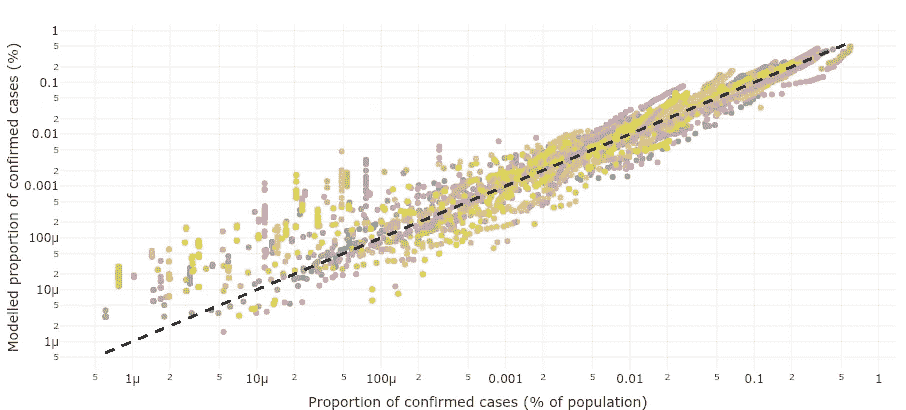

# 有多少人真的被 SARS-新冠肺炎感染了？

> 原文：<https://towardsdatascience.com/how-many-people-have-really-been-infected-by-sars-covid-19-ed9338641501?source=collection_archive---------42----------------------->

## [我看着新冠肺炎](http://towardsdatascience.com/tagged/my-look-at-covid-19)

## 各国距离实现群体免疫还有很长的路要走

[jplenio](https://pixabay.com/es/users/jplenio-7645255/) 在 [Pixabay](https://pixabay.com/) 上的照片

***更新 2020 年 5 月 15 日*** : *这篇文章中的上限度量现在被一篇* [*更新的文章*](/upper-bounds-and-testing-biases-for-the-number-of-sars-covid-19-infections-66ff3eaa5be7) *中的更好的近似所取代。下限和中心估计值不受此影响，这里得出的结论和主要观点也不受此影响。*

***2020 年 5 月 3 日更新:*** *分析的附加细节，源代码本身可在 Jupyter 笔记本(R)上的*[*GitHub*](https://github.com/fermosc/CoVID-Prevalence)*处获得。它也可以直接在 Binder 上运行。*

当前的 SARS-新冠肺炎疫情已经在世界范围内造成了大量的死亡，并严重影响着全球数十亿人的生活。为了了解这种新疾病带来的真正风险，并预测不同政策可能产生的影响，关键是要知道有多少人可能已经受到这种病毒的影响——无论有无症状。在这篇文章中，我提出了不同国家自疫情爆发以来感染该疾病的累计比例的严格下限和上限——其一生中的患病率。这些界限表明，没有一个国家的疾病传播得足够远，以至于不能指望很快实现群体免疫。然后我继续介绍一个更精确的终生患病率的中心估计值。这一估计为在不久的将来达到群体免疫的前景描绘了一幅更加暗淡的画面。最后，估计数用于了解不同国家遵循的检测政策，特别是在检测大多数疾病病例和了解疾病在一个国家内的传播程度之间的平衡。

# 终生患病率的上限和下限

想象一下，在一百个人中，我们有二十个人感染了这种病毒(患病率为 20%)，但我们不知道确切的人数，除了怀疑一些人可能被感染。我们选择对 10 名表现出与疾病最相符症状(如干咳、发烧等)的人使用 10 套检测试剂盒。十次检测中有五次呈阳性(50%的阳性检测率)；其他五人的症状是由其他疾病引起的，如普通感冒、流感或吸烟者的咳嗽。总之，由于有五个人实际上被检测为阳性，我们很容易知道*至少有*百分之五被感染——这是*下限*。我们的*测试偏差*——选择测试表现出最明显迹象的人，而不是随机挑选 10 个人——导致了 50%的阳性测试率，比我们人口中 20%的真实患病率高出一倍多。即使我们不知道真实的流行率，我们知道最多有 50%的人被感染。底线是，我们可以确定感染人数在 5%到 50%之间。总之，这就是我下面讨论的下限和上限的逻辑。

## **下限:确诊病例**

在所有国家，感染 SARS-新冠肺炎的人数很可能远远高于官方报告的确诊病例数。换句话说，*每个国家报告的确诊病例数是该疾病真实流行率的下限。*图 1 中的绿色三角形标出了终生患病率的下限(即官方报告的确诊病例比例)。

图 1:各国感染 SARS-新冠肺炎的人口累计百分比的上限(红色三角形)、下限(绿色三角形)、中央外推估计值(蓝色圆点)和可能范围(灰色线段)(注意对数垂直轴)。这些估计是使用 2020 年 4 月 25 日的最新数据计算的。将光标悬停在绘图上以查看估计的实际值。

对 SARS-新冠肺炎流行率的低估很大程度上可以归因于测试不充分。即使对于相对较小的国家，检测全部人口也是完全不可能的，更不用说连续检测全部人口了，因为人们可能在接受检测后被感染。截至 4 月 28 日，仅有的成功检测了超过 4%人口的国家有冰岛(占检测人口的 13.5%)、巴林(6.91%)和卢森堡(6.62%)。这三个国家都是非常小且相当富裕的国家，这并非巧合。

> 那些接受疾病测试的人比那些没有接受测试的人更有可能被感染。

一个更可行的方法是对从人群中随机抽取的大量个体进行测试。然而，很少有国家发布——甚至收集——这样的随机抽样数据。相反，在大多数国家(唯一的例外是冰岛)，对这种疾病的检测相当严格，其中一个原因是全球市场上缺乏可靠的检测手段。这导致人们只有在已经有大量迹象表明他们可能已经被感染时才进行疾病测试(例如，他们要么显示出疾病的明显症状，要么他们与已经被发现感染的人有过密切接触)。这导致了人口的有偏抽样:*那些接受疾病测试的人比那些没有接受测试的人更有可能被感染*。

各国在怀疑和紧急程度的界限上遵循着非常不同的标准，这使得使用这些珍贵的检测棉签变得更加混乱。通常，即使在表现出明确的症状后，一些患者，尤其是那些属于被认为严重并发症风险较低的人群的患者，仍然难以接受检测。幸运的是，许多国家目前正在努力解决检测短缺的问题，一些国家正在实施大规模随机抽样研究和血清学调查，以评估该流行病在其人口中的真实流行程度。

## **上限:阳性率**

上述检测偏差导致*在实际接受检测的人群中发现的阳性病例的百分比可以作为该疾病在一个国家的真实流行率的上限*:接受检测的人群比未接受检测的人群更有可能呈阳性，这意味着如果对整个人口进行检测，检测呈阳性的比例会更低。

我用这种方法来了解一个国家可能被感染的最大人数。ourworldindata.org 网站*记录了不同国家报告进行的非典-新冠肺炎测试的次数。我们可以将进行的测试数量与不同国家报告的 SARS-新冠肺炎确诊病例的数量结合起来(由[约翰·霍普金斯大学 CSSE 分校](https://github.com/CSSEGISandData/COVID-19)编辑、整理和提供)以获得“最坏情况”的情景(或者，正如我在下面讨论的，也许实际上是最好的情况)。确诊病例与所做检测的比率接近于给定日期的最大可能感染人数。这些上限估计值由图 1 中上方的红色三角形标出。*

> *[……]目前没有一个国家接近实现群体免疫*

*截至 2020 年 4 月 29 日完成这篇文章时，只有两个国家的阳性检测率超过 25%:厄瓜多尔(48.68%阳性检测)和英国(27.90%阳性检测)。即使是那些受该疾病肆虐最严重的国家，阳性病例的最大百分比也低于 25%:西班牙的感染者最多为 20.1%，意大利的感染者最多为其人口的 11.0%，美国可达 17.8%。请注意，不清楚在某个时间点感染的人口比例较低是否一定是好消息。有人可能会说，拥有更高比例的已经患病的人口将使一个国家更接近实现人们渴望的群体免疫。这也将使这种疾病的真实死亡率比目前认为的要低得多(例如，见这篇[文章](https://www.economist.com/graphic-detail/2020/04/11/why-a-study-showing-that-covid-19-is-everywhere-is-good-news))。不幸的是，如果人们接受群体免疫需要一个国家 60 %-[70 %](https://www.jhsph.edu/covid-19/articles/achieving-herd-immunity-with-covid19.html)的人口通过该疾病的估计，我们必须得出结论:*目前没有一个国家接近实现群体免疫，尽管 T10 一些报告与此相反。**

# *更精确的估计:有界外推*

*以上，我已经提供了强有力的下限(官方确认的病例；图 1 中的绿色三角形)和上限(正测试率；图 1 中的红色三角形)代表 SARS-新冠肺炎在各国的流行情况。这些是至关重要的，因为我们几乎可以肯定，在任何给定的国家，已经患病的人的比例必须在这两个界限之间(图 1 中灰色部分所示)。现在，我将大致说明不同国家的真实患病率在这个范围内的位置。我在这里提供的估计必然是一个猜测——即使是一个在统计学上有充分动机的猜测——严重依赖于推断。从统计学上来说，推断是一件非常冒险的事情。值得记住马克·吐温对推断的讽刺:*

> *在一百七十六年的时间里，密西西比河下游缩短了二百四十二英里。这相当于平均每年超过 1.3 英里。因此，任何冷静的人，不是瞎子也不是白痴，都可以看到，在古老的鲕状志留纪时期，就在一百万年前的 11 月，密西西比河下游长达一百三十万英里以上，像鱼竿一样突出在墨西哥湾上空。出于同样的原因，任何人都可以看到，七百四十二年后，密西西比河下游将只有一英里又四分之三长，开罗和新奥尔良将把它们的街道连接在一起，在一个市长和共同的市议员委员会的领导下舒适地缓慢前行。*

*在各国，确诊病例数必须与检测次数密切相关:只有在实施检测后才能确诊病例。还有一个因素使得这种相关性更强。正如我所讨论的，有理由相信自己可能被感染的人——无论是由于症状还是与其他患者接触——更有可能接受检测。在这种疾病更流行的国家，有这种症状的人数会更多。这就形成了一个反馈循环，感染人数多的国家将进行更多的检测，进一步加强了相关性。*

*报告的死亡和疾病康复的相对数量可以作为疾病在特定国家发展阶段的指标。最初，各国可能会经历该疾病病例数量的激增，但直到一段时间后，才会出现大量死亡或康复。这种延迟的原因是这种疾病需要时间来恢复或死亡，因此在感染和最终结果之间必须有一些滞后。这里也需要谨慎:各国报告的痊愈人数实际上是发现受感染的人数。然而，现在已知很大比例的人被感染，但[仍然完全无症状](https://www.cebm.net/covid-19/covid-19-what-proportion-are-asymptomatic/)。这些人往往不接受检查，而且经常完全康复，但不计入官方统计。原则上，该疾病导致的死亡人数可以被视为更可靠的统计数字——更难忽略死亡人数——但也有广泛的报道称，即使是死亡人数也可能被大大低估。例如，在几个国家，据报道许多 SARS-COVID19 死亡(许多发生在[疗养院和养老院](https://www.euronews.com/2020/04/17/coronavirus-care-homes-could-be-where-over-half-of-europe-s-covid-19-deaths-occur-says-new) ) [没有被纳入官方死亡统计](https://www.nytimes.com/interactive/2020/04/21/world/coronavirus-missing-deaths.html?auth=linked-facebook)。*

**

*图二。预测确诊病例数的回归模型，作为执行的测试数、报告的死亡数和报告的恢复数的函数。横轴表示确诊病例数，纵轴表示模型预测值。虚线是同一性，即使用该模型预测的确诊病例数正好等于确诊病例的真实数。图中的点强烈地聚集在这条线周围，这表明该模型是现实的准确反映。点的颜色对应不同的国家。注意两个轴上的对数刻度。*

*因此，所有三个指标(确诊病例、确诊死亡和确诊痊愈)都应作为其真实值的实际下限。尽管如此，人们仍然可以利用它们之间可靠的相互关系来估计某个国家已经发生的真实病例数。我使用了一个国家接受测试的人口比例和死于该疾病的人口比例(来自[ourworldindata.org](https://ourworldindata.org/covid-testing))，以及已知已从该疾病中康复的人口比例(来自[约翰·霍普金斯大学的 CSSE](https://github.com/CSSEGISandData/COVID-19) )，来预测该国被确认感染的人口比例(在技术术语中，我使用了 [*主成分*](https://rpubs.com/esobolewska/pcr-step-by-step) [*probit 回归模型*](https://www.sciencedirect.com/topics/economics-econometrics-and-finance/probit-model) )。从图表(图 2)中可以看出，在拟合范围内，这种回归模型实现了非常准确的预测。*

*请注意，在上述回归模型中，确诊病例数是*预测的*变量，而接受检测的人口比例、死亡和康复是独立的预测因素。我用这个回归模型来推断人群中的真实病例数。这是通过将受试人群的比例人为设置为 100%，然后使用拟合模型(具有报告的恢复和死亡的真实值)来预测确诊病例的数量来实现的。为了保持外推的合理性，这些都受到额外的约束，即得到的估计值必须位于上述已知的上下限内(用技术术语来说，贝叶斯先验)。*

*这种方法为我们提供了由图 1 中的蓝点绘制的中心估计值。在各国之间，这些中央估计数更接近流行率的下限——即官方报告的病例——而不是阳性检测率的上限。在所有国家的研究中，只有三个国家的终生流行率可能超过 1.5%:西班牙(1.73%)、比利时(1.71%)和意大利(1.6%)。正如我所说，这些估计只是猜测。然而，尽管对某些人来说它们看起来很低，但事实上它们与现有的几个大规模随机测试研究中发现的结果是一致的。例如，最近的一项研究报告了在 Vo '村进行的两次广泛检测的结果，Vo '村是意大利北部该疾病的最初疫源地之一，也是首批通过隔离成功控制病毒的地区之一。研究人员测试了很大一部分人口(分别为 85.9%和 71.5%)，发现封锁开始时的患病率仅为 2.6%，封锁结束时为 1.2%。“Vo”是这种疾病在意大利最初传播的地区之一，比该国其他地区传播得更广(并且是意大利第一个死于 SARS-新冠肺炎的人)。因此，我对意大利 1.6%的终生流行率的估计似乎是一个相当合理的赌注。*

*图 3。SARS-新冠肺炎真实累积流行率的估计演变。将光标悬停在图表上以查看点的实际值，并单击图例放大或取消选择特定曲线以进行更详细的比较。*

*上面的图 3 描绘了中央估计值是如何演变的。它证实了西班牙——我自己的国家——目前是大多数病例发生的地方，并于 4 月 3 日超过了意大利。幸运的是，根据图中斜率的衰减，似乎所有被绘制的国家——我根据个人兴趣和疾病造成的问题最多的国家的组合选择的——似乎都已经过了疾病的高峰期，可能除了俄罗斯。图 4 证实了这一点，该图绘制了估计的每日新病例，计算为连续累积点之间的差异。*

*图 4。SARS-新冠肺炎真实每日新增病例数的估计变化(7 天移动平均值)。将光标悬停在图表上以查看点的实际值，并单击图例放大或取消选择特定曲线以进行更详细的比较。*

# *发现的病例比例是多少？*

*正如我前面提到的，不同的国家在对其人口进行检测(以及报告这些检测的标准，详见 [*、ourworldindata.org*](https://ourworldindata.org/covid-testing))时遵循着本质上不同的标准。这种不同的策略自然导致官方报告的数字在多大程度上准确地反映了疾病在各国的实际流行情况。图 5 绘制了官方报告的确诊病例数与真实病例累积估计数之间的比率。首先要注意的是，所有标绘的国家——除了爱沙尼亚和德国，如下所述——都大大提高了它们的检出率，也许在标绘区间结束时稳定在一个特定值附近。然而，请注意，这些国家中似乎没有一个检测到超过其 SARS-新冠肺炎病例的大约四分之一(西班牙和美国)，而其他国家(例如，法国和瑞典)似乎只检测到其病例的大约 15%。*

*图 5:各国报告为 SARS-新冠肺炎官方确诊病例的真实病例比例。这些是以累计确诊病例数与上一节计算的累计估计数之比计算的。将光标悬停在图表上以查看点的实际值，并单击图例放大或取消选择特定曲线以进行更详细的比较。*

*爱沙尼亚早期的检出率高峰很可能是因为在高峰之日病例数量很少。后来，当这种疾病开始更广泛地传播时，它的检测能力变得不堪重负，正如它在一个又一个国家发生的那样。然而，令人惊讶的是，大多数其他国家的检出率并没有开始回升，爱沙尼亚和德国(在某种程度上)在检测疾病病例方面似乎一直在逐渐恶化*—*，也就是说，他们的检出率在下降，或者至少没有上升。这些国家——它们对疫情的最初反应在某种程度上是欧洲范围内的榜样——突然之间表现不佳，这似乎有点违背直觉。也许他们有意追求不同的目标？对那些最擅长检测该疾病的国家的检测率的演变进行研究表明了另一种可能性。*

## *查找单个案例与了解总共有多少个案例*

*图 6 描绘了截至 4 月 28 日，我估计在发现其病例方面最成功的 10 个国家的估计发现率的演变。总体而言，只有新加坡(100%检出)、冰岛(63.41%)、卢森堡(44.44%)和巴林(43.17%)的估计检出率超过 40%。请注意图中，在这十个国家中，似乎有两种不同的模式。一方面，一组国家——巴林、爱尔兰、葡萄牙、新加坡、西班牙和美国——显示出它们在 SARS-新冠肺炎检测能力方面的持续增长。这些国家的首要任务似乎是发现尽可能多的患者。这有一个明显的优势，即让他们尽快得到治疗和/或监测和隔离，这将有助于控制疾病的传播。然而，这种方法的代价是只对那些更有可能患病的人进行测试，从而增加了测试的偏倚。正如我上面所讨论的，这使得很难使用检测信息来评估该疾病在该国的真实传播情况。*

*图 6:截至 4 月 28 日估计检出率最高的十个国家中被报告为 SARS-新冠肺炎官方确诊病例的真实病例比例。这些是以累计确诊病例数与上一节计算的累计估计数之比计算的。将光标悬停在图表上以查看点的实际值，并单击图例放大或取消选择特定曲线以进行更详细的比较。*

*在这组国家中，新加坡的情况尤其突出。这个国家——尽管最近出现了疾病高峰——似乎目前发现了几乎所有的病例。然而，令人惊讶的是，新加坡并不在进行最广泛测试的国家之列。到 4 月 20 日(他们最新报道的测试次数)，他们最多只测试了 1.39%的人口，远低于许多其他国家。这表明新加坡可能特别擅长于接触者追踪，即找到所有与已知感染者接触过的人。事实上，新加坡政府已经率先部署了基于蓝牙的联系人追踪应用程序[，该应用程序已经被大部分新加坡人接受。](https://qz.com/1842200/singapore-wants-everyone-to-download-covid-19-contact-tracing-apps/)*

> *[……]后几个国家正在平衡发现个别患者的需要和更好地了解该疾病在其公民中的真实流行情况；简而言之，他们正在减少他们的测试偏差。*

*另一方面，第二组国家——包括冰岛、以色列、卢森堡和瑞士——显示出它们的检测率暂时持平甚至下降的变化模式，与我们在德国和爱沙尼亚看到的非常相似。至关重要的是，就接受测试的人口百分比而言，这一群体包括前三名国家中的两个。冰岛——迄今为止进行最广泛检测的国家——在检测这种疾病方面似乎越来越差，这是怎么回事？这个问题的答案是，后几个国家正在平衡检测个体患者的需要和更好地了解疾病在其公民中的真实流行情况；简而言之，他们正在减少测试偏差。*

*这些国家似乎不是仅对最有可能患病的人进行检测，而是对患病迹象较少、也不属于特别高风险群体的人进行检测。这样，尽管冰岛进行了比其他任何国家都多的检测，但实际上检测到的病例越来越少。作为交换，这种较低偏倚的检测策略使他们能够更好地了解该疾病在其人群中的流行情况，因为无偏倚检测的阳性率将接近该国的真实流行率。这种策略的一个有趣的副作用是，人们还将测试更多症状轻微甚至完全无症状的人。这样的人患严重并发症的可能性要小得多。这导致这些国家的官方死亡率下降。确切地说，一段时间以来，德国异乎寻常的低死亡率(目前为 4.04%)让媒体感到困惑，爱沙尼亚的死亡率更低(3.08%)——例如，与西班牙的(10.24%)或瑞典的(12.26%)相比。因此，爱沙尼亚——我写这篇文章的地方——和德国不是表现不佳，而是在一个非常好的公司里；他们采取的策略与迄今为止控制疫情最好的一些国家一样。对爱沙尼亚检出率的这种解释确实与[爱沙尼亚政府明确强调无偏见检测不谋而合](https://news.err.ee/1073473/covid-19-testing-to-include-people-without-symptoms-to-get-better-overview)。*

# *结论*

## *这里给出的下限和上限并不严格*

*请注意，虽然可以说我提出的中心估计只不过是明智的赌注，但由于它们依赖于外推法(尽管是受控的外推法)，因此下限和上限确实是硬边界。*几乎可以肯定，不同国家的真实终生流行率一定在图 1 的灰色部分。**

*确诊阳性病例数是真实终生流行率的有效下限。这是很难争议的。任何国家的领导人都不太可能在报告该疾病在该国感染了比实际更多的人时获得任何好处。事实上，我确信人们可以找到不那么保守但仍然有效的技术，将下限置于更高的值。*

*我所讨论的检测偏差使得任何国家的真实流行率都不太可能高于其阳性检测率。全球检测试剂盒的短缺迫使各国在管理检测时相当有选择性。这导致了一种积极的偏见:感染者比未感染者更有可能接受检测，使得阳性检测率高于疾病的流行率。*

*有人可能会认为，由于疾病点患病率的变化，*每日*阳性检测率——即单日阳性检测率——可能会导致更高的上限。但是，请注意，点流行率——某一天的流行率——必须低于这里计算的终生流行率，因为后者实际上是前者的累积和。因此，随着流行病的发展，终生流行率不断上升。我使用期末的累积阳性检测率(即最近一次可用的累积阳性检测率)作为患病率的上限。这肯定是一个保守的界限，当然可以做得更紧。换句话说，我们可以降低上限，但它们仍然是有效的上限。*

## *群体免疫在 T2 非常遥远，甚至在瑞典也是如此*

*计算出的上限——阳性检测率——表明，目前，没有一个有公开检测数据的国家的流行率能超过 30%,只有厄瓜多尔例外，略高于 48%。更引人注目的是，根据外推估计，对于每个被研究的国家，最大流行率很可能低于 2%。专家认为，达到群体免疫需要一个国家 60%或 70%的人口以某种方式对这种疾病免疫。不幸的是，在该疾病广泛传播约两个月后，所有国家仍远未达到这些数字。在最初毫无准备的情况下，大多数国家、机构和个人已经建立了某种形式的社交距离，并养成了习惯——比如戴口罩、避免握手、用视频会议代替商务旅行等。—这将减缓疾病传播的速度，更不用说一些国家目前实施的严格隔离了。所有这一切意味着，如果用了两个月的时间达到最多 20%的流行率——很可能大幅降低——那么要达到 60%的流行率就需要长得多的时间，而且疾病的传播速度也会更慢。*

*上述发现与一些政府官员为其政策选择辩护的公开声明形成了鲜明对比，这些官员声称，他们预计自己的国家将很快实现群体免疫。例如，[瑞典公共卫生机构认为](https://thehill.com/changing-america/well-being/prevention-cures/494113-sweden-could-reach-herd-immunity-in-weeks-top)斯德哥尔摩地区的阳性检测率约为 20%——该地区集中了瑞典的大多数 SARS-新冠肺炎病例——他们预计需要“几周”才能达到预期的群体免疫力。我的估计——基于他们官方报告的数据——表明瑞典的总体阳性检测率刚刚超过 15%,而外推估计认为他们的真实流行率很可能仅仅超过瑞典人口的百分之一*。至少从 2 月 29 日起，瑞典就出现了确诊病例。在花了大约八个星期达到目前的流行率后，很难看出他们究竟如何期望在几个星期内将他们的病例增加至少三倍——最有可能是大约五十倍。当然，除非是几十个中的几个。在目前的情况下，这甚至更加困难:*人们比在*之前更加谨慎。同样重要的是，即使瑞典当局最终是正确的，并且他们设法在几周内从目前的流行率达到群体免疫，流行率必要的残酷增长将导致难以忍受的高死亡人数，特别是在老年人和那些预先存在健康状况的人中，并将使瑞典的卫生系统不堪重负。其他最初以群体免疫为目标的国家已经不得不改变策略。**

## **我们将经历一段漫长的旅程**

**上述观点认为，我们目前的流行率与人们渴望的群体免疫相差甚远，如果有什么不同的话，我们应该预计流行率的进一步增长将比目前更慢，这意味着我们需要许多个月才能希望出现任何形式的群体免疫。即便如此，专家们也不确定经历这种疾病一定会产生免疫力。根据大多数专家的说法，另一条获得群体免疫的途径——疫苗——在最乐观的情况下——至少需要一年的时间来部署。**

**一些国家在放松保护措施后出现了疫情反弹。新加坡是成功控制疫情的典范。然而，4 月 7 日，在该疾病的病例数量再次大幅增加后，它被迫采取更严格的措施。最近，[检疫在中国哈尔滨市恢复。这警告我们，只要没有某种形式的疫苗，完全解除限制就很难实现。](https://nationalpost.com/news/world/covid-19-city-of-harbin-chinas-new-coronavirus-epicentre-tightens-travel-restrictions)**

**因此，目前的保护措施很可能在很长一段时间内都是必要的。这些都有深刻的社会和经济影响。对一些人来说，在人们面临死亡的情况下，甚至提及保护措施的经济影响似乎都是轻率的。然而，重要的是要记住，深刻的经济危机本身对健康有强烈的影响，而且[也导致许多人死亡](https://www.sciencedirect.com/science/article/pii/S2468266716300184)。因此，各国政府和国际机构有责任平衡健康保护措施和减轻这些措施的社会经济影响。**

## **许多病例没有被发现，但没有那么多**

**我对流行率的估计证实，各国确实存在严重的 SARS-新冠肺炎病例漏报，这并不令人感到意外。大多数发达国家——除了新加坡——目前发现了 20%到 60%的病例(见图 5 和图 6)。这具有积极的意义，即该疾病的真实死亡率将在目前报道的死亡率的一半至五分之一之间。这给了一些乐观的理由。**

**在最近的一项研究中， [Silverman 和他的同事们](https://www.medrxiv.org/content/10.1101/2020.04.01.20050542v3)发现，很有可能有大量——大约 870 万——美国患者可能经历过 SARS——新冠肺炎，只经历了轻微的症状——类似于轻微的普通感冒——而没有被认为是疾病。我估计 4 月 28 日美国的发病率略高于 380 万例。美国的最大可能患病率——根据阳性检测率，略低于 5900 万例——确实允许 870 万例(占人口的 2.63%)。然而，我认为我估计的不到 400 万可能更接近美国患病率的真实值。**

> ***[……]绝大多数人口都有* ***而不是*** *这种尚未过去的疾病。***

**这 870 万人是通过将大多数具有不属于流感的一致症状的患者归因于 SARS-新冠肺炎而推断出来的。人们会预计，即使考虑到高比例的轻度病例，这种疾病的突然爆发也应该反映在更强的死亡人数上，超过他们报告的 0.1%。有了这样的数字，我们还应该相信绝大多数的医疗保健系统都与西班牙或意大利相似——特别是考虑到西班牙和意大利的人均医院床位和医生数量都比美国多得多。这似乎还没有发生。我的估计也完全符合[提供的数据，即在受影响地区(意大利 Vo)对该疾病进行的明确而广泛的检测](https://www.medrxiv.org/content/10.1101/2020.04.17.20053157v1.full.pdf)。即使是一个受严重影响的地区也没有达到 3%的患病率，这很好地支持了我的估计值，将意大利作为一个整体，患病率约为 1%。在任何情况下，联合考虑 [Silverman 等人的](https://www.medrxiv.org/content/10.1101/2020.04.01.20050542v3)和我提出的估计值，我们可以得出美国患病率的可能范围在 1.17%(我的中心估计值)和 2.63%(Silverman 等人的[)之间。总的来说，这两项估计表明，实际病例数是美国官方报告比率的 4 至 9 倍(988，451 例确诊病例；占总人口的 0.30%)，表明存在实质性的漏报。然而，这两个估计数仍然相当低的终生流行率。病毒并非“无处不在”。尽管网上流传着一些谣言*，但绝大多数人都已经* ***而不是*** *患上了这种疾病。*](https://www.medrxiv.org/content/10.1101/2020.04.01.20050542v3)**