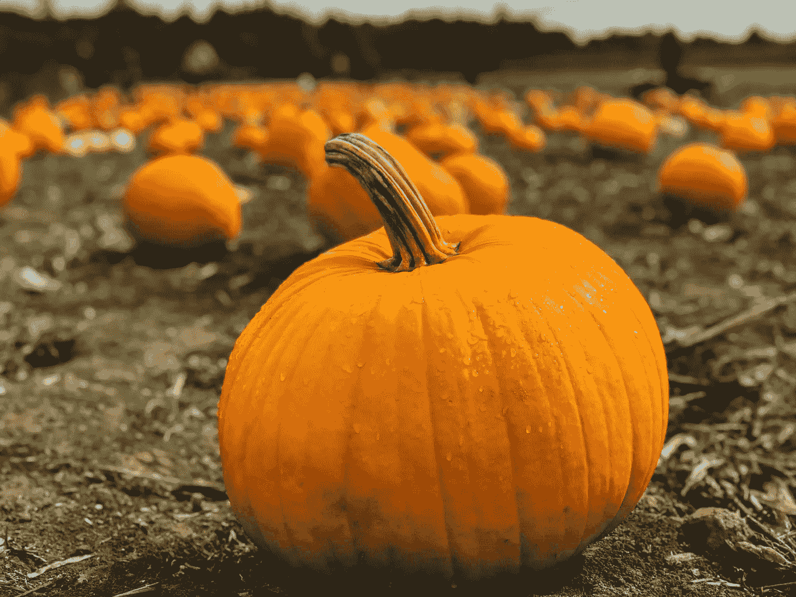
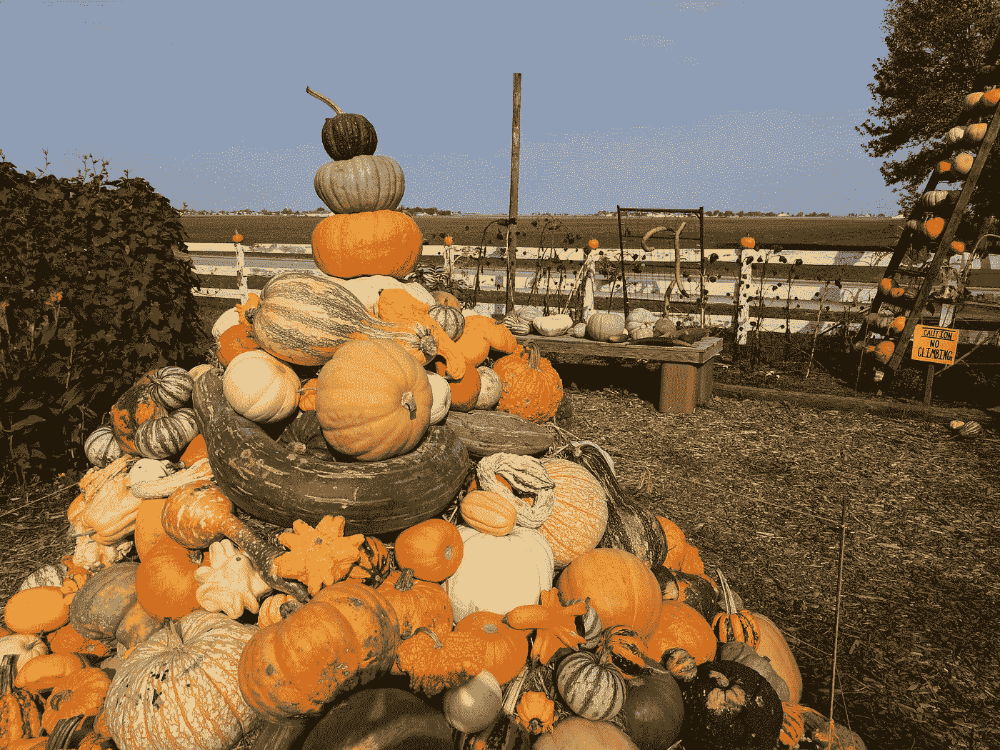
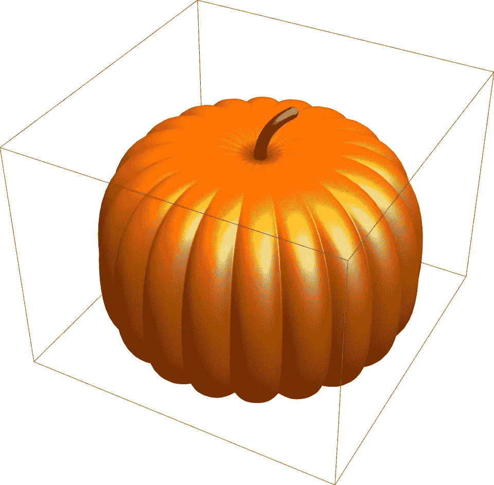

# 你需要多少个南瓜才能遮住月亮？

> 原文：<https://towardsdatascience.com/how-many-pumpkins-do-you-need-to-cover-the-moon-f99a183e64aa?source=collection_archive---------51----------------------->

## 一个计算思维的故事，只有少量的数学



马里乌斯·乔奇兰在 [Unsplash](https://unsplash.com/s/photos/pumpkin?utm_source=unsplash&utm_medium=referral&utm_content=creditCopyText) 上的照片

好吧，这是正式的。第一批橙色南瓜已经到达伊利诺斯州中部的杂货店。这意味着写一个关于南瓜、万圣节和“香料拿铁”的故事是正式的。也许不是最后一个。伊利诺伊州是美国最大的南瓜生产商，通常生产超过 500，000，000 磅南瓜。这些南瓜中的大部分，大约 90-95%，种植用于食品加工，其余的种植用于装饰目的。一个主要的“U-Pick”南瓜农场[大南瓜园](http://the200acres.com/cucurbit-market/)，位于伊利诺伊州亚瑟附近。



(作者拍摄的大南瓜地图片)

南瓜与万圣节有着千丝万缕的联系，万圣节是由爱尔兰移民带来的传统，他们最初用芜菁雕刻南瓜灯。芜菁逐渐被更容易获得、更容易雕刻的南瓜所取代。

另一项特别的活动将在今年的万圣节举行。月亮将是猎人的月亮，收获月之后的第一个满月。我很好奇用南瓜覆盖整个月亮需要什么，所以我做了一点计算。结果还是挺意外和惊艳的！


照片由 [Aron 视觉效果](https://unsplash.com/@aronvisuals?utm_source=unsplash&utm_medium=referral&utm_content=creditCopyText)在 [Unsplash](https://unsplash.com/s/photos/full-moon?utm_source=unsplash&utm_medium=referral&utm_content=creditCopyText) 上拍摄

让我们从问 [Wolfram|Alpha](https://www.wolframalpha.com/) 月球[表面积](https://www.wolframalpha.com/input/?i=surface+area+of+the+moon)开始。这是 1500 万平方英里。有很多要讲的。首先，让我们把普通的圆形南瓜近似为一个立方体，每边测量南瓜的直径。为了生成下图所示的南瓜，我使用了 Wolfram 语言代码，这些代码来自张宇松发表的这篇[非常棒的南瓜雕刻博文:](https://blog.wolfram.com/2011/10/28/industrial-pumpkin-carving-with-mathematica/)



(图片由作者提供)

让我们假设我们有一个直径正好为 1 英尺的完美南瓜。这意味着它的足迹，或南瓜印，正好是 1 平方英尺。我们现在需要做的就是将月球表面除以 1 平方英尺。在 [Wolfram 语言](https://www.wolfram.com/language/)中，我们可以使用[数量](https://reference.wolfram.com/language/ref/Quantity.html)函数来实现:

```
In[.]:= Quantity[15000000, "Miles"^2]/Quantity[1, "Feet"^2]Out[.]= 418176000000000
```

因此，我们将需要 418 万亿多一点的南瓜！一个直径为一英尺的南瓜的重量在 12 到 18 磅之间，所以我们假设平均重量为 15 磅。总重量(在地球上)将是 62.7264 亿磅，或 6.2 万亿磅。鉴于伊利诺伊州每年只生产微不足道的 500，000，000 磅南瓜，这意味着它将需要相当长的时间才能完全覆盖月球:

```
In[.]:= 6272640000000000/500000000Out[.]= 12545280
```

换句话说，伊利诺伊州需要 12545280 年才能种出足够覆盖月球的南瓜！有很多方法可以把圆南瓜包装得更紧密，比如把它们放成六边形，这样会花更长的时间。

在接下来的几百万年里，在前门放几个南瓜可能会更好，也更有趣。万圣节快乐！🎃🎃🎃


照片由[克雷格·迪米克](https://unsplash.com/@photoliphecjd?utm_source=unsplash&utm_medium=referral&utm_content=creditCopyText)在 [Unsplash](https://unsplash.com/s/photos/pumpkin-porch?utm_source=unsplash&utm_medium=referral&utm_content=creditCopyText) 上拍摄