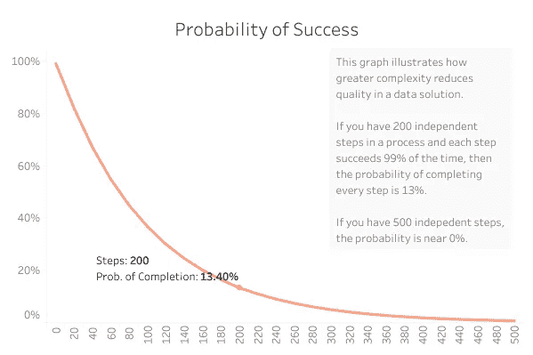

# 营销分析如何成为万金油(以及我们应该做什么)

> 原文：<https://towardsdatascience.com/how-marketing-analytics-became-snake-oil-and-what-we-should-do-instead-fc2d1319c95b?source=collection_archive---------79----------------------->

## 了解为什么营销分析经常让营销人员失望，以及数据科学家如何解决这个问题

照片由[埃弗雷特收藏馆](https://www.shutterstock.com/g/everett)提供

业内人士一直声称，大衰退对营销分析是一件好事。他们认为，在大多数公司削减营销预算的时候，营销人员会在数据上投入更多，以证明他们对客户的价值。

我想我们很多人都认为新冠肺炎的低迷会对营销分析造成同样的影响。然而，这一次可能不是这样。

我注意到，由于新冠肺炎经济低迷，过去几周，不同公司的许多同事都丢掉了工作。可能是危机迫使营销人员评估昂贵的分析实践是否真的值得投入金钱和工作。或者可能是我们(数据专业人员)从未交付过我们认为的那么多价值。

事实上，双方可能都有责任。分析师和营销人员都没有真正以正确的方式对待营销分析。

在过去的十年中，营销行业在构建数据仓库、实施高级跟踪以及雇佣数据专业人员来分析和报告这些数据方面投入了大量资金。

但是，随着时间的推移，营销分析开始变成了万金油。

就投资金额而言，收益被广泛夸大了。构建的解决方案在质量上是脆弱的。这些目标通常不太可能实现(如果不是不可能的话)。

我不认为分析师或营销人员故意做一些不诚实的事情。我认为他们只是做了营销人员经常做的事情——推销产品的好处。

主要问题是营销人员可能不是使用这种特殊产品的合适人选。

# 是什么让营销行业与其他行业如此不同？

其他行业使用数据的时间比营销要长得多。金融服务、制造、物流和科技公司已经构建了高度复杂的数据解决方案来支持和改善他们的组织。

但是这些行业区别于市场营销的一个关键点是，它们严重依赖于**的运营效率。**

在金融服务交易中，几秒钟的时间会产生很大的影响。制造和技术公司依靠运营来提高质量。物流需要先进的组织和效率来持续按时地交付货物。

与这些行业一样，高质量的数据解决方案也需要运营效率。因为这些行业长期以来一直优先考虑效率，所以他们更容易构建这些解决方案。他们产生的数据更加准确，而且各种利益相关者实际上都在使用这些数据。

然而，营销机构从来不依赖运营效率。至少程度不一样。

在大多数情况下，这对营销人员来说是一件好事。这有助于他们赢得客户，并适应消费者不断变化的需求。

但是在这种类型的环境中，很难确定运营效率的优先级，这会导致普遍的数据质量问题，从而破坏数据解决方案的目标。

# 质量差如何破坏营销数据解决方案？

出于同样的原因，你希望你的税务会计师擅长数学，利益相关者希望他们的数据是准确的。每当他们在报告中发现错误，每当分析师不得不回来澄清时，营销分析团队就会失去可信度。

一旦信誉问题在组织中普遍存在，就很难与之对抗。尽管分析团队成员可能仍然会因为产生他们认为是好的工作而获得报酬，但公司内部的利益相关者将开始从其他地方获取他们的数据。

他们将完全忽略您的仪表板，而是直接进入数据源本身。这样做对他们来说是一种痛苦，但当他们相信这会让他们获得更准确的数据时，他们会忍受这种痛苦。

具有讽刺意味的是，这些利益相关者也经常导致质量问题。数据收集是分析团队和利益相关者之间的合作，利益相关者缺乏纪律会导致他们抱怨的质量问题。

# 质量如何成为营销机构的一个问题？

营销人员乐于快速适应以满足客户的需求。营销主管希望他们自己的内部部门能够快速适应以满足他们的需求。

这导致营销数据解决方案的目标不断变化。仪表板或数据仓库的目的是不断变化的，因此项目陷入了开发困境。

构建这些解决方案的数据专业人员发现自己在为同一个项目进行“再一次调整”。这些没有明确最终目标的持续调整只会进一步降低数据质量。

这些质量问题随后被在分析部门之外工作的个人贡献者放大。一个常见的例子是，当营销人员快速启动活动时，他们可能直到活动启动后才记得添加 URL 参数跟踪。

营销机构有专门负责媒体购买、社交媒体管理、活动策划和客户管理的部门并不罕见。

所有这些部门通过他们的努力自然产生数据。并且数据通常在各个部门内是可靠的。由于只有少数人实施社交媒体活动，他们很容易在自己的团队中建立一致的做法。

但是，当分析团队试图将这些数据孤岛整合在一起时，问题就出现了。

让所有这些贡献者以这样一种方式使用他们的各种工具，即各种数据源可以映射在一起，需要管理层通过更明确的过程和程序施加巨大的影响。

如果您查看下面的简化场景，您将会看到交付这些完美解决方案的可能性是如何随着复杂性的增加而降低的，即使单个部分通常会自行成功。

作者提供的图表；[例子](https://qz.com/work/1154701/a-short-equation-explains-why-simplicity-is-the-best-policy/)灵感来自瑞安·格拉夫

当营销人员试图创建企业范围的数据解决方案时，这种情况基本上会发生。他们根本没有扩展这些解决方案的操作规程。

到目前为止，还没有任何工具能够消除对这一原则的需求——不管有多少销售团队声称他们的工具是银弹。

# 营销人员应该变得更擅长运营吗？还是应该设定更现实的目标？

营销人员可以学习改善运营(当然也可以阅读我即将出版的解释如何做到这一点的书)，但我认为最好设定更现实的目标，而不是改变整个行业文化。

以下是营销人员对数据的共同目标:

*   一个“主”数据仓库，来自所有部门的所有数据都清晰地映射在一起
*   回答每一个业务问题的“主”仪表板
*   跨域跟踪
*   多渠道归因

即使对于一个高效的组织来说，这些目标也是雄心勃勃的。而且都是理论上可能的。

但随着公司规模的增长，实现这一目标变得更加困难。公司最终增加了越来越多的步骤来支持解决方案，从而降低了输出的质量。

这种规模的工作需要每个贡献者的高度自律，从客户经理到创意人员，再到数据分析师甚至高管。

在一个适应性和直觉至关重要的行业，很难毫无阻力地创造出这种水平的纪律。

# 解决办法？我们应该少做商业智能，多做数据科学

如果营销人员和他们的分析师都希望数据解决方案能够提供真正的好处，并在营销行业文化中切实可行，他们应该少关注商业智能，多关注数据科学。

我一直认为“数据科学”是一个老生常谈的术语，但它实际上适用于这种情况。

由应用统计学和使用 R、Python 或 SAS 等高级编程语言的机器学习定义的数据科学，为营销人员提供了一种规避大规模跟踪和报告计划中的许多问题的方法。

由于营销人员努力获得组织纪律，以实现他们的许多目标(跨领域、多渠道归因、用户旅程、主仪表板等)所需的跟踪水平，他们可以使用统计数据来推断他们的业务问题的答案。

以多渠道归因为例。

许多营销人员想知道，如果一个用户在 9 月份浏览了展示广告，在 10 月份看到了《脸书邮报》,他是否会在 12 月份买东西。

许多人喜欢使用多渠道属性来绘制这样的购买路径。但是同时跟踪和绘制地图并不是现实世界的解决方案。一家拥有 300 名员工的广告公司不太可能组织起来支持一个精确的跟踪系统，并绕过谷歌和脸书(以及整个欧盟)制定的隐私规则，以完全准确地绘制这条路径。

但同样的归因问题，可以用统计学来回答。我们可以推断，有时使用简单的 t 检验，是否一个部门的支出增加，如社交媒体，会导致更高的产品购买率。

这种方法最好的一点是，它实际上将关注点从跟踪和报告转移到了真正的分析上。

分析团队可以按原样使用现有数据，而不是将各种数据源映射在一起。如果你已经在分析数据，为什么不用更原始的形式呢？

(附注:您仍然应该将这些原始数据放入数据仓库。您只是不需要在这样的粒度级别区分映射的优先级。)

使用原始数据也使得数据质量不再是一个问题。由于统计总是依赖于抽样，而不是捕捉整个人口，数据质量更宽容。如果你知道你正在试图估计你的活动对结果的影响，如果你丢失了一些数据点，那就不是问题了。

这减轻了组织改善运营的负担，并让分析团队推动利益相关者进行即席分析。

分析团队必须自动化最基本的报告，并[启动假设库](https://www.taylorrodgers.com/business-intelligence/how-to-deliver-real-analyses-and-escape-the-reporting-trap-for-good)，利益相关者每周提出问题，分析团队通过即席分析进行回答。

分析团队也必须从雇佣如此多的数据库开发人员、报表开发人员和低技能分析师转向统计人员和数据科学家。或者至少是理解更高级统计数据的分析师。

这将使营销分析团队更加灵活，并根据营销人员的文化产生更大的价值。

毕竟，营销人员不仅仅想要灵活性——他们*需要* it，而数据科学能够提供这种灵活性。

*最初发表于*[*【https://www.taylorrodgers.com】*](https://www.taylorrodgers.com/business-intelligence/how-marketing-analytics-became-snake-oil-and-what-we-should-do-instead)*。*