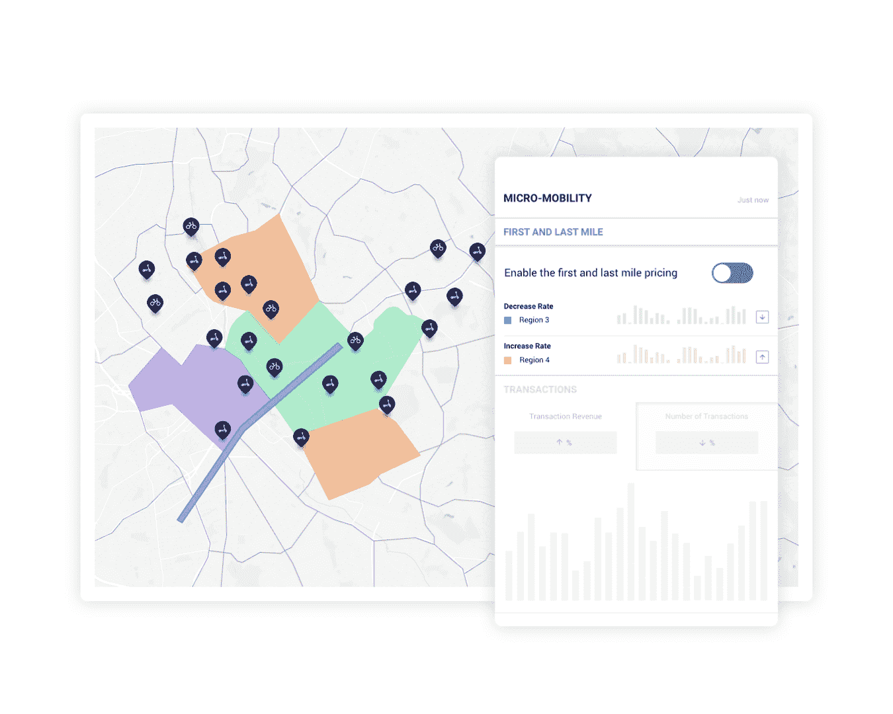
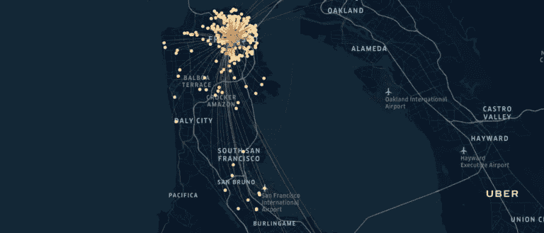

# 微移动公司如何利用位置智能提高资产利用率

> 原文：<https://towardsdatascience.com/how-micro-mobility-companies-leverage-location-intelligence-for-better-asset-utilization-43c0c59d8690?source=collection_archive---------32----------------------->

## 微移动公司如何使用位置智能以更好的方式管理他们的地面资产

[来源](https://www.smarthostingplans.com/tc/cities-are-getting-more-serious-about-micromobility-data/)

> 这里有一个很好的问题，可以写在便利贴上，放在你的办公桌上:“我们现在有哪些资产没有为我们赚钱？”—比尔·沃尔什

对于一家微移动公司(又名“X 的优步”)，匹配需求和供应是业务的核心。每有一个单位的需求没有得到满足，你就失去了一个订单。对于每一个闲置的供应单位，你都在你的车辆上赔钱。

> 正常情况下，每个微移动公司都有匹配算法。但是，该算法在一天中的不同时间、一周中的不同日子、不同地点的表现如何呢？他们有模式吗？你是如何分析的？

在这篇文章中，我们将深入探讨在地面上拥有车辆的微型移动公司的供需缺口。让我们详细探讨这两个差距，并理解它与监控和历史分析的关系。

> 监测有助于了解现场目前正在发生的情况，并对此采取积极主动的态度。现实世界是非常变化无常和混乱的，你的模型总是不能适应这些突然的变化。

*例如，当需求高峰或低谷超过平均值时(可能是下雨、交通、抗议、当地事件等。)监控有助于了解哪里的需求异常高，以及你能做些什么。*

> 虽然监控有利于这些即时的突发事件，但分析历史模式有助于您了解这些区域行为的细微差别(或者说，用户或骑手在特定区域的行为)。

*例如，您从数据中了解到，当用户的行程在晚上结束于郊区时，它很可能不会被另一个用户接走，这意味着运营团队必须接走它！*

[来源](https://eng.uber.com/machine-learning/)

## 一.需求>>供应(订单损失)

让我们来看一个场景:周六晚上 8 点，你的用户在一个有很多酒吧的地方下车，因为那里有一场音乐会。

就本文的范围而言，我们可以假设一个下车的用户是没有预订顺风车的人。被取消的用户将意味着在预订乘坐后没有选择乘坐的人。

*注意:每个唯一用户和每个唯一会话的掉线都很重要。因此，即使用户搜索了五次并退出，他也只能算一次。*

## 案例 1:监控

您希望实时监控的一些重要指标，以便能够将您的需求和供应匹配在一起，并用于其他战术决策:

*   **Where:** 这些用户在哪些地点下车？
*   **速率:**每分钟的掉线率是多少？是增加、减少还是不变？
*   **到最近供应点的距离:**最近的可用供应点在哪里，有多远？

## 案例 2:历史分析

历史分析的目的是找到不匹配的模式，并随着时间的推移改进模型，做出更具战略性的决策。举个例子，

*   **频率:**这些地点的下降是否有规律，是否以一定的频率发生？*例如，工作日与周末、早高峰与晚高峰*
*   **持续时间:**用户平均在这些地点停留多长时间？ *5 分钟、30 分钟还是一小时？*
*   **区域属性:**区域或供给有什么内在的东西吗？*例如，在某些情况下，乘客故意取消行程，因为这些地区似乎不适合他们的偏好(交通繁忙、郊区)。*
*   **下一个需求时间:**这不仅仅是关于在那个实例中正在发生的事情。但是，*流*是什么样子的。你下一步最有可能在哪里获得需求？

> 理解流动对于微流动公司来说是非常重要的。接下来哪个领域最有可能获得需求？离车手现在的位置有多远？

盈利能力:这趟旅程会盈利吗？也许让用户放弃无利可图的顺风车并不是一个坏主意。

## 二。供应>>需求(闲散乘客)

你的骑手在住宅区，在那里他们通常会收到大量的乘车请求。然而，你没有收到请求，因此，乘客是空闲的，而用户可能会在商业区下车。

*注意:空闲骑手和骑手会话都是需要考虑的重要参数。这将有助于我们了解问题是出在特定的骑手组(骑手会话数量多)还是其他参数，如位置或时间(闲置骑手数量多)*

## 案例 1:监控

如上所述，监控可以很好地了解当前发生的情况，尤其是在异常情况下。

*   **哪里:**现在哪些区域的骑手(或车辆)处于闲置状态？
*   费率:每分钟的费率是多少？是增加、减少还是不变？
*   **到最近需求的距离:**最近的可用需求在哪里，有多远？

## 案例 2:历史分析

历史分析主要是为了理解低效率的模式。

*   **频率:**闲散骑手是否有位置模式，是否在某一频率成为闲散？
*   **持续时间和活跃时间:**骑手平均在这些地点闲置多长时间，这与骑手的活跃时间有何关联？
*   **供给或区域的属性:**区域或供给有什么内在的东西吗？*例如，当付款方式不被司机接受时，他们会取消订单——他们希望当天早些时候拿到现金。*
*   收入和激励:在这些情况下，评估骑手的收入和激励会很有用。这种激励能补偿他们不接受这种特殊乘车方式的偏好吗？
*   **下一个需求时间:**如前所述，在按需型公司中，匹配不在于现在发生了什么，而在于流程在哪里。*如果您的需求预测模型显示您将在 30 分钟内获得一些订单，那么将骑手移动 5 公里远是没有意义的！*

城市中的地理模式

## 线上与线下的二分法

如果你是一家做 web 应用的公司，你会使用 web(或 app)分析产品(如 Google Analytics、Heap、Mixpanel、Amplitude、Clevertap)来获得用户行为的详细信息。您可以根据用户的品味、偏好和行动创建“用户角色”，以个性化您的策略，从而提高您的参与度和忠诚度。

如果你是一家在地面上有移动司机或车辆的公司，获得可见性并分析你的不同维度在地面上如何相互作用变得非常重要。

如果你能根据不同地区的表现创造类似的位置角色或微观市场，你就能个性化你的策略，并使这些微观市场有利可图。

> 一旦你理解了你的供给和需求是如何共同作用的，以及某些领域的表现，你就能全面了解实际情况。

## 弥合供需差距

一旦你知道了这些差距的特征——它们什么时候发生，在哪里发生，多久发生一次等等，这里是你可以做的所有事情来弥补它们！

## 获得物ˌ获得

在高供应量的地区(流动性不是很大)，你可以专注于线下的促销和宣传活动。*比如在居民区设置围板。*

## 保留

您可以根据用户如何移动和发送上下文营销促销信息来创建用户角色。*例如，在办公区，下午 5 点是吃零食的时间！*

## 利用

如果您发现了不同日期、时间和地区的需求和*流程*的模式，您就可以提供您的供应并提高其利用率。*例如，运营团队会在不同的日子、不同的时间重新分配车辆。*

## 单位经济学

从收入方面来说，你可以让你的定价更加基于地理位置。从成本方面来看，您可以识别交付过程中的瓶颈，并了解您在生命周期的哪些步骤上花费了时间和成本。

## 损害控制

如果出现异常情况，例如收入或订单突然下降，您可以保持警惕。例如，有时某个地方发生的本地事件会对你的 KPI 产生重大影响，你可能需要对此做出反应！

微移动现象肯定有可能扰乱这个行业(根据统计，它已经在扰乱这个行业了)。微观流动性公司的水平效率取决于一个组织如何管理和利用他们的地面资产。