# 移动定位数据如何帮助您减少新冠肺炎的风险

> 原文：<https://towardsdatascience.com/how-mobile-location-data-could-help-you-limit-exposure-to-covid-19-cb821b560809?source=collection_archive---------66----------------------->

## 随着纽约市进入重新开放的第一阶段，这里是过去 6 周热门购物区的人流高峰。

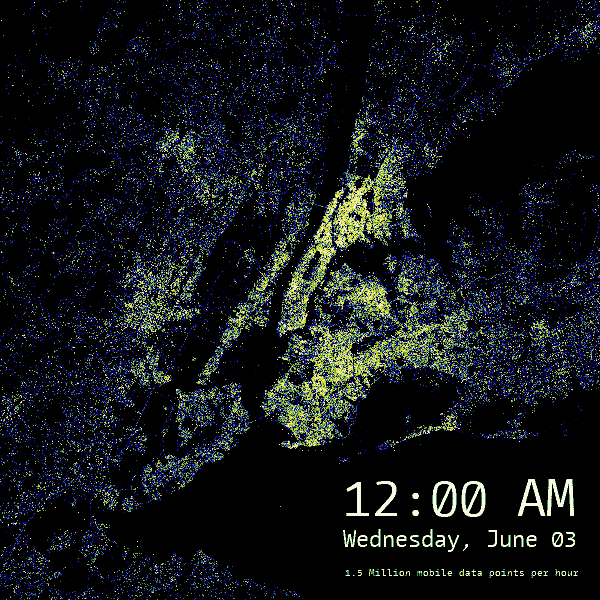

鉴于最近的抗议活动，人们可能会担心手机追踪。我们希望确保我们使用的数据是真正匿名的。除了帮助人们在跑腿时减少新冠肺炎暴露，我们无意分析步行交通。

出于任何目的走出家门已经成为让自己暴露于新冠肺炎的邀请，但是我们可以采取什么措施来限制我们的风险呢？

在线购物平台已经超载了大部分社会隔离的订单，使得在 3 月底和 4 月初几乎不可能获得送货，特别是在外围行政区。有时选择是有限的，无论是去银行，洗衣服，还是为接下来的几个星期采购物品，这样的旅行是不可避免的。

但是，除了起床去杂货店或邮局之外，我们还能做些什么来避免在街区周围排队呢？

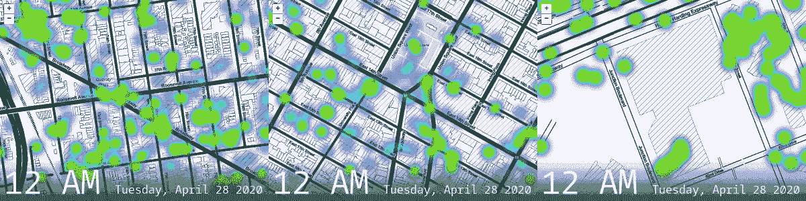

从左到右杰克森高地、联合广场、减压阀公园区域的移动位置数据

随着纽约市确诊病例的减少，天气开始感觉像夏天，抗体检测仍然容易出错，新冠肺炎检测仍然供不应求。回归“正常生活”的症结在于感染者和易感者在互不知晓的情况下混杂在一起导致新病例的涌入。

正如我们在新加坡和韩国看到的那样，在没有缓解高暴露情况的明确战略的情况下重新开放，随后又出现了新的病例。4 月下旬，新加坡成为南亚病例最多的地方。韩国在重新开放的第一个星期后，新病例激增，与一个多月前的情况相当。

除了重新开放和恢复封锁的来回摆动，我们对行人交通的意识是否有助于平坦化曲线？

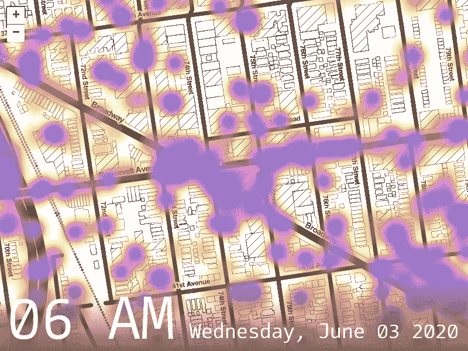

数据分析 NYC 和 Predicio 使用过去一个月的匿名移动位置数据来了解我们城市中一些人口最稠密的零售区的客流量如何每小时、每周波动，以便您可以使用这些见解来获得更安全的购物体验并缩短您的旅行时间。

Predicio 为您带来了用于分析的匿名移动数据，这是一家新兴的基于位置的行为智能初创公司，提供符合 GDPR 和 CCPA 标准的位置数据，这些数据来自用户同意共享其位置的应用程序。

我们首先通过在大纽约地区 10 x 10 英里半径范围内每小时 100，000 个匿名移动位置点的随机样本进行研究来查看数据，以在一个月的过程中每周二每小时生成我们的可视化结果。

在我们感兴趣区域的 100，000 个数据点中，我们查看了感兴趣点周围四分之一英里半径内的步行交通密度，并生成了这些可视化结果:

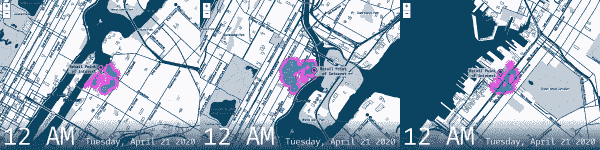

我们还想让人们看到，一天中，每小时的行人流量是如何相互比较的。

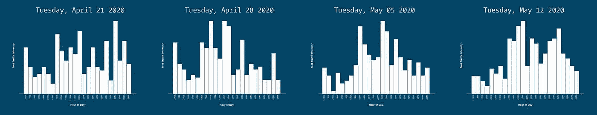

在我们感兴趣点周围四分之一英里的移动数据的统一样本中，步行交通计数

由于直方图每天波动很大，我们合并直方图，取上个月的中值客流量。

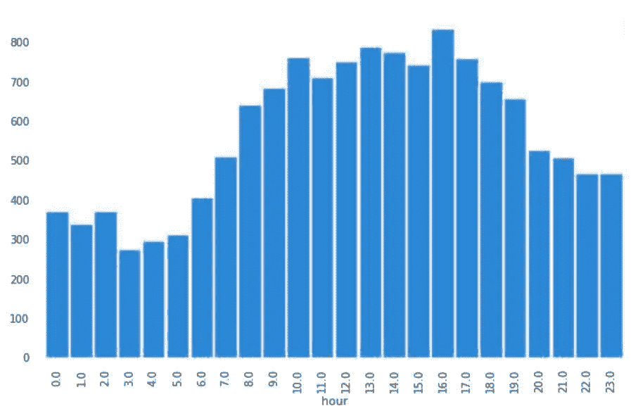

4 月 21 日至 5 月 15 日期间，我们感兴趣点周围四分之一英里内的中值客流量

正如人们所看到的，取中值步行交通，这消除了在我们的一般模式中边缘观察的异常值，给出了与我们的交通假设相关的更平滑的分布，因为它与正常的睡眠时间表相关。

我们推断最不拥挤的时间是商店开门的时间和商店关门前的晚上。

我们得出这一结论的基础是，我们感兴趣的地点每周二的营业时间是上午 9 点到晚上 8 点，然后从每小时的客流量中扣除。随着商店临近开门时间，我们看到一个小时前开始的客流量激增。从开放时间到下午，客流量确实有所波动，但与下午 7 点(关门前一小时)相比，客流量仍然很高。

人们不喜欢晚上去跑腿是有道理的。谁知道商品是否会脱销，更糟糕的是，如果位置拥挤，人们可能无法在商店关门前完成任务。

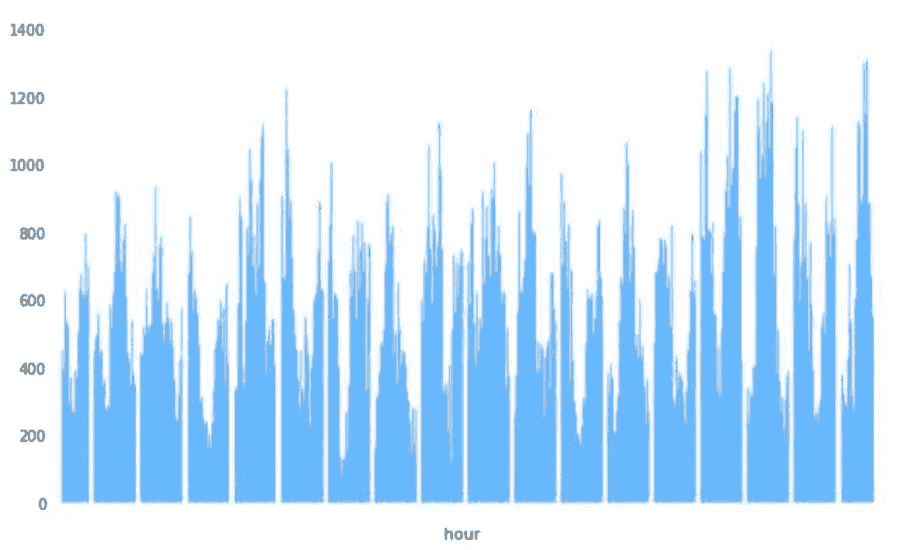

4 月 21 日-5 月 15 日，从我们的兴趣点开始，四分之一英里半径内的 25 天内的日常波动

我们观察数据的其他方法是观察更长的时间跨度，以一天为基础，以我们发现的模式为基础。

在左边和底部的图中，我们没有把时间分成几天，而是在视觉上看到了连续的几个小时。然后，我们使用 ARIMA 模型进行了一些时间序列分析，以获得在几天、几周和几个月内重复模式的总体感觉，并对不同时间跨度内发现的模式进行了实验。

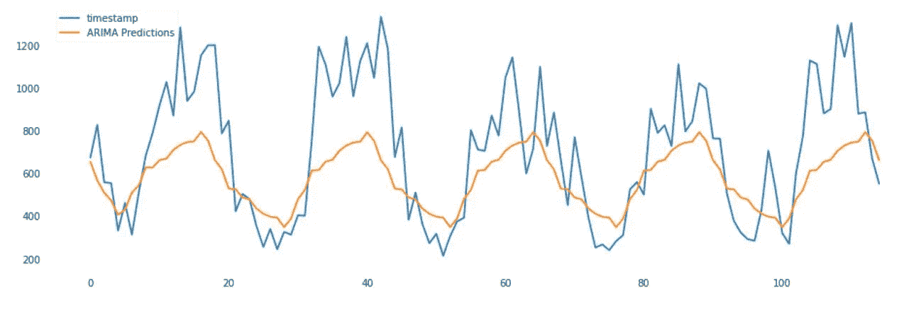

在连续几个小时内拟合 ARIMA 模型。X 轴代表我们的样本人数，Y 轴代表从 4 月 21 日上午 12 点开始的时间。(即。第 25 小时是 4 月 22 日凌晨 1 点)

如你所见，很大一部分工作是从噪音中分离出信号。我们还对观察数据的位置进行微调的一种方法是，更好地将我们的移动数据点隔离到我们感兴趣的点所在的区块内。

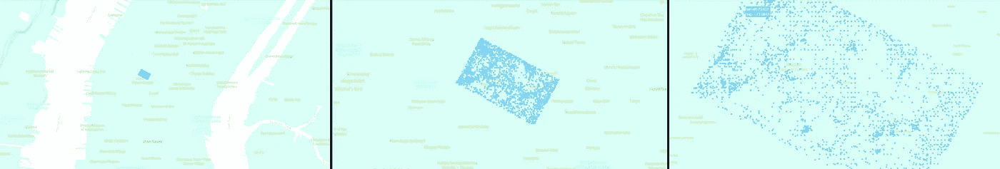

聚焦在宾州车站，看着一个街区

以下是我们如何与谷歌地图为宾州车站过滤掉宾州车站所在街区以外的所有其他步行交通的周二平滑图进行比较:

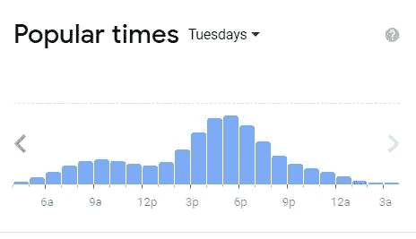

来自谷歌地图的宾州车站

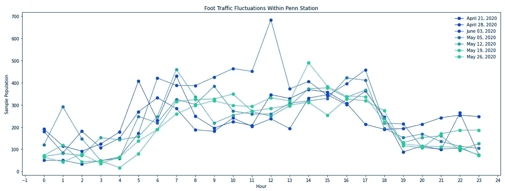

可以看出，由于各种原因，如某些用户在手机上更活跃，以及我们有限的样本强化了我们的结果，基于我们的数据，步行流量存在较大差异。

如果你想知道我们是如何得到视觉效果的，下面将以教程的形式向你展示我们分析的技术层面。

## 在这里获取数据[。](https://location-data.predic.io/)

从[的 Predicio 数据门户](https://location-data.predic.io/)中，我们按小时提取数据，过滤感兴趣的地理半径，选择一个特定的位置作为关注点，然后做进一步的分析。下面展示了我们是如何做到的，以及如何操作位置信息！

只要有经度、纬度和时间，就可以使用任何位置数据。这里有两个类似的开放数据集可供尝试:纽约市关于行人交通的[开放数据门户统计了穿过布鲁克林大桥的行人数量](https://data.cityofnewyork.us/Transportation/Brooklyn-Bridge-Automated-Pedestrian-Counts-Demons/6fi9-q3ta)，或者是一个预先配置的数据集，其中包含[人的数量和利兹市议会提供的八个特定的高流量位置](https://datamillnorth.org/dataset/leeds-city-centre-footfall-data)。

根据您拥有的数据，您可能需要专注于您想要关注的内容，并将其转换为适当的日期时间。以下代码浓缩了您可能需要进行的一些争论。

以下是您可能决定用来组织数据的示例步骤:

> 1.缩小关注范围，将你的辩论功能只应用在这个领域。
> 
> 2.创建一个新的数据框，仅过滤我们感兴趣点的距离。
> 
> 3.绘制每小时的热图，并保存截取的截图。

```
def wrangle(X): X = X.copy()
    X = X.sample(<number to pass in>, replace=True) X['date_EST'] = pd.to_datetime(X['timestamp'], unit='s')
    X['date_EST'] = X['date_EST'].dt.tz_localize('UTC')\
                                 .dt.tz_convert('US/Eastern')
    X['date'] = X['date_EST'].dt.date
    X['hour']  = X['date_EST'].dt.hourreturn X
```

在我们的分析中，我们在目标位置周围每小时 14 x 14 英里的半径范围内采集了 100，000 个样本。

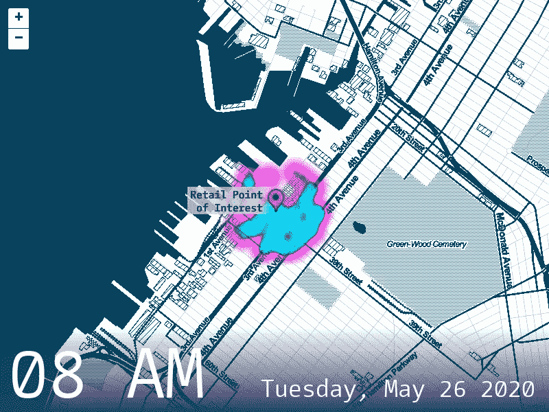

然后，我们使用 wrangle 函数处理我们的 2，400，000 个样本，以获得正确的日期时间格式。

由于过滤过程需要花费大量时间，我们将循环包装在 TQDM 中，以查看过程的进度条。

```
df_container = []
total_rows = 0
cols = ['timestamp', 'lat', 'lng']for i in tqdm(range(24)):
    i = str(i).zfill(2) for j in range(5):
        try:
            df = pd.read_csv(f'<file_to_read_in \
                         {<dynamic number to process,i>} \
                          rest_of_file_name
                         {<dynamic number to process, j>}>', \
                          delimiter = '\t', \
                          error_bad_lines=False, \ 
                          usecols = cols)
            #keeping track of the total amount of rows for reference
            rows, _ = df.shape
            total_rows += rows #selecting only data that is in the 
            #area of interest while reading the data in
            df = df[(df['lat'] > <latitute min>) & \
                    (df['lat'] < <latitute max>) & \
                    (df['lng'] < <longitude min>) & \
                    (df['lng'] > <longitude max>)] df = wrangle(df)
            df_container.append(df) except:
            continuedf_sample = pd.concat([df for df in df_container])
```

现在我们有了一个带有适当时间的数据帧，我们将使用 Geopy 创建一个新列，显示我们与感兴趣位置的距离，从而精确定位我们的位置。

```
lat = <your latitude>
lng = <your longitude>df_sample['distance_in_km'] = [distance.distance((lat, lng), (i,j)).km for i, j in tqdm(zip(df_sample['lat'], df_sample['lng']))]
```

然后，我们创建了一个新的数据帧，该数据帧仅隔离到感兴趣点的距离小于 0.5 公里或四分之一英里半径的点。

```
df_point_of_interest = df_sample[df_sample['distance_in_km'] < 0.5]
```

为了在 matplotlib 中创建直方图，我们将数据帧绘制成一组，如下所示:

```
df_point_of_interest.groupby('hour') \
                    .count() \
                    .reset_index() \
                    .plot.bar(x='hour', y='timestamp', \
                              color = 'orange', width=0.9, \
                              figsize=(10,6));
```

## 将数据过滤到一个块内的引脚点

我们隔离特定位置的方法是在绘图软件中绘制多边形，类似于连接点，然后将多边形形状转换为. shp 文件，如下所示。我们展示了一个宾州车站的例子:

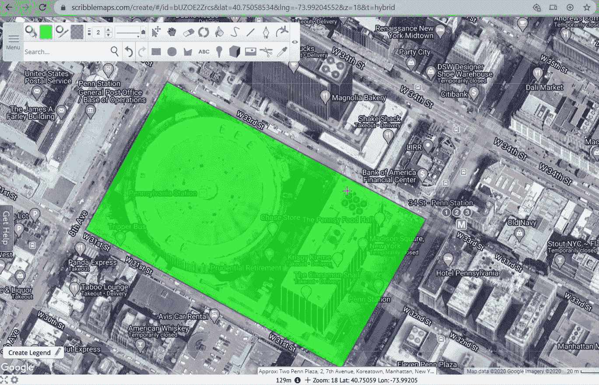

为了仅过滤多边形内的移动数据点，我们将经度和纬度坐标地理编码到 geopandas 数据帧中，然后创建一个新列来保存我们的点是否在形状中的条件的结果。

最后，我们执行数据帧过滤，仅提取形状内的数据帧行。

```
gdf = geopandas.GeoDataFrame(df,
      geometry=geopandas.points_from_xy(df['lng'], df['lat']))gdf = gdf.assign(**{'within_shape': gdf.within(i) for i in shapefile_df['geometry']})new_df = gdf[gdf['within_shape'] == True]
```

以下是我们筛选的结果:

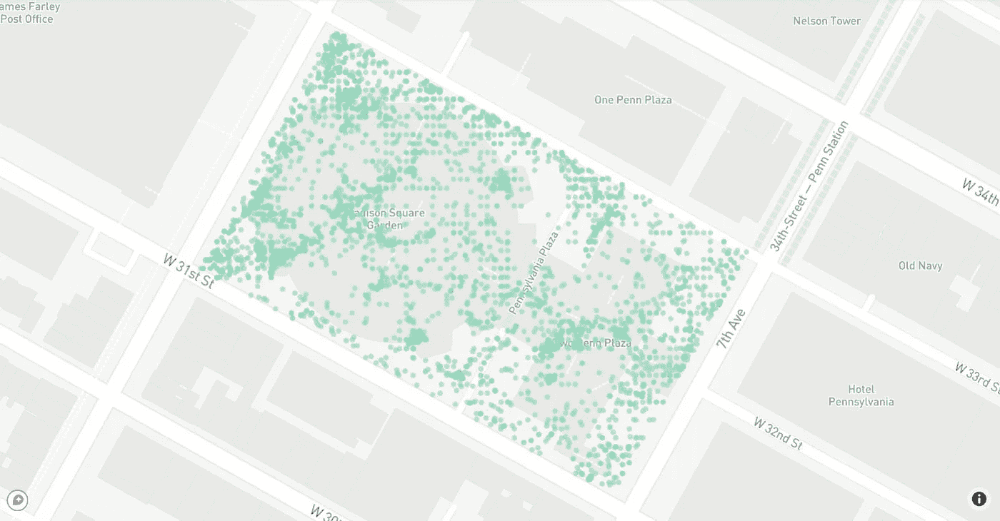

将我们的数据隔离在一个街区内

通过过滤我们的数据，我们可以安全地排除我们感兴趣范围之外的数据。

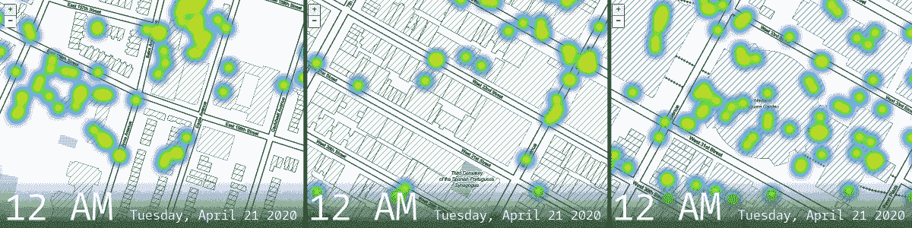

从左至右，布朗克斯区、曼哈顿熨斗区和宾州车站的一些受欢迎的购物目的地

## 使用热图可视化数据

为了生成上面的热图，我们使用了 follow，这是一个围绕 fleet . js 的包装器，可以制作漂亮的交互式地图，可以在任何浏览器中查看。

我们想出的生成热图的脚本的工作方式如下:我们介绍我们的脚本，每小时循环一次视觉图像，分为以下多个部分:

> 1.对于每个小时，创建一个仅针对特定小时过滤的数据帧
> 
> 2.热图接收经度和纬度坐标的数组以及其他参数中的叶子图设置。
> 
> 3.在一个 url 名称下保存叶子地图，然后用 Selenium，进入 url 并截图保存。

在 0 到 23 小时之间的 for 循环中，我们创建一个新的 dataframe，只过滤有问题的小时，然后生成一个图。

```
folder_path = <path to save our images to>for i in tqdm(range(24)):
    options = webdriver.ChromeOptions()
    options.add_argument('--headless')
    options.add_argument('--no-sandbox')
    options.add_argument('--disable-dev-shm-usage') # open it, go to a website, and get results
    wd = webdriver.Chrome('chromedriver',options=options)
    path = os.getcwd() # filtering dataframe per hour
    hour = df_point_of_interest[df_point_of_interest['hour'] == i]
```

对于绘图，我们首先实例化一个地图对象，设置地图的中心，指定地图主题，然后指示缩放级别。下面的代码片段是上面 for 循环的延续。

```
 # instantiating the map
    point_of_interest_map = folium.Map(location=[lat, lng],  \
                                       tiles='Stamen Toner', \
                                       zoom_start=14)
```

对于热图对象，我们传入一个经度和纬度列表，然后指定热图的半径、最大缩放并添加到我们刚刚实例化的地图中。下面的代码片段是上面 for 循环的延续。

```
 # adding mobile points to map
    HeatMap(data= hour[['lat', 'lng']] \
            .groupby(['lat', 'lng']) \
            .count().reset_index() \
            .values.tolist(), \
            radius=10, \
            max_zoom=13) \
            .add_to(point_of_interest_map)
```

最后，我们为。html，然后在那个位置保存我们的叶子图。下面的代码片段是上面 for 循环的延续。

```
 mapfile = f'point_of_interest_hour_{i}' # saving map as default Folium html
    point_of_interest_map.save(f'{mapfile}.html') # creating pointer towards file location
    tmpurl=f'file://{path}/{mapfile}.html' # getting html map into memory and giving it time to load
    wd.get(tmpurl)
    time.sleep(random.randint(5,8)) # saving it as screenshot to covert from html to png
    wd.save_screenshot(f'{shared_folder_path}{mapfile}.png')
    wd.quit()
```

我们使用 Selenium web driver 访问网页并截图，保存，然后退出。下面的代码片段是上面 for 循环的延续。

```
 # opening the screenshot in memory
    im = Image.open(f'{shared_folder_path}{mapfile}.png') # getting the height
    width, height = im.size # crop from top left coordinate at (0,0)
    # crop to the bottom right at(with, height)
    im = im.crop((int(150), int(150), int(width), int(height)))
```

到目前为止，我们的输出看起来像下面的彩虹和黑白图像。

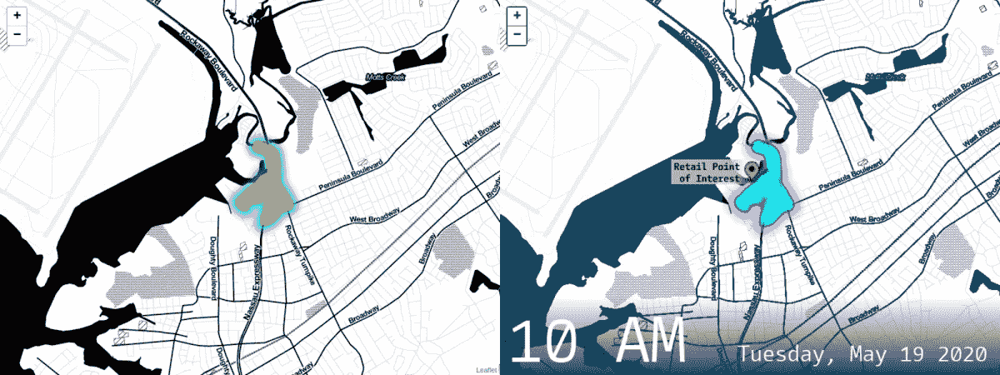

我们保存的叶子图(左)然后被注释(右)

因为我们希望我们的可视化效果更有感染力，所以我们首先在 Photoshop 这样的照片编辑程序中做了一些风格上的决定，然后我们自动化了这个过程，在 Python 中批量执行注释。

我们使用 Pillow，一个图像库来改变热图的色调和饱和度，从彩虹渐变到洋红色和青色。我们还将黑色和灰色的地图背景缓和为深蓝色，并应用了文本。我们计划在以后的文章中展示一个关于图像处理的教程。

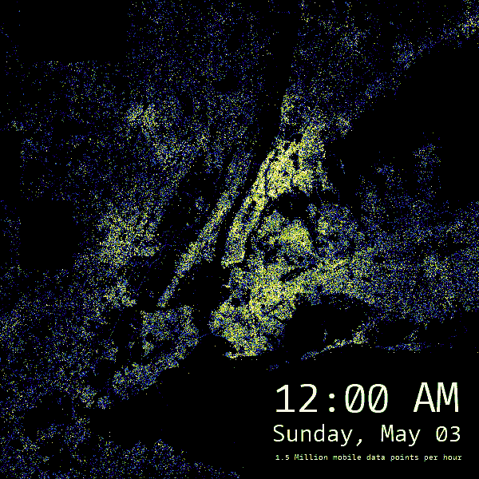

上面这张图片也使用 Pillow 进行注释，是在 Datashader 中生成的，data shader 可以很好地处理大型数据集。Datashader 与 Dask、Holoviews、Bokeh 和 Geoviews 集成在一起，可以创建动态的、可缩放的地图，覆盖在地图瓦片上。这个默认的代码片段用于生成静态可视化，然后通过 Pillow 编译成. gif 文件:

```
agg = ds.Canvas().points(hour_df, 'lng', 'lat')
    utils.export_image(tf.shade(agg,cmap=bgyw),filename=img_file_name, background="black", fmt=".png")
```

我们和你一样，仍然被所有城市照亮的数字的力量所包围。随着纽约市在未来几周开始重新开放，我们希望你保持安全。

## 谢谢你的来访！

非常感谢你和我们一起学习。如果您想就此项目展开对话，请随时联系我们。

鸣谢:感谢 [Jef Ntungila](https://www.linkedin.com/in/jefntungila/) 实现了高效的辩论、统计分析、绘图和优化。