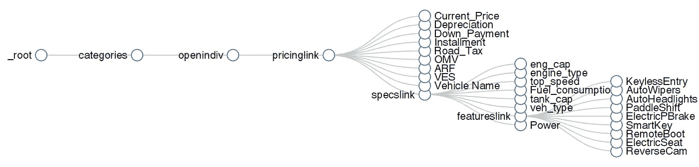
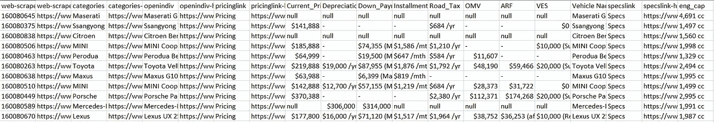
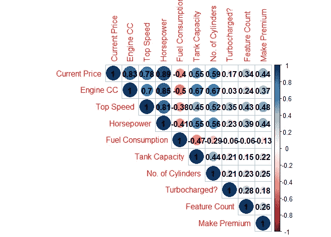
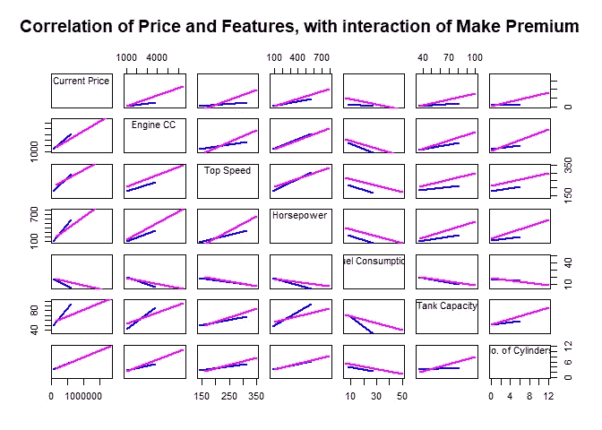
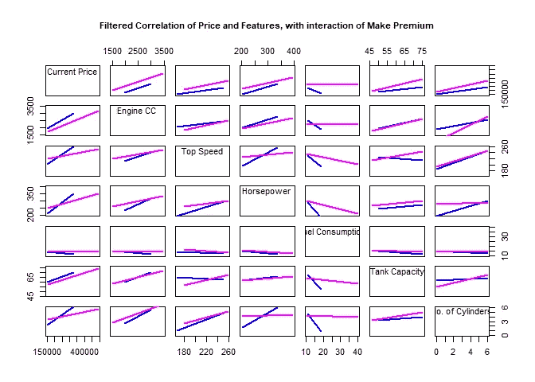
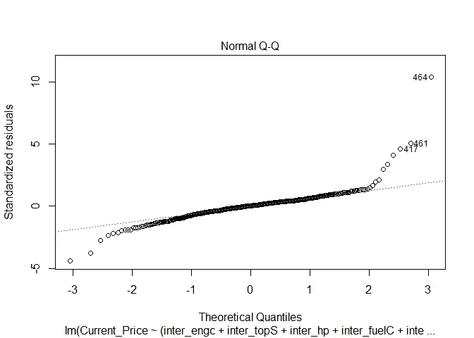

# 汽车的品牌对其价格的影响有多大？

> 原文：<https://towardsdatascience.com/how-much-does-a-cars-brand-affect-its-price-14b762d2324?source=collection_archive---------33----------------------->

作为一名即将从大学毕业的学生，我已经准备好开始#成人生活，其中一部分就是买一辆新车。当然，我很快意识到

我没有钱，而且

**(b)** 新加坡的汽车贵得令人望而却步。

因此，我做了任何处于我这种情况的人都会做的事情——我决定分析新加坡的汽车价格，而不是真的买车(注意:这不会带来同样的满足感)

# 原则问题

作为我的第一个独立数据分析项目之一，在开始这个项目时，我只有两个简单的问题:

**1。品牌对汽车价格的影响有多大？**我爸爸总是谈论“宝马”的溢价，我想知道这是不是真的。一辆“豪华车”是否人为抬高了它的价值..？多少钱？

**2。给定某些参数，我们能多准确地预测汽车的价格？这个项目的第二个潜在部分可能涉及建立一个简单的网络应用程序，给出汽车的“公允价值”，给定某些参数，因此建立一个模型来预测价格是我想要实现的东西。**

# TL；博士；医生

我意识到，在这个节骨眼上，你们中的一些人可能不想浏览整篇文章，所以我就把我的结论放在这里(如果你想知道技术细节，可以向下滚动，看看漂亮的图表)

**1。制造溢价效应**我们缩小了汽车的规格，并比较了“正常规格”的溢价(宝马等。)采用非高端品牌(丰田等)。)使得。品牌在最高速度和油耗与价格的相关性上有最显著的交互作用。这是有道理的，高端品牌的购买者可能并不真正关心燃料成本，仍然会购买高油耗的汽车。

**2。预测模型**该模型的预测$R^{2}$值为 0.837，与调整后的$R^{2}$值 0.857 相差不远。这意味着该模型能够用给定的变量预测大约 84%的汽车价格。剩余的异常值主要是超级跑车(如法拉利 SF90)，其价格很可能由于与之相关的显著溢价而被夸大(超出了“正常”的豪华品牌，如宝马)

# 预想的步骤

在决定着手这个项目时，我认为有三个关键步骤要做。这些步骤恰好与一个典型的 ***数据分析*** (wow buzzwords)项目相匹配

1.  数据收集
2.  数据清理
3.  数据分析

带着这些步骤，我走向了伟大的未知世界！

# 第一步:数据收集(又名:完成了吗？)

任何数据项目的第一步总是要有要分析的数据。我意识到我需要一个好的数据源，为我提供所有我需要的关于汽车的基本信息。我父亲(我汽车知识的主要来源)经常谈到神秘的 SGCarMart。

前往该网站时，我惊喜地发现，它包含了一个重要汽车信息的大型存储库。价格、车型、特征、引擎大小——SGCarMart 拥有一切！现在唯一的问题是把数据转换成一个好的，可操作的。csv 文件。

***网页信息+a . CSV =网页报废***

在我的工作/研究经历中，以及在我参加的在线课程中，数据总是一点点地来到我面前。csv 文件，所以我第一次面临需要获得自己的信息。

最初，我决定走与 rvest 一起废弃的通常路线:

然而，我最终决定使用 [Web Scraper](https://webscraper.io/) ,因为它附带了一个非常方便的选择器图，允许我准确地规划出我想要如何浏览页面和收集数据。

**选择器图形向您显示精确的报废图——方便！！**

选择 2000 毫秒的延迟(这样我就不会被 SGCarmart 阻止了— *手指交叉*),它走了。我总共运行了四次 scrapper，挑选出同一品牌/型号的不同变体(因为 SGCarmart 以不同的风格组织了它们的价格/规格/功能标签)。大约 4 个小时后，我完成了，我的房间是废弃的数据**凌乱的**。

**urgh hhh 太乱了**

# 第二步:数据清理(又名:我宁愿清理我的房间，对不起妈妈)

据福布斯报道，数据科学家花 60%的时间清理数据——我知道我要吃苦头了。

第一步是将单独的报废文件合并在一起，并删除没有价格的汽车(网站上的一些汽车尚未上市，因此没有价格)。

接下来，我需要从数据集中移除所有的随机伪像。出于某种原因，SGCarmart 在一些图形中包含了随机的“β”字符，因此这些字符必须被删除。

基本的清理工作完成后，是时候进行下一部分的数据清理了…虚拟编码。我决定根据变量中唯一观察值的数量对一些类别进行编码，而不对其他类别进行编码。假设我计划生成一个线性回归模型，`lm`函数将能够处理`factors`,因此我可以放心地将它们作为因子。

这里需要注意的是——我对柱面类型的编码肯定可以做得更有效率，但是，我只是在打出代码的中途才意识到有这么多不同类型的柱面，于是决定继续完成剩下的部分。我知道努力不够——下次我会做得更好。

# 3.数据分析(又名:这实际上是所有人关心的)

令人惊讶的是，数据清理并没有花费我预期的那么长时间。解决了这个问题，现在是项目中最性感的部分——分析数据！我做了一个快速的`dfSummary`，只是为了对数据有一个大概的了解。(我喜欢使用 dfSummary 只是为了对数据有个粗略的感觉)

从`dfSummary`来看，我们正在检查的各种发动机参数和特性存在很大的差异。此外，还有一些栏目缺少数值的问题。由于“NAs”不是很多，我决定从`zoo`包中执行一个`NA.approx()`来填充缺失的值

# 问题 1:品牌/品牌如何影响车价？

第一个问题是，品牌的“地位”对汽车的最终价格有多重要，我必须想出汽车的分类。在咨询了众多来源(也就是一些谷歌和 Reddit)后，我决定将它们分成两大类:标准版和高级版。我主要感兴趣的是知道一个著名品牌的汽车是否有溢价。如果是，多少钱。(我还为在新加坡不受欢迎的汽车创建了一个“其他”类别，因此这些汽车并没有特别的恶名)

标准

福特、雪铁龙、本田、现代、吉普、起亚、马自达、三菱、斯巴鲁、铃木、丰田、大众、日产

溢价

奥迪、法拉利、捷豹、兰博基尼、雷克萨斯、玛莎拉蒂、迈凯轮、奔驰、保时捷、宝马、沃尔沃

在研究“状态”的相互作用之前，我首先想了解汽车价格和我打算在线性回归模型中使用的各种特性之间的相关性。

只看最上面一行(当前价格)，看起来大多数功能都与价格有一定的正相关性(除了油耗，除非你喜欢你的车耗油，否则油耗与价格有明显的负相关性)。这看起来很有希望，下一步是确定这些相关性的相互作用。

为此，我决定用一个`scatterplotMatrix`。我过滤掉了标有“其他”的汽车制造商，只比较受欢迎的“标准”和“高级”汽车制造商。

(再次查看当前价格的最上面一行~其他规格)不出所料，在所有不同的功能中都观察到了交互作用(这是通过非平行回归线观察到的。无效模型将导致平行回归线)。

“但是等等，”你可能会假设说，“当然会有交互！高档汽车制造商自然会生产更多的特殊规格汽车，使回归线交叉！”你是对的。意识到这一点，我因此再次运行的阴谋，但这一次限制它的范围，使 V12 超级跑车等的影响。会被移除。我将发动机规格收紧到“正常”范围，查看速度为**150–260**，发动机 CCs 为**1000–3500**，马力为**200–500**的汽车。我还收紧了油箱和消耗变量，以标准化的措施。

再次查看该图，似乎发动机 CC 和最高速度回归线大致平行。我猜，如果你只看速度或 CC，制造溢价可能并不那么重要。(附带说明:由于道路税是根据 CC 计算的，因此 CC 在新加坡环境中特别敏感。这可能因此解释了 make 具有的非效应)。

纵观其他变量，我发现一个特别有趣的是燃料消耗。“标准”(蓝色)回归线下降得相当快(表明普通人可能不太喜欢高油耗的汽车)。相比之下,“优质”(粉色)的线条几乎保持笔直。我猜如果你花 200+k 买一辆超跑，燃料价格/消耗真的不重要。

***结论:*** 老实说，剧情并不是最确凿的。最初很清楚，品牌确实会影响变量之间的相关性。但是，当我们做一个“苹果对苹果”的比较(强制比较低规格的高级车和类似规格的标准车)时，在某些因素中，相互作用的影响明显减少了。然而，我敢断定**在一定程度上造成了问题。但是高档品牌也倾向于生产更多规格更好的高档汽车**

# 问题 2:建立评估“公允价值”的模型

上述图表显示，汽车品牌对价格和个人特征之间的相关性有影响。然而，汽车品牌对价格和所有特征之间的相关性有什么影响呢？

为了找到答案，我建立了一个多元线性回归模型(这也允许我以后创建一个“公允价值”模型)

创建了模型之后，我用测试集对其进行了测试，以找到 R 平方值。

0.857 的 R 平方值意味着约 86%的价格变化可以用模型来解释。用简单的英语来说(但老实说*不是最准确的理解方式*，这意味着我们放入模型的各种特征解释了*为什么价格是现在的价格。*

*不过，这个值高得令人怀疑，我怀疑可能有一些过度拟合的情况。回归模型通常的经验法则是每个变量有 10-15 个观察值。我的数据(大约 545 个观察值和 8 个变量)很好地符合这一点，但仍然有我想挠的痒痒。*

*测试过度拟合的一个好方法是使用预测的 R 平方值，并将该值与实际的 R 平方值进行比较。如果这些值相差很大，可能会出现过度拟合。我是通过托马斯·霍珀的一篇有用的[帖子](https://www.r-bloggers.com/2014/05/can-we-do-better-than-r-squared/)做到这一点的。更多关于使用预测 R 平方的理论，请参考那个博客。*

*令人高兴的是，预测的 R 平方值实际上与实际的 R 平方值相差不远。我对过度合身的担心被适当地消除了。回到 make premium 的问题，然后我为模型创建了一个表来查看特定的交互。*

*查看多变量回归模型的输出(该模型考虑了所有特征和价格之间的关系)，似乎品牌对最高速度和燃料消耗的影响最显著。*

*因此，我们可以得出结论,**在多元回归模型中，make 继续对价格和其他变量之间的相关性产生影响，对最高速度和油耗的影响最为显著。***

# *问题 2b:残差正态性*

*我还想探索我的模型的残差的正态性，这很容易通过 Q-Q 图来完成:*

**

*该图不遵循正态分布，在两个尾部都有异常值。然而，尽管正态性假设很重要，[篇论文](https://www.frontiersin.org/articles/10.3389/fpsyg.2018.02104/full)认为，鉴于[中心极限定理](https://sphweb.bumc.bu.edu/otlt/mph-modules/bs/bs704_probability/BS704_Probability12.html)，正态性假设对于大型数据集(通常称为> 200，但当然取决于上下文)来说不太重要。对于我的数据集> 200，我对残差缺乏正态性感到更舒服。*

*当然，我仍然想探索异常值，并将残差映射回原始数据集，以便找出这些异常值是什么。*

*正如预期的那样，大多数异常值是价格令人难以置信的高性能汽车。这些跑车的价格可能没有被模型捕捉到的原因可能可以归因于买家情绪的一个(本质上不可测量的)特征。前两名是法拉利。法拉利的价格标签很可能不仅仅是它的发动机排量和油耗，还很可能受到你的钱包看起来有多鼓和你看起来有多酷的影响。*

*这个小研究的结论被总结在 tl 中；博士:但我会在这里重复一遍，以防你第一次没听到！*

***1。制造溢价效应**我们缩小了汽车的规格，并比较了“正常规格”的溢价(宝马等。)采用非高端品牌(丰田等)。)使得。品牌在最高速度和油耗与价格的相关性上有最显著的交互作用。这是有道理的，高端品牌的购买者可能并不真正关心燃料成本，仍然会购买高油耗的汽车。*

***2。预测模型**该模型的预测$R^{2}$值为 0.837，与调整后的$R^{2}$值 0.857 相差不远。这意味着该模型能够用给定的变量预测大约 84%的汽车价格。剩余的异常值主要是超级跑车(如法拉利 SF90)，其价格很可能由于与之相关的显著溢价而被夸大(超出了“正常”的豪华品牌，如宝马)*

# *个人结论:对于那些喜欢从头到尾阅读的人*

***1。收集数据。**后悔没有早点学习 Regex。我是在使用 Webscraper 收集数据后才学习 Regex 的，我可能已经使用 Regex 和 Webscraper 在数据收集期间进行了预清理，这可能会加快数据清理过程。*

***2。可视化多元模型的困难。**我花了最多的时间试图找出如何最好地呈现多元回归模型。最后，我放弃了，继续展示一份`jtools`的汇总表。我相信有更好的方法来做到这一点，并会在下一个项目中努力改进。*

***3。常态假设。**在提出这个模型并绘制 Q-Q 图之后，我最初吓坏了，因为我意识到这是超级不正常的。这促使我去阅读更多关于正态性的东西，我想意识到正态性很重要，但对模型的准确性来说并不关键，这是令人欣慰的。在[中，统计专家的](https://thestatsgeek.com/2013/08/07/assumptions-for-linear-regression/)用词为*“对于中到大样本量，残差的非正态性不应该对通常的推断过程产生不利影响，这是中心极限定理的结果”*。*

*感谢阅读~希望有助于你以后买新车时更好的决策！请注意(希望如此)第 2 部分，我将尝试使用 SHINY 创建一个 web 应用程序，帮助您使用我们创建的模型找到您想要购买的汽车的合理价格！*

**最初发表于*[*https://zachlim98.github.io/me/2020-10/sgcarmart1*](https://zachlim98.github.io/me/2020-10/sgcarmart1)*。**