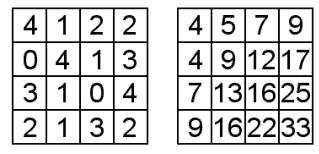
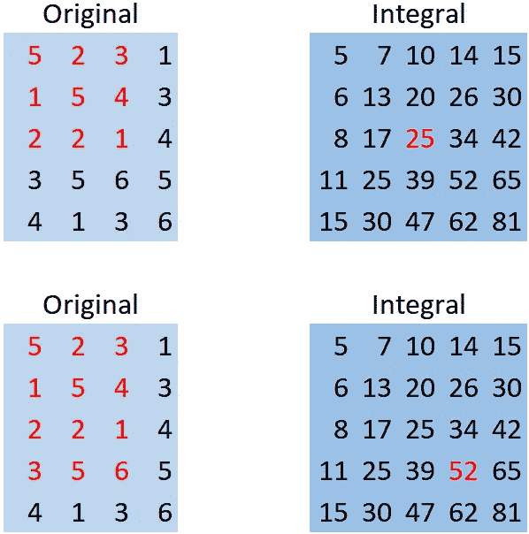

# 图像积分快多少？

> 原文：<https://towardsdatascience.com/how-much-faster-is-image-integral-90ba0008497a?source=collection_archive---------32----------------------->

## 使用 Google Colab 比较暴力和图像积分

在我寻求学习更多关于计算机视觉和 python 的过程中，我一直在阅读 Viola-James 物体检测框架，这里的[论文对此做了最好的总结](http://citeseerx.ist.psu.edu/viewdoc/summary?doi=10.1.1.10.6807)。

在这篇文章中，他们描述了图像积分的概念，这是一种描述图像的数组的总面积表，他们的观点是——暴力计算积分比提前计算图像积分并从数组中取出数字要慢得多。这种计算经常在计算机视觉应用中使用。

我很好奇——快了多少？这篇论文发表于 2001 年，我们现在的处理器肯定要快得多(20 年后)，这不会有什么不同吧？嗯，我是*非常错误的*。

## **跟着一起:** [**Google Colab 笔记本**](https://colab.research.google.com/drive/1UJOd9ByM9chEWs3GQ7G2PE6CrLj5Xfu9?usp=sharing)

# 图像积分



图像转换成图像积分。来源:[Stackoverflow.com](https://stackoverflow.com/questions/16546130/efficient-implementation-of-summed-area-table-integral-image-in-r)

使用左上角作为索引 0，0 (x=0，y=0)，水平和垂直计算积分。

在积分图像(右侧)中，索引(x=1，y=0)是 5，它是原始图像(so，4+1=5)中的(0，0)和(1，0)中包含的值的总和

同样，integral image index (2，2) = 9，也就是左上 2x2 块之和:4+4+1+0 = 9。

我举了几个更简单的例子:



来源:图片由作者提供。灵感来自[vinsol.com](https://vinsol.com/blog/2016/06/28/computer-vision-face-detection/)

# 图像设置

让我们浏览一下图像的设置、上传和转换等。首先，导入您的库:

设置您的库

我要用这张哈巴狗的照片:


资料来源:Unsplash.com

很好，现在图像已经上传了，接下来要做一些事情:将它转换成黑白图像，然后转换成一个 numpy 数组:

黑白转换，然后转换成 numpy 数组

我们将使用 open cv (cv2)中的图像积分函数。它用零填充积分，所以我们将删除下面第 2 行中的那些。

从第 4 行开始，我们将定义一个强力函数进行比较，它所做的只是对行和列求和:

使用 OpenCV 并定义强力函数

# 多次 CPU 迭代

我将进行三种类型的迭代，并记录执行每种计算所需的时间。我们将每个迭代运行 500 次，以尽量减少可变性。

在对图像做深度学习的时候，500 次大概是一个很低的数字；图像计算大概是几百万到几十亿的量级。

我们还将选择上图中的位置(1000，1000)进行计算。

## 迭代 1——强力推进图像积分

这是“控制”时间:

## 迭代 2-重复图像积分计算

这里，我们将在每次重复时重复 cv.integral，而不是只计算一次:

结果呢？121.8x！即使我们每次重复重新计算积分。

```
Image Integral is: 121.8 times faster
```

## 迭代 3-使用预先计算的图像积分

这类似于对一幅图像计算一次积分，然后对同一幅图像进行数百次计算。

结果= 33073.65x. **比三十三个** **快一千个**倍。

```
Image Integral is: 33073.65 times faster
```

# GPU 计算

当然，所有深度学习的学生都是 GPU 的忠实粉丝，但在这种情况下，它不会成功。

有 GPU 开销，如 CUDA 初始化、内核调用、内存分配，使这个过程慢得多。重复做 500 次非常慢，我不得不减少到 50 次，这样我就不会永远无所事事。

结果？CPU 图像积分计算一次(上面的迭代 3)几乎比 GPU 快 37，000 倍。

GPU 计算实际上比所有 CPU 迭代都要慢。

## 如果你错过了上面的，这里是 [Colab 笔记本](https://colab.research.google.com/drive/1UJOd9ByM9chEWs3GQ7G2PE6CrLj5Xfu9?usp=sharing)

# 参考

[1] [Viola-Jones 对象检测框架](https://en.wikipedia.org/wiki/Viola%E2%80%93Jones_object_detection_framework)，维基百科，2020 年 10 月访问

[2] [OpenCV-Python](https://pypi.org/project/opencv-python/) ，2020 年 10 月访问

[3] [CuPy](https://cupy.dev/) ，2020 年 10 月访问