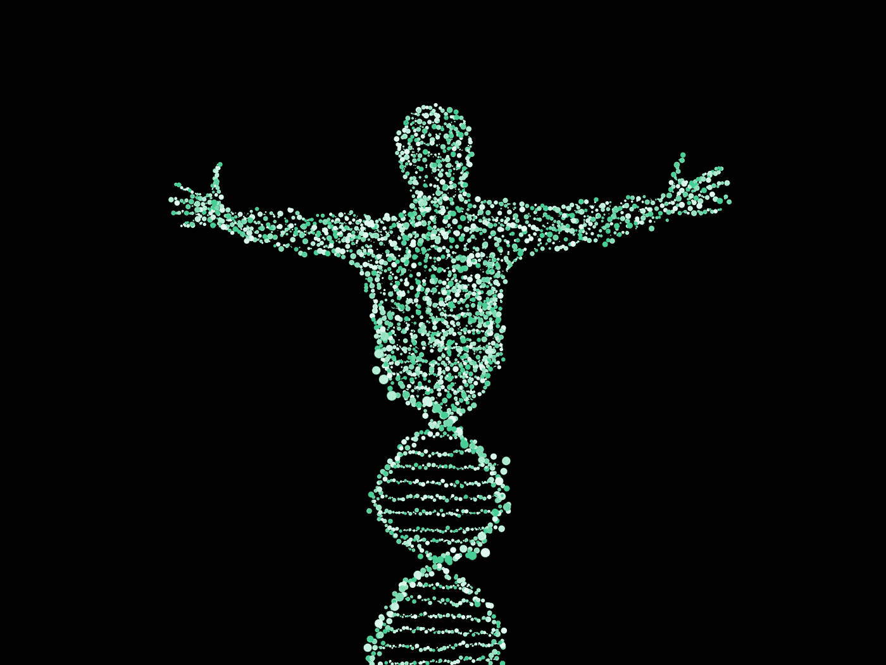

# 你的基因数据值多少钱？

> 原文：<https://towardsdatascience.com/how-much-is-your-genetic-data-worth-3bb7a8b4ae5c?source=collection_archive---------28----------------------->

## 50%的美国公民表示，95 美元足以让他们交出自己的基因秘密

图片来自[皮克斯拜](https://pixabay.com/?utm_source=link-attribution&utm_medium=referral&utm_campaign=image&utm_content=2125123)

像脸书和谷歌这样的科技巨头目前正从我们的数据中获得天文数字的利润。个人在线信息的价值在 1 美元到 100 美元之间，截至上个月，脸书拥有 24 亿用户。这只是基于你在网上浏览和互动的内容。想象一下，一家公司可以用你的整个基因组，甚至只是部分基因组做些什么。从与医疗保险公司分享到创造个性化的药物，可能性是无穷无尽的。

随着技术的进步，基因组测序的成本持续下降，我们对基因组的看法将会改变。目前，通过 Veritas 对你的整个基因组进行测序需要 1999 美元，然而作为一种宣传噱头，以显示未来几年成本将降低多少，他们在 2018 年的有限时间内提供了 199 美元的服务。随着获取基因数据越来越容易，你的基因组将不再是健康或疾病的指标，而是被视为你的财产——一种你可以选择分享或保留的商品。

如今，像 23andMe 这样的公司通过向客户收取费用来发现更多关于他们基因组的信息。将来，随着公众开始意识到他们基因数据的真正价值，这种情况可能会逆转。那么，你的基因组值多少钱？上周发表在《PLOS 综合》上的一项研究报告了最近的一项调查结果，发现 50%的参与者愿意以平均 95 美元的价格出售他们的基因数据。

[基因组数据监管调查(GDGS)](https://journals.plos.org/plosone/article?id=10.1371/journal.pone.0229044) 基于美国不同地区的 2，020 名参与者。他们首先观看了一段信息丰富的视频，该视频提供了关于基因组数据库的事实信息，例如基因分型的当前市场成本和隐私风险。看完视频后，参与者被问及他们期望从一家大公司得到什么来交换他们的基因数据。

*   11.7%的人乐于免费分享他们的基因组
*   37.8%的人不愿意放弃他们的数据，无论多少
*   50.5%的人愿意有偿分享他们的数据

想要出售数据的参与者随后提供他们乐意接受的费用，平均价格约为 130 美元。鉴于这大约是消费者基因分型的当前市场价格，这并不奇怪。然而，他们随后被问及愿意为个性化的调查结果报告**支付**多少钱。平均 35 美元使净支出下降到**95 美元**。

调查还发现，在“卖家”中，购买他们数据的公司类型并不重要。在考虑的五个类别(技术、政府、医院、制药、大学)中，销售意愿没有显著差异。

> **交易破坏者**是数据将如何被使用和监管。

在向参与者提出的各种治理政策中，根据请求删除数据的能力是最重要的因素，72.2%的人表示这将增加他们的参与意愿。紧随其后的是保证数据不会被出售或与其他组织共享(69.8%)，以及保证公司会为数据的每次特定使用请求许可(67.9%)。

GDGS 首次调查公众对大公司使用基因数据的看法，这与之前基于学术机构使用此类数据的研究形成了鲜明对比。这些过去的[研究](https://www.liebertpub.com/doi/10.1089/bio.2014.0032)都发现超过 50%的人愿意免费分享他们的数据，2015 年的一项[调查](https://www.cell.com/ajhg/fulltext/S0002-9297(17)30021-6)甚至发现一个机构关于数据使用和分享的政策**并没有**影响参与意愿。

新的发现表明，当涉及到我们自己的基因数据时，公众舆论正倾向于更严格的管理政策。这可能是因为随着这个话题越来越受欢迎，被媒体和新闻机构广泛报道，普通人对这个话题越来越了解。

23andMe 正试图站在公众一边，对他们如何使用数据非常透明，并在你注册时提供选择“退出”他们的研究项目的选项。然而，他们还通过与葛兰素史克(GlaxoSmithKline)和 T2(America)阿米尔(Amirall)等公司联手，在数百万美元的交易中引领个性化医学研究。随着从我们的基因数据中获利的潜力进一步增长，科技巨头想要参与这一行动将变得不可避免，用不了多久，任何人都可以通过提供泄露一切的唾液样本获得报酬。

大型科技公司多年来一直在我们不知情的情况下利用我们的数据，直到最近才被迫采用更透明的数据共享模式。这项研究表明，令人欣慰的是，随着人们越来越意识到他们对自己基因组的权利，遗传数据不太可能出现同样的情况。