# 你的数据有多少价值？

> 原文：<https://towardsdatascience.com/how-much-juice-is-there-in-your-data-d3e76393ca9d?source=collection_archive---------51----------------------->

## 应用于 Kaggle 的信息论答案，带代码

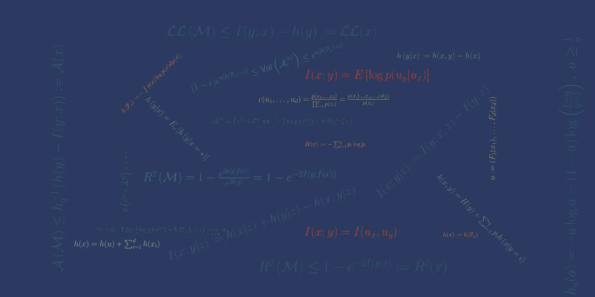

作者图片

97 %。根据 Gartner 的数据，这是组织未使用的数据的百分比，构成了所谓的“[黑暗数据](https://www.gartner.com/en/information-technology/glossary/dark-data)”。

数据已经取代石油成为世界上最有价值的资源，但几乎所有的数据仍未被组织使用。Gartner 估计，87%的组织“商业智能和分析成熟度较低”。

对这一悖论的一种可能解释是，并非所有数据都是生而平等的。从一个组织到另一个组织，以及在同一个组织内从一个项目到另一个项目，数据的价值可能有很大的不同。

为了在商业智能和分析方面进行必要的投资，组织应该能够准确地预测这样做的业务影响，并且这样的未来投资应该能够产生足够高的 ROI。

> 如果没有勘探地球物理学的机器学习等价物，数据就不可能成为新的石油

假设数据总是有价值的，并试图通过试错法提取这种价值作为人工智能项目的一部分，无论是由 AutoML 平台驱动，充其量都是非常浪费的，在最坏的情况下会产生负 ROI。

根据石油类比，这就相当于假设无论在哪里看都有石油在地下*，并且驱动从地下提取的石油量的唯一因素是使用的提取技术*。

多年来，地球物理学和经济学交叉的整个研究领域，即[勘探地球物理学](https://en.wikipedia.org/wiki/Exploration_geophysics)，一直致力于降低石油生产中的商业风险。勘探地球物理学依靠**归纳推理**(与演绎推理相反)来检测给定位置有价值地质矿床的存在并估计其数量，而不会产生建设开采场地的前期成本和风险。

同样，为了降低投资人工智能项目的商业风险，在进行任何预测建模之前并独立于预测建模，开发量化数据价值的归纳推理方法至关重要，这一阶段我们称为**预学习**。

评估数据集的演绎方法包括首先分配资源以使用数据集，然后监控一段时间的业务影响，而归纳方法包括使用数学推理从感兴趣的数据集推断任何预测模型可以实现的最高性能，成本低廉，且无需训练任何预测模型。

在本文中，我们总结了使 [**能够预学习**](https://www.kxy.ai/reference/latest/theoretical_foundation/memoryless/problem_formulation.html) 的理论基础，并且我们说明了如何使用开源的 [**kxy**](https://github.com/kxytechnologies/kxy-python) python 包来量化各种数据集中的汁液。

> 果汁是从什么开始的？

***数据中的汁液指的是数据中对解决手头特定问题有用的信息量。***

(左)Unsplash 上 Rinck Content Studio 的照片|(右)Instagram 用户@skwoodlekids 的插画

就像桔子汁(或地下的油)独立存在一样，无论是否被提取，也无论如何被提取，重要的是要认识到每个数据集在概念上都可以被认为是一个(可能是空的)部分，可以用来解决手头的问题，以及无用的剩余物。

在这方面，有两点值得强调。首先，什么是有用的(resp。没用)是问题特定的。数据集对解决特定问题无用的部分可能对解决另一个问题有用。

其次，数据集中对解决给定问题有用的东西并不依赖于解决问题的特定方法。同样，给定橙子中包含的果汁总量是可以从橙子中提取的最大液体量，不管它是如何压榨的，数据集中的果汁总量是可以从数据集提取的最大效用量，以解决特定问题，不管使用什么机器学习模型来解决问题。

为了奠定预学习的基础，我们需要正式定义“问题”和“有用”的含义。

我们关心的问题是分类和回归问题，对输入或输出的类型没有限制。具体来说，我们考虑使用输入向量***×输入向量*** 来预测业务结果 ***y*** 。选择 ***y*** 是我们有兴趣解决的业务问题的固有属性，而输入 ***x*** 代表我们考虑用来解决问题的数据集。

像往常一样，我们通过将它们建模为随机变量来表示我们对 ***y*** 和 ***x*** 的值的不确定性。说我们的数据集对于解决感兴趣的问题是有用的，相当于说输入 ***x*** 是关于标签/输出 ***y*** 的信息。

幸运的是，信息量和关联的概念被信息论完全形式化了。你会在这里找到一本关于信息论的初级读本。出于本文的目的，如果我们将随机变量的熵表示为 ***h(z)*** 连续变量的熵表示为微分，分类变量的熵表示为香农，就足以回忆起关于*x***y***信息量的规范度量是它们的 ***互信息，*** 定义为*

*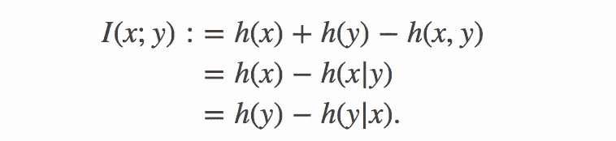*

> *互信息的一些关键性质*

***互信息*I(y；x)*** 明确定义了输出是分类的还是连续的，以及输入是连续的、分类的还是两者的组合。关于为什么会出现这种情况的一些背景阅读，请查看本书的[和其中的参考文献。](https://www.kxy.ai/reference/latest/theoretical_foundation/memoryless/quantifying_informativeness.html)*

*它总是非负的，当且仅当 ***y*** 和 ***x*** 是统计独立的(即 ***y*** 和 ***x*** 之间没有任何关系)。*

*此外，互信息通过无损特征变换是不变的。的确，如果 ***f*** 和 ***g*** 是两个一一对应的映射，那么*

**

*一个更一般的结果，被称为[数据处理不等式](https://en.wikipedia.org/wiki/Data_processing_inequality)，陈述了应用于 ***x*** 的变换只能减少其与 ***y*** 的互信息。具体来说，*

*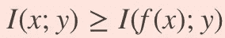*

*并且当 ***f*** 或者是一对一映射，或者 ***y*** 和 ***x*** 是统计独立给定的 ***f(x)*** 时，等式成立*

*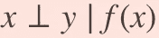*

*这意味着包含在 ***x*** 中的关于 ***y*** 的所有信息都完全反映在 ***f(x)*** 中，或者换句话说，转换 ***f*** 保留了所有果汁，尽管有所损失。*

*因此，当互信息被用作量化数据集中汁液量的代理时，有效的特征工程既不减少也不增加汁液量，这是相当直观的。特征工程只是将输入和/或输出转换成一种表示，使训练特定的机器学习模型变得更容易。*

> *从互信息到最大可实现的性能*

*虽然它反映了数据集中果汁量的本质，但通常以比特或 NAT 表示的互信息值很难与业务分析师或决策者交流。*

*幸运的是，它可以用来计算使用 ***x*** 预测*y 时所能达到的最高性能，对于各种性能指标(R、RMSE、分类精度、每样本对数似然等。)，进而可以转化为业务成果。我们在下面提供了一个简短的总结，但是你可以在这里找到更多的。**

**我们考虑一个具有预测概率的预测模型 *M***

**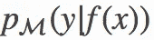**

**其中 ***f(x)*** 是模型对与输入 ***x*** 相关联的输出的预测。当 ***y*** 为分类时，该模型为分类器，当 ***y*** 为连续时，该模型为回归模型。**

## **[**最大可实现 R**](https://www.kxy.ai/reference/latest/theoretical_foundation/memoryless/applications.html#a-achievable-r-2)**

**在加法回归模型中**

**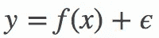**

**R 的总体版本定义为**

**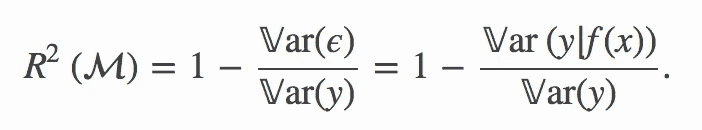**

**在我们的模型下，上面公式中的比率代表了不能用输入来解释的输出方差的分数。**

**虽然方差是高斯分布不确定性的良好度量，但与熵不同，它是其他分布不确定性的弱度量。**

**考虑到**熵**(在 nats 中)**与**(自然)****标准差**的对数具有相同的单位/标度，我们将 R 概括如下:****

****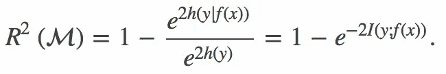****

****注意，当 ***(y，f(x))*** 为联合高斯(如高斯过程回归，包括带有高斯加性噪声的线性回归)时，上述信息调整后的 R 与原始 R 相同。****

*******更一般地，这种信息调整的 R 适用于回归和分类，具有连续输入、分类输入或两者的组合。*******

****直接应用*数据处理不等式*给出了任何模型预测*与*所能达到的最大 R:******

*****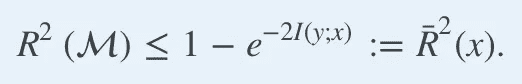*****

*****重要的是要强调这个最优 R 不仅仅是一个上限；通过任何预测分布为真(数据生成)条件分布 ***p(y|x)*** 的模型来实现。*****

## ****[最小可实现 RMSE](https://www.kxy.ai/reference/latest/theoretical_foundation/memoryless/applications.html#d-regression-achievable-rmse)****

****上述模型的均方根误差的总体版本为****

****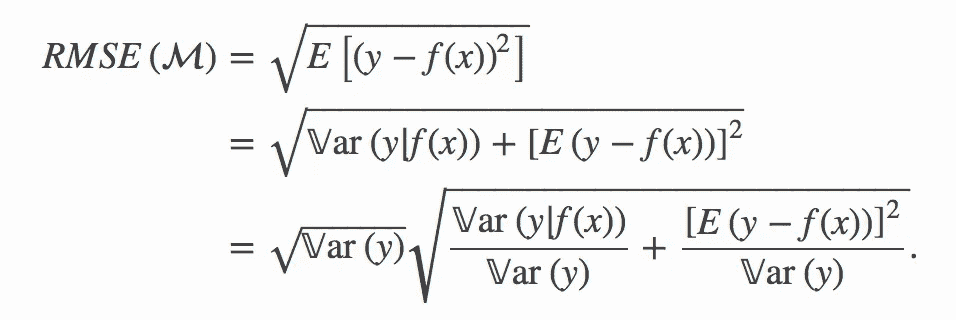****

****同样，我们可以把它的信息调整概括定义为****

****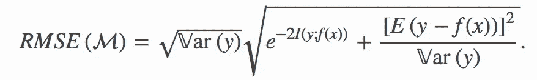****

****数据处理不等式*的直接应用*给出了最小的 RMSE 任何模型使用*x*预测都能达到:******

*****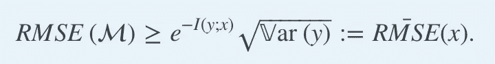*****

## *****[最大可达真实对数似然](https://www.kxy.ai/reference/latest/theoretical_foundation/memoryless/applications.html#b-achievable-true-log-likelihood)*****

*****类似地，我们模型的每次观察的样本对数似然性可以定义为*****

*****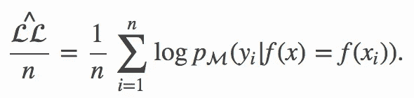*****

*****其人口当量，我们称之为*每个观测值的真实对数似然*，即*****

****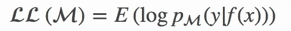****

****满足不等式****

****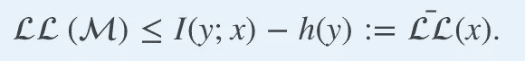****

****这个不等式源于吉布斯不等式和数据处理不等式。更多详情见[此处](https://www.kxy.ai/reference/latest/theoretical_foundation/memoryless/applications.html#b-achievable-true-log-likelihood)。****

****请注意，上述不等式适用于回归和分类问题，并且上限是通过使用真条件***【p(y | x)】***作为其预测分布的模型来实现的。****

****术语 ***-h(y)*** 表示在没有任何数据的情况下可以实现的每个观测的最佳真实对数似然，并且可以被视为天真的对数似然基准，而互信息术语***I(y；x)*** 代表可归因于我们数据的提升。****

## ****[可达到的最大分类精度](https://www.kxy.ai/reference/latest/theoretical_foundation/memoryless/applications.html#c-achievable-classification-accuracy)****

****在输出 ***y*** 可以取高达 ***q*** 的不同值的分类问题中，也可以通过使用 ***x*** 来预测 ***y.*** 的模型来表达可以实现的最高分类精度****

****让我们考虑一下功能****

****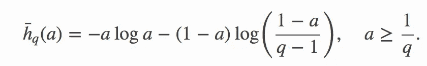****

****对于给定的熵值 ***h*** ，通过预测采用 ***q*** 不同值的任何离散分布的结果可以实现的最佳精度，并且具有熵值 ***h*** 由下式给出****

****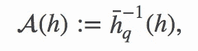****

****其中函数****

****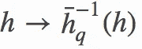****

****是的反函数****

****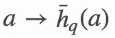****

****并且很容易进行数值评估。你可以在这里找到更多细节[。](https://www.kxy.ai/reference/latest/theoretical_foundation/memoryless/applications.html#c-achievable-classification-accuracy)****

****下图为各种**q 提供了上述功能的说明。******

****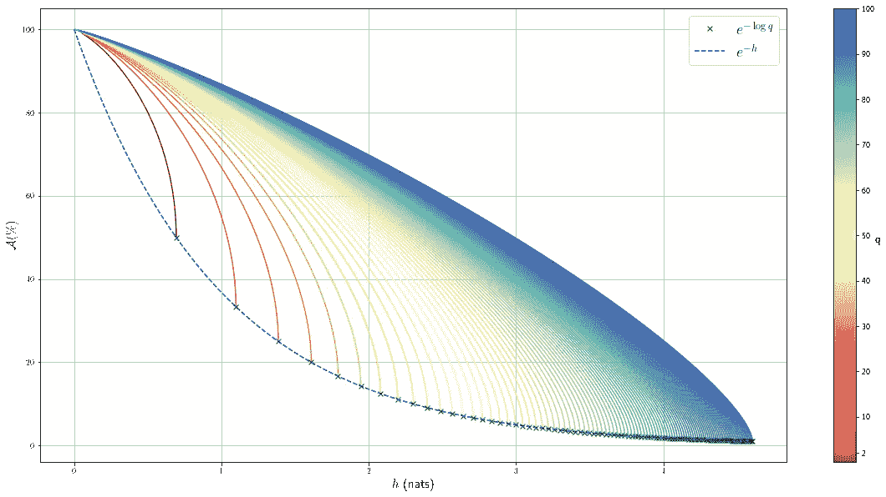****

*****图 1:预测具有 q 个可能结果的离散分布的结果时可达到的精度。*****

****更一般地，使用*预测分类输出 ***y*** 取 ***q*** 不同值的分类模型 ***可以达到的精度满足不等式:********

****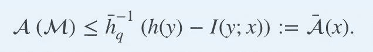****

****熵项 ***h(y)*** 反映了由总是预测最频繁结果组成的简单策略的准确性，即****

****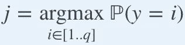****

****鉴于互信息项***I(y；x)*******

> ****总而言之，在分类和回归问题中，几乎任何基于群体的性能度量所能达到的最高值都可以表示为真实数据生成分布****I(y；x)*** 和输出的可变性的度量(如其熵***【h(y)***、方差或标准差))当天真(无输入)预测策略不具有无效性能时。*****

> *****无模型互信息估计*****

*****最后，我们可以解决房间里的大象。显然，这都归结为估计互信息***I(y；x)*** 在真实数据下生成分布。然而，我们并不知道真正的联合分布***【y，x】***。如果我们知道它，我们就能获得最好的预测模型——具有预测分布的模型——真条件 ***p(y|x)*** ！*****

*****幸运的是，我们不需要知道或学习真正的联合分布***【y，x】***；这就是我们前面提到的归纳推理方法发挥作用的地方。*****

*****我们采用的归纳方法包括测量足够宽范围的数据属性，间接揭示其中的结构/模式，并推断与观察到的属性一致的交互信息，而不做任何额外的任意假设。我们凭经验观察的属性越灵活，我们在数据中捕获的结构就越多，我们的估计就越接近真实的互信息。*****

*****为了有效地做到这一点，我们依靠一些技巧。*****

## *******招数一:**在 copula-uniform 对偶空间中工作。*****

*****首先，我们回忆一下，*和 ***x*** 之间的互信息是一对一映射不变的，特别地，当 ***y*** 和 ***x*** 为序数时， ***y*** 和 ***x*** 之间的互信息等于******

*****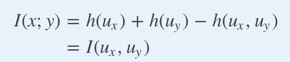*****

*****我们不是直接估计 ***y*** 和 ***x*** 之间的互信息，而是估计它们的 copula-uniform 对偶表示之间的互信息；我们称之为在 copula-uniform 对偶空间中工作的*。******

*****这允许我们完全绕过边际分布，并以一种单位/比例/表示自由的方式进行推断——在对偶空间中，所有边际分布在[0，1]上都是一致的！*****

## *****技巧二:通过成对 Spearman 等级相关性揭示模式。*****

*****我们通过估计原始空间中的所有成对 Spearman 等级相关性来揭示我们的数据中的结构，为两个序数标量 ***x*** 和 ***y*** 定义如下*****

*****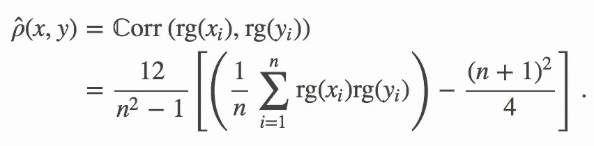*****

*****它衡量两个变量单调相关的倾向。它的人口版本仅仅是 copula 的函数——统一的对偶表示法*和***v******x***和 ***y*** 并读作******

**********

*****换句话说，使用 Spearman 的秩相关，我们可以在对偶空间中工作，同时有效地估计原始空间中感兴趣的属性。*****

*****如果没有这个技巧，我们将需要估计边际 CDF，并明确地将概率积分变换应用于输入，以便能够在对偶空间中工作，这将违背第一个技巧的目的。*****

*****毕竟，假设两个变量之间的互信息不依赖于它们的边际分布，那么不得不估计边际分布来计算它将是一种耻辱。*****

## ********招数三:扩大输入空间捕捉非单调模式。********

*****对于回归问题，成对 Spearman 秩相关完全捕获“输出随着特定输入减少/增加”类型的模式，对于分类问题，“我们可以根据特定输入取大值还是小值来判断编码输出的一位是 0 还是 1”。*****

*****为了捕捉这些单调关联类型之外的模式，我们需要求助于另一个技巧。我们注意到，对于任何不是内射的函数 ***f*** ，我们有*****

*****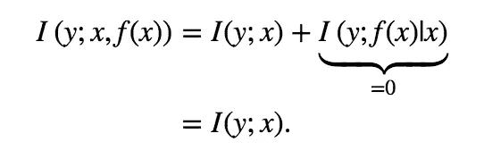*****

*****由此可见，与其估计***I(y；x)*** ，我们可以估计***I(y；x，f(x))*** 对于任意内射函数 ***f*** 。*****

*****而 ***y*** 与 ***x*** 之间的成对 Spearman 秩相关性揭示了 ***y*** 与 ***x*** 、 ***f*** 之间的单调关系，因此可以选择 ***y*** 与 ***f(x)*** 之间的成对 Spearman 相关性*****

********f*** 的一个很好的例子就是函数*****

*****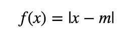*****

*****其中 *m* 可以选择为样本均值、中值或众数。*****

*****的确，如果***y =**x***对于某个均值为零且偏斜为零的随机变量*x，那么*y 与***【x，*** 之间的 Spearman 秩相关关系可以通过对称性*，*发现为**，*不能揭示其中的结构另一方面，****【y】****和***【x】***(同 ***m=0*** )，也就是 **1** ，更能体现出**的信息量有多大************

*****选择 ***f*** 捕捉“当输入偏离标准值时，输出趋于减少/增加”类型的模式。使用相同的技巧可以捕获更多类型的模式，包括周期性/季节性等。*****

## *****诀窍四:用最大熵原理把所有东西放在一起，以此来避免武断的假设。*****

*****综上，我们定义 ***z=(x，f(x))*** ，我们估计向量 ***(y，z)***的 Spearman 秩自相关矩阵即 ***S(y，z)。********

*****然后，我们使用与通过斯皮尔曼秩自相关矩阵***【S(y，z)】、*** 观察到的模式相匹配的所有 copula 密度中具有最高熵的 copula 密度作为 ***(y，z)*** 的 copula 统一表示的密度，即，除了通过 ***S(y，z)*** 观察到的模式之外，对于每个模式最不确定。*****

*****假设 ***(y，z)*** 是 *d* 维的，得到的变分优化问题为:*****

*****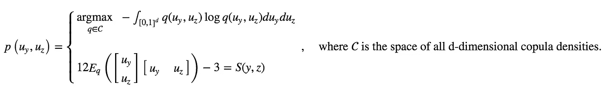*****

*****然后，我们使用学习的联合 pdf 来估计所需的互信息，如*****

*****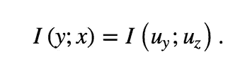*****

> *****理解最大熵变分问题*****

*****在没有 Spearman 秩相关约束的情况下，上述最大熵问题的解是标准均匀分布的 pdf，对应于假设*y***x***统计独立，且具有 *0* 互信息。这很直观，因为我们没有理由相信 ***x*** 是关于 ***y*** 的信息，直到我们收集到经验证据。******

*****当我们观察 ***S(y，z)*** 时，变分最大熵问题的新解偏离均匀分布刚好足以反映 ***S(y，z)*** 所捕捉到的模式。因此，不应该期望我们的方法过高估计真实的互信息***I(y；x)*** 。*****

*****此外，只要 ***S(y，z)*** 足够有表现力，我们可以通过选择函数 ***f*** 来控制，所有类型的模式都将反映在***【S(y，z)*** 中，并且我们估计的互信息不应被期望低估真实的互信息***I(y；x)*** 。*****

> *****应用于正在进行的 Kaggle 竞赛*****

*****我们构建了 [KxY 平台](https://www.kxy.ai/)，以及附带的开源 [python 包](https://github.com/kxytechnologies/kxy-python)，通过专注于高 ROI 项目和实验，帮助各种规模的组织削减其人工智能项目的风险和成本。特别令人感兴趣的是本文中描述的方法的实现，以量化数据中的果汁量。*****

*******kxy** 包可以从 PyPi ( **pip install kxy** )或 Github 安装，也可以通过我们在 DockerHub 上预先配置的 Docker 映像来访问——有关如何开始的更多详细信息，请阅读 [this](https://www.kxy.ai/reference/latest/quickstart/getting_started.html#Getting-Started) 。一旦安装完毕， **kxy** 包需要一个 API 密匙来运行。您可以通过填写我们的[联系表](https://www.kxy.ai/request-a-trial/)或发送电子邮件至 demo@kxy.ai 来申请。*****

*****我们以[房价高级回归技术](https://www.kaggle.com/c/house-prices-advanced-regression-techniques) Kaggle 竞赛为例。该问题包括使用 79 个解释变量的综合列表预测房屋销售价格，其中 43 个是分类变量，36 个是顺序变量。*****

*****我们发现，当使用独热编码方法来表示分类变量时，可以实现近乎完美的预测。*****

*****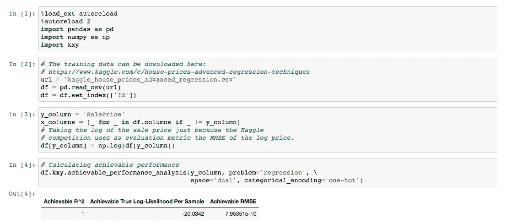*****

*****关于房价高级回归 Kaggle 竞争的可实现性能分析的代码片段和输出。*****

*****事实上，当我们以贪婪的方式一次选择一个解释变量，总是在尚未选择的变量中选择产生最高增量果汁量的变量时，我们发现仅用 79 个变量中的 17 个，我们就可以实现近乎完美的预测——在 R 意义上。*****

*****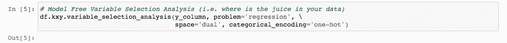*****

*****贪婪变量选择分析的代码片段。*****

*****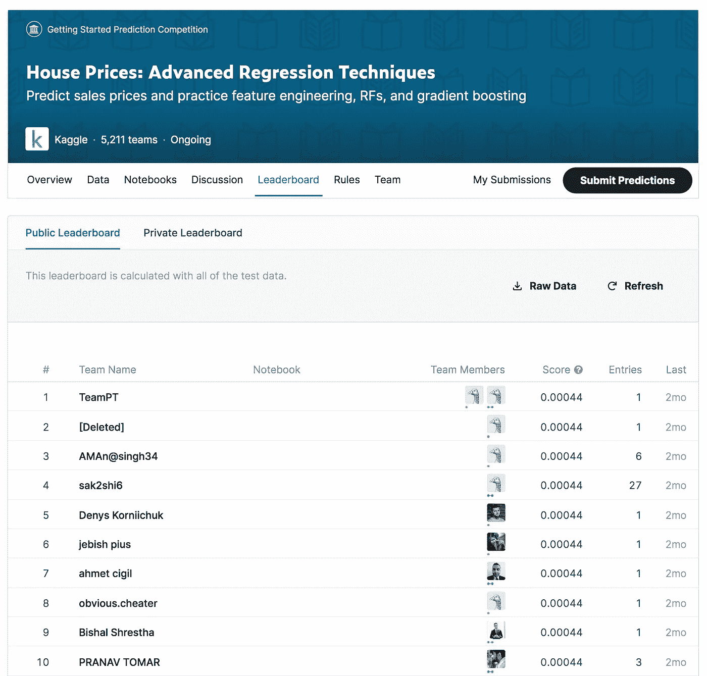*****

*****写这篇文章时 Kaggle 排行榜截图。*****

*****下图说明了全变量选择分析的结果。有趣的是，当前 Kaggle 排行榜的榜首已经设法产生了 0.00044 的 RMSE，这是使用前 15 个变量可以实现的最佳结果和使用前 16 个变量可以实现的最佳结果之间的某个位置。*****

**********

*****标签。Kaggle 房价高级回归技术竞赛 KxY 无模型变量选择分析结果。*****

*****你可以在这里找到用于生成上述结果的代码。*****

*****脚注:*****

*****【】假设观测值(输入、输出)可以看作是从同一个随机变量 ***(y，x)*** 中独立抽取的。特别是，问题不应该表现出任何时间依赖性，或者观察值(输入、输出)应该被视为来自静态和遍历时间序列的样本，在这种情况下，样本大小应该足够长，以跨越多个系统的内存。*****

*****[ ]前一个脚注的要求具有非常实际的意义。整个推理管道依赖于对 Spearman 秩相关矩阵 ***S(y，z)*** 的精确估计。当观测值可以被视为同分布样本时，对***【y，z】***的可靠估计只需要很小的样本量，就能指示真实的潜在现象。另一方面，当观察呈现时间依赖性时，如果使用我们的数据的不相交子集来估计***【y，z】***产生非常不同的值，则时间序列不是平稳的和遍历的，或者它是平稳的和遍历的，但是我们没有足够长的历史来表征 ***S(y，z)；*** 无论哪种方式，估计的 ***S(y，z)*** 都不会准确地表征真实的潜在现象，并且不应该应用分析。*****