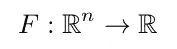
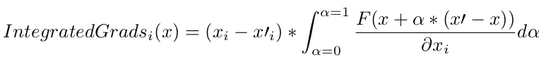
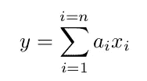
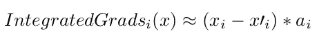
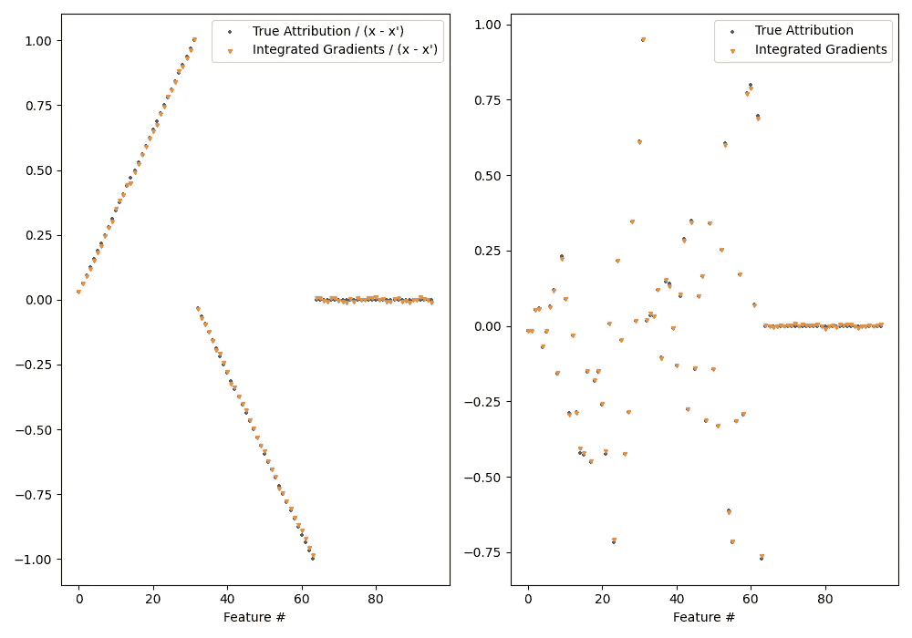
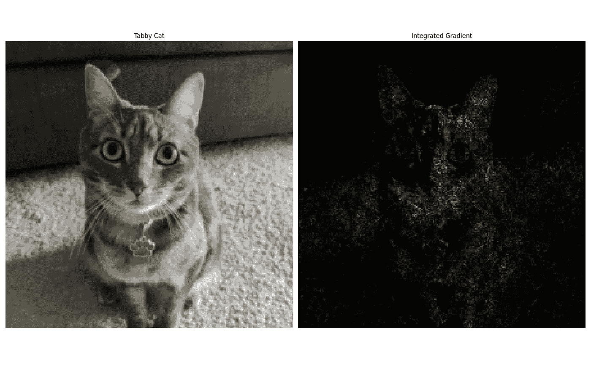
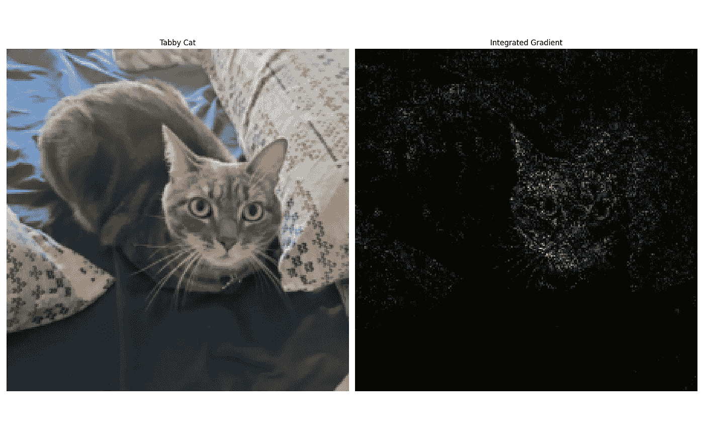

# 您的神经网络的预测有多少可以归因于每个输入特征？

> 原文：<https://towardsdatascience.com/how-much-of-your-neural-networks-prediction-can-be-attributed-to-each-input-feature-62581efd9b38?source=collection_archive---------16----------------------->

## 用 PyTorch 实现的具有集成梯度的深度神经网络。


照片由 [img.ly](https://unsplash.com/@imgly?utm_source=unsplash&utm_medium=referral&utm_content=creditCopyText) 在 [Unsplash](https://unsplash.com/s/photos/gradient?utm_source=unsplash&utm_medium=referral&utm_content=creditCopyText) 上拍摄

众所周知，神经网络是黑盒预测器，数据科学家通常不知道哪个特定输入特征对预测影响最大。如果我们想了解模型实际学到了什么，这可能是相当有限的。有了这种理解，我们就可以发现我们的学习算法或数据处理管道中的错误或弱点，从而能够改进它们。

我们将在本项目中实施的方法称为集成梯度，在以下文章中有所介绍:

*   [深度网络的公理归属](https://arxiv.org/abs/1703.01365)

在本文中，作者列出了一个好的属性方法应该遵循的一些理想的公理，并证明了他们的方法 **Integrated gradients** 满足这些公理。其中一些公理是:

*   灵敏度:如果两个样本仅在一个特征上不同，并且通过神经网络具有不同的输出，那么这个特征的属性应该是非空的。相反，如果一个特征根本不影响输出，那么它的属性应该为零。
*   实现不变性:如果两个网络的所有输入都有相同的输出，那么它们的属性应该是相同的。

更多的公理可以在上面链接的文章中详细找到。

积分梯度很容易实现和使用，它只需要计算神经网络输出相对于其输入的梯度的能力。这在 PyTorch 中很容易做到，我们将在下面详细介绍如何做到这一点。

# 该方法:

我们将我们的神经网络表示为函数 F:



我们对特征向量 x 的属性感兴趣，并且还引入了基线特征向量 x’。该基线 x '允许我们对原因的“不存在”进行建模，并且其通过神经网络的输出应该接近于零。

积分梯度法的计算如下:



作者图片

其中 x_i 是向量 x 的第 I 个特征。

# 示例:

## 合成示例:

让我们生成一个合成数据集，尝试更好地理解这种方法。

我们将数据生成流程设定为:



这可以用 python 来实现，如下所示:

```
**def** build_dataset(size):
    pos_size = 32
    neg_size = 32
    noise_size = 32
    pos_cols = [**"POS_%s"** % i **for** i **in** range(pos_size)]
    neg_cols = [**"NEG_%s"** % i **for** i **in** range(neg_size)]
    noise_cols = [**"NOISE_%s"** % i **for** i **in** range(noise_size)]

    pos = {i: np.random.uniform(-1, 1, size=size) **for** i **in** pos_cols}
    neg = {i: np.random.uniform(-1, 1, size=size) **for** i **in** neg_cols}
    noise = {i: np.random.uniform(-1, 1, size=size) **for** i **in** noise_cols}

    df = pd.DataFrame({**pos, **neg, **noise})

    df[**"target"**] = df.apply(
        **lambda** x: sum(
            [x[k] * (i + 1) / pos_size **for** i, k **in** enumerate(pos_cols)]
            + [-x[k] * (i + 1) / neg_size **for** i, k **in** enumerate(neg_cols)]
        ),
        axis=1,
    )

    coefs = (
        [(i + 1) / pos_size **for** i, k **in** enumerate(pos_cols)]
        + [-(i + 1) / neg_size **for** i, k **in** enumerate(neg_cols)]
        + [0 **for** i, k **in** enumerate(noise_cols)]
    )

    **return** np.array(df[pos_cols + neg_cols + noise_cols]), np.array(df[**"target"**]), coefs
```

我们可以看到，所有特征的系数并不相同，有些是正的，有些是负的，有些是零。

我们在这个数据上训练一个多层感知器，如果模型正确地学习了数据模式，那么我们期望发现特征 x_i 的属性大约等于:



因为它是与基线相比，我改变输出的特性的数量。

并且:


因此，让我们实施综合梯度，并检查我们的实证结果是否有意义。

首先，我们在 PyTorch 中通过拟合训练数据来训练回归模型。然后我们选择 x '全为零。

为了计算积分，我们使用一种近似法，通过从 x 到 x’计算小间隔的 dF 值，然后对 dF * size_of_interval 求和。使用以下函数实现整个过程:

```
**def** compute_integrated_gradient(batch_x, batch_blank, model):
    mean_grad = 0
    n = 100

    **for** i **in** tqdm(range(1, n + 1)):
        x = batch_blank + i / n * (batch_x - batch_blank)
        x.requires_grad = **True** y = model(x)
        (grad,) = torch.autograd.grad(y, x)
        mean_grad += grad / n

    integrated_gradients = (batch_x - batch_blank) * mean_grad

    **return** integrated_gradients, mean_grad
```

使用 torch.autograd.grad 可以轻松计算梯度。在我们的函数中，所有要素的运算同时进行矢量化。

现在我们已经得到了积分梯度，让我们检查它是否符合我们的预期:



我们可以看到，属性的估计值(橙色)与我们的预期值(蓝色)非常接近。该方法能够识别特征如何影响输出，以及哪些特征对目标没有影响。

## 图像示例:

现在让我们做一个图像分类的例子，我们将使用在 ImageNet 上训练的 resnet18 应用于我的猫的照片。我们将使用与上述完全相同的过程，每个图像像素将被视为一个输入特征。我们将得到一个结果，其中每个像素由它对图像分类的影响程度表示为一只**虎斑猫。**



作者图片



作者图片

我们可以看到，对“虎斑猫”输出神经元影响最大的像素位于猫的面部。

# 结论:

积分梯度是了解每个输入要素对神经网络输出的影响的好方法。该方法解决了现有方法的一些缺点，并满足一些公理，如敏感性和实现不变性。
在处理神经网络时，这种方法可以成为一种很好的工具，以便更好地理解它们的预测，甚至检测训练算法或数据集是否存在一些问题。

代号:[https://github.com/CVxTz/IntegratedGradientsPytorch](https://github.com/CVxTz/IntegratedGradientsPytorch)