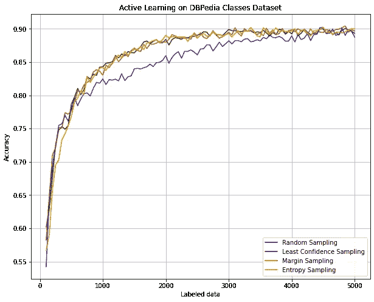

# 如何更有效地标注训练数据

> 原文：<https://towardsdatascience.com/how-much-time-can-you-save-with-active-learning-b4886f5da462?source=collection_archive---------53----------------------->

## 通过主动学习节省时间和精力

如果你曾经参加过任何从零开始的机器学习项目，你可能知道大量的时间通常花在对数据进行标记上。标记数据的数量和质量通常决定了项目的下一步以及最终结果。

选择标记哪些数据的传统方法是简单地选取一个你有标记能力的**随机样本**。

在这篇文章中，我想探索一种更有效的选择标记数据的方法，称为**主动学习**，基于这样一种想法，一些数据点可能比其他数据点给模型带来更多的信息价值。

照片由 [Unsplash](https://unsplash.com?utm_source=medium&utm_medium=referral) 上的 [NeONBRAND](https://unsplash.com/@neonbrand?utm_source=medium&utm_medium=referral) 拍摄

## 主动学习

> *主动学习的主要原则是*让模型选择哪些数据实例应该由人工注释者(通常称为 oracle)标记*，这样可以用更少的标记数据获得更好的性能。*

让模型做到这一点的最常见的场景被称为**基于池的采样**，其中有大量未标记的数据可用。从这个池中，模型使用某个**查询策略**绘制要标记的实例。在标记了查询的实例之后，用新添加的数据重新训练模型，并再次重复该过程。

可能最简单的查询策略，也是我在实验中使用的策略，是**不确定性采样**。该策略查询模型预测最不确定的实例。如果我们想象一个*二元分类问题*，这些将是后验概率最接近 0.5 的实例。

在*多类分类问题*中，有几种方法进行不确定性采样:

> ***最小置信度采样*** *选择最可能的标签具有最小置信度的实例(其概率离 1.0 最远)。*
> 
> ***边缘采样*** *选择最可能和第二可能标签之间差异最小的实例。*
> 
> ***熵采样*** *选择熵最高的实例(统计概率使用* [*此公式*](https://en.wikipedia.org/wiki/Entropy_(information_theory)) *)。*

## 实验

我决定做一个实验，比较所有的*三种多类方法*，以及基本的*随机抽样*。为此，我使用了 [DBPedia Classes 数据集](https://www.kaggle.com/danofer/dbpedia-classes)，这是一个多类文本分类的通用基准数据集。

从数据集中，我随机选择了 **5000 个实例**到我们的未标记数据池中。这些数据将被使用不同的策略进行查询，然后被标记为。标注本身并不需要实际执行，因为数据集已经包含了标签。因此，标签只是在需要时简单地分配给实例。

接下来，我创建了一个具有一个卷积层的简单模型，在输入中使用[手套词嵌入](https://nlp.stanford.edu/projects/glove/)。我需要这个模型非常轻量级，因为它会在每次查询后被反复重新训练。

用于每个查询策略的模型。

主动学习需要总是从已经标记的一小部分数据开始，因此在实际开始查询之前，模型至少要经过一点训练。这个小数据集被称为种子。我设置了 100 个实例的种子，这些实例是从我们的池中随机选择的，被标记并用于每个策略。

下一个参数是**批量大小**，它在主动学习的上下文中意味着*在模型重新训练之前，应该一次查询和标记多少个实例*。理想情况下，我们将使用批处理大小 1，这样模型在每个标记的实例后重新训练，从而最大化查询的有效性。这通常是不可能的，因为训练本身计算量很大，需要一定的时间。在这个实验中，我使用的批量为 50。

总的来说，我用这个批量做了 98 次迭代，它和 100 个实例的种子一起贯穿了我们已经建立的整个池。每一次迭代，模型的准确性都在一个单独的测试集上进行测量。每种策略的结果如下图所示:

准确度给定标记数据的数量，使用不同的查询策略。图片作者。

正如您所看到的，所有三种查询策略都以非常相似的方式执行，并且都比随机抽样要好。我们还可以看到，在大约 4500 个标记实例之后，所有的查询策略(包括随机抽样)都达到了相同的精度。这仅仅是因为我们即将到达*池的末端*，这里几乎所有的数据都被贴上标签，而不管策略如何。

现在让我们试着将结果转换成*现实生活场景*。如果我们项目的目标是达到例如 85%的准确度，那么可以通过使用随机抽样标记 1900 个实例，或者使用最小置信度抽样标记 1150 个实例来实现。这意味着**花费在标记数据上的时间**减少了 39.5%。

定义项目范围的另一种方式是，我们有能力标记例如 2000 个数据实例。通过这种方式，我们将使用随机抽样达到 85.96%的准确度，使用最小置信度抽样达到 88.4%，这意味着通过标记相同数量的数据，准确度**提高了 2.44%。**

## 结论

结果似乎很有希望，但是，我们必须意识到，它们可能因数据集而异。值得一提的是，主动学习可能会有一些缺点。

其中之一是在项目开始时为主动学习设置基础设施可能需要一些时间(尽管一些[框架](https://github.com/modAL-python/modAL)已经可用)，并且重新训练模型的过程可能*在计算上要求很高*。

另一个是你最终得到的带标签数据的分布*偏向于已经用于查询的模型*。如果您现在出于某种原因决定更改模型，那么数据将不再来自随机分布，这对您的新模型来说可能比实际情况更糟。

总的来说，我希望我给了你一个关于积极学习的好的概述，并且当你开始你的下一个项目时，你会考虑到它。

该实验的代码可在[这本 kaggle 笔记本](https://www.kaggle.com/sebastianpoliak/active-learning-on-dbpedia-classes)中找到。

受[启发主动学习文献调查](http://burrsettles.com/pub/settles.activelearning.pdf)。

感谢您的阅读！

 [## 通过观察偏差和方差来系统地调整你的模型

### 有没有想过是否有比盲目猜测超参数或…更系统的方法来调整您的模型

towardsdatascience.com](/systematically-tuning-your-model-by-looking-at-bias-and-variance-4986662315b2)  [## 零射击学习字母字符(代码实验)

### 是否有可能识别培训中未提供的字母字符？

towardsdatascience.com](/zero-shot-learning-the-alphabetic-characters-an-experiment-with-code-d1a0f23f4b4c)