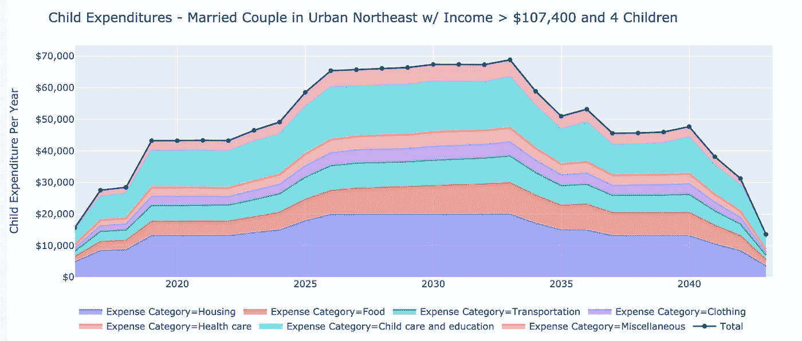
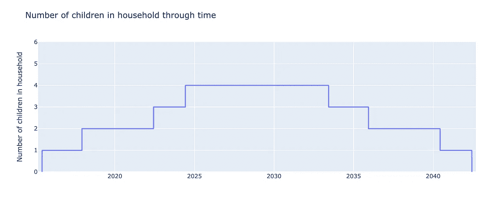
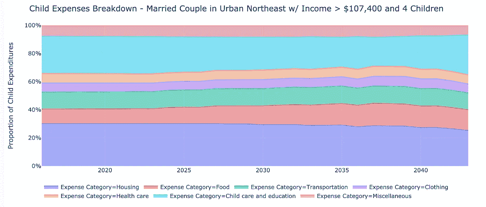
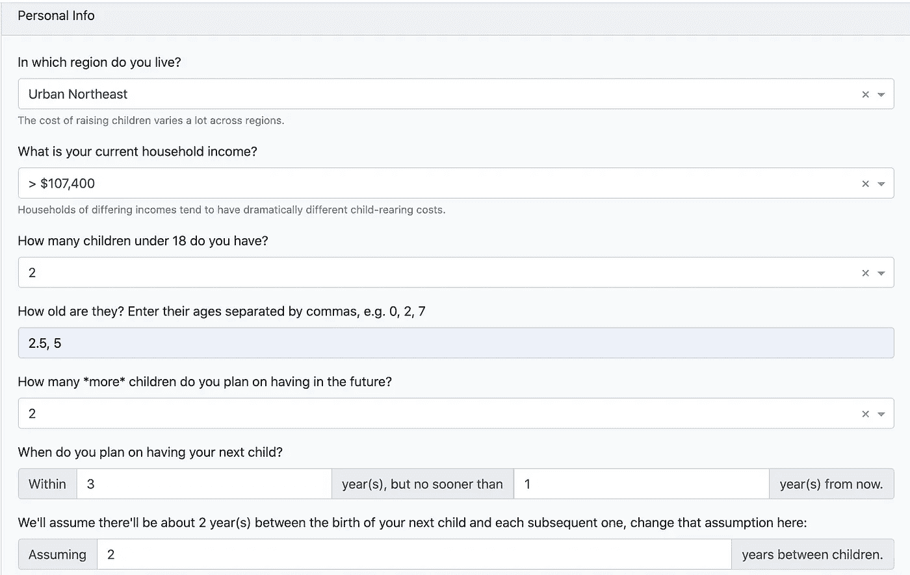
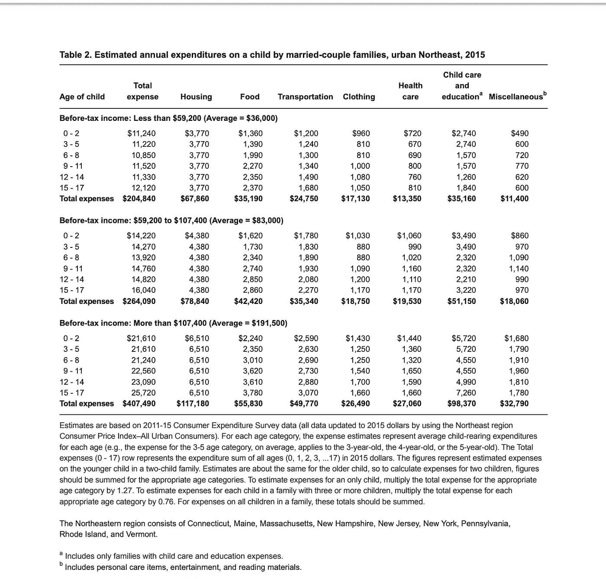
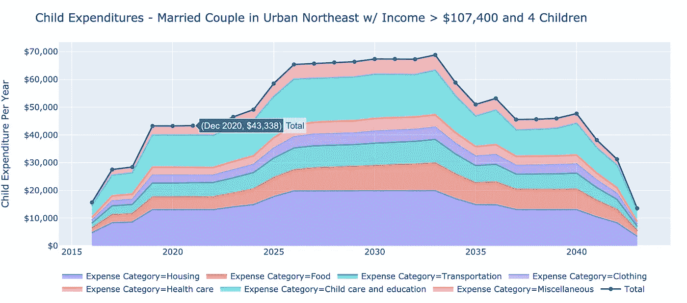
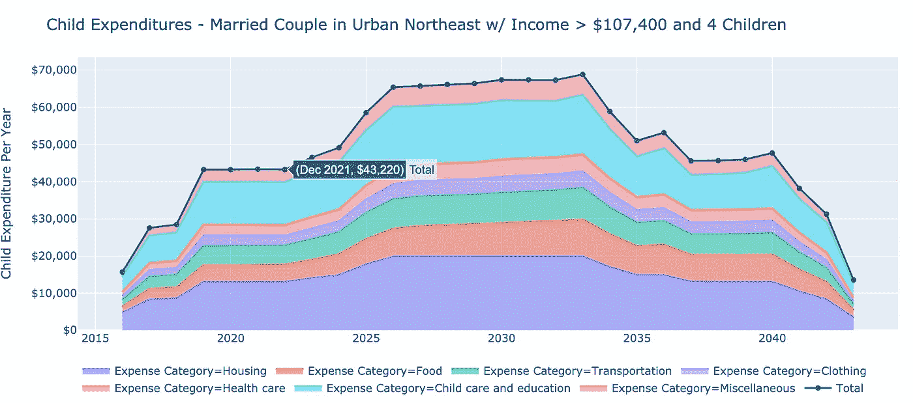

# 抚养孩子实际上会花费你多少钱？

> 原文：<https://towardsdatascience.com/how-much-would-raising-kids-actually-cost-you-299a589d004?source=collection_archive---------50----------------------->

## 建立一个交互式计算器来帮助计划生育

# ***概述***

在这篇文章中，我们将开发一个交互式计算器，它可以用来估算一个**家庭抚养孩子的年度总成本**，按费用类别(如食物、衣服等)细分。).

如果对方法论不太感兴趣，您可以立即在这里使用计算器。

这个计算器是基于利诺等人的美国农业部报告，题为“家庭在孩子身上的支出”，该报告估计了抚养一个孩子到 17 岁的增量成本。

它考虑到了:

*   你目前有几个孩子
*   你最终想要几个孩子
*   这些孩子的预期出生时间
*   你家在哪里
*   您家庭的收入水平

它**还没有**考虑大学费用**，尽管未来的帖子会尝试这样做。**

请注意，我已经将美国农业部报告中的原始数据表转录到一个谷歌表格中，可以在这里[访问](https://docs.google.com/spreadsheets/d/1pXaXiWU93WuAM93rrYMzewR_cWWGno0cJYPLakz_bYA/edit?usp=sharing)，如果这对任何人都有帮助的话。

# **背景&动机**

作为一个住在纽约的即将 30 岁的人，我的朋友群中关于“钱”的对话越来越频繁，越来越重要，并形成了相当有意义的人生决策。我差点因为密尔沃基失去了一个好朋友，因为他和他的妻子在考虑(在几个因素中)在密尔沃基和在纽约相比养育一个孩子的成本节约。朋友小组中的其他人已经开始倡导搬到波士顿、新泽西，甚至慕尼黑。

作为一个终生的纽约人和保持我们的朋友群体地理完整性的强烈倡导者，我希望利用我作为应用统计建模师和数据科学家的专业技能来弄清楚一旦我们有了家庭，我和我的朋友们是否(以及如何)能够负担得起继续在纽约生活。

我想有一个**游戏计划**。

这是相当广泛的(但值得！)事业。它包括建立预测生命周期收入和支出轨迹的模型，个人债务和投资的演变，以及将个人财务状况的这些不同但相互关联的方面整合在一起的整体框架。(后续帖子即将发布！)

在这篇就职文章中，我想从分解一个至关重要的、改变生活的、重新安排优先次序的生活事件开始:生孩子。

# 最终产品

最终，我们会得到三个交互式图表:

1.  随着时间的推移，您家中的孩子数量

2.一段时间内您与孩子相关的总支出

3.按类别分列的与儿童有关的支出细目(如食品、住房、教育等。)

# 方法学

在一个高层次上，这种方法是基于 Lino 等人的美国农业部报告“家庭在孩子身上的支出”这似乎是该主题的权威来源(参见*关于数据来源的注释*部分)。

对于我们的计算器，我们将:

1.  收集用户输入
2.  计算给定时间点家庭中孩子的数量
3.  使用美国农业部的估算，计算每个孩子的花费
4.  在每个孩子的基础上说明有多个孩子节省的费用，如旧衣服、大宗购买食品/家庭用品、共用卧室等。

## 收集用户输入

我们希望我们的估计考虑到:

*   *我们住在哪里*——生活成本以及生孩子的成本会因居住地不同而有很大差异——例如，在波斯顿抚养孩子与在印第安纳州的农村抚养孩子会有很大不同
*   我们家庭的收入等级不出所料，美国农业部发现，收入较高的人能够负担得起并确实在育儿活动上花费更多
*   *我们目前有几个孩子*
*   *我们期望未来有多少孩子*
*   *那些孩子的时机*

举个例子，让我们以一个具有以下特征的已婚夫妇家庭为例:

1.  位于纽约市
2.  年收入 12 万美元
3.  有两个孩子，一个两岁半，一个五岁
4.  打算多生两个孩子
5.  期待他们的下一个孩子(他们的第三个)在未来 3 年内出生，但不会早于一年
6.  期待在那之后再等一两年，生下他们的第四个也是最后一个孩子

他们会输入以下内容:

请注意，地区和家庭收入类别直接取自美国农业部的报告。据我所知，没有更详细的数据，例如城市或收入十分位数级别的数据。

## 计算家庭中的孩子

根据上面的输入，我们可以计算出这些年来家庭成员中 18 岁以下儿童的数量:

我们假设一个家庭的下一个孩子正好在“X 年内，但不会早于 Y 年”问题中输入的 X 和 Y 数字之间。

## 每个孩子的费用

美国农业部为有两个孩子的家庭中的一个独生子女提供了按孩子年龄和费用类别分列的支出估算。

例如，以下是它对东北部城市已婚夫妇家庭的估计:

参见 Lino 等人的《2015 年家庭在儿童身上的支出》第 25 页，在此处找到。我还将报告中的表 1-7 转录到了谷歌表单中，可以在这里[访问](https://docs.google.com/spreadsheets/d/1pXaXiWU93WuAM93rrYMzewR_cWWGno0cJYPLakz_bYA/edit?usp=sharing)。

我们可以这样理解，对于一对年收入超过 107，400 美元的夫妇，他们有两个分别为 2 岁半和 5 岁的孩子，他们在 2020 年与孩子相关的总支出预计为:

1.  两岁半的孩子要 21610 美元
2.  +5 岁儿童 21，610 美元(尽管两个孩子属于不同的年龄组，但他们的总费用相同，这纯粹是巧合)
3.  **=两个孩子每年总共 43220 美元**

我们可以验证这确实与我们的计算器显示的一致(注意，2020 年是闰年，所以我们比 43，338 美元高一点，但 2019 年和 2021 年都正好是 43，220 美元):

2020 年是闰年！

2021 年有合适的，43220 美元的数字

## 针对多个孩子进行调整

美国农业部的估计是针对两个孩子的家庭，所以我们将根据报告中提供的指导调整到一个孩子或三个以上孩子的家庭(见表 1-7 的注释):

> 要估算一个独生子女的费用，将相应年龄类别的总费用乘以 1.27。要估算一个有三个或三个以上孩子的家庭中每个孩子的费用，将每个适当年龄类别的总费用乘以 0.76。对于一个家庭中所有孩子的花费，这些总数应该相加。

我们根据“计算家庭中的孩子”这一步的输出结果，将它合并到我们的计算器中。

# 你自己试试！

自己试试计算器，让我知道你对潜在改进的想法。

 [## 抚养孩子的成本计算器

### 根据你要生几个孩子、你住在哪里以及你的家庭收入来估算抚养孩子的成本。根据美国农业部的“家庭儿童支出”报告。](https://gameplan-app-21.herokuapp.com/apps/child-expenditures) 

# 关于数据源的说明

如前所述，该方法基于[这份美国农业部报告](https://fns-prod.azureedge.net/sites/default/files/crc2015_March2017.pdf):

> Lino、k . Kuczynski、n . Rodriguez 和 t . Schap(2017 年)。2015 年按家庭分列的儿童支出。杂项出版物编号 1528–2015。美国农业部营养政策和促进中心。

作者使用了 2011-15 年消费者支出调查访谈(CE)的数据，他们声称这是“全国范围内最全面的家庭支出信息来源”。

> 该样本由 23，297 个已婚夫妇家庭和 7，030 个单亲家庭组成，并通过使用 BLS 加权方法进行加权，以反映感兴趣的美国人口。

这似乎是该话题的权威来源。它被谷歌上所有关于“抚养孩子的成本”的热门搜索所引用，例如:

*   Investopedia 关于抚养孩子成本的文章，[此处](https://www.investopedia.com/articles/personal-finance/090415/cost-raising-child-america.asp)
*   专注于金融咨询民主化的金融科技公司 SmartAsset 有一篇文章[在这里](https://smartasset.com/retirement/the-average-cost-of-raising-a-child)
*   给我带来最大安慰的是[莱曼·斯通](https://medium.com/u/109e4ac77b09?source=post_page-----299a589d004--------------------------------)，他是一个无可挑剔的推特粉丝，在人口统计学方面(以及其他方面)非常有价值，在 2019 年有一长串引用它的帖子。

# 感谢您的阅读，并随时联系我们！