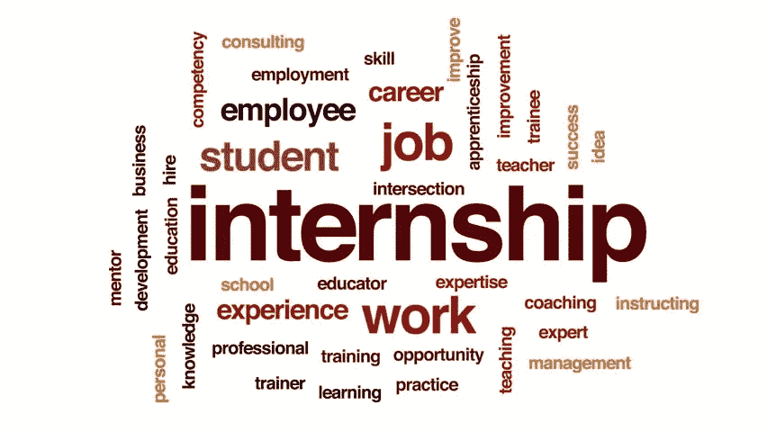

# 这就是我第一次基于计算机视觉的实习的情况！

> 原文：<https://towardsdatascience.com/how-my-first-internship-was-all-like-364187922d44?source=collection_archive---------48----------------------->

## “永远不要以为你什么都知道。请教和寻求帮助，大多数人都会拜倒在自己的石榴裙下，分享自己的技能。”托尼·克拉克

来源: [shutterstock](https://www.shutterstock.com/video/clip-26049182-internship-animated-word-cloud-text-design-animation)

毫无疑问，获得你的第一份实习，并开始在一些很酷的行业驱动的项目中工作，是每个毕业生都想参与的最激动人心的冒险。为你的工作获得报酬增加了更多的刺激。让我告诉你，我最近一直是这个旅程的一部分，在这篇文章中，我将讨论我的发现和工作。

我在印度本加卢鲁的一家快速发展的初创公司实习。我在那里做了一个半月的深度学习和计算机视觉实习生。

## 目录:

1.  **招聘人员是如何找到我的？**
2.  **电话面试和招聘流程。**
3.  **分配的项目。**
4.  **我学到了什么。**
5.  **欣赏**
6.  **结论。**

## 我是如何被接近的？

因此，我在计算机科学的 B.Tech 项目的第二年，为我的学期考试而学习。让我先告诉你，我有点痴迷于我的 LinkedIn 个人资料，我一天在那里徘徊 5 次。晚上，我打开手机，看到一条与 LinkedIn 相关的通知，看到这家初创公司的招聘人员向我寻求他的初创公司的带薪实习生职位，因为他对我的 [LinkedIn 简介](https://www.linkedin.com/in/shobhit-srivastava-451459163/)印象深刻。这个领域是深度学习和计算机视觉。当我在现场工作了一段时间后，我变得很兴奋，在短暂的聊天中，他问我我的 G [ithub](https://github.com/shobhitsrivastava-ds) 个人资料链接和简历，并在规定的时间安排了一个电话。

来源: [Shutterstock](https://image.shutterstock.com/z/stock-photo-portrait-of-serious-male-economist-dressed-in-corporate-clothes-talking-on-mobile-phone-while-328290353.jpg)

## **电话面试和选拔流程**

所以我对他进行了电话采访，他问了我一些与深度学习和计算机视觉相关的话题，以及我过去从事的项目和一些技术问题。最后，他要求我为评估过程建立一个基于暴力检测的深度学习模型，该模型将能够检测暴力武器，如枪、步枪、刀、火等。，我一点也不知道主要项目(我将要工作)是基于相同的主题。

所以，我花了一两天的时间准备模型，为此我不得不从 google Images 上刮下相关图片，准备用于模型训练。我收集了大约 3000 张枪、刀和所有东西的照片，并把它们存放在单独的文件夹里。由于我的笔记本电脑没有所需的计算能力，所以我不得不在私人回购中上传 Kaggle 上的图像，并在那里进行所有的训练过程。我和他分享了链接，他对我的工作印象深刻，最后我收到了录取通知书。

来源: [Shutterstock](https://image.shutterstock.com/image-photo/finance-manager-meeting-discussing-company-600w-1262281936.jpg)

## 分配的项目

选拔过程结束后，我与招聘人员和其他实习生进行了小组通话，我应该与他们一起在一个团队中工作。所以我们就整个项目将如何进行进行了简短的讨论。

我们被指派设计和开发一个基于深度学习的端到端武器检测模型，该模型将检测暴力武器，如枪支、步枪、刀、火、烟。除此之外，我还被分配了一个独立的项目，研究基于遮挡的人脸检测模型。如果你不知道它是关于什么的，基本上它是关于*开发一个面部检测模型，它将能够检测任何人的面部，即使它在摄像机中是部分可见的。*由于我很难在孟加拉国旅行，所以我请求远程工作，他接受了。旅程就这样开始了。

*Andrew Krasovitckii/shutterstock . com*

## 项目开发进展如何，我学到了什么？

我不会进入这个项目的技术细节，而是给一个简单的概述。之前没用过 OpenCV 和图片抓取软件，所以要学。让我告诉你，开始一周是非常令人兴奋的，因为我学到了很多关于使用 python 编写代码来解决现实世界问题的东西，比如我编写了代码来一次性重命名 10，000 张图像，为此，有一次我想到手动重命名所有这些图像(尽管这会花费很多时间)。

因此，在建模过程中，我们采用 YOLOv3 算法进行目标检测。本地 PC 上的训练模型非常耗时，所以我们不得不在 google cloud 上进行，花费了我们大约 700 美元。我们根据我们的要求调整了算法的一些层，比如锚盒的数量等，经过一周的准备和 2-3 天的训练，我们的模型准备好了。除此之外，在视频和实时镜头上部署模型是最困难的部分，因为为了快速处理，我们必须删除一些模型层，使其快速工作。我将向您展示一个视频剪辑，通过它您将了解它的应用。

来源:[洛克森科技](https://www.youtube.com/watch?v=mvcdYRadi9k)

与此同时，我不得不开发基于遮挡的人脸检测模型(由于保密问题，不能透露技术细节)。这就是我整个实习项目的发展过程。

远程参与项目有时会让你感到沮丧，但最终唯一重要的是你开发的产品。在实习期间，我提高了我的沟通技巧，因为我必须主持与我的日常项目目标相关的日常虚拟会议，同时通过与相关产品经理交流我的进展，并与我的团队成员接触，让我感受到在现实世界的项目中在企业世界工作的感觉。

## 赞赏。

我们的工作得到了产品经理的高度赞扬，后来当我们了解到该公司为该产品申请了美国专利时，我为我们的成就做出了很大贡献。

## 结论。

最后，我想陈述一些我在旅途中经历和学到的东西。

1.  永远不要拒绝在团队中工作的提议。
2.  你的工作是有报酬的，所以不要在工作时间之外做额外的工作。
3.  没有什么能代替努力。
4.  维护并更新您的简历、LinkedIn 个人资料和 Github 个人资料。
5.  热爱你所做的事情，它能减轻你的工作压力。
6.  寻找比你更好的人，解决同样的问题，了解你和其他人思维模式的不同。

请继续关注更多类似文章。

如果这篇文章对你有所帮助。请在这里支持我[https://www.buymeacoffee.com/shobhitsri](https://www.buymeacoffee.com/shobhitsri)

谢谢你。