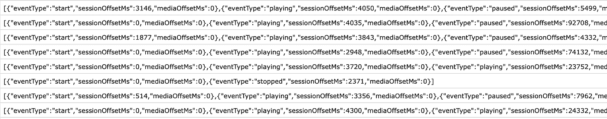

# 网飞是如何让我看《艾斯·文图拉》——第四遍？

> 原文：<https://towardsdatascience.com/how-netflix-got-me-to-watch-ace-ventura-the-4th-time-c15121bd971a?source=collection_archive---------59----------------------->

## 流媒体应用如何跟踪你的每次点击，并推荐内容。它告诉了你什么，以及你如何用它来预测你的未来。

“无聊”，我在翻阅我的网飞数据的电子表格时对自己说。然后我发现了一个名为“点击流”的文件，网飞记录了我的每一次点击。

丹尼斯·詹斯在 [Unsplash](https://unsplash.com/photos/ScQXxiIZ0Qo)

你是怎么喜欢上那个看了四季 40 多集的情景喜剧的？那部关于海洋生物的纪录片怎么样？这是你的选择，还是一个被智能引擎的建议和布局严重辅助的选择？

您可以下载您的网飞数据，方法是登录网飞后，进入右上角菜单中的“帐户”，导航至“下载您的个人信息”伟大的新闻是它的突出，容易找到。坏消息呢？嗯，我在 5 月 17 日提出请求后，于 6 月 14 日得到了我的数据(见下文)。

虽然这完全符合当前的数据请求法规，但对于数据爱好者来说，等待文件存档来玩是一段很长的时间。

网飞报告数据档案包含几个常见的文件夹和结构，如您的帐户设置、您使用过的设备、支付模式、客户信息历史和附加信息表。为了了解档案，我们不得不称赞网飞，它实际上非常全面，整理得很好。

网飞收集的数据类别

在这套附加信息说明中，有两个有趣的部分，他们解释得比我好得多。因此，关于网飞数据档案，请参见“点击流”和“内容互动”的说明。点击流指的是你在网飞的每一次点击，而“内容互动”指的是你如何在网飞的各种设备上与内容互动的一组表格。

网飞有一个复杂的推荐引擎来找到你喜欢的节目。他们的魔力当然对一个纯粹的观众来说是隐藏的，但是，你可以从你自己的角度来审视它，看看你自己是如何在内容、偏好、剖析和最终导致行动的建议的海洋中游泳的。

*   有时你会因为网飞决定自动播放下一个内容而结束播放？这种情况有什么规律吗？
*   有时候你只看了几集，并没有上瘾，这在不同的类型中都适用吗？
*   这种行为是一贯的吗？这取决于你睡得怎么样，你走了多少步吗？
*   你是否有不同的“观众角色”，根据你每天或每周的模式偏好不同的内容？
*   你的受暗示性和你的哥们相似吗，怎么比较？

来自网飞档案馆的数据集有你在网飞生活的数字副本，其他流媒体服务也有类似的流。除了性格测试和你可能对应的猫的类型之外，你可以很容易地想象这种类型的数据集的其他用途，例如建议领域之外的内容(例如，基于音轨的音乐)。

流行为等数据的可用性是前所未有的，令人着迷。这种数据的可移植性是一个分水岭，为新的应用打开了市场。和一群不同背景不同行为的朋友看什么电影好？那么，我们为什么不建立一个应用程序来结合数据集并找到共同点，以建议我们可能会一起欣赏的电影？反过来，基于我们共同和不同的流媒体历史，我可能会和什么人有很多讨论呢？

你是怎么看完《艾斯·文图拉》的？你想知道吗？

PS。基于对基于这些数据的应用程序的一些建议，我想添加一个链接到 [Prifina](http://www.prifina.com) public Slack 的 post 脚本，在那里我们有一个电影推荐应用程序预览(MovieMater)，它基于组合的流媒体数据(想想网飞，亚马逊视频，Hulu，YouTube)生成推荐。加入讨论，[点击这里查看应用](https://join.slack.com/t/libertyequalitydata/shared_invite/zt-ddr4t974-MCzsch4FSeux8DrFQ2atbQ)。