# 神经网络如何描绘山脉和山谷——3D 远足

> 原文：<https://towardsdatascience.com/how-neural-networks-paint-mountains-and-valleys-3d-hike-69995663b72?source=collection_archive---------47----------------------->

如果你像我一样，你会遇到数百个神经网络输出的可视化，并觉得有些事情不合理。那是因为少了点什么。 ***准确地说是一个维度。***

> 如果你直接来到这里，请看看第一个关于神经元的**真实输出的故事。一旦你抓住了一个，就只是把两个和两个放在一起——无论是比喻还是字面意思！**

 [## 2D 人工神经网络中的神经元如何在三维可视化中弯曲空间

### 这是为那些想直观了解人工神经网络中神经元内部工作的人准备的。你只需要一个…

towardsdatascience.com](/how-a-neuron-in-a-2d-artificial-neural-network-bends-space-in-3d-visualization-d234e8a8374e) 

> 好吧，假设我们肩负着一项“拯救世界”的任务，那就是找到一种方法来找出导致新冠肺炎的冠状病毒链中的一种病毒。当政治和秘密继续的时候，你把你的手放在在黑暗网络上泄露的最终数据库上。

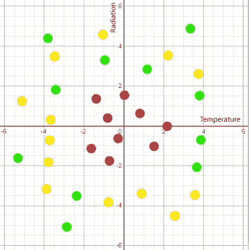

病毒耐热和耐辐射矩阵

分别是 X 轴和 Y 轴上的 ***耐热耐辐射矩阵*** 。令人讨厌的导致疫情病毒的种群是红色的，而其他“相对无害”的是其他看起来无害的绿色和黄色。

> 让我们一步一步地解决这个问题，或者说一步一步地解决。

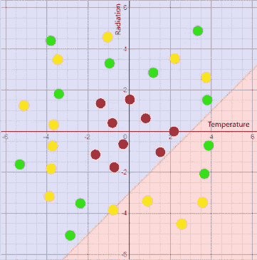

只有一条线的边界，又名 2D 神经元

红线给了我们 ***第一个边界*** ，我们可以自豪地报告，致命的冠状病毒只能 ***在线的左侧*** (蓝色阴影区域)。右边的任何东西(红色阴影区域)只是一个普通的旧病毒。

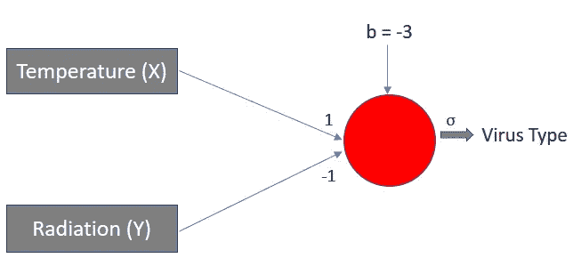

单神经元神经网络

从我们的[第一个故事](/how-a-neuron-in-a-2d-artificial-neural-network-bends-space-in-3d-visualization-d234e8a8374e)中我们已经知道，在平面上使用线 的 ***分类只不过是一个具有两个输入*** 的 ***神经元的表示。这还不能解决整个问题，但绝对是一个好的开始！***

> 这条红线的方程式是“x-y-3=0”，但再次从我们这个系列的第一个故事[中，我们知道得更清楚——一条线只不过是 2 个平面的交点。](/how-a-neuron-in-a-2d-artificial-neural-network-bends-space-in-3d-visualization-d234e8a8374e)

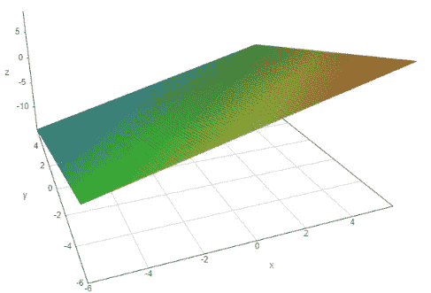

没有激活的“x-y-3”神经元的 3D 输出

神经元输出的*不是一条线，实际上 ***是一个平面****与红线*** 上的** 温度-辐射平面 ***相交。下面是神经元及其输出 ***没有*** 任何激活的样子。****

> *现在，让我们在这个输出之上应用一个简单的 sigmoid 激活，事情开始变得非常有趣。*

*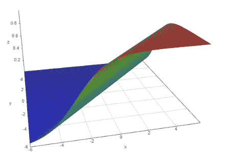*

*具有乙状结肠激活的“x-y-3”神经元的 3D 输出*

*在 ***中的*** [非线性输出](/why-a-neural-network-without-non-linearity-is-just-a-glorified-line-3d-visualization-aff85da10b6a)景观:*

*蓝色 ***谷*** 是冠状病毒**可能**驻留的地方。绿色的 ***斜坡*** 是我们逐渐从日冕之地爬向平原老病毒之地的地方。红色的 ***山*** 是只有普通病毒呆的地方。*

*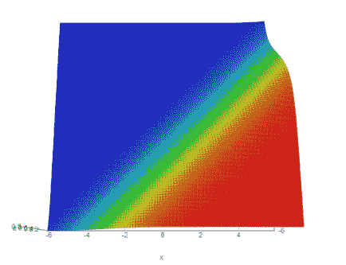*

*具有乙状窦激活的“x-y-3”神经元的 3D 输出的“俯视图”*

*如果您查看此输出的 ***顶视图*** ，它会折叠回 2D，看起来非常类似于我们之前看到的带有网格线的图表。*如果你只能从这个故事中学到一件事，那应该是这样一个事实，即使你在 2D 看一个神经元输出，* ***颜色实际上代表了神经元在 3D 中输出的强度。****

> *如果你已经遵循了这一点，我们准备深入兔子洞。让我们**添加 3 个新的神经元**到问题中，看看我们能得出什么。所以坏的冠状病毒正在…*

*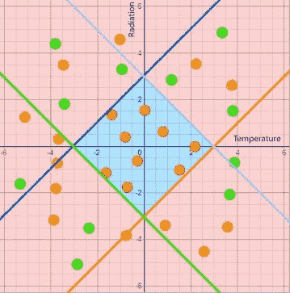*

*具有 4 个神经元的边界*

1.  ******红色*** 直线 x-y-3=0***
2.  *****右*******蓝*** 线-x+y-3=0***
3.  *******紫色****x+y-3 = 0 线*****
4.  ******右*****绿色****x+y+3 = 0*******

****免责声明:绿线与任何中东争端无关****

**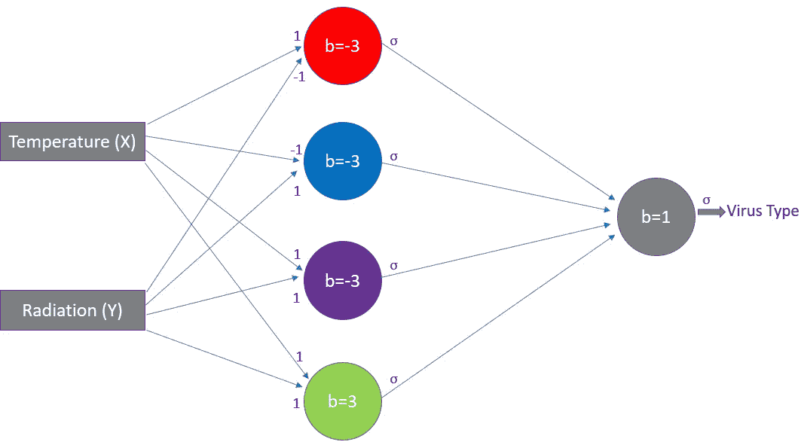**

**具有 4 个具有 sigmoid 激活的神经元的神经网络**

**只需从彩色线条 中使用 ***参数画一些圆圈和箭头，就可以将简单的线图转化为看起来复杂的神经网络！*我们已经在我们的* [*第一个故事*](/how-a-neuron-in-a-2d-artificial-neural-network-bends-space-in-3d-visualization-d234e8a8374e) *中做到了这一点。******

> *4 个神经元的输出合在一起是一种享受。sigmoid 函数的[非线性特性确保所有 4 个独立输出能够为最终组合输出带来各自的**独特贡献**。](/why-a-neural-network-without-non-linearity-is-just-a-glorified-line-3d-visualization-aff85da10b6a)*

*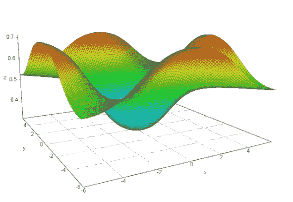*

*具有乙状结肠激活的 4 个神经元的 3D 输出*

> *颜色组合仍然有效，但现在更好地定义了边界。蓝色山谷是冠状病毒的聚居地。**绿色**斜坡是我们逐渐从日冕之地爬向朴素的病毒之地的地方。红色的山是普通病毒停留的地方。*

> *最后，从这个奇妙的景观的顶部看去。*

*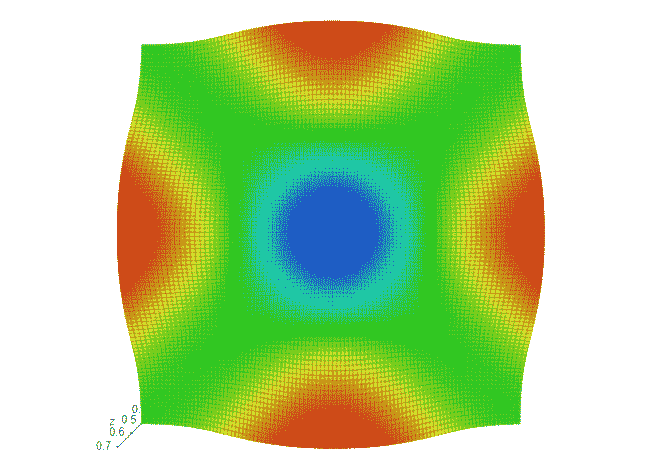*

*具有乙状结肠激活的 4 个神经元的 3D 输出的“俯视图”*

*如前所述， ***颜色代表景观*** 的高度，进而代表神经网络输出 的 ***强度。****

**一首缺乏想象力的诗会读作* ***“红色高，蓝色低，绿色在爬得慢的地方”****

*这里是 2D 视图和三维俯视图的并排比较。这种人工神经网络输出决不是最佳的，但它应该有助于你在任何时候查看神经网络 ***分类输出*** 时，对实际发生的事情*有一种直觉。**

**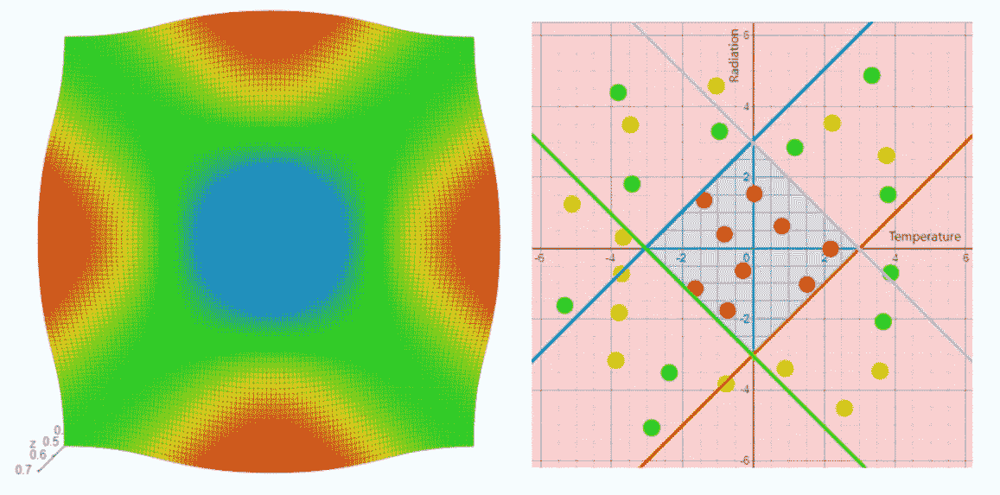**

**2D 视图与 3D 俯视图的并排比较**

> **正如你所想象的，具有 3 个输入维度的神经网络输出的“俯视图”将由一个位于中心的**蓝色球体**来表示，然后随着你向外移动而变成绿色到红色。**

**我将留给你最终的图像，它使用了一个 ***步骤*** 激活，而不是一个 s 形。果然，风景消失了，我们只剩下 ***悬崖*** *！*不奇怪，3D *俯视图*与 2D 视图没有什么不同，因为阶跃函数从地板直接跳到天花板。**

****

**具有二元阶跃激活的 4 个神经元的 3D 侧视图和俯视图输出**

*****额外阅读:*** 如果你想了解更多关于神奇的 ***非线性*** 给神经网络带来的创造这些惊人形状的知识，这个正在进行的系列中的 4 分钟阅读将是一个 ***良好的开端*** 。**

** [## 为什么没有非线性的神经网络只是一条美化了的线——3D 可视化

### 在本系列的第一部分，我们创建了一个简单的单神经元神经网络的可视化，以告诉苹果…

towardsdatascience.com](/why-a-neural-network-without-non-linearity-is-just-a-glorified-line-3d-visualization-aff85da10b6a)**