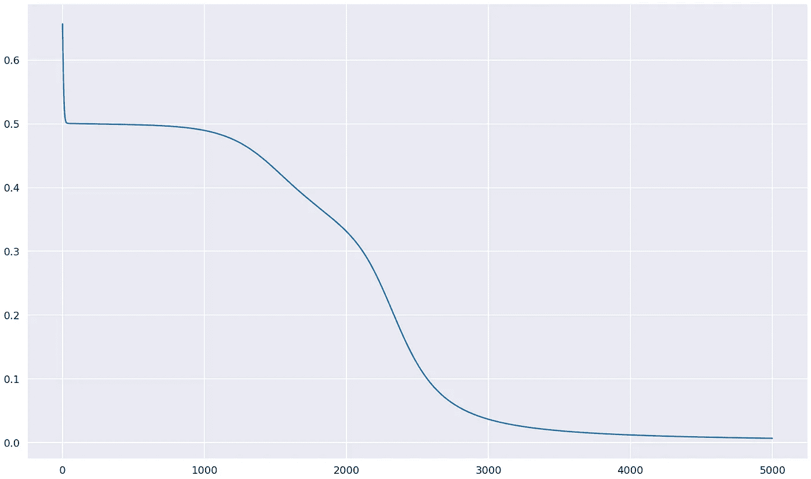

# 神经网络如何解决异或问题

> 原文：<https://towardsdatascience.com/how-neural-networks-solve-the-xor-problem-59763136bdd7?source=collection_archive---------0----------------------->

## 以及为什么隐藏层如此重要


作者图片

**感知器**是一种分类算法。具体来说，它是一个线性二元分类器。它是由弗兰克·罗森布拉特在 20 世纪 50 年代末发明的。

感知器基本上是作为一个阈值函数工作的——非负输出被放入一个类，而负输出被放入另一个类。

虽然有很多关于神经网络及其变体的讨论，但我们将讨论一个突出单层感知器和多层感知器之间主要差异的具体问题。

# 目录

```
**The Perceptron**
   Structure and Properties
   Evalutation
   Training algorithm**2d Xor problem  
**   The XOR function**Attempt #1: The Single Layer Perceptron** Implementing the Perceptron algorithm
   Results
   The need for non-linearity**Attempt #2: Multiple Decision Boundaries
**   Intuition
   Implementing the OR and NAND parts**The Multi-layered Perceptron
**   Structure and Properties
   Training algorithm**Attempt #3: The Multi-layered Perceptron
**   Implementing the MLP
   Results
```

# **组织和性能**

感知器有以下组件:

*   输入节点
*   输出节点
*   激活功能
*   权重和偏差
*   误差函数


具有 2 个输入节点的单层感知器的表示——作者使用 [draw.io](https://app.diagrams.net/) 绘制的图像

## 输入节点

这些节点包含网络的输入。在任何迭代中——无论是测试还是训练——这些节点都被传递来自我们数据的输入。

## **权重和偏差**

当我们谈论“训练”一个模型时，这些参数是我们更新的。它们被初始化为某个随机值或设置为 0，并随着训练的进行而更新。偏差类似于独立于任何输入节点的权重。基本上，它使模型更加灵活，因为你可以“移动”激活函数。

## 估价

输出计算很简单。

*   计算输入和权重向量的点积
*   加上偏见
*   应用激活功能。

这可以这样表达:


这通常被简化为权重和输入向量加上偏差的点积。


## 激活功能

该函数允许我们以更有意义的方式拟合输出。例如，在简单分类器的情况下，比如说`-2.5`或`8`的输出对于分类没有多大意义。如果我们使用称为 sigmoidal 激活函数的东西，我们可以在 0 到 1 的范围内拟合它，这可以直接解释为属于特定类的数据点的概率。

尽管有很多种激活函数，我们将为我们的感知器使用一个简单的线性激活函数。线性激活函数对其输入没有影响，并按原样输出。

## 分类

感知器如何给一个数据点分配一个类？

我们知道一个数据点的评估由关系式`wX + b`表示。我们定义一个阈值( **θ** )来对我们的数据进行分类。通常，对于感知器，该阈值被设置为 0。

因此，`wX + b`大于或等于 0 的点将属于一个类别，而其余的点(`wX + b`为负)被分类为属于另一个类别。我们可以这样表达:


## 训练算法

为了训练我们的感知机，我们必须确保我们正确地对所有的训练数据进行分类。请注意，这与您训练神经网络的方式不同，在神经网络中，您不会尝试正确分类您的整个训练数据。在大多数情况下，这将导致所谓的过度拟合。

我们通过计算**梯度**或δw 来开始训练算法。它是下式的乘积:

*   对应于该权重的输入节点的值
*   实际值和计算值之间的差异。


我们通过简单地用计算出的梯度乘以学习率来增加我们的原始权重，从而得到我们的新权重。


这是如何工作的一个简单的直觉:如果我们的感知器正确地分类了一个输入数据点，`actual_value — computed_value`将是`0`，并且我们的权重不会有任何变化，因为梯度现在是`0`。

# 2D 异或问题

在异或问题中，我们试图训练一个模型来模仿 2D 异或函数。

## 异或函数

该函数定义如下:


XOR 真值表—作者图片

如果我们画出来，我们会得到下面的图表。这就是我们想要分类的。您在图例中看到的⊕(“o-plus”)符号通常用于表示 XOR 布尔运算符。


XOR 输出图—作者使用 [draw.io](https://app.diagrams.net/) 绘制的图像

我们的算法——不管它是如何工作的——必须正确地输出 4 个点中每一个点的 XOR 值。我们将把这建模为一个分类问题，因此`Class 1`将表示 XOR 值 1，而`Class 0`将表示值 0。

# 尝试 1:单层感知器

让我们用单层感知器来模拟这个问题。

## **输入数据**

我们将在其上训练模型的数据是我们看到的 XOR 函数的表。

```
**Data         Target
[0, 0]         0
[0, 1]         1
[1, 0]         1
[1, 1]         0**
```

## 履行

**进口**

除了通常的可视化(`matplotlib`和`seaborn`)和数字库(`numpy`)，我们将使用`itertools`中的`cycle`。这是因为我们的算法无限地循环通过我们的数据，直到它成功地正确分类整个训练数据，而中间没有任何错误。

**数据**

接下来，我们创建训练数据。这些数据对于每种逻辑门都是一样的，因为它们都接受两个布尔变量作为输入。

**培训功能**

这里，我们无限地循环数据，跟踪我们正确分类了多少连续的数据点。如果我们设法在一段时间内对所有东西进行分类，我们就终止了我们的算法。

如果没有，我们重置我们的计数器，更新我们的权重并继续算法。

为了可视化我们的模型是如何执行的，我们创建了一个数据点的网格，或者说一个网格，并在网格中的每个点上评估我们的模型。最后，我们根据模型的分类给每个点着色。因此,`Class 0`区域将被分配给属于该类的点的颜色填充。

**感知器类**

为了把所有的东西放在一起，我们用我们刚刚讨论过的函数创建了一个简单的`Perceptron`类。我们有一些实例变量，如训练数据、目标、输入节点数和学习率。

## 结果

让我们创建一个感知器对象，并在 XOR 数据上训练它。

你会注意到训练循环永远不会终止，因为感知器只能收敛于线性可分的数据。线性可分离数据基本上意味着您可以用 1D 的一个点、2D 的一条线、3D 的一个平面等来分离数据。

> 感知器只能收敛于可线性分离的数据。因此，它不能模仿异或函数。

请记住，感知器必须一次性正确地对整个训练数据进行分类。如果我们连续记录有多少点被正确分类，我们会得到这样的结果。


超过 100 个训练周期的 correct_counter 的值-作者提供的图像

该算法仅在`correct_counter`达到 4 时终止——这是训练集的大小——因此这将无限期地继续下去。

## 对非线性的需求

很明显，单个感知器不能满足我们的目的:类不是线性可分的。这归结为一个事实，即单一的线性决策边界是行不通的。

非线性允许更复杂的决策边界。我们的 XOR 数据的一个潜在决策边界可能是这样的。


我们的 XOR 模型的潜在非线性决策边界—作者使用 [draw.io](https://app.diagrams.net/) 绘制的图像

# 2d XOR 问题—尝试 2

我们知道模拟 XOR 函数需要非线性的判定边界。

> 但是为什么我们必须坚持单一的决策边界呢？

## 直觉

让我们首先将 XOR 函数分解成它的 AND 和 OR 对应物。

两个布尔变量 A 和 B 上的 XOR 函数被定义为:


让我们将`A.~A`和`B.~B`加到等式中。因为它们都等于 0，所以等式仍然有效。


让我们重新安排术语，这样我们可以从第一部分中抽出`A`，从第二部分中抽出`B`。


进一步简化，我们得到:


使用布尔代数的德摩根定律:`~A + ~B = ~(AB)`，我们可以这样替换上式中的第二项:


让我们分别用 x1 和 x2 代替 A 和 B，因为这是我们在数据中使用的约定。


XOR 函数可以浓缩为两部分:**一个 NAND 和一个 OR** 。如果我们可以分别计算这些，我们可以使用**AND 门合并结果。**

让我们把公式的 OR 部分称为第一部分，把 NAND 部分称为第二部分。

## **建模 OR 零件**

我们将像以前一样使用相同的感知器类，只是我们将在训练数据上训练它。


OR 真值表—作者使用 [draw.io](https://app.diagrams.net/) 绘制的图像

这是收敛的，因为 or 函数的数据是线性可分的。如果我们像第一次尝试那样绘制正确分类的连续数据点的数量，我们会得到这个图。很明显，在迭代 50 次左右，它达到了值 4，这意味着它对整个数据集进行了正确的分类。

> correct_counter 测量被我们的感知器正确分类的连续数据点的数量


我们或感知器的正确计数图——作者图片

决策边界图如下所示:


我们的或感知器的输出图—作者的图像

## 模拟 NAND 部分

让我们进入第二部分。我们需要模拟一个与非门。就像 OR 部分一样，我们将使用相同的代码，但在 NAND 数据上训练模型。所以我们的输入数据应该是:


NAND 真值表—作者使用 [draw.io](https://app.diagrams.net/) 制作的图片

经过训练后，下面的图表明，我们的模型收敛于 NAND 数据，并完美地模拟了 NAND 门。


NAND 感知器的决策边界和正确计数器图—作者图片

## 将所有东西整合在一起

从中可以清楚地看出两件事:

*   我们对两个逻辑门的输出执行逻辑“与”(其中第一个是“或”,第二个是“与非”)
*   并且两个函数被传递相同的输入(x1 和 x2)。

让我们将这个模型应用到我们的网络中。首先，让我们把我们的两个感知机看作是黑盒。


我们模型的平面图——作者使用 [draw.io](https://app.diagrams.net/) 绘制的图像

在添加了我们的输入节点 x_1 和 x_2 之后，我们最终可以通过一个简单的函数来实现这一点。


添加输入节点—作者使用 [draw.io](https://app.diagrams.net/) 生成的图像

最后，我们需要一个 AND 门，我们将像刚才一样训练它。


我们的和感知器的正确计数和输出图。—作者图片

我们现在拥有的是一个模拟 XOR 函数的模型。

如果我们要实现我们的 XOR 模型，它看起来会像这样:

如果我们从我们的模型(基本上是我们的 OR 和 n AND 模型的 AND)中绘制决策边界，我们会得到这样的结果:


我们第二次尝试的输出图，显示了我们的 XOR 数据的正确分类——作者使用 [draw.io](https://app.diagrams.net/) 生成的图像

> 在所有 2 个输入逻辑门中，XOR 和 XNOR 门是唯一不可线性分离的。

尽管我们的模型是可行的，但对于大多数非线性分类或回归任务来说，它似乎不是一个可行的解决方案。真的是具体到这个案例，绝大多数问题都不能拆分成仅仅是简单的中间问题，可以单独解决，然后再组合。对于这样的事情:


一个二维的二元分类问题——作者使用 [draw.io](https://app.diagrams.net/) 的图片

潜在的决策边界可能是这样的:


符合我们示例的潜在决策边界—作者使用 [draw.io](https://app.diagrams.net/) 绘制的图像

我们需要寻找一个更通用的模型，它将允许非线性的决策边界，就像上面的曲线一样。让我们看看 MLP 是如何解决这个问题的。

# 多层感知器

MLP 的所有组件，如输入和输出节点、激活函数、权重和偏差，都与我们刚刚在感知器中讨论的相同。

> 最大的区别？MLP 可以有隐藏图层。

## 隐藏层

隐藏层是那些具有除输入和输出节点之外的节点的层。

> MLP 通常被限制为只有一个隐藏层。

**隐藏层允许非线性。**隐藏层中的节点与输出节点没有太大的不同:先前层中的节点用它们自己的权重和偏差连接到它，并且通常用激活函数计算输出。


多层感知器的一般结构——作者使用 [draw.io](https://app.diagrams.net/) 绘制的图像

## 激活功能

还记得我们在感知器模型的输出节点上使用的线性激活函数吗？还有几个更复杂的激活函数。你可能听说过`sigmoid`和`tanh`函数，它们是一些最流行的非线性激活函数。

> 激活函数应该是可微的，这样网络的参数可以用反向传播来更新。

## 训练算法

虽然输出生成过程是感知器的直接扩展，但更新权重并不那么简单。这就是反向传播的由来。

**反向传播**是一种从输出层一直到起点更新模型权重和偏差的方法。其背后的主要原理是，每个参数的变化与其对网络输出的影响程度成比例。对模型输出几乎没有任何影响的权重将显示出非常小的变化，而具有较大负面影响的权重将显著变化，以提高模型的预测能力。

> **反向传播**是一种算法，用于根据误差函数的梯度更新模型的权重和偏差，从输出层一直到第一层。

更新权重的方法直接来自求导和链式法则。

当谈到反向传播时，有很多内容需要讨论。它有自己的文章。所以如果你想了解更多，可以看看 Simeon Kostadinov 的这篇精彩文章。

[](/understanding-backpropagation-algorithm-7bb3aa2f95fd) [## 理解反向传播算法

### 了解神经网络最重要组成部分的具体细节

towardsdatascience.com](/understanding-backpropagation-algorithm-7bb3aa2f95fd) 

# 尝试 3:多层感知器

## 建筑

对于网络的隐藏层数或每层中的节点数没有固定的规则。最佳性能的模型是通过反复试验获得的。

> 网络的架构指的是它的一般结构——隐藏层的数量、每层中节点的数量以及这些节点如何相互连接。

让我们用一个有两个节点的隐藏层。我们将在每个隐藏层节点中使用 sigmoid 函数，当然还有输出节点。


我们 MLP 的最终建筑——作者使用 [draw.io](https://app.diagrams.net/) 绘制的图像

## 履行

这里使用的库如 NumPy 和 pyplot 与感知器类中使用的相同。

**训练算法**

这里的算法略有不同:我们对训练数据进行固定次数的迭代——准确地说是`num_epochs`。在每次迭代中，我们进行一次前向传递，然后进行一次后向传递，根据需要更新权重和偏差。这被称为反向传播。

**乙状结肠激活功能**

这里，我们定义一个 sigmoid 函数。如前所述，它应用于每个隐藏层节点和输出节点的输出。它是可微的，因此它允许我们舒适地执行反向传播来改进我们的模型。

它的派生也是通过`_delsigmoid`函数实现的。

**向前和向后传球**

在前向传递中，我们多次应用`wX + b`关系，并在每次调用后应用 sigmoid 函数。

在反向传递中，实现为`update_weights`函数，我们计算 6 个权重和 3 个偏差相对于误差函数的梯度，并通过因子`learning rate * gradient.`更新它们

最后，classify 函数按预期工作:由于 sigmoid 函数输出 0 到 1 之间的值，我们简单地将它们解释为属于特定类的概率。因此，大于或等于 0.5 的输出被归类为属于`Class 1`，而那些小于 0.5 的输出被称为属于`Class 0`。

**MLP 级**

让我们通过创建一个 MLP 类将所有的东西集合在一起。我们刚才讨论的所有功能都放在里面了。`plot`函数与`Perceptron`类中的函数完全相同。

## 结果

让我们用`0.2`倍于`5000`倍的学习率来训练我们的 MLP。

如果我们绘制损失函数的值，我们在大约 5000 次迭代后得到下面的图，表明我们的模型确实收敛了。



我们 MLP 5000 多个时代的损失图—作者图片

这里用我们的广义神经网络或 MLP 创建了一个清晰的非线性决策边界。


决策边界图，显示决策边界和类别——由作者提供的图像

## 注意#1:添加更多的层或节点

添加更多的层或节点会产生越来越复杂的决策边界。但这也可能导致所谓的过度拟合，即模型在训练数据上达到非常高的精度，但无法推广。

Tensorflow 神经网络游乐场是一个很好的资源，您可以在那里尝试不同的网络架构并查看结果。

[](http://playground.tensorflow.org/#activation=sigmoid&batchSize=30&dataset=xor&regDataset=reg-plane&learningRate=0.1&regularizationRate=0&noise=0&networkShape=2&seed=0.21709&showTestData=false&discretize=true&percTrainData=70&x=true&y=true&xTimesY=false&xSquared=false&ySquared=false&cosX=false&sinX=false&cosY=false&sinY=false&collectStats=false&problem=classification&initZero=false&hideText=false&batchSize_hide=false) [## 张量流-神经网络游乐场

### 这是一种构建从数据中学习的计算机程序的技术。它非常松散地基于我们如何思考…

playground.tensorflow.org](http://playground.tensorflow.org/#activation=sigmoid&batchSize=30&dataset=xor&regDataset=reg-plane&learningRate=0.1&regularizationRate=0&noise=0&networkShape=2&seed=0.21709&showTestData=false&discretize=true&percTrainData=70&x=true&y=true&xTimesY=false&xSquared=false&ySquared=false&cosX=false&sinX=false&cosY=false&sinY=false&collectStats=false&problem=classification&initZero=false&hideText=false&batchSize_hide=false) 

## 注意#2:选择损失函数

我们在 MLP 模型中使用的损失函数是均方损失函数。虽然这是一个非常流行的损失函数，但它对数据做了一些假设(比如它是高斯型的)，并且在分类问题上并不总是凸的。这里使用它是为了更容易理解感知机如何工作，但对于分类任务，有更好的替代方法，如**二进制交叉熵损失。**

[](https://machinelearningmastery.com/how-to-choose-loss-functions-when-training-deep-learning-neural-networks/) [## 训练深度学习神经网络——机器学习掌握时如何选择损失函数

### 使用随机梯度下降优化算法来训练深度学习神经网络。作为…的一部分

machinelearningmastery.com](https://machinelearningmastery.com/how-to-choose-loss-functions-when-training-deep-learning-neural-networks/) 

# 代码

你可以在这里找到这篇文章的全部代码。

[](https://github.com/Polaris000/BlogCode/blob/main/XOR_Perceptron/xorperceptron.ipynb) [## Polaris 000/blog code/xorperceptron . ipynb

### 这篇文章的示例代码可以在这里找到。

github.com](https://github.com/Polaris000/BlogCode/blob/main/XOR_Perceptron/xorperceptron.ipynb) 

# 结论

生产或研究中使用的神经网络从来没有这么简单，但它们几乎总是建立在这里概述的基础之上。希望这篇文章能给你一些关于如何建立和训练感知器和香草网络的想法。

感谢阅读！