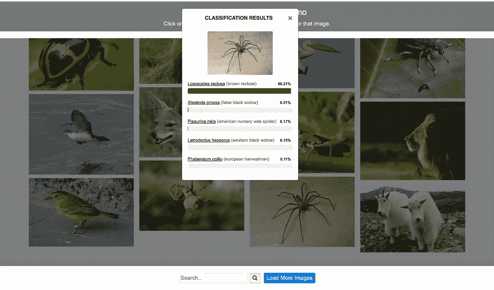

# 非政府组织如何在不破产的情况下利用人工智能

> 原文：<https://towardsdatascience.com/how-ngos-can-leverage-ai-without-breaking-the-bank-919287fdca50?source=collection_archive---------36----------------------->

## 人工智能不是——也不应该——只留给最赚钱的企业。

*这篇文章最初是在 TechHQ 上* [*发表*](https://techhq.com/2019/12/how-ngos-can-leverage-ai-without-breaking-the-bank/) *。增加了插图。*

当你想到利用人工智能(AI)的组织类型时，非政府或非营利组织(NGO)不会跃入脑海。

人们经常看到大型科技公司和风投支持的公司在拓展人工智能的可能性。由于资源和员工时间有限，对人工智能的投资似乎超出了非政府组织的能力范围。

然而，也有非营利组织利用人工智能取得惊人成果的例子。只要看看 [**Wildbook**](https://www.wildbook.org/doku.php) 就知道了，这是一个由保护技术非营利组织 Wild Me 开发的开源平台。

Wildbook 利用人工智能通过它们独特的皮毛图案或其他标志性特征来识别单个动物——它们帮助世界各地的保护主义者识别濒危物种，如 [**猎豹**](http://listheory.prattsils.org/analyzing-the-effects-of-data-collection-on-endangered-animal-populations/)[**鲸鲨**](https://www.whaleshark.org/) 和 [**长颈鹿**](https://www.nationalgeographic.com/animals/2018/11/artificial-intelligence-counts-wild-animals/) 。

识别个体鲸鲨:[野生本](https://www.whaleshark.org/index.jsp)

人工智能不是——也不应该——只留给最赚钱的企业。它可以帮助推动非政府组织内部的创新，并帮助解决我们今天面临的许多最棘手的环境和社会问题。

根据这份 Salesforce 报告，非营利组织对人工智能的使用预计将在未来两年增长 361%。

但是上面的例子更多的是一个例外而不是常态。现实情况是，大多数非政府组织没有利用人工智能，或者他们不知道从哪里开始。当拥有数百万美元预算的企业无法有效使用人工智能时，非政府组织如何用最少的资源做到这一点？

# 强大的用例

将人工智能应用于社会公益:图片来源:[麦肯锡报告](https://www.mckinsey.com/featured-insights/artificial-intelligence/applying-artificial-intelligence-for-social-good)

非政府组织应该从人工智能的*需求*开始，问问自己想做什么。

它们需要自动化吗？人工智能可能能够使用计算机视觉来识别野生动物 [**识别**](http://aka.ms/speciesclassification) 动物并跟踪它们的运动，但它也可以帮助非营利组织优化他们的内部流程并疏导宝贵的资源——它可以帮助他们决定在哪里建立学校或者如何优化土地使用 。

非政府组织也可以根据过去的数据，使用人工智能来预测未来的事件，如偷猎或砍伐森林。这使他们能够主动做出决策，防患于未然。

[**例如，Terrafuse**](https://www.terrafuse.ai/) 通过将历史数据与实时卫星图像和模拟相结合来预测森林野火。非营利组织可以使用麦肯锡发布的报告来确定他们的需求。

# 收集数据

众包数据集的标签:[企鹅观察](https://www.zooniverse.org/projects/penguintom79/penguin-watch/classify)

数据是 AI 的先决条件。在确定了他们的用例之后，非政府组织需要找到创造性的方法来收集相关数据，以训练他们的人工智能算法。

例如，一个希望训练人工智能识别大象的组织可以使用经过策划的开源 [**数据集**](http://openaccess.thecvf.com/content_CVPRW_2019/papers/DOAI/Naude_The_Aerial_Elephant_Dataset_A_New_Public_Benchmark_for_Aerial_CVPRW_2019_paper.pdf) 或公开的游客照片。

一旦他们有了数据，他们需要标记它。这也可以在众包的公共帮助下完成。[难民](https://refunite.org/)例如， [**开发了一款应用**](https://techhq.com/2018/11/ethical-crowdsourcing-ngo-app-pays-refugees-to-train-ai/) ，让那些因冲突而背井离乡的人通过智能手机“训练”人工智能算法来赚钱。

# 寻找资源

物种分类公共 [API](https://speciesclassification.westus2.cloudapp.azure.com/) 微软 AI for Earth

非政府组织可以通过寻找免费的 [**库**](https://modelzoo.co/category/computer-vision) 来快速跟踪他们的 AI 模型开发，这些库建立在流行的 [**机器**](https://docs.microsoft.com/en-us/cognitive-toolkit/) [**学习**](https://www.tensorflow.org/) [**平台**](https://pytorch.org/) 上。或者，他们可以遵循众包路线，利用公共帮助来建立模型。

例如，Kaggle，一个由数据科学家组成的在线社区，举办比赛来支持人工智能的发展。该平台定期与非政府组织合作举办比赛，如自然学家**和野生动物学会 [**iWildcam**](https://www.kaggle.com/c/iwildcam-2019-fgvc6/overview) 等，以解决物种分类的挑战。**

**作为建立人工智能模型的替代方案，非政府组织可以寻找现成的 API，提供公共的、现成的解决方案，如 [**微软 API**](https://www.microsoft.com/en-us/ai/ai-for-earth-tech-resources)。**

## **固定支架**

****

**非政府组织可以申请资金支持或免费计算资源来资助他们的工作。**

**像 [**微软 AI for Earth**](https://www.microsoft.com/en-us/ai/ai-for-earth-grants)[**谷歌 AI for Social Good**](https://ai.google/social-good/impact-challenge/) 和[**AWS Imagine Grant**](https://aws.amazon.com/government-education/nonprofits/aws-imagine-grant-program/)这样的倡议在全球范围内选择非营利组织，并提供财务、技术和实施支持。**

**毫无疑问，人工智能可以帮助非营利组织推进他们的使命，让世界变得更美好。然而，像任何组织一样，他们必须有一个计划来启动他们的人工智能之旅。**

**通过确保他们心中有一个明确的问题，为算法提供高质量的数据，以及一些财政支持，非政府组织可以充分利用人工智能所能提供的一切。**