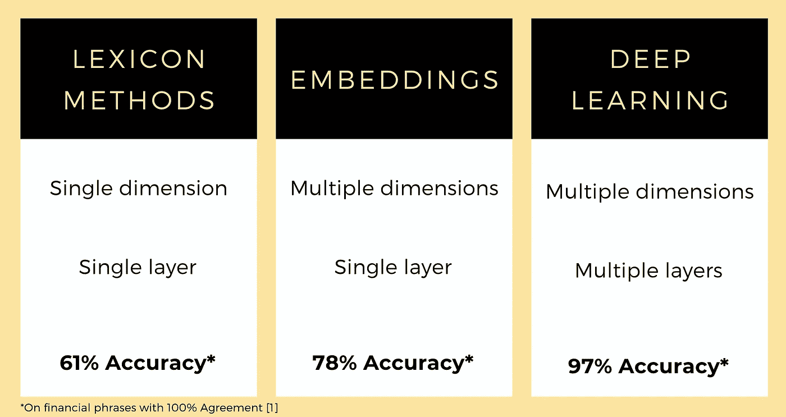
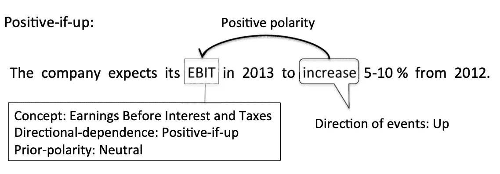

# 自然语言处理是如何发展成金融情绪分析的

> 原文：<https://towardsdatascience.com/how-nlp-has-evolved-for-financial-sentiment-analysis-fb2990d9b3ed?source=collection_archive---------24----------------------->

资料来源:联合国人类住区规划署

## 我们还需要人类去阅读无聊的财务报表吗？

机器学习模型旨在学习其输入数据的良好表示，以执行其任务。近年来，模型学习用自然语言处理(NLP)来表示单词的方式已经发生了变化，在本文中，我们将探讨模型如何理解语言以做出财务决策的显著变化。

我们关注 NLP 在金融市场中的直接应用:自动对文本文档进行情感分类，从而做出快速准确的投资决策，避免人为偏见。

为了更有意义地比较不同的技术变革，我们使用了一个[金融短语库](https://arxiv.org/abs/1307.5336) [1],其中包含带标签的金融短语(如下例所示):

来源:好债还是坏账:检测经济文本中的语义指向[1]

# **词汇袋/词典方法**

金融情绪分类的创始人:蒂姆& # 183；拉夫兰和比尔& # 183；麦克唐纳。[来源](https://www.hillcrestasset.com/behavioral-finance/hillcrest-finance-award/2014-hbfa/)

如果我们想让一个 8 岁的孩子解释上面的短语，我们可以给她一个带有积极、中性和消极标签的单词列表，并让她告诉我们文本中是否包含这些单词——这基本上就是词典方法。最流行的金融词典是拉夫兰·麦克唐纳词典。如果您有兴趣尝试一下，请使用这个运行速度非常快的[代码片段](http://kaichen.work/?p=399)。

使用 LM 的整体准确性并不高— **61%** [1]。因此，尽管我们可以快速地对一个文本序列进行分类，并理解我们为什么要对它们进行分类，但我们仍然非常依赖那些在字典中有一席之地的单词。即使这样，单词也只有一维。也许在更高的维度上，比如 300，我们会有更好的结果来代表每一个单词？

# 嵌入

嵌入将序列中的每个单词投影到多维空间中。我们可以把嵌入想象成一个宽的查找表——我们有 300 列，单词充当查找索引。

以埃隆·马斯克最近影响市场的推文为例

SOTA 嵌入很可能是 ELMO 的[2]语境嵌入，即嵌入考虑到单词及其周围的语境。嵌入有三个组成部分:两个来自双向上下文表示，一个是上下文无关的表示。

如果 Elmo 在 NLP 中每次有人用他的名字都会收到一分钱。资料来源:联合国人类住区规划署

嵌入本身仅仅是表象——仅仅是表象并不能对情感进行分类。因此，我们必须训练一个模型，使用嵌入作为输入，并学习预测情绪。我找不到任何测试短语库的论文，所以我[在这里](https://gist.github.com/neoyipeng2018/73b61bec5e7034a92ea0a4e393202f7d)做了一个快速实验。

**侧**:没有我想象的那么快——张量流/keras 比我记忆中的要更不确定/痛苦。最后，我从一个名为 [pymagnitude](https://github.com/plasticityai/magnitude) 的即插即用库中取出了这些嵌入，并使用了我可信赖的 ol’random forest。

整体准确率上升到了 **78%。**比 LM 字典高，但还是不邪乎。嵌入能够从单词创建多维表示，但是即使嵌入是上下文相关的，它也只是单层表示，不管维度有多大。是时候探索一种高维度的多层表示，即深度学习了。

# 深度学习

资料来源:联合国人类住区规划署

最近在架构和训练方法方面的进步极大地改善了深度学习模型学习语言和执行下游任务的方式。

transformer 架构和[BERT](https://arxiv.org/abs/1810.04805)【4】无需进一步介绍——参考这篇[精彩文章](http://jalammar.github.io/illustrated-bert/)了解更多信息——但简而言之，自我关注和令牌屏蔽的使用允许学习真正的双向上下文关系。

NLP 中迁移学习的使用最早是在[ul mfit](https://arxiv.org/abs/1801.06146)【5】中引入的，其中网络首先学习从庞大的文本语料库中预测最可能的单词，然后使用语言建模中预先训练的权重来执行其他任务——这导致了收敛性的改善，并减少了对庞大的带标签数据集的需求。

[有一篇很好的论文，FinBERT](https://arxiv.org/abs/1908.10063) ，将 BERT 和迁移学习应用于短语库，达到了 **97%** 的准确率！顺便说一句，如果你有兴趣看看如何使用 FinBERT 来交易企业申报情绪，我制作了一个视频，带你了解从解析申报到回测结果的整个过程！

# 下一步是什么？

资料来源:联合国人类住区规划署

我们完事了吗？当我们啜饮马提尼酒时，机器能分析金融文件并产生准确客观的情绪吗？我们是否不再需要人类分析师来仔细阅读大量财务报表，并时刻警惕彭博的头条新闻？

不完全是。

当前的 BERT 模型存在实际限制，如计算成本随输入长度的二次增加——最大输入长度通常上限为 512/1024 个令牌。[改革者](https://arxiv.org/abs/2001.04451)和[龙前](https://arxiv.org/abs/2004.05150)是最近的论文，试图通过简化自我关注机制来解决。

此外，BERT 不能做心算——它只包含文本表示。这是机器完全理解和分析通常包含大量数字的金融文档的主要瓶颈。我发现[的一篇论文](https://arxiv.org/abs/1909.00109)试图用一个做基础数学的程序来增强 BERT——但在 BERT 能够进行人类水平的推理之前，可能要等待很长时间。* *更新:[open ai 发布的 GPT-3](https://arxiv.org/abs/2005.14165?fbclid=IwAR1Cc2FIMZ-Eh-pPLeXNnB3GV7Nd4ER4AuCBbI9xc_gYPoSyFP58X202QuQ) 无需事先训练就能进行零炮计算！

最重要的是，金融文本可能是不明确的，并且通常需要文本本身无法提供的上下文知识 BERT 实现的高准确性是在人类注释者之间 100%一致的短语上。甚至人类都不同意的其他短语使得机器不太可能胜过人类分析师。更有可能的是，一种[量化方法](https://www.forbes.com/sites/michaelmolnar/2019/12/12/quantamental-investing-a-fuzzy-term-that-describes-an-inevitable-future/#434505a5ff07)将主导市场，金融分析师通过机器学习得到增强，以做出准确、快速和客观的投资决策。

# 你认为金融情绪分析的下一步是什么？留下评论。

[1] Pekka Malo、Ankur Sinha、Pekka Korhonen、Jyrki Wallenius 和 Pyry Takala。2014.好债还是坏账:探测经济文本中的语义指向。信息科学与技术协会杂志 65，4 (2014)，782–796。https://doi.org/10.1002/asi.23062arXiv:arXiv:1307.5336 v2

[2] Loughran，t .和 Mcdonald，b.《什么时候责任不是责任？文本分析、字典和 10-k。*《金融杂志》第 66 期*，2011 年第 1 期，第 35 期第 65 页。

[3]马修·彼得斯、马克·诺依曼、莫希特·伊耶、马特·加德纳、克里斯托弗·克拉克、肯顿·李和卢克·塞特勒莫耶。2018a。深层语境化的词语表达。在 NAACL。

[4]雅各布·德夫林、张明蔚、肯顿·李和克里斯蒂娜·图塔诺瓦。Bert:用于语言理解的深度双向转换器的预训练。arXiv 预印本 arXiv:1810.04805，2018。

[5]霍华德和鲁德。用于文本分类的通用语言模型微调。计算语言学协会(ACL)，2018。