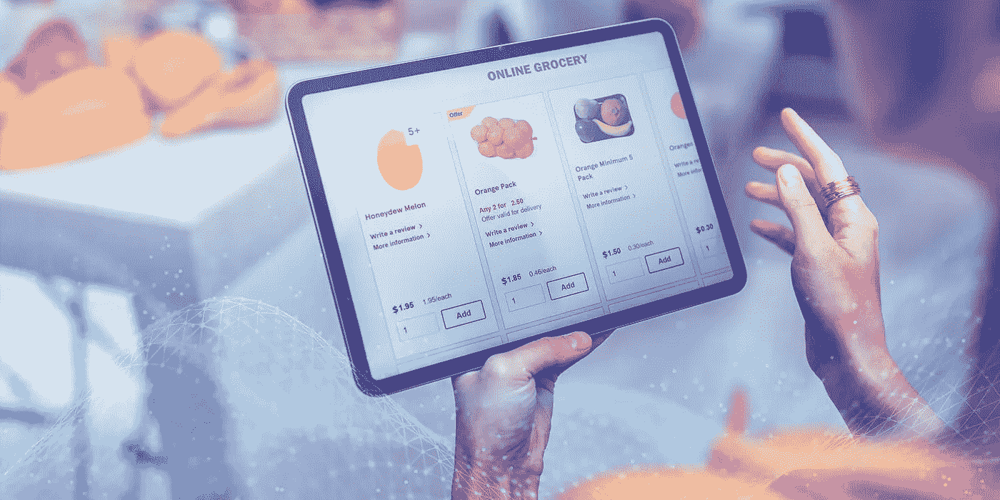

# 北美最大的杂货配送服务如何利用数据科学适应新冠肺炎

> 原文：<https://towardsdatascience.com/how-north-americas-largest-grocery-delivery-service-adjusted-to-covid-19-using-data-science-2450f1642396?source=collection_archive---------47----------------------->

## 随着用户需求的增加，优化算法和利用机器学习来扩展复杂数据集的需求也在增加

Adobe Stock Photos 提供

Instacart 以独特的方式将零售购物和电子商务结合在一起。在全球化的疫情时代，越来越多的消费者使用网上购物来替代传统的杂货店购物。商店提供网上下单和提货服务。送货服务达到了历史最高水平。我很好奇 Instacart 的数据科学团队如何调整他们的计划，并解决他们最初在 2019 年提出的挑战。

*根据 Instacart 高级数据科学家*[*is hant Nayer*](https://www.linkedin.com/in/ishant-nayer/)*的演讲，在 DSSInsider* *上观看* [*完整视频，并与我一起参加*](https://insider.datascience.salon/) [*DSS 零售/Ecomm*](https://www.datascience.salon/retail-and-ecommerce/) *虚拟体验。*

# Instacart 是什么？

Instacart 是一家零售和电子商务公司，在美国和加拿大提供杂货交付和提货服务。你可以通过他们的手机应用程序或网站使用这项服务。Instacart 作为一个四方市场运作，服务于客户、零售商、第三方市场和购物者。你可以选择各种食品杂货、酒类、医疗保健和个人用品。

## 工作原理:

1.  输入您的邮政编码，查找当地参与的零售商，如 Pulix 或 Safeway
2.  选择您的商品并在一天中的任何时间下订单
3.  购物者去商店为你收集商品，并把它们送到你家门口

# 数据挑战

该目录正在接收和创建可供客户使用的商品的所有数据。该数据目录包含来自北美 20，000 家商店的 300 多家不同零售商的 5 亿多种商品。这是一个庞大的数据集，每天都要处理并保持干净。这些物品中的每一个都有大约二十到三十种不同的属性，例如，价格、大小和位置。该目录在规模上变成了一个非常复杂的数据集，包含了所有的属性。有两类主要的属性需要组织。这些数据来自零售商、CPG 制造商和第三方整合商。

**店铺特定属性**:产品价格、供货情况、库存

**产品特定属性**:图片、位置、重量、尺寸、是否按单位或磅出售、营养信息

什么会出错？对于所有这些复杂的数据集，有时会出现产品描述与图片不匹配、没有图片或产品分类错误等问题。

# 解决方案

让一个人全天候坐在电脑前试图捕捉每一个错误是不可能的。算法需要每天定期捕捉这些问题。每个产品属性至少有 10-15 种算法。Instacart 还使用定义的试探法来告诉团队哪些地方不准确。该团队定义什么可能是错误的，然后开发数据的真实来源，并为产品设置检查。

为了帮助产品转换，该团队还需要确保图像是高质量的，由地区测量标准准确定义，以适当的销售单位列出，并用品牌正确命名。正在开发图像检测模型来修复图像，并帮助改善我们零售商的真实数据来源。这将能够从图像中提取文本、品牌名称、营养信息和产品描述。当能够扩展该解决方案时，它将提高我们的数据质量，并波及到业务的其他技术方面。

# Instacart 如何适应 COVID 挑战

**问:在 COVID 期间，Instacart 如何进行整体调整以服务客户？**

Ishant: Instacart 很好地适应了 COVID 时代的消费者需求。他们加入了新的零售商，这意味着他们的目录中增加了数百万件新商品。Instacart 的主要主张来自于这样一个事实，即他们允许零售商添加具有任何类型信息的任何商品，并且他们将使用他们的目录系统来处理这些商品，以满足 Instacart 的要求。正如我在上面的话题中所讨论的，困难的部分已经在去年过去了。从现在开始，只是增加新的自动化零售商。由于 COVID 的限制，许多人开始使用 Instacart 来满足他们的杂货需求，Instacart 可以快速满足这些不断增长的用户需求。

**问:在 COVID 期间，领导者如何利用数据作为工具来应对挑战？**

Ishant: COVID 改变了购物、房地产购买、流媒体和更多行业的许多趋势。对于领导者来说，倾听客户的意见非常重要，而数据是做到这一点的最佳资源之一。关键绩效指标(KPI)是一组指标，领导者密切关注这些指标以了解其业务的健康状况。从我作为数据科学家的职业经历来看，每个领导者都会查看关于他们的业务指标和预测趋势的每日报告，以了解他们的位置和下一步该做什么。在 COVID 期间，定期听取您的分析团队和他们的见解是领导者保持领先地位必须做的事情之一。这将有助于他们管理资源和运营，并了解公司下一步的工作重点。对于 Instacart 来说，数据帮助他们了解需要雇用多少人才能满足不断增长的需求。

**问:作为一名数据科学家，在 COVID 期间，您如何看待复杂数据集的管理变化？**

Ishant:数据集的管理总是在变化并适应当前的情况。这是他们的基本法。在 COVID 期间，许多公司改变了策略以满足客户的需求。这意味着模型和数据集在不断变化，以保持最新，并持续提供客户现在所要求的内容。

# 结论

新冠肺炎改变了购物行为，网上订单的数量在过去几个月里显著增加。利用数据科学，Instacart 能够扩展其交付服务并适应不断增长的在线购买数量，而不会影响服务质量。Instacart 中的算法能够检测产品描述中的错误或在线目录中产品的错误分类，从而避免分析团队花费冗长的工作时间进行手动错误检测，并使他们能够专注于获得有价值的见解，以做出更好的决策，并从根本上改善整体客户体验。