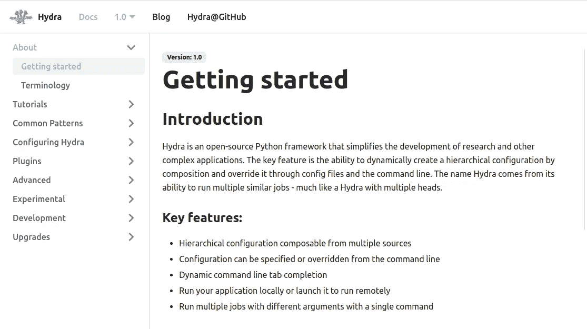
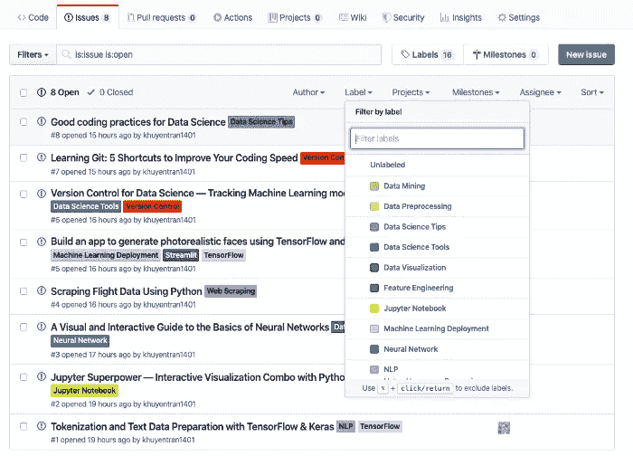
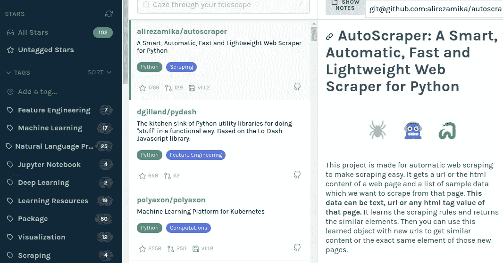

# 如何不被数据科学淹没

> 原文：<https://towardsdatascience.com/how-not-to-be-overwhelmed-with-data-science-5a95ff1618f8?source=collection_archive---------26----------------------->

## 让数据科学再次变得有趣

马修·费雷罗在 [Unsplash](https://unsplash.com?utm_source=medium&utm_medium=referral) 上的照片

# 动机

如果你想学习数据科学，有许多资源可供你学习。由于学习数据科学的需求很高，因此有成千上万的数据科学课程、书籍、图书馆来帮助初学者进入该领域。

这很好，因为你不需要自己解决所有问题。但这也带来了不利的一面，那就是你成为了**不知所措的**资源，不知道从哪里开始。

即使是对一些数据科学概念比较熟悉的人，很多人还是觉得自己是初学者，尽量多上一些课程，掌握所有的概念和技术。

如果你的目标是掌握数据科学中的所有概念和工具，你将永远无法实现。

> 更聪明地工作，而不是更努力

相反，你可能想要的是拥有**相关知识**,从你正在处理的数据中获得洞察力，并为你的公司交付理想的结果。这个目标是可以实现的，这篇文章将向你展示如何让自己**了解对你来说**重要的事情。

# 从一个问题开始，然后寻找资源来回答你的问题

不要学习很多数据科学的课程，而是掌握基础知识，然后开始解决项目。你可能不知道处理项目的所有步骤。没关系，事实上，这是意料之中的。

通过参与现实世界的项目，你将开始问一些现实的问题，例如

*   我的数据有许多特征，我应该保留所有这些特征还是只挑选相关的特征？
*   我的数据有很多空值，有没有一种算法可以不用处理这些空值？
*   如果我想预测一封电子邮件是否是垃圾邮件，我应该从哪里开始？我应该使用哪种算法？

一旦你形成了这些问题，你就可以开始在谷歌上搜索答案。你会惊讶地发现有这么多有用的资源，比如博客帖子、Youtube 视频、关于这个主题的书籍。

没有一个好的资源。只需选择一两个，然后将你学到的知识应用到你的问题中。

# 通过玩基础游戏来学习

一旦你找到了一些潜在的资源，你如何着手阅读这些文章或文档而不感到困惑呢？

在一些文档或博客中，可能会有很多针对初学者和高级用户的内容。有时它提供的比你实际需要的更多。

所以如果你刚学了一个新工具，试着找一个讲解基础知识的教程。介绍该工具的文章或文档中的入门部分都可以。

一旦您对该工具的功能和使用方法有了基本的了解，您就可以通过更深入地研究文档来建立另一层理解。

看到你的问题用你刚刚学到的新知识解决了，你会感到有收获！

# 把有用的文章留到以后

文章是学习不同数据科学概念和工具的好方法。但是你也很容易迷失在每天新的文章数量中。

而不是读了很多文章然后忘记它们。**看几个，实际应用**。尝试本文中介绍的概念或工具，它们可能对您当前的项目有益。

但是如果你读了那些可以作为未来参考的文章呢？我曾经使用 Instapaper 来组织我的文章，但是当我保存的文章数量变大时，我的文章就会丢失。我意识到我很少回头去看我保存的文章。

使用 [Github 问题](https://github.com/khuyentran1401/machine-learning-articles)解决了我的问题。

Github 有一个 Issues 选项卡，允许用户请求关于现有代码的问题。我发现使用 Github issues 对我保存中型文章非常有效，因为它使我能够

*   整理我的文章，以便**很容易找到我的文章以备将来参考**
*   **不看整篇文章，快速复习文章重点**
*   总结的艺术将帮助我更好地保留和理解信息

如果你想学习如何使用 Github issues 来保存你的文章，请查看[这个资源库](https://github.com/khuyentran1401/machine-learning-articles)或[这篇文章](/how-to-organize-your-data-science-articles-with-github-b5b9427dad37)。

# Github 恒星应该属于不同的星系

您可能会启动有用的 Github 存储库，供将来使用。但是由于你不能用 Github stars 分类，所以当你需要的时候，从你的一堆标有星号的回购中找到一个特定的回购是极其困难的。

我曾经害怕主演更多的储存库，直到我发现了星体。 [Astral](https://astralapp.com/) 从 GitHub 下载你所有的标有星号的库，并允许你使用一个简单的&直观的标记系统来组织它们。

每当你想搜索一些为你所寻找的服务的存储库，例如 NLP，你可以通过点击标签很容易地找到 repo！

如果您想将该工具与您启动的其他类似工具区分开来，您还可以记下该工具的内容。

# 结论

有许多学习数据科学的资源，但这不应该让你感到不知所措。创建一个有效的系统来筛选出首先要学习的重要内容，并保存你想在未来尝试的资源，这将使你不那么不堪重负。

通过这些方法，我能够快速学习对我的数据科学项目很重要的新工具和概念，并利用新知识改进我的工作流程。

如果你每天都接受新事物和学习小东西，数据科学是一个有益的领域。

我喜欢写一些基本的数据科学概念，并尝试不同的算法和数据科学工具。你可以在 LinkedIn 和 T2 Twitter 上与我联系。

星[这个回购](https://github.com/khuyentran1401/Data-science)如果你想检查我写的所有文章的代码。在 Medium 上关注我，了解我的最新数据科学文章，例如:

 [## 当生活不给你喘息的机会，如何学习数据科学

### 我努力为数据科学贡献时间。但是发现新的策略使我能够提高我的学习速度和…

towardsdatascience.com](/how-to-learn-data-science-when-life-does-not-give-you-a-break-a26a6ea328fd)  [## 如何在 VSCode 上使用定制的代码片段来提高效率

### 与其为同一段代码复制，为什么不把它保存起来以备将来使用呢？

towardsdatascience.com](/how-to-boost-your-efficiency-with-customized-code-snippets-on-vscode-8127781788d7)  [## cy thon——Python 函数的加速工具

### 当调整你的算法得到小的改进时，你可能想用 Cython 获得额外的速度，一个…

towardsdatascience.com](/cython-a-speed-up-tool-for-your-python-function-9bab64364bfd)  [## Yellowbrick 简介:可视化机器学习预测的 Python 库…

### 您将 f1 分数提高到了 98%！但这是否意味着你的模型表现更好呢？

towardsdatascience.com](/introduction-to-yellowbrick-a-python-library-to-explain-the-prediction-of-your-machine-learning-d63ecee10ecc)  [## 网刮电影数据库与美丽的汤

### 利用你的数据库预测下一部热门电影

medium.com](https://medium.com/analytics-vidhya/detailed-tutorials-for-beginners-web-scrap-movie-database-from-multiple-pages-with-beautiful-soup-5836828d23)