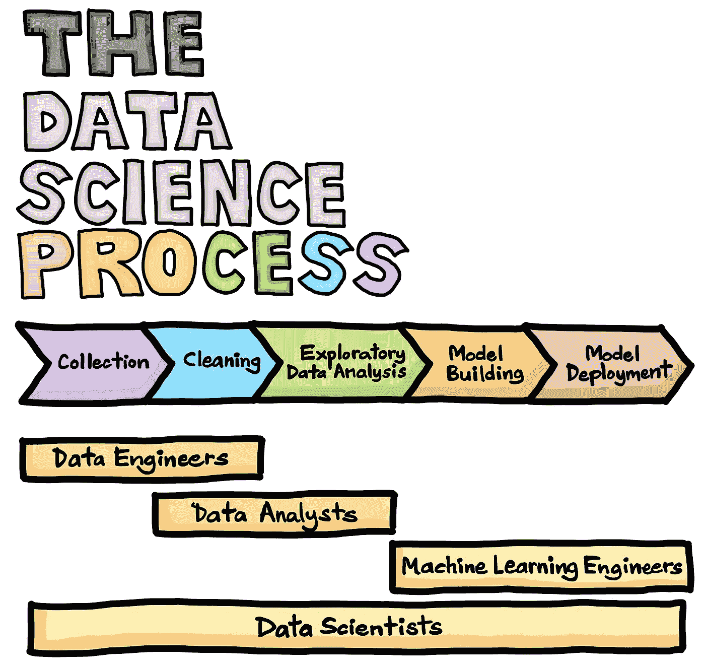

# 如何不构建数据科学项目

> 原文：<https://towardsdatascience.com/how-not-to-build-a-data-science-project-baa494d98da4?source=collection_archive---------50----------------------->

## 项目

## 我一路走来所犯的错误，以及你如何在下一个项目中避免这些错误。

**数据科学项目的绝对禁忌**(由[迪米特里·豪特曼](https://unsplash.com/@dimhou?utm_source=medium&utm_medium=referral)在 [Unsplash](https://unsplash.com?utm_source=medium&utm_medium=referral) 上拍摄)

我知道我做错了。

我已经积累了一系列有趣而实用的项目。我有几门在线课程来展示我学到的东西。我甚至建立了一个作品集网站来展示我所有的项目和文章(你可以在这里访问)。

但是，我仍然觉得我的知识有一个缺口。一个巨大的，裂开的，裂缝大小的洞。我觉得等式里缺少了一些重要的东西。

就在那时，我在 YouTube 上看到了一些关于从头开始构建端到端数据科学项目的非常棒的播放列表。一些很好的例子是 Ken Jee 的[这个](https://www.youtube.com/watch?v=MpF9HENQjDo&list=PL2zq7klxX5ASFejJj80ob9ZAnBHdz5O1t)，Daniel Bourke 的[这个](https://www.youtube.com/watch?v=C_lIenSJb3c&list=PL6vjgQ2-qJFeMrZ0sBjmnUBZNX9xaqKuM)和 Data Professor 的[这个](https://www.youtube.com/watch?v=ZZ4B0QUHuNc)。(向所有人大声喊出一些绝对精彩的内容！)

我意识到我需要开始一个端到端的数据科学项目，stat(一语双关)。尽管一开始会感到不舒服，但亲自动手并投入其中是学习新事物的最佳方式。

所以我就一头扎了进去。

直到我卡住了。又来了。

再一次。

再一次。

但是最后，经过几个小时的辛苦工作，几十次堆栈溢出搜索(感谢上帝的堆栈溢出)和在遇到一大堆错误后沮丧地用头撞墙(这没有多大帮助)，我完成了。

你可以在这里查看我的最终项目。这是一个数据科学工资预测器(受 Ken Jee 的[播放列表](https://www.youtube.com/watch?v=MpF9HENQjDo&list=PL2zq7klxX5ASFejJj80ob9ZAnBHdz5O1t)的启发和指导)。我也在做几个我自己的，这一次没有参考或指导，真正推动自己超越我理解的感知极限。

在构建这些项目的过程中，我学到了很多东西，不仅仅是从数据科学的角度，还包括如何首先解决构建这样一个项目的问题；一次又一次地犯很多错误并从中吸取教训。

以下是我以前犯过的一些错误，以及在你的下一个项目中如何避免这些错误:

# 错误 1:没有把我的项目做成端到端的。

通常，花费在数据科学实际应用上的大部分时间都是在数据清理和准备上。事实上，人们普遍认为**大约 80%的时间**花在清理数据并将其转换成适合进一步分析的形式上。

尽管可能很烦人，但数据清理是数据科学生命周期中必不可少的一步。并不是所有你在实际工作或实习中可能用到的数据集都像 Kaggle 数据集一样干净，可以随时使用。

它可能会很乱，你的工作可能是清理它，使它可以使用。

项目中同样重要的部分是生产和部署项目。最近我越来越多地听到这样一句话:

> 我们的项目不应该在 Jupyter 笔记本上结束它的生命。

构建其他人可以**访问的项目和产品**是数据科学的主要用途之一。

Jupyter 笔记本中的一堆代码通常没有实际用途，但是使用强大且易于使用的工具(如 [Streamlit](https://www.streamlit.io/) 或稍微复杂一点的工具(如 [Flask](https://flask.palletsprojects.com/en/1.1.x/) )来构建一个简单的 Web 应用程序，以展示您所构建的内容，只需一点点额外的努力，就可以让人们更容易地看到您所构建的内容。

从坚实的基础开始，以切实可行的产品结束，这一点非常重要。

专业建议:获取你自己的数据(如果有必要的话，可以从网上搜集)。清理它，预处理它，做一些特征工程。别忘了用 Streamlit 或 Flask 来生产你的项目。

# 错误 2:没有把时间花在最重要的事情上。

帕累托原则(也称为**80–20 法则**)指出，对于许多事件来说，大约 80%的结果来自 20%的原因。类似地，在一个项目中，大约 80%的价值来自你做的 20%的事情。同样，这也意味着你可能做的 80%左右的事情并没有真正增加价值(只有 20%左右)。

我过去常常花很多时间思考和分析我的项目可以采用的不同选项或不同路径。

我不应该。

我应该开始做点什么。我本可以稍后处理选择错误的后果。

我浪费了很多时间的一个简单例子:**云提供商**。

如果到目前为止你和我在一起，使用 Streamlit 或 Flask 制作一个项目是非常重要的。但是，同样重要的是，部署该项目以便每个人都可以访问它。

有很多方法可以做到这一点。

我开始着迷地分析和研究所有不同的选项来帮助部署我的项目。查找 AWS 和 GCP 之间的所有差异，各自的优缺点，它们提供什么实例，我可能会产生什么成本，等等。

直到我意识到我犯的错误。我只是不得不部署它。在哪里并不重要。

所以，我在 [Heroku](https://www.heroku.com/) 上免费部署了它。(他们允许一次免费部署，我很大方地使用了它)。

下一次，我将把它部署在我认为最容易的地方。没有二心。

***亲提示:停止思考，开始行动。利用 80-20 法则。***

# 错误 3:没有计划最终结果会是什么样子。

如果我现在已经成功地让你相信生产化和部署是你的项目生命周期中非常重要的步骤，以及 80-20 法则的力量，那么另一个同样重要但经常被忽视的步骤就是计划最终的结果。

好吧，让我们假设到目前为止你已经同意了我的逻辑，并且你已经决定要构建一个展示你的项目的 web 应用程序。

但是这个应用程序要做什么呢？

问自己一些关于用户界面的问题，例如:

*   它从用户那里得到的**输入**是什么？
*   在**中，你将采用什么形式**输入？
*   你的模型会有什么样的最终结果？
*   **输出**将以什么形式出现？
*   我可以添加哪些**附加功能**来改善用户体验吗？
*   有些事情是我应该不惜一切代价避免的吗？

在我的数据科学工资预测项目中，我犯了一个严重的错误，没有考虑最终的界面及其布局。当我最终到达那个阶段时，我发现用户的分类输入对我的模型没有意义，所以我不得不返回并将某些分类变量更改为顺序变量，在这个过程中浪费了一些宝贵的时间。

一开始就回答这些问题将会为你以后节省大量的时间，也可以避免你不必要地在不同的步骤之间来回奔波**。我在这里使用“不必要”这个词是有原因的，这让我想到了第四个错误。**

**专业建议:无论以何种形式开始，对最终结果都要有一个大致的概念。如果有必要的话，在某个地方画出来。**

# **错误 4:没有回到之前的阶段。**

****

****数据科学生命周期**(鸣谢: [Chanin Nantasenamat](https://towardsdatascience.com/@chanin.nantasenamat) 与 [Ken Jee](https://medium.com/@kenneth.b.jee) 合作)**

**通常，任何项目都可以分为这 5 个主要阶段:数据收集、数据清理、探索性数据分析、模型构建和模型部署。**

**但是我犯的一个主要错误是认为这个过程是一系列线性的步骤，而事实上，它是一个迭代的，经常是循环的过程。**

**例如，在我的数据科学工资预测项目中，当我处于模型构建阶段时，我想到了一些我可以添加的更有趣的功能，作为我的模型的输入。**

**那我做了什么？**

**我一直回到数据清理和预处理步骤，不得不做一些额外的功能工程，不得不对新数据执行一些探索性的数据分析，并使用额外的功能构建另一个模型。**

**有时候，这些绕回来的可能是完全不必要的，比如第三个错误。**

**但有时，在处理数据一段时间后，你可能会有新的见解，在这种情况下，返回是正确的做法。**

*****亲提示:在手之前尽可能多的做好计划，但是如果需要的话就圈回来。据你所知，这一点点努力可能会让你的项目变得更好。*****

# **错误#5:在项目部署后没有进行自省和评估**

**我完全忽略的一步，实际上可能是所有步骤中最重要的一步，是在你完成后评估你的项目。**

**看到哪些做对了，哪些做错了，下次如何改进。**

**在丹尼尔·伯克着手 Airbnb 项目后，我从他的视频[中了解到这个非常重要的步骤。](https://www.youtube.com/watch?v=aBkUE5OJ8u8)**

**花些时间，分析你项目的所有步骤，反省，从中学习，然后继续前进。**

**没有这一步，这篇文章就不会存在。这里列出的错误是我从我的项目中学到的，我几乎可以肯定，任何人在从事自己的项目时都会犯一些错误。从中吸取教训，确保下次不会重蹈覆辙，继续前进。**

*****亲提示:回去看看哪里做对了，哪里做错了，从中吸取教训。*****

> **犯错误没关系，只要你能从中吸取教训—匿名**

**最重要的是:别忘了一路上要开心。**

***随时联系我* [*LinkedIn*](https://www.linkedin.com/in/vishnu-bharadwaj-796877175/) *，查看我的*[*GitHub*](https://github.com/vishnubharadwaj00)*了解我做过的项目，或者我个人的* [*网站*](https://vishnubharadwaj00.github.io) *了解我所有的工作。***