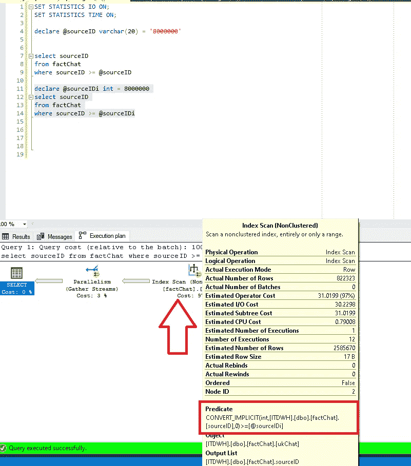
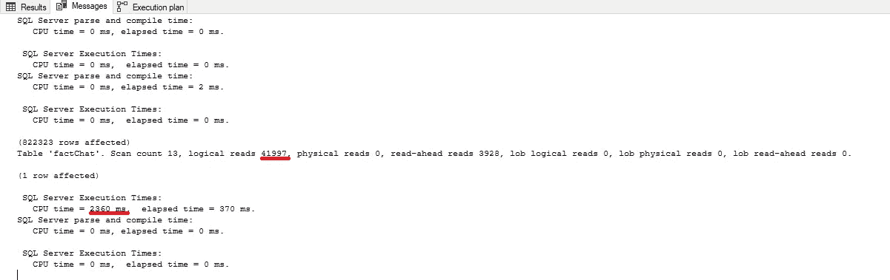
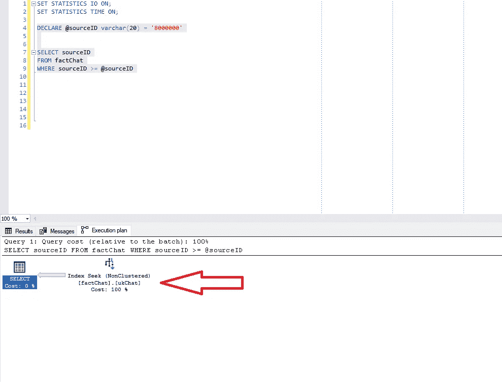
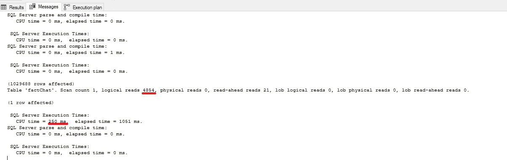
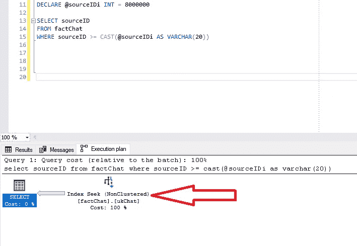
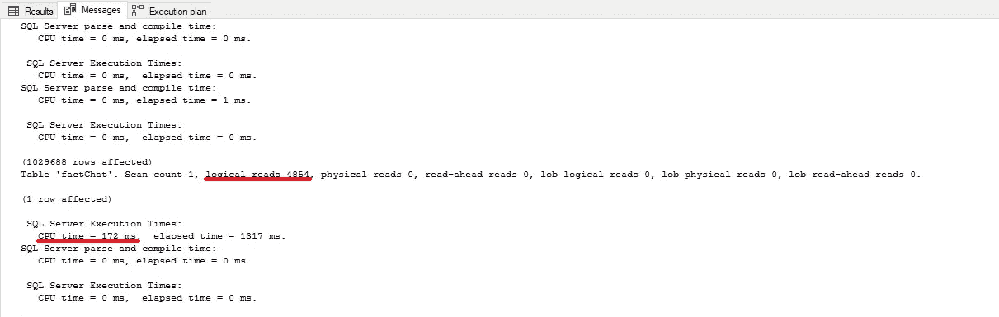
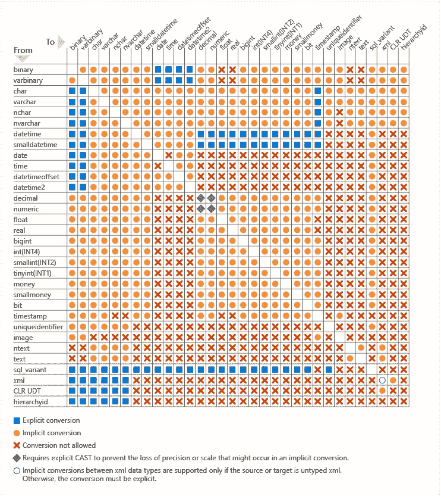

# 如何(不)通过隐式转换来降低 SQL Server 的性能

> 原文：<https://towardsdatascience.com/how-not-to-kill-your-sql-server-performance-with-implicit-conversion-e754ac2eb134?source=collection_archive---------34----------------------->

## 了解如何避免性能杀手并帮助 SQL Server 为查询选择最佳执行计划


莎拉·瓜尔蒂里在 [Unsplash](https://unsplash.com/s/photos/apple-and-oranges?utm_source=unsplash&utm_medium=referral&utm_content=creditCopyText) 上拍摄的照片

在我最近的[文章](/datetime2-why-you-should-not-use-it-70e50ae2bab9)中，我研究了使用 DATETIME 和 DATETIME2 数据类型之间的*【优点】**【缺点】*。这项调查似乎让我大开眼界，因为在阅读关于这些数据类型和使用 DATETIME2 时的潜在缺点的文档时，我发现了一组我需要注意的全新内容！

## 什么是隐式转换？

简而言之，*隐式转换*发生在 SQL Server 需要自动将部分数据从一种数据类型转换为另一种数据类型的时候。

在某些情况下，当您执行 *JOIN* s 或使用 WHERE 子句过滤结果时，您正在比较“苹果”和“橙子”——因此，SQL Server 需要将“苹果”转换为“橙子”，反之亦然。

## 为什么隐式转换不好？

为了解决数据类型之间的不一致，SQL Server 必须付出额外的努力并消耗更多的资源。因此，性能会受到影响，导致索引的低效使用和 CPU 的大量使用。

但是，理论已经足够了，让我们来看看隐式转换在现实中是如何影响性能的。

## 真实用例

我有一个包含客户发起的聊天数据的表格。这个表大约有 860 万行。其中一列是*“SourceID”*，是来自源系统的聊天 ID。在我的表中，该列是 *VARCHAR(20)* 类型，尽管所有值都只包含数字。

我在 SourceID 列上有一个惟一的非聚集索引，在 *DatetmStartUTC* 列上有一个索引(该索引包括所有其他外键列)，所以让我们运行几个查询来检查后台发生了什么。

我还打开了 IO 和时间的统计，以便能够比较结果。最后，我打开了实际的执行计划，以便更深入地了解查询执行中的每一个具体步骤。

## 问题 1 又名“黑仔”

当有人在该表中执行简单的数据分析，并且只看到 *SourceID* 列中的数字时，完全可以编写这样的查询:

```
DECLARE @sourceIDi INT = 8000000

SELECT sourceID
FROM factChat
WHERE sourceID >= @sourceIDi
```

SQL Server 返回大约 822，000 行，这大约是整个表中数据的 10%。

人们可能会认为 SQL Server 在 SourceID 上使用了索引，但是让我们检查一下情况是否如此:



正如我们所注意到的，SQL Server 使用我们的索引，但是它没有选择执行预期的索引查找操作，而是扫描索引。如果我们将鼠标悬停在索引扫描步骤上，我们将在谓词窗格中看到发生了隐式转换，因为 SQL Server 必须在查询过程中在后台应用数据转换。

该操作对性能有许多额外的影响——仅看一些逻辑读取和 CPU 成本，我们就可以得出结论，这与最佳性能相差甚远:



## 问题 2 又名“好人 1”

现在，让我们检查当我们向 SQL Server 提供匹配的数据类型时，它是如何反应的:

```
DECLARE @sourceID varchar(20) = '8000000'

SELECT sourceID
FROM factChat
WHERE sourceID >= @sourceID
```



现在，SQL Server 按预期执行索引搜索，所以让我们另外检查 SQL Server 在后台做了什么来获取我们的结果:



哇，逻辑读取和 CPU 时间减少了近 10 倍！也正因为 SQL Server 在查询过程中不必努力应用隐式转换。

现在，想象一下大部分数据(记住，这个查询只返回表中 10%的数据)或大表的性能差异。

## 问题 3 又名“好人 2”

现在，我想向您展示帮助 SQL Server 做它最擅长的事情的另一种方法——选择执行查询的最佳计划。

我们仍然可以使用 INT 数据类型，而不是在我们的变量定义中给 SQL Server 正确的数据类型，但是我们可以稍后 ***显式地*** 告诉 SQL Server 我们想要比较“苹果”和“苹果”(在我们的例子中，VARCHAR 和 VARCHAR):

```
DECLARE @sourceIDi INT = 8000000

SELECT sourceID
FROM factChat
WHERE sourceID >= CAST(@sourceIDi AS VARCHAR(20))
```

我们在这里做了什么？我们明确地通知 SQL Server 我们希望他做什么:将 VARCHAR(20)列 SourceID 与变量的 VARCHAR(20)值进行比较。

SQL Server 对此很感激，我们可以看看结果:



一开始，索引查找操作是存在的。让我们来看看统计数据:



数字与前一次运行中的相似，因此我们可以得出结论，这两次运行几乎相同。

## 结论

隐式转换可能是一个巨大的性能杀手，而且特别危险，因为它不是那么明显和容易发现。

因此，我推荐阅读 Jonathan Kehayias 撰写的[这篇文章](https://www.sqlskills.com/blogs/jonathan/finding-implicit-column-conversions-in-the-plan-cache/)，其中他提供了一个非常有用的脚本，用于识别计划缓存中的隐式转换。

此外，如果您想确定何时发生隐式转换，请直接查看由微软提供的这个[超级有用的表](https://docs.microsoft.com/en-us/sql/t-sql/data-types/data-type-conversion-database-engine?view=sql-server-ver15):



## 数据类型优先级

数据类型优先级可以在这里找到[，这有助于理解 SQL Server 将如何处理数据类型转换。例如，INT 的优先级高于 VARCHAR，这意味着 SQL Server 会将 VARCHAR 转换为 INT，而不是相反。](https://docs.microsoft.com/en-us/sql/t-sql/data-types/data-type-precedence-transact-sql?view=sql-server-ver15)

因此，如果您将 INT 类型的列与 VARCHAR 类型的值进行比较，您的索引仍然可以使用，因为用于比较的列不需要转换。

此外，当比较来自同一“家族”的类型(例如，INT 和 BIGINT)时，SQL Server 仍然倾向于索引查找操作，因为它足够聪明，能够识别这些情况并使用适当的索引。

总之，作为一个 ***一般的经验法则*** :不要指望 SQL Server 的“仁慈”或者用数据类型优先来挠头——数据类型应该尽可能匹配，或者比较最终应该使用显式转换来处理。