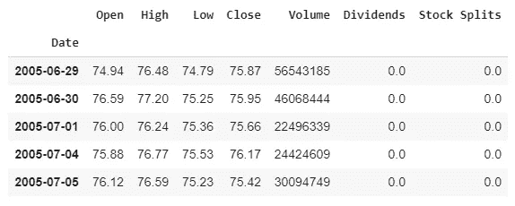
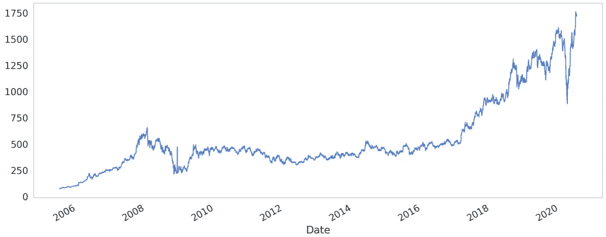
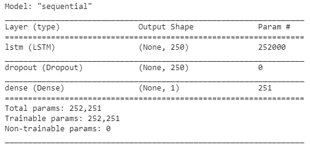
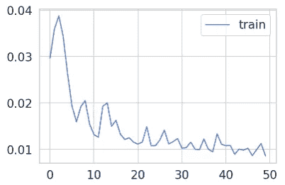
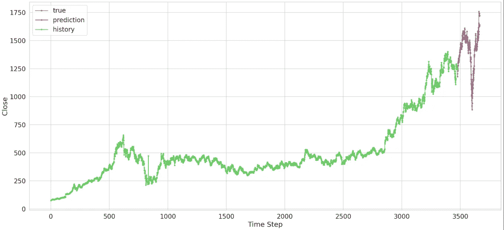
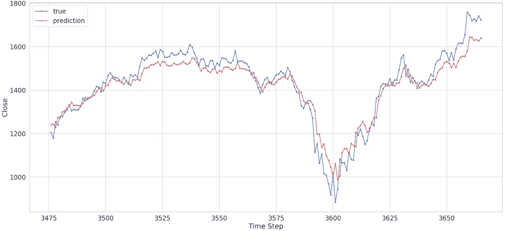
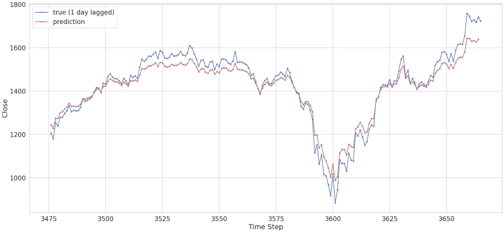

# 如何(不)用 LSTMs 预测股票价格

> 原文：<https://towardsdatascience.com/how-not-to-predict-stock-prices-with-lstms-a51f564ccbca?source=collection_archive---------6----------------------->

## 股票和机器学习——天作之合。但是事情真的像看起来那么简单吗？


想成为一夜之间的百万富翁吗？这篇文章(不)适合你！【原始照片由[卡罗琳娜·格拉博斯卡](https://www.pexels.com/@karolina-grabowska?utm_content=attributionCopyText&utm_medium=referral&utm_source=pexels)从[派克斯](https://www.pexels.com/photo/crop-farmer-showing-money-in-green-summer-field-in-countryside-4497591/?utm_content=attributionCopyText&utm_medium=referral&utm_source=pexels)，[energepic.com](https://www.pexels.com/@energepic-com-27411?utm_content=attributionCopyText&utm_medium=referral&utm_source=pexels)从[派克斯](https://www.pexels.com/photo/blue-and-yellow-graph-on-stock-market-monitor-159888/?utm_content=attributionCopyText&utm_medium=referral&utm_source=pexels)

就在不久前，我突然想到了一个绝妙且“原创”的想法——如果我能利用机器学习来预测股票价格会怎么样。毕竟，时间序列可以很容易地用 LSTM 建模。我可以想象自己一夜暴富！如果这这么容易，为什么还没有人去做呢？

我对自己的光明前景非常兴奋，我打开笔记本电脑，打开谷歌，键入“预测 LSTM python 的股票价格”结果纷至沓来——很快，我意识到我的想法并不新颖。好吧，就这么多了。无论如何，我浏览了许多这样的文章，每一篇似乎都获得了令人惊讶的好结果。但是教程到此为止——没有人用真钱来测试它。为什么这些人还没有成为百万富翁？有些可疑。

**作为免责声明，注意本文内容无一是理财建议，纯属教育**。很明显，我知道，但还是要说出来。恰恰相反，我在努力教育你如何不被这个愚弄，开始动动脑筋。

> 如今，随着股票和机器学习变得如此易于操作、易于使用和容易获得，不陷入这个陷阱变得非常困难，在这个陷阱中，对这两个领域不完整、不成熟的知识会让你陷入严重的麻烦。

让我们开始学习如何不使用 LSTM 来预测股票价格。这篇文章的流程如下:

*   LSTMs 的简单介绍。
*   用 python 获取历史股票数据。
*   以适合 LSTM 模型的格式创建数据集。
*   用 TensorFlow Keras 建立和训练 LSTM 模型。
*   预测和解释结果。

# LSTMs 简介

长短期记忆(LSTM)网络是一种通常用于预测时间序列数据的神经网络。简而言之，它们具有内存/缓存功能，这有助于它们了解数据中的长期依赖性和关系。因此，查看之前的 *N* 个数据点，他们可以通过学习模式来预测下一个(或下几个)点。

*我会让这部分非常简单。如果你想更清楚地了解一个 LSTM 是如何工作的，我推荐你浏览一下*[](/illustrated-guide-to-lstms-and-gru-s-a-step-by-step-explanation-44e9eb85bf21)**，但是即使没有深入的理解，你也应该非常理解这篇文章的主旨和目的。**

# *第一步:获取股票数据*

*在 python 中有多个选项可以访问历史股票价格，但是最简单的库之一是 [**yfinance**](https://pypi.org/project/yfinance/) 。非常方便和免费，它通过从雅虎财经搜集数据来完成工作。*

```
*!pip install yfinance# Import the required libraries
import yfinance as yf
import pandas as pd
import matplotlib.pyplot as pltfrom pandas.plotting import register_matplotlib_converters
register_matplotlib_converters()*
```

**在本文中，我将讨论“Reliance”的股票价格，但这也适用于所有其他工具。**

*下面这段代码下载 Reliance 公司 15 年来的股票价格数据，分辨率为 1 天，并将其存储在 pandas dataframe 中。你可以根据你的实验改变这些参数。*

*打印出熊猫数据帧的头部，可以看到股票数据可用的各种参数。*

**

*熊猫数据框架顶部为 Reliance 股票数据*

*画出“收盘”价格以可视化数据，看看股票在过去几年中上涨得有多好。2020 年 3 月的急剧下降(由于 COVID)也是可见的。但它似乎战胜了这种衰落，再次上升到一个新的高度。*

**

*Reliance 股票数据的收盘价*

**在这里问自己一个问题——****你认为一个 ML 模型能够捕捉所有这些随机性吗？****

# *步骤 2:创建数据集*

*现在让我们修正我们的问题陈述—**LSTM 模型将看到过去 10 天(称为时间步长)的收盘价，并预测第二天的收盘价。***

*为了简单起见，我们只测试最后 200 天。我们可以用剩下的数据进行训练。我们有 3486 个数据点进行训练(将根据您执行代码的日期而增加)。*

*(注意，你可以根据自己的要求改变这一点，但我觉得这应该足以表明我的观点)。*

```
*# Get Close data
df = data[['Close']].copy()# Split data into train and test
train, test = df.iloc[0:-200], df.iloc[-200:len(df)]print(len(train), len(test))
>>> 3486 200*
```

*现在，我们需要标准化我们的数据。 ***人们在这个阶段常犯的一个错误是，他们也单独对测试数据进行归一化*** 。但是在实际场景中，测试数据将是实时的，所以你不会事先知道最小值、最大值或平均值！*如果你给模型提供来自未来的信息*，*，你基本上最终提供了一个趋势或指导方针* *，预测价格需要遵循。我已经看到很多作者犯了这个错误，我不怪他们，因为我也花了一段时间才意识到这一点。**

*为了解决这个问题，我们将使用最小和最大的训练数据来标准化测试数据。这应该是一个不错的近似值(当然，还有更好的方法，例如，只取最近 N 个价格的最小值和最大值)。*

*最后，让我们构建数据，以便我们的 LSTM 模型可以轻松地读取它们。LSTM 需要以**【样本，时间步长，特征】**的形式输入。下面的代码以这种需要的格式创建数据集。*

# *步骤 3:创建模型并训练*

*对于我们的模型，我们将使用 python 中的 TensorFlow Keras 库。简单的序列模型有一个 LSTM 层，然后是一个下降层(以减少过度拟合)和一个最终的密集层(我们的输出预测)。我们将使用具有平均绝对误差损失的可靠的“Adam”优化器。训练它 50 个纪元左右。记住保持 shuffle = False(因为样本的顺序很重要——这是本文的重点:P)。*

*模型总结如下图所示。这个模型非常小，但是你可以试着再玩几层什么的。注意不要过度拟合数据(即使是这个小模型，数据也会过度拟合)。*

**

*我们的 LSTM 模式总结*

*训练后，将损失绘制为:*

```
*plt.plot(history.history['loss'], label='train')
plt.legend();
plt.show()*
```

**

*培训损失*

*随着时间的推移，训练损失明显减少(有些波动)。这位模特似乎训练有素。还是有？我们来评价一下。*

## *第四步:预测！*

*通过模型传递测试集。重新调整结果(记住，我们之前已经对其进行了标准化)，最后绘制出来，看看它在视觉上的表现如何。*

*看看下图中的预测！他们非常好！该模型似乎也预测到了 COVID 下降！这太棒了。我们现在可以在股票市场赚几百万了！*

**

*模型的预测*

*大部分教程到此结束。作者的遗言是“结果看起来很有希望，调整参数，改变模型，等等”。**但是等等，在你辞职成为全职交易员之前，** **让我们放大一下结果吧！***

**

*放大预测*

*你能看出现在发生了什么吗？预测价格落后真实价格 1 个时间步长。模型只是预测一个与它看到的前一个价格接近的值，因为这是对下一个价格的最佳预测。*

*我来帮你简化一下。让我们在下图中绘制一个滞后 1 天的真实价格值。看看图的形状是如何匹配的——现在可以更清楚地看到，我们的模型只是试图模仿它看到的最后价格。*

**

*该模型只是模拟了以前的价格值*

**有什么问题吗？*LSTM 没有做错任何事！如你所知，股票是相当动态和随机的(就所有实际目的而言)。该模型给出了一个 [**随机游走问题**](https://en.wikipedia.org/wiki/Random_walk) 的最佳可能猜测，结果是前一天的价格。但这意味着该模型没有预测任何对交易/投资有用的东西。这就是为什么在实践中盲目使用它是非常危险的。*

# *总结词*

*我并不是说预测股价的任务是不可能的。这肯定是可能的——有几种算法和交易机器人，它们使用了一些机器学习——但这不会这么简单。*

*制定问题陈述、输入和模型需要更多的努力。一些好的方向是**预测价值(一阶导数或二阶导数)的变化，而不是价值本身**。仅预测**股票价格变动(二元分类问题)**可能是另一种选择。或者使用一组**模型**来实现组合/不同的目标。我建议你首先尝试在这些领域获得更强的领域知识，然后进行探索——不要把自己局限于这些想法或你在互联网上看到的其他想法。*

*我并不是说我是这些领域的专家——我只是提出了我对这个主题进行探索后得出的结论，所以请随意指出我的错误或补充我遗漏的任何内容。谢谢你的时间。*

*ML 模型真的能读懂可视化股价图吗？看看我下面的文章，看看结果！*

*[](/can-an-ml-model-read-stock-charts-and-predict-prices-fb73c551c7a4) [## 机器学习模型可以阅读股票图表并预测价格吗？

### 股票和机器学习——天作之合。如果你的 ML 模型可以从字面上阅读价格图表…

towardsdatascience.com](/can-an-ml-model-read-stock-charts-and-predict-prices-fb73c551c7a4) 

*既然可以预测股市，为什么还要浪费时间和精力去预测呢……*

[](https://medium.com/geekculture/a-monkey-picks-my-stock-portfolio-dc10fd665368) [## 一只猴子挑选我的股票投资组合

### 连续 10 年跑赢指数！当您可以随机选择时，为什么还要费心预测/优化…

medium.com](https://medium.com/geekculture/a-monkey-picks-my-stock-portfolio-dc10fd665368) 

或者，看看我的其他一些机器学习文章。我相信你会发现它们很有用……

[](/master-the-coco-dataset-for-semantic-image-segmentation-part-1-of-2-732712631047) [## 掌握用于语义图像分割的 COCO 数据集

### 使用 PyCoco、Tensorflow Keras Python…探索和操作 COCO 图像数据集进行语义图像分割

towardsdatascience.com](/master-the-coco-dataset-for-semantic-image-segmentation-part-1-of-2-732712631047) [](/create-a-synthetic-image-dataset-the-what-the-why-and-the-how-f820e6b6f718) [## 创建一个合成图像数据集——“什么”、“为什么”和“如何”

### 缺少图像来训练你的模型？以下是如何使用合成图像将数据集的大小增加数倍…

towardsdatascience.com](/create-a-synthetic-image-dataset-the-what-the-why-and-the-how-f820e6b6f718)*