# 如何不进行 A/B 测试

> 原文：<https://towardsdatascience.com/how-not-to-run-an-a-b-test-88637a6b921b?source=collection_archive---------23----------------------->


照片由[像素](https://www.pexels.com/photo/antique-bills-business-cash-210600/?utm_content=attributionCopyText&utm_medium=referral&utm_source=pexels)的[皮克斯拜](https://www.pexels.com/@pixabay?utm_content=attributionCopyText&utm_medium=referral&utm_source=pexels)拍摄

# 偷看:为什么你不应该这样做！

想象一下下面的情况。您做了一些分析，发现两组之间存在巨大差异，这可能会为您的团队带来一些重大胜利。第一组平均转化率为 65%，而另一组平均转化率为 40%。那就是 37.5%的涨幅！

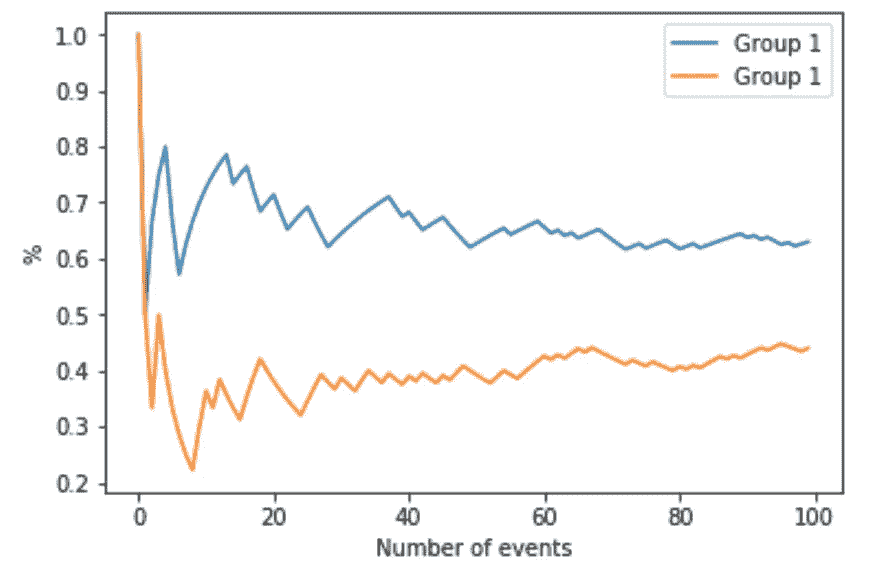

你决定做一个实验，只是为了确定第一组确实比第二组好，但是也要坚持实验设计**一旦达到显著性**就停止实验。

以下是一些可能发生的结果…

# A/B 测试的目标是什么？

正如你们中的一些人可能已经猜到的，上面的图表是两枚硬币各翻转 100 次。他们中的每一个都有 50%的概率正面着地，但在一个小样本实验中，他们总有 50%的概率不会正面着地。

我们进行 A/B 测试的原因是不要等到有显著性(你很快就会看到，p 值很常见< 0.05 at some point of the experiment), but to come up with a system for rejecting or failing to reject the null hypothesis.

Often, a null-hypothesis is *控制组和治疗组之间没有差异*)。

为了拒绝它，我们必须建立一个系统，在这个系统中，似乎不可能没有差别。从数据的角度来看，这可能更容易查看。

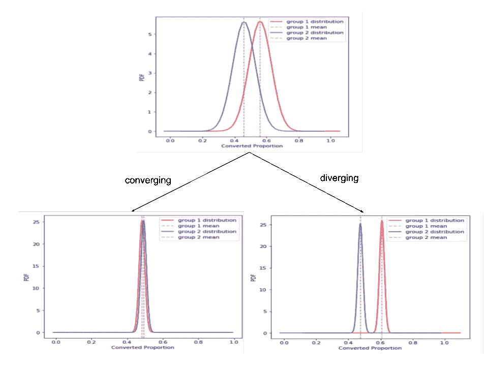

随着样本量的增加，我们的控制和处理会趋同还是趋异？

每组中的样本越多，就越容易区分两组是相同还是不同，因为两组样本之间的方差变小了。

# 实验 1——翻转相等的硬币

让我们试着抛两个硬币，每当 p 值低于 0.05 时做标记:

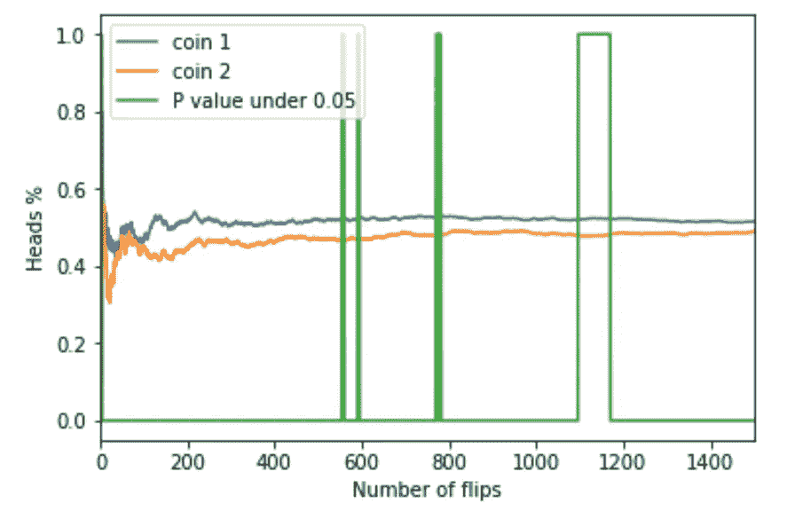

如果 p 值< 0.05

If we stopped the test as soon as we saw “significance”, or as soon as the p-value dipped below 0.05, then there are multiple periods in time that we could have ended a test early and declared a winner. “Blue really is better than orange!” But in reality, you and I both know that the coins have the same probabilities.

Why then did the p-value mislead us?

It’s called chance, or variance. Sometimes, the coins land a little more on heads than tails, or the reverse. If we are comparing two coins, they might go in different directions before converging back together. As you can see in the chart above, most of the time the p-value >为 0.05，绿线会从 0 翻转到 1，只有少数情况下会翻转到< 0.05。

这里还有两个这样的事件:

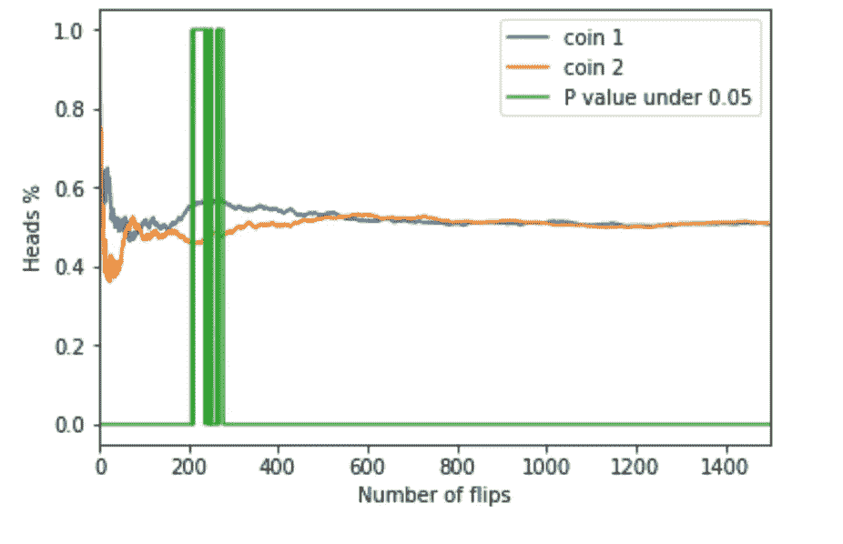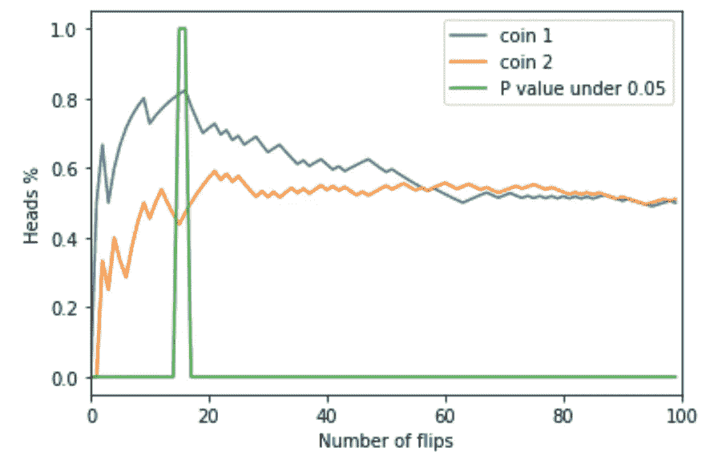

p 值示例< 0.05 at some point in time

We can see that had we waited, we would have been much less likely to have declared a winner since the two groups converge to 50%. This convergence is due to **大数定律**、**、**正因如此，数据科学家喜欢大量样本，以便更清楚地了解分布的真相。

## 实验二——不公平硬币:硬币 1 有 0.5 的几率，硬币 2 有 0.6 的几率

在这种情况下，你对你的团队的实验不耐烦了，你想在一个月后结束。假设一个月只能让你每组参加 800 次活动…

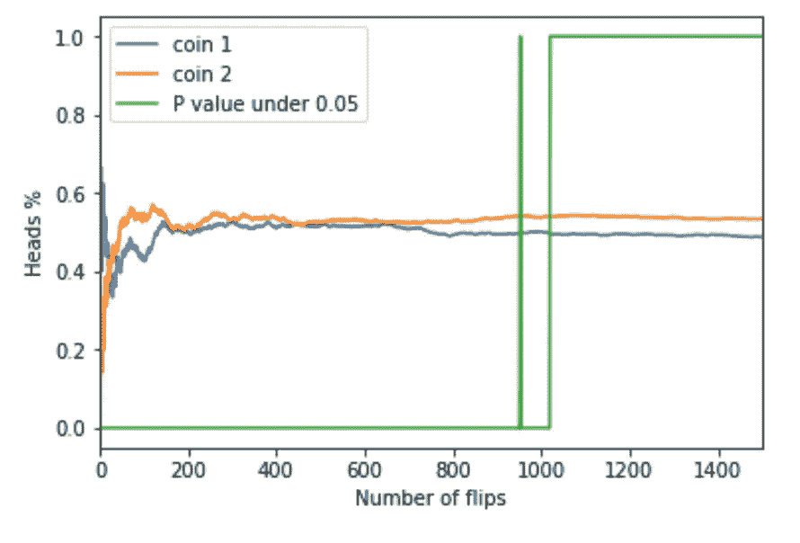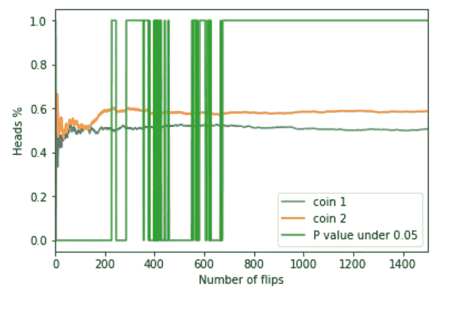

当 coin1！= coin2

有时我们可能很早就看到了真正的不同，而其他时候我们不得不等待真正的改变实现。在某个点之后，p 值阶跃函数翻转并保持翻转状态。换句话说，**一段时间后，我们变得相当确定确实存在差异，如果我们测试显著性，我们很有可能在我们越过事件视界**时看到它。

# 实验 3——知道何时停止

在这里，如果您在仔细分析后计算出预期影响(效果大小)约为 4%，并决定使用 5%的 alpha 值和 80%的幂，您将最终需要 3856 个样本(遵循下面的样本大小计算器链接)。

**当预期效果大小存在实际差异时:**

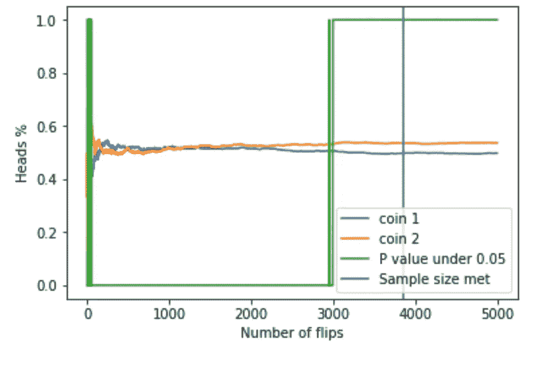

万岁！你的实验成功了！

如果有一个好的实验装置，你很可能会看到它。

**无差异时:**

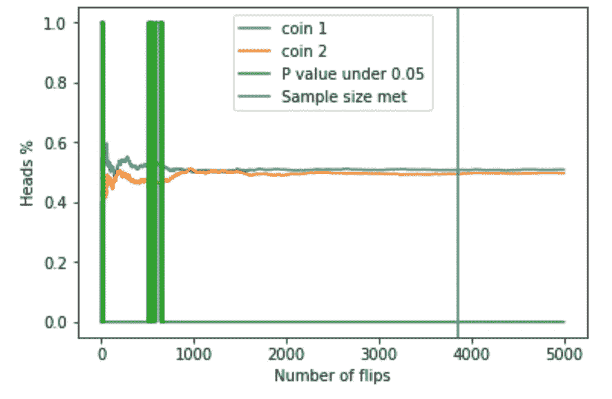

万岁！你的实验成功了！

幸运的是，你没有很早就得出结论说有区别，因为你一直等到你的实验结束。

**当差异大于预期时:**

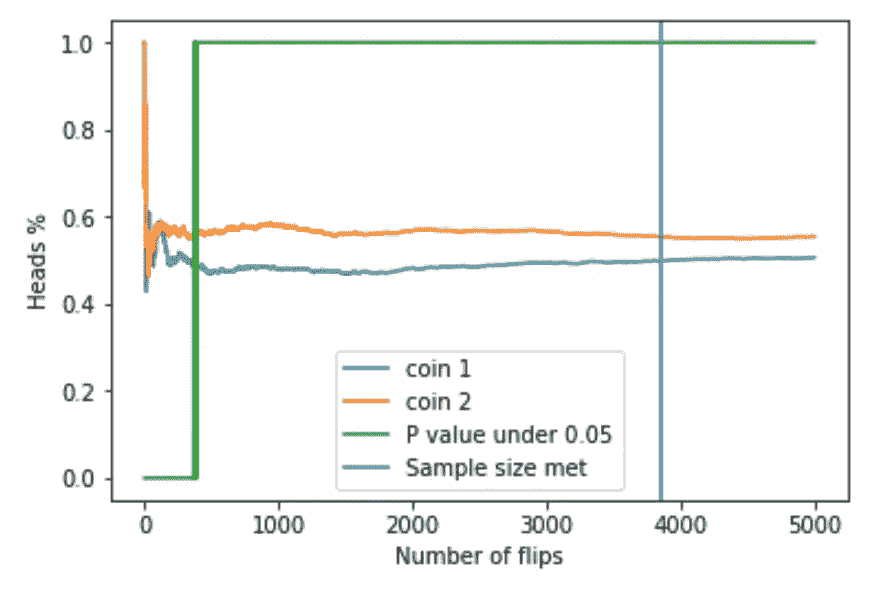

仍然有效，但你浪费了时间。

**当差异小于预期时:**

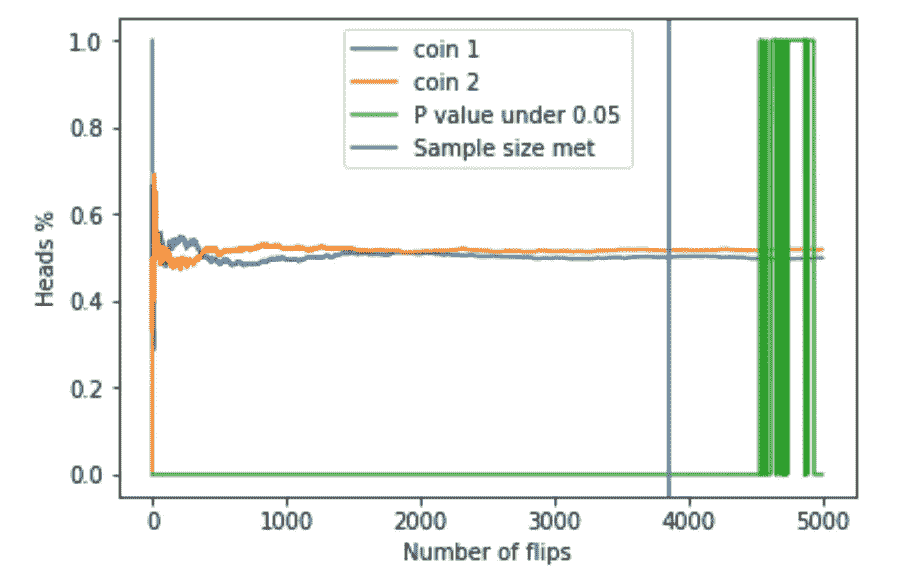

仍然有效，但是你错过了选择一个成功的变体。我说还能用是什么意思？当你设置测试时，你说你期望 X%的大小。在这种情况下，真正的差异要小得多，您的测试表明，在给定的 X%下，我们不能说对照组和治疗组真的有那么大的效果，所以您无法拒绝零。

这些说明了了解预期效果的大小以及等待整个过程后再打电话是多么重要。如果效果大很多，你也不想浪费时间测试。如果效果尺寸更小，你可能会说没有区别。但是，如果效果大小为 0，在一个精心设计的测试中，你有 95%(或者你的 alpha 设置的倒数)可能拒绝错误的改进。

# 实验 4 —概率当它不显著时，我会说它显著

当它不重要时，我说它重要的概率是多少？

这在很大程度上取决于测试运行的时间和您查看的次数。但这里有一些例子:

```
peeks 1, samples 250
probability of saying it’s significant when it’s not: 0.042.peeks 2, samples 250
probability of saying it’s significant when it’s not: 0.079.peeks 3, samples 250
probability of saying it’s significant when it’s not: 0.085.peeks 10, samples 250
probability of saying it’s significant when it’s not: 0.114.peeks 250, samples 250
probability of saying it’s significant when it’s not: 0.174.peeks 500, samples 500
probability of saying it’s significant when it’s not: 0.219.peeks 250, samples 1000
probability of saying it's significant when it's not: 0.271\. peeks 500, samples 1000
probability of saying it's significant when it's not: 0.292.
```

基本上，如果你不断检查，你宣布一个错误的赢家的机会可以超过 30%。这比你原来打算的 5%要高得多。

# 结论

这里的要点是，你不是想什么时候偷看就什么时候偷看，而是在设定的时间后才偷看。这可以防止你根据实验开始时指定的数量做出假阳性或假阴性的声明。一旦你打破了这一点，你有假阳性或假阴性的机会上升。

即使有了硬币，也非常容易被甩开，进行虚假索赔。解决这个问题的唯一方法是利用统计数据并了解所需的样本大小。

## 代码:

[https://gist . github . com/davidblaszka/534 f 88067379587 ff 6 c 06 da 4b 235 E1 cc](https://gist.github.com/davidblaszka/534f88067379587ff6c06da4b235e1cc)

## 参考资料:

 [## 如何不进行 A/B 测试

### 如果你在你的网站上运行 A/B 测试并定期检查…

www.evanmiller.org](https://www.evanmiller.org/how-not-to-run-an-ab-test.html) 

样本大小计算器:

 [## 样本量计算器(Evan 出色的 A/B 工具)

### 需要 iPhone 或 iPad 上的 A/B 样本大小吗？立即下载 A/B 好友。问:一门课程需要多少科目

www.evanmiller.org](https://www.evanmiller.org/ab-testing/sample-size.html)  [## g *功率

### 这些页面是使用 G*Power 版本 3.0.10 开发的。您可以从以下网址下载 G*Power 的最新版本……

stats.idre.ucla.edu](https://stats.idre.ucla.edu/other/gpower/)