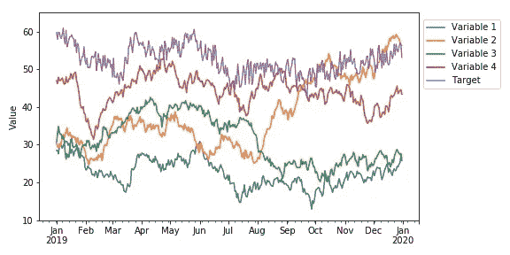
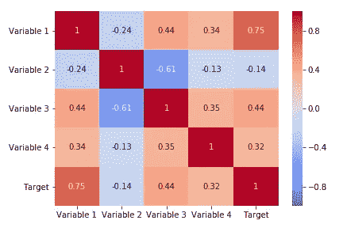
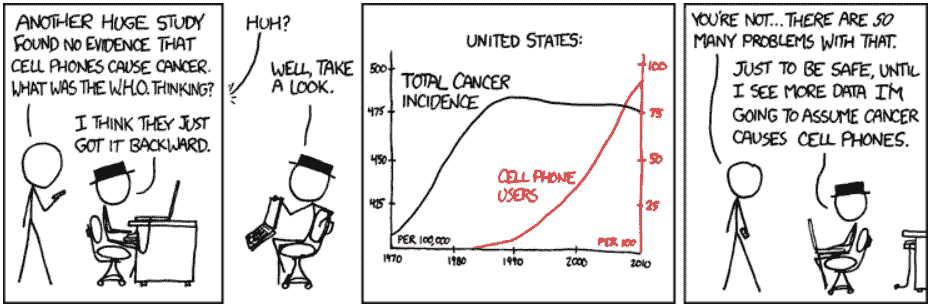
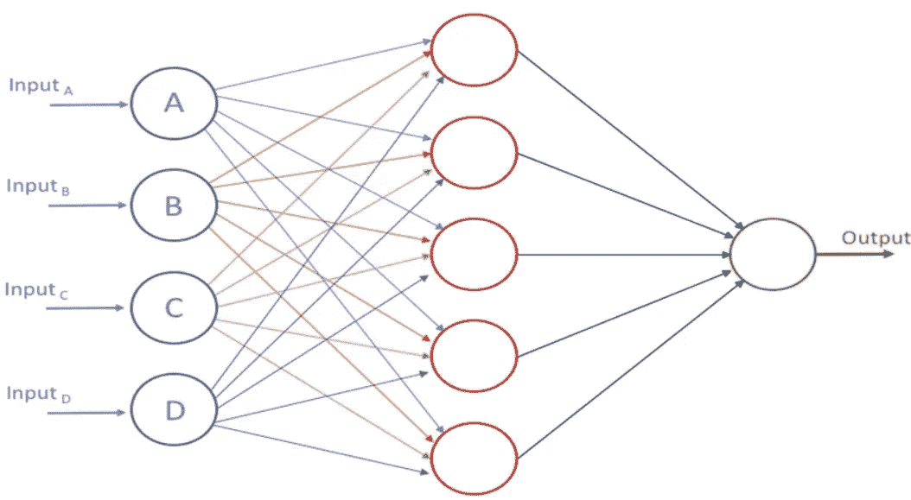
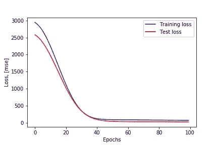
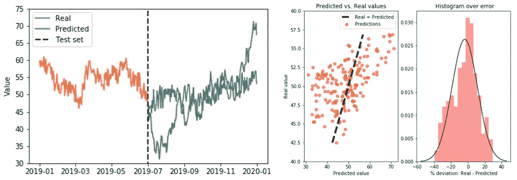
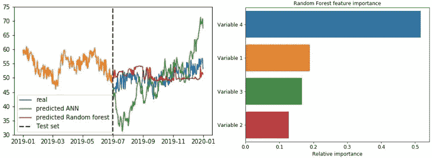
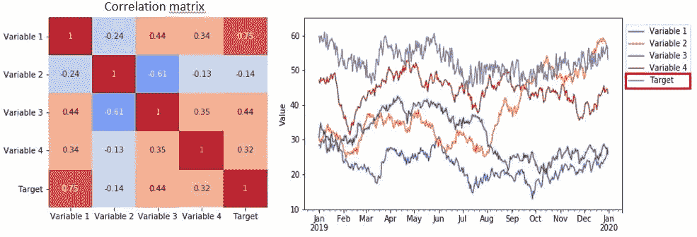
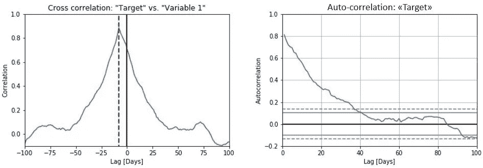
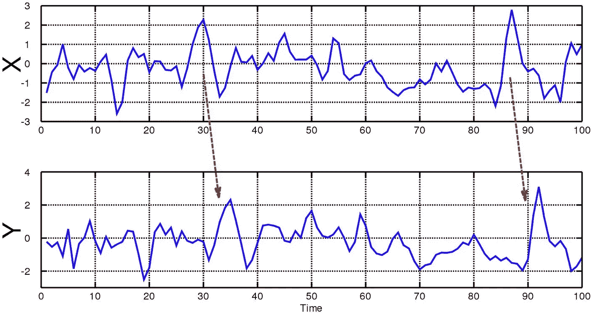

# 如何(不)使用机器学习进行时间序列预测:续集

> 原文：<https://towardsdatascience.com/how-not-to-use-machine-learning-for-time-series-forecasting-the-sequel-e117e6ff55f1?source=collection_archive---------10----------------------->

时间序列预测是机器学习的一个重要领域。这一点很重要，因为有太多的预测问题涉及到时间因素。然而，虽然时间组件增加了额外的信息，但与许多其他预测任务相比，它也使时间序列问题更难处理。顾名思义，时间序列数据不同于其他类型的数据，因为时间方面很重要。从积极的方面来看，这为我们提供了在构建我们的机器学习模型时可以使用的额外信息——不仅输入特征包含有用的信息，而且输入/输出随着时间的变化也包含有用的信息。

我之前关于同一主题的文章[如何(不)使用机器学习进行时间序列预测](https://medium.com/p/19f9d7adf424)，已经收到了很多反馈。基于此，我认为时间序列预测和机器学习是人们非常感兴趣的，许多人都认识到了我在文章中讨论的潜在陷阱。由于对该主题的浓厚兴趣，我选择写一篇后续文章，讨论一些涉及到[时间序列预测](https://en.wikipedia.org/wiki/Time_series)和机器学习的相关问题，以及如何避免一些常见的陷阱。

通过一个具体的例子，我将展示一个人如何表面上有一个好的模型，并决定将它投入生产，而实际上，这个模型可能没有任何预测能力。重要的是，我将更详细地讨论其中的一些问题，以及如何在为时已晚之前发现它们。

# 示例案例:时间序列数据的预测

下图说明了在这种情况下使用的示例数据。我们稍后将更详细地讨论这些数据，但现在，让我们假设这些数据代表了股票指数的年度演变、产品的销售/需求、一些传感器数据或设备状态，以及任何可能与您的情况最相关的数据。目前的基本想法是，数据实际代表的内容不会真正影响下面的分析和讨论。

如图所示，我们总共有 4 个“输入特征”或“输入变量”和一个目标变量，这就是我们试图预测的。这种情况下的基本假设是，我们模型的输入变量包含一些有用的信息，允许我们根据这些特征预测目标变量(可能是，也可能不是)。

# 相关性和因果性

在[统计](https://en.wikipedia.org/wiki/Statistics)中，相关或依赖是任何统计关系，无论[是否为因果](https://en.wikipedia.org/wiki/Causality)。相关性是有用的，因为它们可以表明在实践中可以利用的预测关系。例如，基于电力需求和天气之间的相关性，电力公司可能在温和的日子产生较少的电力。在这个例子中，有一个[因果关系](https://en.wikipedia.org/wiki/Causality)，因为极端天气导致人们使用更多的电力来取暖或制冷。然而，一般来说，相关性的存在不足以推断因果关系的存在(即[相关性并不意味着因果关系](https://en.wikipedia.org/wiki/Correlation_does_not_imply_causation))。这是一个非常重要的区别，我们将在后面详细讨论。

为了检查我们的数据，我们可以考虑的一件事是计算相关矩阵，它表示我们数据集中所有变量之间的相关系数。在[统计](https://en.wikipedia.org/wiki/Statistics)中，皮尔逊相关系数是两个变量之间线性[相关性](https://en.wikipedia.org/wiki/Correlation)的度量。根据[柯西-施瓦茨不等式](https://en.wikipedia.org/wiki/Cauchy%E2%80%93Schwarz_inequality)，它的值介于+1 和 1 之间，其中 1 表示完全正线性相关，0 表示没有线性相关，1 表示完全负线性相关。

然而，虽然相关性是一回事，但我们通常感兴趣的是因果关系。传统观点认为“[相关性并不意味着因果关系](https://en.wikipedia.org/wiki/Correlation_does_not_imply_causation)”这意味着相关性本身不能用来推断变量之间的因果关系(在任一方向上)。

儿童的年龄和身高之间的相关性相当明显，但人的情绪和健康之间的相关性就不那么明显了。心情变好会导致健康变好吗，还是健康变好会带来好心情，或者两者兼而有之？还是两者背后都有其他因素？换句话说，相关性可以作为可能的因果关系的证据，但不能表明因果关系(如果有的话)可能是什么。

(来源:[https://xkcd.com/925/](https://xkcd.com/925/))

相关性和因果性之间的重要区别是建立基于机器学习的预测模型时的主要挑战之一。该模型是根据我们试图预测的流程的代表性数据进行训练的。然后，我们的输入变量和目标之间的任何特征模式/相关性被模型用于建立关系，该关系可用于给出新的预测。

在我们的例子中，从相关矩阵中，我们看到我们的目标变量确实与我们的一些输入变量相关。尽管如此，根据我们的数据训练一个模型，这种明显的相关性可能只是一种统计上的侥幸，它们之间根本没有因果关系。然而，现在，让我们忽略这个事实，并尝试建立我们的预测模型。稍后我们将回头更详细地讨论这些潜在的陷阱。

# 时间序列预测的机器学习模型

有几种类型的模型可用于时间序列预测。在我以前的文章中，我使用了一个长短期记忆网络，或者简称为 [LSTM 网络](https://en.wikipedia.org/wiki/Long_short-term_memory)。这是一种特殊的神经网络，它根据以前时间的数据进行预测，即它在模型结构中明确内置了“记忆”的概念。

然而，根据我的经验，在许多情况下，更简单的模型实际上提供了同样准确的预测。在这个例子中，我实现了一个基于[前馈神经网络](https://en.wikipedia.org/wiki/Feedforward_neural_network)(如下图所示)的预测模型，而不是基于[递归神经网络](https://en.wikipedia.org/wiki/Recurrent_neural_network)。我还将预测与随机森林模型进行了比较(这是我的首选模型之一，基于其简单性和开箱即用的良好性能)。

# 使用开源软件库实现模型

我通常使用 [Keras](https://keras.io/) 来定义我的神经网络模型类型，这是一种高级神经网络 API，用 Python 编写，能够在 [TensorFlow](https://github.com/tensorflow/tensorflow) 、 [CNTK](https://github.com/Microsoft/cntk) 或 [Theano](https://github.com/Theano/Theano) 之上运行。对于其他类型的模型，(像这种情况下的随机森林模型)，我通常使用 [Scikit-Learn](http://scikit-learn.org/stable/) ，这是一个免费的软件机器学习库。它具有各种[分类](https://en.wikipedia.org/wiki/Statistical_classification)、[回归](https://en.wikipedia.org/wiki/Regression_analysis)和[聚类](https://en.wikipedia.org/wiki/Cluster_analysis)算法，并且被设计为与 Python 数值和科学库 [NumPy](https://en.wikipedia.org/wiki/NumPy) 和 [SciPy](https://en.wikipedia.org/wiki/SciPy) 互操作。

本文的主题不是关于如何实现时间序列预测模型的细节，而是如何评估预测。正因如此，我就不赘述建模等细节了。，因为有大量其他博客帖子和文章涉及这些主题。(但是，如果你对这个例子中使用的代码感兴趣，请在下面的评论中告诉我，我会与你分享代码)。

# 训练模型

在使用 Keras 建立神经网络模型之后，我们将数据分成训练集和测试集。前 6 个月的数据用于训练，剩余的数据用作保留测试集。在模型训练期间，10%的数据用于验证，以跟踪模型的表现。然后，可以从下面的训练曲线中可视化训练过程，其中绘制了作为时期函数的训练和验证损失。从训练曲线来看，模型确实能够从数据中学到一些有用的东西。训练和验证损失都随着训练的进行而减少，然后在大约 50 个周期后开始变平(没有明显的[过拟合/欠拟合](https://en.wikipedia.org/wiki/Overfitting)的迹象)。到目前为止，一切顺利。

# 评估结果:

现在，让我们将模型预测与保留测试集中的地面真实数据进行可视化，以查看我们是否有很好的匹配。我们还可以在散点图中绘制真实值与预测值的对比图，并可视化误差分布，如下图右侧所示。

从上面的数字可以清楚地看出，在比较真实值和预测值时，我们的模型并没有获得很好的匹配。我们的模型看似能够学习有用的信息，但在坚持测试集中表现如此糟糕，这是怎么回事？

为了获得更好的比较，让我们也在相同的数据上实现一个[随机森林模型](https://en.wikipedia.org/wiki/Random_forest)，看看这是否会给我们带来更好的结果。正如我们可以从下图左侧的结果中看到的，随机森林模型的性能并不比神经网络好多少。然而，随机森林模型的一个有用的特征是，它还可以输出“特征重要性”作为训练过程的一部分，指示最重要的变量(根据模型)。这种特性的重要性在很多情况下可以为我们提供有用的信息，这也是我们将要详细讨论的内容。

# 虚假的相关性和因果关系

有趣的是，我们从上图中注意到，根据随机森林模型，变量 4 显然是最重要的输入变量。然而，从下图中的相关矩阵和图中，我们注意到与目标最强相关的变量是“变量 1”(它具有第二高的特征重要性)。实际上，如果你仔细观察下面绘制的变量，你可能会注意到变量 1 和目标遵循完全相同的趋势。这是有意义的，在我们下面对本例中使用的数据的讨论中将变得显而易见。

# 本例中使用的数据的来源

随着我们越来越接近完成这篇文章，是时候透露一些关于所用数据来源的额外细节了。如果你读过我之前的一篇关于[时间序列预测机器学习的陷阱](https://www.linkedin.com/pulse/how-use-machine-learning-time-series-forecasting-vegard-flovik-phd/)的文章，你可能已经意识到我是随机行走过程(以及一般的[随机过程](https://en.wikipedia.org/wiki/Stochastic_process))的粉丝。在这篇文章中，我确实选择了一种类似的方法，来解决虚假的相关性和因果关系。

实际上，数据集中的所有变量(4 个输入变量和一个“目标”)都是由随机游走过程生成的。我最初生成了 4 个随机行走体，为了获得目标变量，我简单地实现了“变量 1”的 1 周时间偏移(添加了一点随机噪声，使其第一眼看起来不那么明显)。

因此，变量和目标之间当然没有因果关系。当谈到第一个变量时，由于目标与变量 1 相比在时间上向后移动了一周**，目标变量的任何变化在变量 1 的相应变化之前发生**。因此，与目标变量的唯一耦合是通过随机游走过程本身固有的[自相关](https://en.wikipedia.org/wiki/Autocorrelation)。****

**如果我们计算变量 1 和目标之间的互相关，可以很容易地发现这种时移，如下图左侧所示。在互相关中，有一个 7 天时间偏移的清晰峰值。然而，我们从上面的相关矩阵和下面的图中注意到，即使在零天的滞后期，目标和变量 1 之间也存在显著的相关性(准确地说，相关系数为 0.75)。然而，这种相关性仅仅是因为目标变量具有缓慢衰减的自相关性(明显长于一周的时间偏移)，如下图右侧所示。**

****

# **格兰杰因果关系检验**

**如前所述，我们模型的输入变量与目标相关，并不意味着它们有因果关系。当试图在稍后阶段估计目标时，这些变量实际上可能没有任何预测能力。然而，当制作数据驱动的预测模型时，错误的相关性和因果性是一个容易陷入的陷阱。这就引出了一个重要的问题:我们能做些什么来避免这种情况吗？**

****格兰杰因果检验**是一种[统计假设检验](https://en.wikipedia.org/wiki/Statistical_hypothesis_testing)，用于确定一个[时间序列](https://en.wikipedia.org/wiki/Time_series)是否对[预测另一个](https://en.wikipedia.org/wiki/Forecasting)有用，通常情况下，[回归](https://en.wikipedia.org/wiki/Regression_analysis)反映“仅仅”[相关性](https://en.wikipedia.org/wiki/Correlation)，但是[克莱夫·格兰杰](https://en.wikipedia.org/wiki/Clive_Granger)认为[因果关系](https://en.wikipedia.org/wiki/Causality)可以通过测量使用另一个时间序列的先前值预测一个时间序列的未来值的能力来测试。如果通常通过对 *X* 的[滞后值](https://en.wikipedia.org/wiki/Lag_operator)(也包括 *Y* 的滞后值)的一系列[t-检验](https://en.wikipedia.org/wiki/T-test)和[F-检验](https://en.wikipedia.org/wiki/F-test)可以表明，那些 *X* 值提供了关于未来值的[统计上显著的](https://en.wikipedia.org/wiki/Statistical_significance)信息，则称时间序列 *X* 为格兰杰原因 *Y***

**格兰杰根据两个原则定义了因果关系:**

1.  **原因发生在结果之前。**
2.  ****原因具有关于其结果的未来值的唯一信息。****

**当时间序列 *X* 格兰杰原因导致时间序列 *Y (* 如下图 *)* 时， *X* 中的模式在一段时间延迟后在 *Y* 中大致重复(两个示例用箭头表示)。因此， *X* 的过去值可用于预测 *Y* 的未来值。**

****

**[来源](https://en.wikipedia.org/wiki/Granger_causality)**

**格兰杰因果关系的原始定义没有考虑到[潜在的混杂效应](https://en.wikipedia.org/wiki/Confounding)，也没有捕捉到瞬时和非线性的因果关系。因此，进行格兰杰因果关系测试并不能给你一个明确的答案，即你的输入变量和你试图预测的目标之间是否存在因果关系。尽管如此，它绝对值得研究，并且与纯粹依赖它们之间的(可能虚假的)相关性相比，它提供了额外的信息。**

# **非平稳时间序列的“危险”**

**大多数统计预测方法都是基于这样一种假设，即通过使用数学变换，时间序列可以呈现为近似平稳的(即“平稳化”)。一个[平稳时间序列](https://www.otexts.org/fpp/8/1)是指其统计特性如[表示](https://en.wikipedia.org/wiki/Mean)、[方差](https://en.wikipedia.org/wiki/Variance)、[自相关](https://en.wikipedia.org/wiki/Autocorrelation)等。都是不变的。一个这样的基本转换是对数据进行[时差。](https://www.otexts.org/fpp/8/1)**

**这种变换的作用是，我们不是直接考虑数值，而是计算连续时间步长之间的*差值*。定义模型来预测时间步长值之间的*差异*而不是值本身，这是对模型预测能力的更大考验。在这种情况下，不能简单地使用数据具有很强的自相关性，并使用时间“ *t* 的值作为“ *t+* 1”的预测。由于这一点，它提供了对模型的更好的测试，以及它是否从训练阶段学到了任何有用的东西，以及分析历史数据是否实际上可以帮助模型预测未来的变化。**

# **摘要**

**我想通过这篇文章强调的要点是，在处理时间序列数据时要非常小心。正如上面的例子所示，人们很容易被愚弄(在我以前的一篇关于人工智能和大数据的隐藏风险的文章中也讨论过)。通过简单地定义一个模型，进行一些预测和计算常见的准确性度量，人们可能看起来有一个好的模型，并决定将其投入生产。然而，在现实中，该模型可能没有任何预测能力。**

**有了高质量和易于使用的机器学习库和工具箱，构建模型的实际编码部分变得非常简单。这一进展是个好消息。它节省了我们大量的时间和精力，并限制了实现过程中编码错误的风险。在建立模型的过程中节省下来的时间应该用来集中精力问正确的问题。在我看来，这是数据科学最重要的方面之一。你如何正确地验证你的模型预测？您的数据中是否存在任何隐藏的偏差，可能会扭曲您的预测，或者任何微妙的反馈循环，可能会导致意外的结果？**

**我想强调的最重要的一点是，对数据告诉你的事情保持怀疑是非常关键的。问关键的问题，永远不要得出任何草率的结论。科学方法应该应用于数据科学，就像应用于任何其他种类的科学一样。**

**你自己在机器学习和时间序列预测方面有什么经验？我将非常感谢任何关于这个话题的评论和新的投入。希望你觉得这个帖子有用，觉得有意思就随意分享吧！**

***你觉得这篇文章有趣吗？如果是这样的话，你可能也会喜欢我的其他一些关于人工智能、机器学习、物理等主题的文章。，你可以在下面的链接和我的中型作者简介中找到:***

** [## Vegard Flovik 培养基

### 2018 年夏天我发表第一篇关于“走向数据科学”的文章时，数字背后的统计数据…

medium.com](https://medium.com/@vflovik) 

而且，如果你想成为一个媒体会员，免费访问平台上的所有资料，你也可以使用下面我的推荐链接。(注意:如果您使用此链接注册，我也会收到一部分会员费)

 [## 通过我的推荐链接加入 Medium—Vegard flo vik

### 作为一个媒体会员，你的会员费的一部分会给你阅读的作家，你可以完全接触到每一个故事…

medium.com](https://medium.com/@vflovik/membership) 

# 更多来自 Vegard Flovik 媒体:

1.  蒙特卡洛方法简介
2.  [从物理学到数据科学的转变](/q-a-with-a-data-scientist-1f872518315f)
3.  [什么是图论，为什么要关心？](https://builtin.com/machine-learning/graph-theory)
4.  [用于图像分类的深度迁移学习](/deep-transfer-learning-for-image-classification-f3c7e0ec1a14)
5.  [建造一个能读懂你思想的人工智能](/building-an-ai-that-can-read-your-mind-8b22ad5a7f05)
6.  [人工智能和大数据隐藏的风险](https://medium.com/me/stats/post/3332d77dfa6)
7.  [如何使用机器学习进行异常检测和状态监控](/how-to-use-machine-learning-for-anomaly-detection-and-condition-monitoring-6742f82900d7)
8.  [如何(不)使用机器学习进行时间序列预测:避免陷阱](/how-not-to-use-machine-learning-for-time-series-forecasting-avoiding-the-pitfalls-19f9d7adf424)
9.  [如何利用机器学习进行生产优化:利用数据提高绩效](/machine-learning-for-production-optimization-e460a0b82237)
10.  [如何向 AI 系统教授物理？](/how-do-you-combine-machine-learning-and-physics-based-modeling-3a3545d58ab9)
11.  [我们能否利用纳米级磁铁构建人工大脑网络？](https://medium.com/predict/can-we-build-an-artificial-brain-network-using-nanoscale-magnets-1c0a925973ab)
12.  [供应链管理中的人工智能:利用数据推动运营绩效](/artificial-intelligence-in-supply-chain-management-predictive-analytics-for-demand-forecasting-80d2d512f155)

## 研讨会演示—从宣传到实际应用**