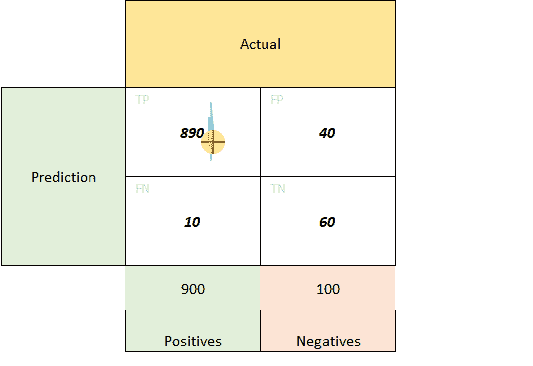

# 如何不使用 ROC、精确回忆曲线和 MCC(马修斯相关系数)

> 原文：<https://towardsdatascience.com/how-not-to-use-roc-precision-recall-curves-mcc-matthews-correlation-coefficient-f68a33108f8b?source=collection_archive---------24----------------------->

## 我们在这些指标上犯的常见错误&如何选择最适合您的业务案例的指标

SpaceX 在 [Unsplash](https://unsplash.com?utm_source=medium&utm_medium=referral) 上拍摄的

作为一名数据科学家，我喜欢很多事情。其中之一就是对你正在为之创建解决方案的业务有一个整体的认识。让我们使用的公式具有真实世界的背景使它变得更加有趣。这就是为什么当我团队中的一位初级同事通过精确回忆曲线向我展示各种模型的比较时，我询问这是否是我们案例的最佳指标，他的反应是，“我可以通过 ROC 曲线展示这一点；也许那样会更好？”

每个有经验的数据科学家都会告诉你，没有对错之分。业务决定了最佳方法。所以，让我向你提出同样的问题，让我们看看什么是好的方法。

> 除非另有说明，所有图片均归作者所有。

# 问题陈述

我们正在为生产齿轮零件的制造工厂实施自动质量控制系统。这是一个计算机视觉问题。作为第一步，我们挑选了一个齿轮零件，并试图根据是否存在划痕、生锈、尺寸不正确等因素将其分为“好”或“坏”。发现的缺陷类型现在并不重要，只需要将其分类为好的或坏的。

此外，将不良零件运送给最终客户的惩罚是巨大的，因此我们应该非常仔细地正确分类不良零件。

让我们假设实际的和预测的(来自我们的模型)结果给出了下面的[混淆矩阵](/the-two-variations-of-confusion-matrix-get-confused-never-again-8d4fb00df308)，其中我们将**好的部分视为*正的*** ，将**坏的部分视为*负的*** :

如果你想温习与混淆矩阵相关的各种指标，如精确度、召回率、特异性，或者更喜欢预测作为列的“其他”表示，我会推荐阅读 [*混淆矩阵的两种变化-弄糊涂了，再也不会了*](/the-two-variations-of-confusion-matrix-get-confused-never-again-8d4fb00df308) 以获得更大的清晰感。

当然，上面的矩阵是基于特定的概率阈值(在这种情况下为 0.5)，ROC 曲线将通过考虑各种阈值来构建，但您可以对一般的类别分布有一个大致的了解。

您应该使用哪个指标？-

1.  受试者工作特征曲线
2.  精确召回曲线
3.  还有别的吗？

# 思维过程

首先，让我们消除 ROC 曲线，因为它不是最适合不平衡的类问题。这里有一个很棒的[视频](https://www.youtube.com/watch?v=4jRBRDbJemM)可以帮你打好基础。

现在进入[精确回忆](https://scikit-learn.org/stable/auto_examples/model_selection/plot_precision_recall.html)曲线——这是我的同事选择的。y 轴表示精度，x 轴表示召回率。如果我在不同的阈值下使用上面的混淆矩阵来绘制这条曲线，你会发现这个方法有什么问题吗？

> 精确回忆曲线应该会把我们的注意力吸引到 P **阳性类别**。

如果我们想把注意力集中在“坏”的阶层上，那么积极和消极的阶层应该互换。这类似于一个医学用例，在这个用例中，癌症的检测相当于检测结果为“**阳性**”。如果只有很少的人/部分会有癌症/缺陷，那么我们将它设为阳性类别，然后使用 PR 曲线。

如果您不想交换类别标签，另一种非传统的方法是将 y 轴映射为 **TN/(TN+FN)** ，x 轴映射为特异性或 **TN/(TN+FP)** 。我可以用数学来解释这些新的轴，但是一个非常直观的记忆方式是:

**案例一**(传统 PR 曲线):以 TP 为‘pivot’，pivot 除以行和为 y 轴(精度)，pivot 除以列和为 x 轴(回忆)。

“传统”公关曲线

**案例二**(非传统曲线):既然你不希望交换标签，我们就以 TN 为支点。同样，与上面完全一样，pivot 除以行总和是 y 轴，而 pivot 除以列总和是 x 轴(特异性)。

“非传统”曲线

理想的 PR 曲线在(1，1)处具有“最佳”值。

# 一些其他指标？

如果不提及马修斯相关系数或 MCC，这篇文章将是不完整的。

MCC 适用于这样的情况:您希望在预测所有类时评估模型的性能，而不特别关注任何特定的类。这里有一个关于这个话题的很棒的博客。

想象一下——很快，我们的问题陈述会扩大，客户会要求将所有不同的缺陷分开分类，而不仅仅是“好”或“坏”。因此，它可能是“划痕”、“尺寸错误”、“生锈”、“良好”等等。

一旦我们筛选出几个型号，最好有一个单一的指标来比较它们在不同类别中的整体表现。MCC 就是这么做的。

希望这让您对不同的场景有所了解，在这些场景中，不同的指标是有价值的。理解它们背后的数学总是一个好主意，因为只有这样，人们才能根据自己的特定需求调整它们——就像我们将 PR 曲线调整为非传统曲线一样。

对分享想法、提问或简单讨论想法感兴趣？通过我的网站、[我只是个学生](http://iamjustastudent.com/about)或者在 [LinkedIn](https://www.linkedin.com/in/himanshu-chandra-33512811/) 、 [YouTube](https://www.youtube.com/channel/UChNybQwpqrX9SOc1D4K_x5Q) 或 [GitHub](https://github.com/HCGrit/MachineLearning-iamJustAStudent) 上与我联系。

回头见&学习愉快！

 [## Himanshu Chandra -业务主管-ML

### .

www.linkedin.com](https://www.linkedin.com/in/himanshu-chandra-33512811/)