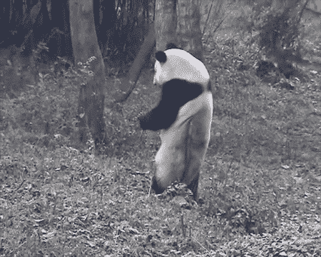

# 如何不写熊猫代码

> 原文：<https://towardsdatascience.com/how-not-to-write-pandas-code-2cbda8b3816c?source=collection_archive---------12----------------------->

## 大部分“如何不”用熊猫编码的想法来自于我的开始。每一次失败后，我都会向熊猫展示一个正确的“方法”。


来自 [Giphy](https://giphy.com/gifs/natgeowild-panda-nat-geo-wild-mission-critical-l3vRbgCJxtSXS9jFe) 的《国家地理坠落的熊猫》

在过去的 3 年里，我一直用熊猫作为我数据分析的主要工具。我必须承认,“如何不用熊猫编码”的大部分内容都来自于我的开端。在进行代码评审时，我仍然看到许多经验丰富的程序员的“禁忌”。

在这篇文章中，我首先展示了一个“如何不”的例子，然后展示了一个正确的“如何”用熊猫计算统计数据的方法。

改进的理由是简洁、更可读的代码和更快的执行速度。报告的时间格式为:`831 ms ± 25.7 ms per loop`，表示平均 831 毫秒，标准偏差为 25.7 毫秒。每个代码样本执行多次，以计算准确的执行时间。

**这里有几个你可能会感兴趣的链接:**

```
- [How To Create Date Series in SQL](https://dataanalysis.substack.com/p/how-to-create-date-series-in-sql) [Article]- [Data Science for Business Leaders](https://imp.i115008.net/c/2402645/880006/11298) [Course]- [Intro to Machine Learning with PyTorch](https://imp.i115008.net/c/2402645/788201/11298) [Course]- [Become a Growth Product Manager](https://imp.i115008.net/c/2402645/803127/11298) [Course]- [Free skill tests for Data Scientists & Machine Learning Engineers](https://aigents.co/skills)
```

*上面的一些链接是附属链接，如果你通过它们购买，我会赚取佣金。请记住，我链接课程是因为它们的质量，而不是因为我从你的购买中获得的佣金。*

要升级您的熊猫游戏，请参见:

[](https://medium.com/@romanorac/pandas-data-analysis-series-b8cec5b38b22) [## 熊猫数据分析系列

### 从提示和技巧，如何不指南到与大数据分析相关的提示，熊猫文章的精选列表。

medium.com](https://medium.com/@romanorac/pandas-data-analysis-series-b8cec5b38b22) 

# 样本数据集

示例数据集包含各个城市的预订信息。它是随机的，它的唯一目的是显示例子。

数据集有 3 列:

*   **id** 是唯一 id，
*   **城市**是预订的城市，
*   **booked_perc** 是某个时间的预订百分比。

数据集具有 10K 条目，以使速度提高更加明显。如果以正确的方式编写代码，Pandas 可以在数百万行的数据帧上计算统计数据。

```
import pandas as pd
import numpy as npsize **=** 10000cities **=** ["paris", "barcelona", "berlin", "new york"]df **=** pd**.**DataFrame(
    {"city": np**.**random**.**choice(cities, size**=**size), "booked_perc": np**.**random**.**rand(size)}
)
df["id"] **=** df**.**index**.**map(str) **+** "-" **+** df**.**city
df **=** df[["id", "city", "booked_perc"]]
df**.**head()
```


# 1.如何不对数据求和


来自 [Reddit](https://www.reddit.com/r/gifs/comments/4invm5/rolling_panda/) 的滚动熊猫

我来自 Java 世界，我把“多行中的 for 循环”带到了 Python。

让我们计算 booked_perc 列的总和—我知道对百分比求和没有意义，但我们还是要这样做:)

```
**%%**timeitsuma **=** 0
**for** _, row **in** df**.**iterrows():
    suma **+=** row**.**booked_perc766 ms ± 20.9 ms per loop (mean ± std. dev. of 7 runs, 1 loop each)
```

对一列的值求和的更巧妙的方法是:

```
**%%**timeitsum(booked_perc **for** booked_perc **in** df**.**booked_perc)989 µs ± 18.5 µs per loop (mean ± std. dev. of 7 runs, 1000 loops each)**%%**timeitdf**.**booked_perc**.**sum()92 µs ± 2.21 µs per loop (mean ± std. dev. of 7 runs, 10000 loops each)
```

正如所料，第一个例子是最慢的——对 10k 个条目求和几乎需要 1 秒钟。第二个例子的速度之快让我吃惊。用 pandas 对数据求和的正确方法(或对列使用任何其他操作)是第三个例子，也是最快的！

# 2.如何不过滤数据


来自[吉菲](https://giphy.com/gifs/panda-playing-QoCoLo2opwUW4)的熊猫游戏

尽管在开始使用 pandas 之前，我对 numpy 很有经验，但我是在 for 循环中过滤数据。您可以在计算总和时观察性能损失。

```
**%%**timeitsuma **=** 0
**for** _, row **in** df**.**iterrows():
    **if** row**.**booked_perc **<=** 0.5:
        suma **+=** row**.**booked_perc831 ms ± 25.7 ms per loop (mean ± std. dev. of 7 runs, 1 loop each)**%%**timeitdf[df**.**booked_perc **<=** 0.5]**.**booked_perc**.**sum()724 µs ± 18.8 µs per loop (mean ± std. dev. of 7 runs, 1000 loops each)
```

正如所料，第二个例子比第一个快几个数量级。

多加几个滤镜呢？我们简单地将它们括在括号中:

```
**%%**timeitdf[(df**.**booked_perc **<=** 0.5) **&** (df**.**city **==** 'new york')]**.**booked_perc**.**sum()1.55 ms ± 10.7 µs per loop (mean ± std. dev. of 7 runs, 1000 loops each)
```

# 3.如何不访问以前的值


来自 [Giphy](https://giphy.com/gifs/pandas-12L6wFC7gHKQ92) 的熊猫翻滚

您可能会说:好吧，但是当我需要访问前一列的值时怎么办？那么我需要一个 for 循环。不对！

让我们计算在有和没有 for 循环的情况下从一行到另一行的百分比变化。

```
**%%**timeit**for** i **in** range(1, len(df)):
    df**.**loc[i, "perc_change"] **=**  (df**.**loc[i]**.**booked_perc **-** df**.**loc[i **-** 1]**.**booked_perc) **/** df**.**loc[i **-** 1]**.**booked_perc7.02 s ± 24.4 ms per loop (mean ± std. dev. of 7 runs, 1 loop each)**%%**timeitdf["perc_change"] **=** df**.**booked_perc**.**pct_change()586 µs ± 17.3 µs per loop (mean ± std. dev. of 7 runs, 1000 loops each)
```

同样，第二个例子比第一个 for 循环快得多。

Pandas 有许多函数可以基于以前的值计算统计数据(例如，`shift`函数延迟一个值)。这些函数采用`periods`参数，该参数定义了要包含在计算中的先前值的数量。

# 4.如何不应用复杂函数



来自 [Giphy](https://giphy.com/gifs/panda-working-pole-9rYAlBv4PnP44) 的熊猫工作杆

有时，我们需要对一个数据帧应用一个复杂的函数(一个有多个变量的函数)。假设我们想将纽约的 booking_perc 乘以 2，将其他值设为 0，并将列命名为 sales_factor。

我想到的第一种方法是使用带有 iterrows 的 for 循环。

```
**%%**timeit**for** i, row **in** df**.**iterrows():
    **if** row**.**city **==** 'new york':
        df**.**loc[i, 'sales_factor'] **=** row**.**booked_perc ***** 2
    **else**:
        df**.**loc[i, 'sales_factor'] **=** 03.58 s ± 48.2 ms per loop (mean ± std. dev. of 7 runs, 1 loop each)
```

稍微好一点的方法是直接在数据帧上使用 apply 函数。

```
**%%**timeit**def** **calculate_sales_factor**(row):
    **if** row**.**city **==** 'new york':
        **return** row**.**booked_perc ***** 2
    **return** 0df['sales_factor'] **=** df**.**apply(calculate_sales_factor, axis**=**1)165 ms ± 2.48 ms per loop (mean ± std. dev. of 7 runs, 10 loops each)
```

最快的方法是使用熊猫滤镜，直接计算函数值。

```
**%%**timeitdf**.**loc[df**.**city **==** 'new york', 'sales_factor'] **=** df[df**.**city **==** 'new york']**.**booked_perc ***** 2
df**.**sales_factor**.**fillna(0, inplace**=**True)3.03 ms ± 85.5 µs per loop (mean ± std. dev. of 7 runs, 100 loops each)
```

我们可以观察到从第一个例子到最后一个例子的加速。

当我们处理 3 个或更多变量的函数时，我们可以把它分解成多个熊猫表达式。这将比使用应用功能更快。

`f(x, a, b) = (a + b) * x`

```
df['a_plus_b'] = df['a'] + df['b']
df['f'] = df['a_plus_b'] * df['x']
```

# 5.如何不对数据进行分组


来自 [Giphy](https://giphy.com/gifs/natgeowild-panda-nat-geo-wild-mission-critical-l3vQWz6kFbX5RWgaQ) 的熊猫

正如你现在看到的，当我开始使用 pandas 时，我非常依赖 for 循环。通过对数据进行分组，您可以在使用 pandas 时最大限度地减少代码行数。

假设我们想计算:

*   城市的平均销售系数
*   以及城市的第一个预订 id。

```
**%%**timeitavg_by_city **=** {}
count_by_city **=** {}
first_booking_by_city **=** {}**for** i, row **in** df**.**iterrows():
    city **=** row**.**city
    **if** city **in** avg_by_city:
        avg_by_city[city] **+=** row**.**sales_factor
        count_by_city[city] **+=** 1
    **else**:
        avg_by_city[city] **=** row**.**sales_factor
        count_by_city[city] **=** 1
        first_booking_by_city[city] **=** row['id']**for** city, _ **in** avg_by_city**.**items():
    avg_by_city[city] **/=** count_by_city[city]878 ms ± 21.4 ms per loop (mean ± std. dev. of 7 runs, 1 loop each)
```

Pandas 有一个 group by 操作，所以不需要迭代数据帧。pandas 中的 group by 与 SQL 中的 GROUP BY 语句做同样的事情。

```
**%%**timeitdf**.**groupby('city')**.**sales_factor**.**mean()
df**.**groupby('city')**.**sales_factor**.**count()
df**.**groupby('city')**.**id**.**first()3.05 ms ± 65.3 µs per loop (mean ± std. dev. of 7 runs, 100 loops each)**%%**timeitdf**.**groupby("city")**.**agg({"sales_factor": ["mean", "count"], "id": "first"})4.5 ms ± 131 µs per loop (mean ± std. dev. of 7 runs, 100 loops each)
```

令人惊讶的是，第三个例子并不是最快的，但它比第二个例子更简洁。当你需要加速你的代码时，我建议你使用第二种方法。

# 结论


来自 [Giphy](https://giphy.com/gifs/z6xE1olZ5YP4I) 的快乐熊猫

我的建议是:

> 如果你对熊猫使用 for 循环，可能有一个更好的方法来写它。

存在计算开销很大的函数，即使上面的优化也无济于事。然后，我们需要使用最后的手段:Cython 和 Numba，我将在接下来的几周中介绍这两个地方。

你喜欢这个职位吗？学到了新东西？请在下面的评论中告诉我。

# 在你走之前

像往常一样，你可以下载这个 [Jupyter 笔记本](https://romanorac.github.io/assets/notebooks/2019-12-09-how-not-to-write-python-code.ipynb)在你的机器上尝试例子。

在[推特](https://twitter.com/romanorac)上关注我，在那里我定期[发关于数据科学和机器学习的](https://twitter.com/romanorac/status/1328952374447267843)推特。

