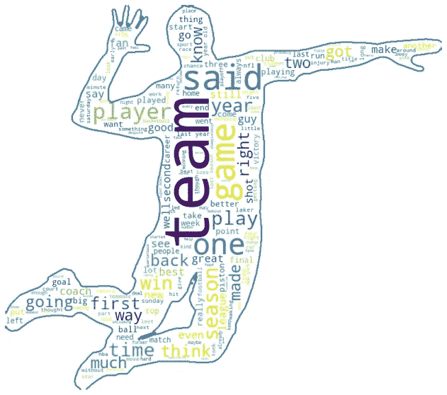
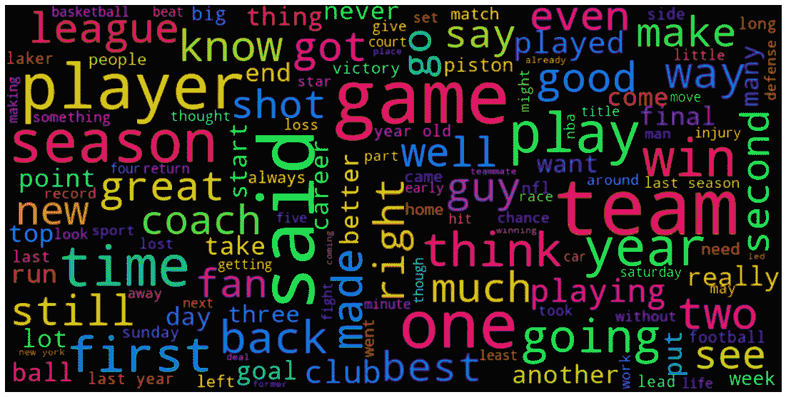
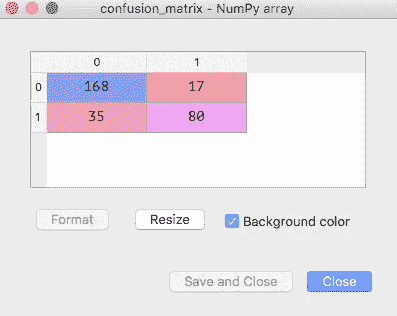

# 体育文章有多客观？

> 原文：<https://towardsdatascience.com/how-objective-are-sports-articles-690277250f2e?source=collection_archive---------71----------------------->

## [随机数据集挑战](https://medium.com/@shraddha.anala)

## 分析客观性和可视化词云

探索不同类别文章的内容对于确定它们的质量、它们是否真的有用以及弄清楚它们是否是**主观的**非常重要；*作者自己的个人观点分量很重，*还是**客观**；*作者提出了一个更中立的立场。*

照片由 [Tim Gouw](https://unsplash.com/@punttim?utm_source=medium&utm_medium=referral) 在 [Unsplash](https://unsplash.com?utm_source=medium&utm_medium=referral) 上拍摄

> 在本教程中，我们将查看 [**体育文章数据集**](https://archive.ics.uci.edu/ml/datasets/Sports+articles+for+objectivity+analysis) ，并从这些文章中构建美丽的词云，以及分析这 1000 篇文章中的独立特征，以计算出它们的客观性/主观性得分。本教程和实现是我的 [**随机数据集挑战**](https://medium.com/@shraddha.anala/randomized-link-generator-for-datasets-f46342b5033) 的一部分，在那里我构建了不同的机器学习模型来扩展我的数据科学技能。

# 关于数据集:

数千篇体育文章被亚马逊土耳其机器人标注为主观或客观。附加特征，例如字数、语义分数、名词、形容词、符号的频率等。，都是从这些文章中摘录的。

所以我们有两个信息来源。体育文章本身加上可量化的数字特征矩阵。

# 教程:

## 1)词云可视化-

让我们从构建一个单词云开始，实际上，有两个，所以我们可以看看最频繁出现的单词。

字云形状的排球运动员中期穗。图片作者。

首先，为了将单词组合成这种形状，我们必须将文章中的所有单词提取到一个语料库中。

我们将使用自然语言处理技术从文章中提取词干、词条和删除停用词，以及除字母数字字符之外的任何特殊字符。

然后，我们将使用单词云方法和一些其他参数来设置单词云的大小，并指定要使用的掩码。

这是你以前可能见过的另一种形状更正常的单词云。

词云。图片作者。

## 2)客观性分析-

在这个更“简单”的分析中，我们将使用**功能** excel 表来查看哪种技术属性，属于主观文章还是更客观的文章。

像往常一样，我们将从导入所需的库、数据集、预处理数据和训练模型开始。

经过对多个分类器的反复试验，我发现支持向量分类器的性能最好，准确率为 82.66%。

## 3)混淆矩阵-

混淆矩阵是另一个性能指标，它一眼就能告诉我们 ***，对于每个类，模型正确和错误地分类了多少个观察值。***

混乱矩阵。图片作者。

可以看出，我们的模型正确预测了(*预测=实际*)，168 篇客观文章，80 篇主观文章。对于客观文章来说，不正确的预测是 35 个，即 35 个主观文章被错误地分类为客观文章，而对于 17 个实际客观文章则相反，它们被错误地标记为主观文章。

这就是了。又是一天，又是一个机器学习模型。

这一次，我想做一些不同的事情，让*同时使用* **NLP** 和**分类算法**来分析文章。

整合文本文章和可量化的特征数据集，我想到了绘制单词云，因为当我在其他几篇文章中遇到它时，我一直想知道如何做。

希望这篇文章/教程对你有帮助。如果你想看看我的其他作品，可以看看我的 [**GitHub**](https://github.com/shraddha-an) **。**

这个系列的其他文章可以在 [**这里**](https://medium.com/@shraddha.anala) 找到。

非常感谢您的阅读，祝您有美好的一天！

下一篇文章再见。