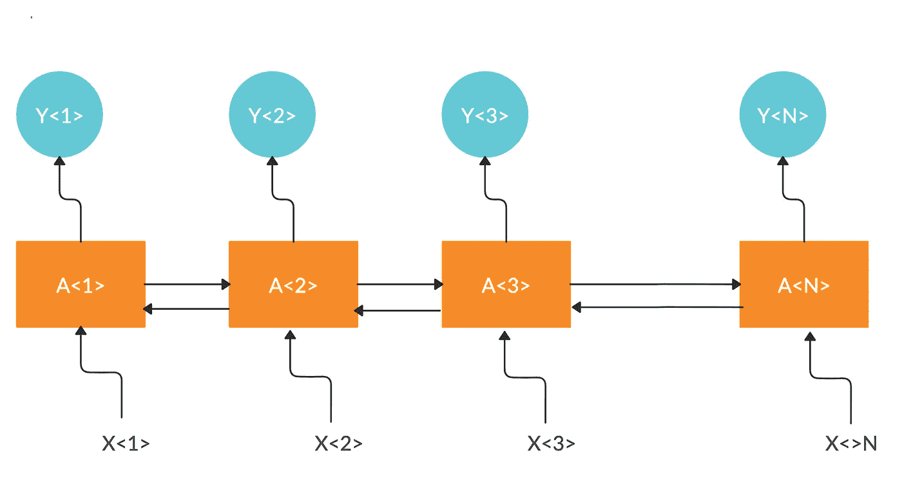

# 使用序列模型的自然语言生成

> 原文：<https://towardsdatascience.com/how-our-device-thinks-e1f5ab15071e?source=collection_archive---------23----------------------->

## 使用单层 LSTM 模型生成文本

递归神经网络(图片由作者提供)

# **简介**

如果我告诉你，你可以让你自己的设备以你自己的方式用不到 100 行代码为你写东西，那会怎么样？

让你的设备代表你书写的想法非常鼓舞人心。这种实践被称为**文本生成**或**自然语言生成**，这是自然语言处理(NLP)的一个子领域。

文本生成的基础可以很容易地分解成一个简单的监督机器学习问题，其中，存在某些特征(称为 x)及其相应的标签(称为 y)，并且使用这些特征，我们可以创建我们自己的预测函数，该预测函数然后将生成我们预测的标签(称为 ŷ或 yhat)。然后，我们将这些预测标签映射到实际标签，以确定成本并使用优化算法(如梯度下降、RMSprop 甚至 Adam 优化器)进行优化。

我们把文本生成的任务简化为一个简单的预测问题。因此，通过这一点，我们可以有一个文本语料库，其中可能有几个句子。我们提取每个句子(假设它有 *n* 个单词),在每个句子中，我们将开始的 *n-1* 个单词标记为特征(称为 x ),将第*n*个单词标记为标签(称为 y)。

现在，假设我们有一个句子，“深度学习已经自动化了我们的世界”，在这里，“深度学习已经自动化了我们的”这个短语可以是特征(称为 x)，最后一个词“世界”可以是标签(称为 y)。所以在未来，每当设备遇到文本“深度学习已经自动化了我们的”时，它就会知道预测“世界”是下一个单词。

结果，如果我们用大量的数据训练一个网络，我们会得到一个相当复杂的模型，可以预测接下来的单词和 *voilà* ，我们已经教会了我们的设备写作。

# **使用 TensorFlow 生成文本**

我们现在将学习如何应用实用方法生成新文本。为此，我们将使用 TensorFlow 2.0，这是一个开源的机器学习库。

导入必要的库

为此需要遵循的步骤是:

*   **数据预处理:**

我们来看两个例句:

**艾是新电**

**AI 就是我的力量**

(*注意，与机器学习实践者用来训练模型的实际数据相比，这里采集的样本非常小。通常，使用作家出版物的整个语料库或整本书作为数据集，然而在这里，为了便于理解，作者只取了其中的一小部分。)*

为简单起见，为了减少我们集合中的大量单词，我们可以将句子中的每个单词都转换为小写，因为这不会改变句子的意思(new、NEW 和 New 都是相同的意思)。我们可以通过使用*来做到这一点。Python 3 中的 lower()* 。

所以我们句子的小写形式是:

**艾是新电**

**ai 是我的力量**

我们现在有一个样本来训练我们的模型。接下来要做的是为每个单词生成一个唯一的令牌。语料库中的重复单词被分配相同的标记。这可以使用 TensorFlow 中的 Tokenizer 轻松完成。

第一句:

**ai - > 1**

**是- > 2**

**->3**

**新增- > 4**

**电- > 5**

第二句:

**ai - > 1**

**是- > 2**

**我的- > 6**

**电源- > 7**

现在，我们可以用一系列数字来表示我们的句子:

**【1，2，3，4，5】**->为第一句

**【1、2、6、7】**->**为第二句**

**生成令牌**

**我们现在生成 *n-gram* 序列，其中，这样的句子的前两个单词可以是一个序列，前三个单词可以是下一个序列，以此类推。因此，我们列出了以下可能的顺序:**

**对于第一句[1，2，3，4，5]**

**[1, 2]**

**[1, 2, 3]**

**[1, 2, 3, 4]**

**[1, 2, 3, 4, 5]**

**对于第二句[1，2，6，7]**

**[1, 2]**

**[1, 2, 6]**

**[1, 2, 6, 7]**

**我们现在将这些生成的序列添加到另一个列表中(形成一个 2-D 列表)。**

**生成 n 元语法序列**

**这里需要注意的一个关键点是，每个生成序列的长度是不同的，因此为了保持顺序，我们用零预先填充，每个序列的长度等于可用的最长序列。因为在当前情况下，序列的最大长度是 5，所以我们相应地进行预填充。可以使用 Keras 的 pad_sequences()方法进行填充。**

**填充后，每个序列将看起来像:**

**对于第一句[1，2，3，4，5]**

**[0, 0, 0, 1, 2]**

**[0, 0, 1, 2, 3]**

**[0, 1, 2, 3, 4]**

**[1, 2, 3, 4, 5]**

**对于第二句[1，2，6，7]**

**[0, 0, 0, 1, 2]**

**[0, 0, 1, 2, 6]**

**[0, 1, 2, 6, 7]**

**我们现在知道，对于这些序列中的每一个，前 4 个字是特征(称为 x)，最后一个字是标签(称为 y)。然后，我们通过简单的 NumPy 数组切片来提取我们的特征及其相应的标签。**

**剩下要做的一件事是将我们的标签转换成一个热点编码向量，以便于优化。**

**说特征是**x =【0，1，2，3，4】****

**对应的标签是**标签=【5】****

**因此，标签的独热码编码向量是:[0，0，0，0，1]，即在向量的第 5 个位置存在 1，在剩余位置存在 0。**

**因此， **y = [0，0，0，0，1]****

**生成要素(x)和标注(y)**

**我们现在已经准备好了可以输入到模型中的训练数据。**

*   ****构建模型:单层 LSTM 模型****

**我们定义了一个序列模型，其中每一层恰好有一个输入张量和一个输出张量。**

1.  **第一层是**嵌入层**，它将是网络中的第一层。这一层有三个参数，即输入维度(我们的语料库中唯一单词的总数)；输出维度(或向量将被映射的嵌入维度)；和输入长度(输入的每个序列的长度)。**
2.  **对于第二层，我们添加了 20 个单元的**双向 LSTM** 层，这对于处理长句和依存关系中的消失梯度问题是有效的。**
3.  **因此，在第三层，我们添加了一个**密集层**和 *p* 单元。其中 *p* 是我们的语料库中唯一单词的总数，我们将 softmax 激活应用于这些单元中的每一个。**

**模型构建**

*   ****编译模型:****

**由于下一个单词的预测是一个多类分类问题，我们选择我们的损失函数作为**分类交叉熵**和优化器作为 **Adam。**通过选择这一优化器，我们允许 TensorFlow 自行调整学习速率，这为我们消除了一个需要微调的超参数。然后我们训练模型，比如说 500 个时期。**

**编译模型**

**拟合训练数据后，我们的模型显示训练准确率接近 95%，剩下我们要做的就是使用该模型进行预测。**

*   ****预测下一个单词:****

**现在，为了进行预测，我们必须给我们的模型一些感知，让它知道我们希望它在什么意义上生成文本。为此，我们给它一个初始短语或句子，然后模型解析它，并根据我们训练它的文本语料库进行计算预测。因此，该模型将预测下一个单词的标记，然后将该标记转换回原始单词，最后显示整个预测的字符串。**

**预测接下来的 t 个单词(这里 t=5)**

**现在通过一个例子来理解整个过程，让我们用下面的句子来训练这个模型:**

**深度学习的范围一直在以指数速度增长，深度学习蓬勃发展的原因隐藏在这样一个事实中，即在当今世界中存在大量我们认为理所当然的应用程序，从在我们的 iPhone 上使用嘿 Siri(触发词检测)到在我们的 Gmail/LinkedIn 上使用自动回复(情感分析)；深度学习已经在我们甚至没有意识到的情况下自动化了我们的世界。这个世界需要深度学习来维持，因为它已经变得必要。”**

**这里，生成新文本的种子是:**

****输入=人工智能的范围****

**因此，该模型预测:**

****输出=人工智能学习范围已经自动化了我们的世界****

**现在，由于我们的模型，预测的句子可能在语法上不正确，但句子的整体主旨很容易理解。**

# ****总而言之****

**人们可能会认为模型做出的预测看起来有些微不足道，但必须记住，在文本生成之前，我们的设备无法形成新的句子，事实上，它甚至不知道构造单词所需的基本字母。**

**从让我们的设备理解文本中的情感到预测给定序列中的新词，NLP 已经走过了很长的路，我们甚至可以走得更远。**

**这里是作者的 Github 库的链接，可以参考完整的代码。**

** [## ujjwalkumar 2607/NLP-使用 LSTM 自动生成文本

### 该模型被给予一个初始数据序列来学习，这是:“深度学习的范围已经…

github.com](https://github.com/ujjwalkumar2607/NLP-automatic-text-generation-with-LSTM)**