# 疫情如何影响大学成绩:基于真实数据集的分析

> 原文：<https://towardsdatascience.com/how-pandemic-has-affected-college-scores-analysis-on-real-dataset-e6cea8c469b1?source=collection_archive---------49----------------------->

## 深入探究我的大学成绩并发现其中的趋势

疫情冠状病毒已经影响了世界上很多人。所有类型的企业都崩溃了，人们正在转向不同的领域，大多数行业正在转向在线模式。随着在线模式在今天如此普遍，教育领域也不例外。我住在印度和这里，这是第一次所有的教育机构都选择在线教学方法。这个系统对我们来说很新，完全适应这个环境需要时间。最近，我第四学期的成绩公布了，当我把这学期的统计数据与前几个学期进行比较时，我震惊了。想知道我发现了什么？开始挖掘数据吧！

由[乔治·托马塞蒂](https://unsplash.com/@gtomassetti?utm_source=medium&utm_medium=referral)在 [Unsplash](https://unsplash.com?utm_source=medium&utm_medium=referral) 上拍摄的照片

# 关于数据

## 数据看起来怎么样？

我所在的大学最棒的一点是，它以开放的 pdf 格式发布结果，每个访问其网站的人都可以访问这些结果。但是这里有一个问题，pdf 有多层、多层次的表格，很难处理。即使您查看表格并尝试推断您的最终得分，这也是一个繁琐的过程，因为您需要参考多个 pdf 中的多个页面来获得想要的值。以下是 PDF 的截图:

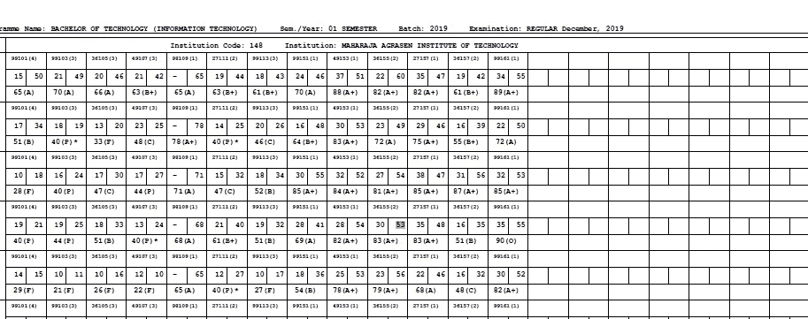

由于隐私问题，一些细节已被隐藏。作者照片

如果你仍然对查看实际的 PDF 感到好奇，请点击这个[链接](http://ggsipu.ac.in/ExamResults/ExamResultsmain.htm)下载你想看的任何学期成绩！

## 一件重要的事情

我不会解释数据提取过程，因为解析器**仍在开发中，源代码尚未公开**。这是一个很长的过程，因为文件可能从 100 页到 400 页不等，并且必须进行大量预处理才能获得最佳结果。我根据这些 pdf 做了一个简化的结果门户。你可以在这里查看(这是一个 Heroku 应用，可能需要一分钟左右才能启动)。这所大学在不同的文件中同时公布所有附属学院的成绩。我把所有学院的数据综合起来，每学期做一个档案，简化比较。每个文件大约有 5.9k 个条目，这里我们将比较第四学期的结果和以前的学期。

## 缩写:

印度的常见分支机构:

*   IT:信息技术
*   CSE:计算机科学与工程
*   欧洲经委会:电子和通信工程
*   EEE:电气和电子工程
*   机械与自动化工程

# 不同的分科招收多少学生？

我们考虑的第一个问题非常简单，我将以柱状图的形式展示数据来回答这个问题。

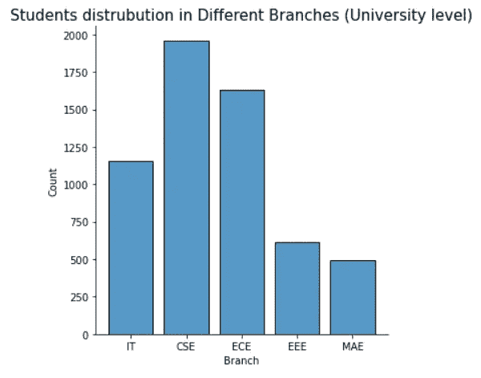

不同学科的学生

这里有一个有趣的事实，印度每年培养出世界上 25%的工程师，但缺乏推动创新的研究人员。在这里，每个学生都想获得 CSE，只是为了加薪，不管他们是否足够熟练。从这个柱状图中可以明显看出，在一所相当小的大学中，大约有 2000 名学生选择了 CSE(如果你想知道，我选择了它😀)其次是 ECE 和 MAE 是这里最不被看好的分支。你一定在想这和疫情有什么关系？这是我做预测的地方。由于新生入学尚未开始，我没有这一届的数据，但鉴于目前的情况，我相信 CSE 和 IT 将迎来另一个高峰，因为大多数学生都在广泛使用小工具，每个人都将真正对技术感兴趣，而不是任何其他外部因素，这可能会增加研究人员。

# 平均 SGPA 和百分比

SGPA 代表学期绩点，这是在最初阶段筛选工作简历时最常见的标准。让我们来看看第三学期的 SGPA 和第四学期的 SGPA 的对比:

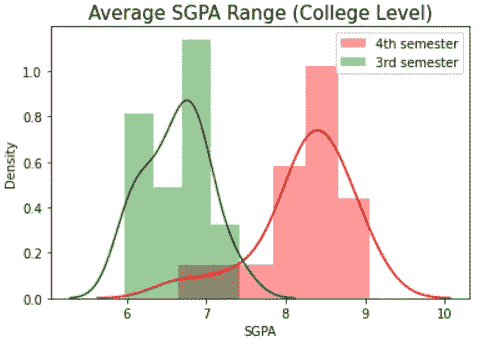

这里所有大学的平均水平都在各自的学期范围内

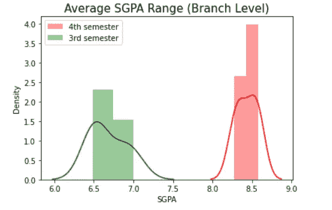

这里所有分支的平均值都在各自的学期范围内

惊讶，困惑？我也是。让我解释一下这是怎么回事。您正在查看的图表是 seaborn-distplot，它显示了位于分布范围内的 SGPA 大学或分校的**平均值，图表显示了第三和第四学期的数据。为了更好地理解这一点，下面是第四学期的 SGPA 分支的实际数值形式:**

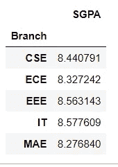

按作者分类的数据

在第四学期，SGPA 山脉的变化是如何发生的？答案很简单。发生这种情况是因为在这个学期，冠状病毒处于高峰期(☹️仍处于高峰期)，所有的课程都暂停了。在此期间，该大学试图提出不同的解决方案来评估本学期的学生，因为物理考试不可行，在线考试也有其自身的困难。然后决定在第三学期对学生进行 50%的**评估，50%的**内部评估通过电话和一些谷歌测验进行。奇怪的是，在大学水平上，当**第三学期 SGPA 在 5.5 到 7.5 之间**时，那么怎么会**第四学期有 6.5 到 9 的范围**？为了证明我的观点，我回去将这些学期与第二学期进行了比较，结果确实令人震惊:

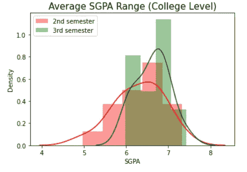

第二学期 SGPA 与第三学期的比较

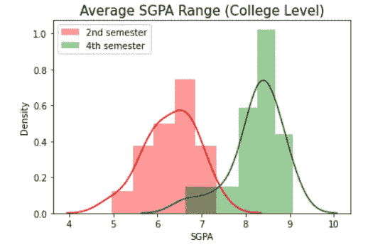

第二学期 SGPA 与第四学期的比较

从上面的两个图表，我们可以说第四学期的评估方法对学生太宽松了。如果一个学生得了 8 分 SGPA，那么与第二学期相比，这没什么大不了的。如果我们看百分比趋势，那么它与我们在 SGPA 发现的非常相似:

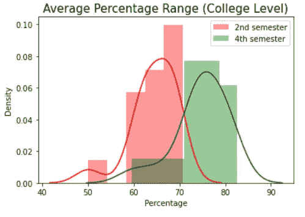

第二学期与第四学期的百分比比较

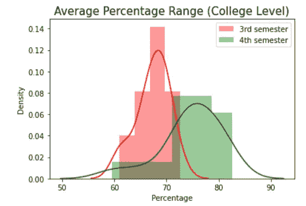

第三学期与第四学期的百分比比较

让我们假设大学**在采取这种评估方式**时犯了一个错误，最终给了所有学生额外的分数，但是当我从学生的角度思考时(我就是这样！)，要知道小小的努力却换来了大量的成果，这绝对令人惊叹。从长远来看，这不会有帮助，这一切都归结为一个结论，为什么印度失业率高。

# 终极顶级

第四学期对学生来说是个灾难。这学期 SGPA 加入后，他们本来很低的平均绩点提高了。因为每一个团体都有一个领导者，toppers 与此类似，他们都是在各种情况下都表现出色的杰出人士。鉴于目前的情况，我原以为这学期我们不会有这种趋势，但当我看到过滤后的结果时，我的想法发生了转变:

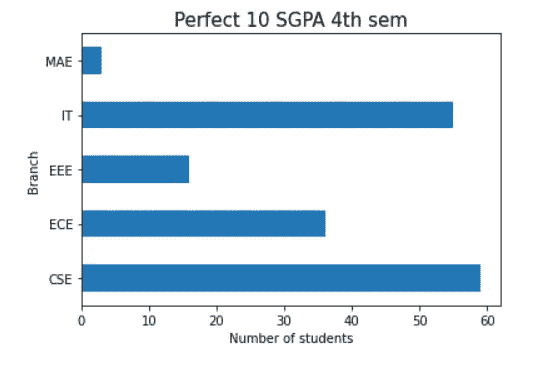

分支明智的学生数得分完美 10 SGPA

本学期某一特定分支的 60 名学生中最多有 10 名获得了满分！我在第三学期尝试过，没有结果！他们中没有人得过满分 10 分，所以我调整了逻辑，让第三学期的 SGPAs 高于 9 分，结果如下:

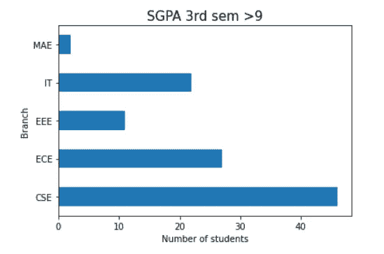

SGPA 得分大于 9 的学生人数

即使有了这些标准，也只有 45-48 名学生的 SGPA 得分高于 9 分！

# 最后一个音符

这是一种令人担忧的情况，就好像我们给了学生太多的评分自由，那么他们就会认为这些课程是理所当然的，而永远不会努力通过实际表演来取得好成绩。这类似于我们在模型构建中称之为**假阳性**的情况，当学生应得的分数较低时，他们被错误地给予分数(如果你想要混淆矩阵的详细解释，请在下面评论)。从学生的角度来看，我们永远不会满足于我们没有达到的分数，我认为需要一种更好的评估方法来取代这个有缺陷的系统。

这就是这篇文章的全部内容，我希望我能够以最好的方式表达我的分析。在 medium 上关注我以获得关于新文章的更新，如果你是一个热情的 Python 开发者，想要升级他们当前的技能，那么请确保在 medium 上查看我的 Python 系列中的 **android 应用。说完了，合十礼！**

[Linkedin](https://www.linkedin.com/in/kaustubh-gupta-612767ab/) ， [Github](https://github.com/kaustubhgupta)