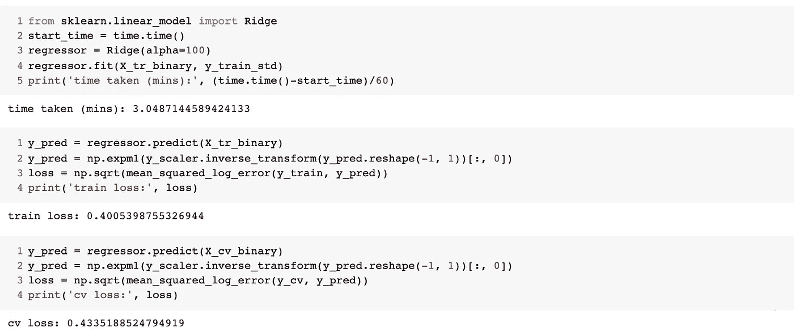
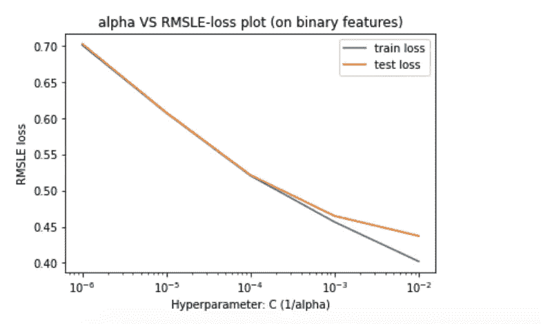

# 线性模型的集合能有多强大？

> 原文：<https://towardsdatascience.com/how-powerful-can-an-ensemble-of-linear-models-be-231824de50e1?source=collection_archive---------35----------------------->

## 一组线性模型如何在 Kaggle 上进入 Mercari 价格预测挑战排行榜的前 6%。

随着近年来深度学习算法的快速增长，今天它们已经成为人工智能的最先进水平。这让我想知道传统和老式的机器学习技术，如线性回归，支持向量机等，是否仍然足够体面，可以与深度学习技术相抗衡？
为了检查这些经常被忽视的机器学习技术的能力，我将只使用传统的机器学习技术(没有神经网络)来解决一个 Kaggle 竞赛问题。


> **注意:我将在这个项目中使用 python 3.7。**

## 博客的鸟瞰图-

该项目分为 6 个主要步骤-

*   业务问题和评估指标
*   关于数据
*   探索性数据分析
*   数据预处理
*   建模
*   从 Kaggle 排行榜获取分数。

B ***业务问题及评估指标***

很难知道一件东西到底值多少钱。小细节可能意味着价格上的巨大差异。例如，其中一件毛衣售价 335 美元，另一件售价 9.99 美元。你能猜出哪个是哪个吗？


考虑到有多少产品在网上销售，产品定价在规模上变得更加困难。服装有很强的季节性定价趋势，并受品牌名称的影响很大，而电子产品的价格根据产品规格而波动。日本最大的社区购物应用 Mercari 深谙这个问题。他们希望向卖家提供定价建议，但这很难，因为他们的卖家可以在 Mercari 的市场上出售任何东西或任何一捆东西。
在这场竞赛中，我们需要构建一个算法，自动建议正确的产品价格。我们将提供产品的文本描述，以及包括产品类别名称，品牌名称和项目条件等细节的功能。

本次比赛的评价指标为[均方根对数误差](https://www.kaggle.com/wiki/RootMeanSquaredLogarithmicError)。RMSLE 的计算方法如下:


其中:
*是 RMSLE 值(得分)
*n* 是(公共/私有)数据集中的观察总数，
*pi* 是价格的预测，
*ai* 是 *i* 的实际销售价格。
*log(x)* 是 x 的自然对数*

****注意，由于这种数据的公共性质，这种竞争是一种“只有内核”的竞争。因此，我们需要构建一个代码，在一台拥有 16 GB RAM 和 4 个 CPU 的机器上一小时内执行。****

*一个 ***回合的数据****

*我们将使用的数据由 Mercari 提供，可以通过[这个](https://www.kaggle.com/c/mercari-price-suggestion-challenge/data)链接在 Kaggle 上找到。这些数据列出了 Mercari 网站上产品的详细信息。
让我们看看网站上的一款产品，以及它在数据集中是如何描述的。*

**

*[https://www.mercari.com/](https://www.mercari.com/)*

***数据集有 8 个特征:***

*   ***Train_id/Test_id:** 数据集中的每个项目都有一个唯一的项目 id。这将在提交预测价格时使用。*
*   ***名称:**代表产品名称，为字符串格式。以上产品名称为*【安·兰德源头】**
*   ***物品状况:**卖家提供的表示物品状况的编号。它可以取 1 到 5 之间的值。在我们的例子中，产品的状态是'*好'*，所以在数据集中用 4 表示。*
*   ***类别名称:**代表物品的类别。对于上面的条目，数据集中提到的类别是*‘其他/书籍/文学&小说’* ，这个特征的数据类型也是 string。*
*   ***品牌名称:**代表该商品所属品牌的名称。上述产品的品牌名称为*‘企鹅兰登书屋’*。*
*   ***价格:**表示商品的价格，在我们的例子中，这将是我们需要预测的目标值。单位是美元。以上产品，提供的价格为 *'$9'* 。*
*   ***运输:**代表产品可用运输类型的编号。如果运费由卖方支付，运费将为 1，如果费用由买方支付，运费将为 0。对于上述产品，运输是免费的，因此在数据集中，此功能将为 1。*
*   ***物品描述:**物品的完整描述。对于上述产品，说明中写道，*《源泉》袖珍平装书——安·兰德——百年纪念版——经典文学——书的状况良好，封面和边角有一些磨损(见图片)。*该特征已经以预处理的形式出现在所提供的数据集中。*

*让我们使用 pandas 导入数据，并检查前 5 个条目。*

```
*import pandas as pd
data = pd.read_csv('train.tsv', sep='\t')
df_test = pd.read_csv('test.tsv', sep='\t')
data.head()*
```

**

*E**勘探数据分析(EDA)***

*在这一部分，我们将深入探索和分析数据。我们将逐一介绍这些数据。*

> ***价格***

*这是我们需要使用其他特征形式的产品信息来预测的目标特征。
让我们使用 describe()查看该特性的统计摘要*

```
*data['price'].describe()*
```

**

*   *数据集中大约有 148 万个产品。最贵的产品定价为 2009 美元，最便宜的产品定价为 3 美元，而平均价格为 26.75 美元*

*现在我们来看看价格直方图。在这里，我使用的箱数是 200。*

```
*plt.hist(data['price'], bins=200)
plt.xlabel('price')
plt.ylabel('frequency')
plt.title('histogram of price')
plt.show()*
```

**

*   *我们可以观察到分布遵循幂律分布，为了解决这个问题，并使其成为高斯分布，让我们将这些值转换为对数形式，即我们将用 log(price+1)替换价格值。*

*我们将价格转换为正态分布，因为它是统计学中最著名的分布之一，因为它符合许多自然现象，这使它成为我们可以进行分析的最容易解释的分布之一。将数据转换为正态分布的另一个原因是价格的方差减少了，并且大多数点都以平均值为中心，这使得模型的价格预测更加容易。*

*我已经把数据转换成了日志形式。下面是日志的直方图(价格+1)。*

```
*plt.hist(data['price_log'], bins=20)
plt.xlabel('log(price + 1)')
plt.ylabel('frequency')
plt.title('histogram of log of price')
plt.show()*
```

**

*   *我们可以观察到，分布现在更容易解释，并试图遵循正态分布。*
*   *此外，请注意大多数点是如何以平均值为中心的(平均值接近 3)。*

> ***项目条件标识***

*这是表示物品状况的分类特征。让我们使用 value_counts()查看更多信息*

```
*data['item_condition_id'].value_counts()*
```

**

*   *输出告诉我们，这个特性可以占用 1 到 5 之间的 5 个值，并且具有特定条件的项目的数量就在它的旁边。*

*让我们看看这个特性的条形图*

```
*sns.barplot(x=data['item_condition_id'].value_counts().keys(),
            y=data['item_condition_id'].value_counts())
plt.xlabel('item condition type')
plt.ylabel('number of products')
plt.title('bar graph of "item condition type"')
plt.show()*
```

**

*   *我们可以看到，大多数项目的条件 id 为 1，只有极少数项目的条件 id 为 5。*

*现在让我们比较具有不同 item_condition_id 的产品的价格分布*

****

*   *我们可以看到，具有不同 item_condition_id 的项目的价格分布非常相似。*

*让我们来看看具有不同 item_condition_id 的产品的价格分布的箱线图和小提琴图。*

```
*# plotting box-plot
sns.boxplot(x='item_condition_id', y='price_log', data=data)
plt.show()# plotting violin plot
sns.violinplot(x='item_condition_id', y='price_log', data=data)
plt.show()*
```

**

*箱线图和 violin 图还告诉我们，具有不同 item_condition_id 的商品的价格分布差别不大，而且分布有点向右倾斜。item_condition_id = 5 的产品具有最高的中间价格，而 item_condition_id = 4 的产品具有最低的中间价格。大多数产品的价格在 1.5 英镑到 5.2 英镑之间*

> ***类别名称***

*这是一个文本类型的数据，告诉我们产品的类别。
我们来看看特征类别名称的统计汇总-*

```
*data['category_name'].describe()*
```

**

*这些是字符串类型的特征，实际上是三个子类别合并成一个。
让我们考虑上面描述中提到的最频繁出现的类别名称特征“女性/运动服装/裤子、紧身衣、打底裤”。它可以分为 3 个子类别:
-子类别 _1:“女性”
-子类别 _2:“运动服装”
-子类别 _3:“裤子、紧身衣、打底裤”
为了使该特征的可视化更容易，我将考虑该特征的子类别。让我们把数据分成小类。*

```
*# this is to divide the category_name feature into 3 sub categories
from tqdm import tqdm_notebook
sub_category_1 = []
sub_category_2 = []
sub_category_3 = []for feature in tqdm_notebook(data['category_name'].values):
  fs = feature.split('/')
  a,b,c = fs[0], fs[1], ' '.join(fs[2:])
  sub_category_1.append(a)
  sub_category_2.append(b)
  sub_category_3.append(c)data['sub_category_1'] = sub_category_1
data['sub_category_2'] = sub_category_2
data['sub_category_3'] = sub_category_3*
```

> ***子类别 _1***

*让我们检查一下统计描述:*

```
*data['sub_category_1'].describe()*
```

**

*   *在我们的数据中，大约有 140 万个这样的函数，可以接受 11 个不同的值。其中最常见的是女性。*

*让我们绘制子类别 1 的条形图*

```
*sns.barplot(x=data['sub_category_1'].value_counts().keys(), y=data['sub_category_1'].value_counts())
plt.ylabel('number of products')
locs, labels = plt.xticks()
plt.setp(labels, rotation=90)
plt.title('bar-plot of sub_category_1')
plt.show()*
```

**

*   *我们可以看到，大多数项目的子类别 1 为“女性”，最少的项目为“运动和户外”。*
*   *请注意，没有定义 sub_category_1 的项目用“无标签”表示。*

*让我们检查 sub_category_1 的分布和价格日志*

```
*sns.FacetGrid(data, hue="sub_category_1", height=5).map(sns.distplot, 'price_log').add_legend();
plt.title('comparing the log of price distribution of products with
           sub_category_1\n')
plt.ylabel('PDF of log of price')
plt.show()*
```

**

*   *我们可以看到，大多数分布都是右偏的，只有一点差异。*
*   *“手工制作”子类别略有不同，因为我们可以看到该类别中的一些产品的 log(价格)低于 2*

*现在让我们来看看子 _ 类别 _1 的小提琴情节*

**

*   *查看小提琴图，我们可以说，子类别 1 为“男士”的商品的销售往往更贵，而子类别 1 为“手工”的商品往往更经济。*

> ***子类别 2***

*让我们检查 sub_category_2 的统计描述:*

```
*data['sub_category_2'].describe()*
```

**

*   *sub_category_2 有 114 个不同的值，让我们分析一下 sub_category_2 的前 20 个类别。*

*sub_category_2 中前 20 个类别的条形图*

```
*plt.figure(figsize=(12,8))
sns.barplot(x=data['sub_category_2'].value_counts().keys()[:20],
            y=data['sub_category_2'].value_counts()[:20])
plt.ylabel('number of products')
locs, labels = plt.xticks()
plt.setp(labels, rotation=90)
plt.title('bar-plot of top 20 sub_category_2')
plt.show()*
```

**

*   *我们可以看到，大多数商品都有 sub_category_2，即“正宗服装”,其次是“化妆品”,然后是“上衣和衬衫”。*

> ***子类别 3***

*让我们检查 sub_category_3 的统计描述:*

**

*   *sub_category_3 有 865 个不同的值，让我们分析一下 sub_category_3 的前 20 个类别的直方图。*

**

*   *我们可以看到，大多数商品都有 sub_category_3，如“裤子、紧身衣、打底裤”，后面是“其他”和“面部”。*

> ***品牌名称***

*这是另一个文本类型特征，表示产品所属的品牌。让我们来看看特性 brand_name 的统计摘要。*

**

*   *在这里，我们可以看到共有 4089 个不同的品牌名称。*

*让我们看看前 20 个品牌的直方图*

```
*plt.figure(figsize=(12,8))
sns.barplot(x=data['brand_name'].value_counts().keys()[:20],
            y=data['brand_name'].value_counts()[:20])
plt.ylabel('number of products')
locs, labels = plt.xticks()
plt.setp(labels, rotation=50)
plt.title('bar-plot of top 20 brands (including products with
           unknown brand)')
plt.show()*
```

**

*   *请注意，这里的“未知”表示没有指定品牌的商品。*
*   *PINK、Nike 和 Victoria's Secret 是网站上商品最多的前三大品牌。*

*让我们看看 20 大品牌及其平均产品价格的柱状图。*

```
*plt.figure(figsize=(12,8))
sns.barplot(x=df['brand_name'].values[:20],
            y=df['price'].values[:20])
plt.ylabel('average price of products')
locs, labels = plt.xticks()
plt.setp(labels, rotation=50)
plt.title('bar-plot of top 20 brands with their mean product price')
plt.show()*
```

**

*让我们看看产品价格最高的前 20 个品牌的柱状图*

**

> ***运输***

*这是一种数值分类数据类型，可以取 2 个值，0 或 1
让我们来看看它的统计描述。*

```
*data['shipping'].value_counts()*
```

**

*   *发货为 0 的商品比发货为 1 的多 22%。*

*我们来对比一下不同出货的产品价格分布日志。*

**

*   *我们可以看到，不同运输的项目的价格分布日志略有差异。*
*   *运费为 1 的产品往往价格较低。*

> ***项目 _ 描述(正文)***

*这是描述产品的文本类型特征。让我们来看看其中的一些。*

```
*data['item_description']*
```

**

*   *我们可以看到这些总共有 1482535 个。*

*我们将在执行一些 NLP 技术后使用这个特性，这些技术将在本博客的后面讨论。
我们可以对该功能做的另一件事是，计算它的字长，即该功能包含每个产品的字数，并对其进行分析。
我们来查看一下物品描述的 word_length 的统计汇总。*

```
*data['item_description_word_length'].describe()*
```

**

*   *我们可以看到最长的描述有 245 个字，最短的没有字。平均来说，单词在 25 个左右*

*我们来绘制 item_description_word_length 的直方图，*

```
*plt.hist(data['item_description_word_length'], bins=200)
plt.xlabel('item_description_word_length')
plt.ylabel('frequency')
plt.title('histogram of item_description_word_length')
plt.show()*
```

**

*   *我们可以看到，字长直方图遵循幂律分布。*
*   *这个直方图我用了 200 个面元。*

*让我们通过取单词长度的对数，试着把这个转换成正态分布。这是分布图。*

```
*plt.hist(data['log_item_description_word_length'])
plt.xlabel('log(item_description_word_length + 1)')
plt.ylabel('frequency')
plt.title('histogram of log of item_description_word_length')
plt.show()*
```

**

*   *我们可以看到，这个特征试图遵循正态分布。*
*   *大多数项目的单词长度在 5 到 20 之间。(从 antilog 获得的值)。*
*   *我们可以将此作为建模的一个特征。*

*现在让我们看看 log(item_word_length)如何影响商品的价格*

**

*   *我们可以看到，随着 item_word_length 从 0 到 50，价格的对数增加，但随后价格趋于下降，除了我们可以在大约 190 的字长附近观察到的峰值。*
*   *此外，单词长度超过 100 的价格波动更大。*

> ***产品名称***

*最后，让我们看看最后一个特性，即产品的名称。这也是一个文本类型特征，我们稍后将对其执行 NLP，但首先，让我们通过绘制“名称”特征中单词数量的直方图来对其进行一些分析。*

```
*plt.hist(data['name_length'])
plt.xlabel('name_length')
plt.ylabel('frequency')
plt.title('histogram of name_length')
plt.show()*
```

**

*   *这种分布明显是左倾的，最大条目的名称长度大约为 25。*

*让我们看看价格是如何随着产品名称的字数而变化的。*

```
*df = data.groupby('name_length')['price_log'].mean().reset_index()
plt.figure(figsize=(12,8))
sns.relplot(x="name_length", y="price_log", kind="line", data=df)
plt.show()*
```

**

*   *请注意，我使用的是价格日志，而不是实际价格。*
*   *我们可以看到，name_length 值在 10 到 38 之间的分布非常线性，然后有一个急剧的下降和上升。*

*DT11*数据预处理**

*在这一步中，我们将清理数据，并为建模做好准备。
记住，我们有 6 个特征，其中有:
- 4 个文本特征:名称、描述、品牌名称和类别
- 2 个分类特征:运输和商品条件 id*

*让我们从清理文本特征开始，为此，我们将定义一些函数-*

```
*import re
def decontracted(phrase):
    # specific
    phrase = re.sub(r"won't", "will not", phrase)
    phrase = re.sub(r"can\'t", "can not", phrase)
    # general
    phrase = re.sub(r"n\'t", "not", phrase)
    phrase = re.sub(r"\'re", " are", phrase)
    phrase = re.sub(r"\'s", " is", phrase)
    phrase = re.sub(r"\'d", " would", phrase)
    phrase = re.sub(r"\'ll", " will", phrase)
    phrase = re.sub(r"\'t", " not", phrase)
    phrase = re.sub(r"\'ve", " have", phrase)
    phrase = re.sub(r"\'m", " am", phrase)
    return phrase*
```

*该功能的工作原理是将单词从“我们将”分解为“我们将”，“不能”分解为“不能”，“我们是”分解为“我们是”等。这一步是必要的，因为我们不希望我们的模型以不同的方式对待像“我们是”和“我们是”这样的短语。*

```
*stopwords= ['i', 'me', 'my', 'myself', 'we', 'our', 'ours', 'ourselves', 'you', "you're", "you've","you'll", "you'd", 'your', 'yours', 'yourself', 'yourselves', 'he', 'him', 'his', 'himself', 'she', "she's", 'her', 'hers', 'herself', 'it', "it's", 'its', 'itself', 'they', 'them', 'their','theirs', 'themselves', 'what', 'which', 'who', 'whom', 'this', 'that', "that'll", 'these', 'those', 'am', 'is', 'are', 'was', 'were', 'be', 'been', 'being', 'have', 'has', 'had', 'having', 'do', 'does', 'did', 'doing', 'a', 'an', 'the', 'and', 'but', 'if', 'or', 'because', 'as', 'until', 'while', 'of', 'at', 'by', 'for', 'with', 'about', 'against', 'between', 'into', 'through', 'during', 'before', 'after','above', 'below', 'to', 'from', 'up', 'down', 'in','out','on','off', 'over', 'under', 'again', 'further','then', 'once', 'here', 'there', 'when', 'where', 'why','how','all', 'any', 'both', 'each', 'few', 'more','most', 'other', 'some', 'such', 'only', 'own', 'same', 'so','than', 'too', 'very', 's', 't', 'can', 'will', 'just','don',"don't",'should',"should've", 'now', 'd', 'll', 'm', 'o','re','ve','y','ain','aren',"aren't",'couldn',"couldn't",'didn',"didn't", 'doesn', "doesn't", 'hadn',"hadn't", 'hasn', "hasn't", 'haven', "haven't", 'isn', "isn't",'ma', 'mightn', "mightn't", 'mustn',"mustn't", 'needn', "needn't",'shan',"shan't",'shouldn',"shouldn't", 'wasn', "wasn't", 'weren', "weren't", 'won', "won't", 'wouldn', "wouldn't", '•', '❤', '✨', '$', '❌','♡', '☆', '✔', '⭐','✅', '⚡', '‼', '—', '▪', '❗', '■', '●', '➡','⛔', '♦', '〰', '×', '⚠', '°', '♥', '★', '®', '·','☺','–','➖','✴', '❣', '⚫', '✳', '➕', '™', 'ᴇ', '》', '✖', '▫', '¤','⬆', '⃣', 'ᴀ', '❇', 'ᴏ', '《', '☞', '❄', '»', 'ô', '❎', 'ɴ', '⭕', 'ᴛ','◇', 'ɪ', '½', 'ʀ', '❥', '⚜', '⋆', '⏺', '❕', 'ꕥ', '：', '◆', '✽','…', '☑', '︎', '═', '▶', '⬇', 'ʟ', '！', '✈', '�', '☀', 'ғ']*
```

*在上面的代码块中，我定义了一个包含停用词的列表。停用词是不会给句子增加太多语义或字面意义的词。其中大部分是单词或不太重要的单词的压缩表示，如“a”、“at”、“for”等，以及符号。*

*现在我们将定义一个函数，该函数获取句子，并使用解串函数和停用词列表来清理和返回处理过的文本。*

```
*from tqdm import tqdm_notebook
def preprocess_text(text_data):
  preprocessed_text = []
  # tqdm is for printing the status bar
  for sentence in tqdm_notebook(text_data):
    sent = decontracted(sentence)
    sent = sent.replace('\\r', ' ')
    sent = sent.replace('\\n', ' ')
    sent = sent.replace('\\"', ' ')
    sent = re.sub('[^A-Za-z0-9]+', ' ', sent)
    sent = ' '.join(e for e in sent.split() if e.lower() not in
                    stopwords)
    preprocessed_text.append(sent.lower().strip())
  return preprocessed_text*
```

*使用 preprocess_text()函数清理文本数据的时间到了。*

```
*df['name'] = df['name'].fillna('') + ' ' +
                       df['brand_name'].fillna('')
df['name'] = preprocess_text(df.name.values)df['text'] = (df['item_description'].fillna('')+
                       ' ' + df['category_name'].fillna(''))
df['text'] = preprocess_text(df.text.values)df_test['name'] = df_test['name'].fillna('') + ' ' 
                  + df_test['brand_name'].fillna('')
df_test['text'] = (df_test['item_description'].fillna('') + ' '
                   + df_test['category_name'].fillna(''))*
```

*请注意，df['name']列包含连接和预处理的' name '和' brand_name '功能，同样，df['text']功能包含连接和预处理的' item_description '和' category_name '功能。*

*让我们继续进一步的过程，但在此之前，我们需要将数据分成训练集和交叉验证集。此外，我们将把目标值(即价格)转换成对数形式，以便它们呈正态分布，并且 RMSLE(均方根对数误差)易于计算。*

```
*df =  df[['name', 'text', 'shipping', 'item_condition_id']]
X_test = df_test[['name', 'text', 'shipping', 'item_condition_id']]from sklearn.model_selection import train_test_split
from sklearn.preprocessing import StandardScalery_scaler = StandardScaler()
X_train, X_cv, y_train, y_cv = train_test_split(df, y,
                               test_size=0.05, random_state=42)
y_train_std =
     y_scaler.fit_transform(np.log1p(y_train.values.reshape(-1, 1)))*
```

*现在是时候将这些预处理过的文本特征转换成数字表示了。在这个过程中，我将使用 TF-IDF 矢量器。我们将从特性“名称”开始*

```
*from sklearn.feature_extraction.text import TfidfVectorizer as Tfidftfidf = Tfidf(max_features=350000, token_pattern='\w+', ngram_range=(1,2)) # using only top 350000 tf-idf features (with bi-grams).
X_tr_name = tfidf.fit_transform(X_train['name'])
X_cv_name = tfidf.transform(X_cv['name'])
X_test_name = tfidf.transform(X_test['name'])*
```

*接下来是“文本”功能*

```
*tfidf = Tfidf(max_features=350000, token_pattern='\w+', ngram_range=(1,3)) # using only top 350000 tf-idf features (with tri-grams).
X_tr_text = tfidf.fit_transform(X_train['text'])
X_cv_text = tfidf.transform(X_cv['text'])
X_test_text = tfidf.transform(X_test['text'])*
```

*让我们也处理从“shipping”开始的其余分类特征
因为这个特征只取 2 个值 0 和 1，我们不需要对它们进行某种特殊的编码，让我们保持它们不变。*

```
*from scipy import sparse
X_tr_ship =
         sparse.csr_matrix(X_train['shipping'].values.reshape(-1,1))
X_cv_ship = sparse.csr_matrix(X_cv['shipping'].values.reshape(-1,1))
X_test_ship =
          sparse.csr_matrix(X_test['shipping'].values.reshape(-1,1))*
```

*第二个分类特征是‘item _ condition _ id’，它也是一个顺序特征。请记住，这些可以接受 5 个整数值(1–5 ),因此我们也将保持原样。*

```
*X_tr_condition =
 sparse.csr_matrix(X_train['item_condition_id'].values.reshape(-1,1)
                                                               - 1.)
X_cv_condition =
  sparse.csr_matrix(X_cv['item_condition_id'].values.reshape(-1,1)
                                                               - 1.)
X_test_condition =
  sparse.csr_matrix(X_test['item_condition_id'].values.reshape(-1,1)
                                                               - 1.)*
```

*请注意，我使用了-1，因为该特性包含 5 种介于(1–5)之间的值，所以-1 会将它们转换为(0–4)的范围。这将在转换为稀疏数据时给我们带来优势。*

*现在，作为最后一步，我们将按列堆叠这些特性。*

**

*我现在将把这些预处理过的数据转换成二进制形式，其中的值只能是 1 或 0。*

```
*X_tr_binary = (X_tr>0).astype(np.float32)
X_cv_binary = (X_cv>0).astype(np.float32)
X_test_binary = (X_test>0).astype(np.float32)*
```

*这一步的优点是，现在我们将有 2 个具有良好方差的数据集要处理。*

*M ***odeling****

*是时候用我们的数据测试一些模型了。我们将要尝试的模型是-
-岭回归器
-线性 SVR
- SGD 回归器
-随机森林回归器
-决策树回归器
- XGBoost 回归器*

> ***正态数据的岭回归量***

**

*线性回归*

*我们使用线性回归来寻找最优超平面(上面 gif 中的红线),使得**损失**或每个点到平面/直线的距离之和的平方最小。我们可以注意到，如果我们考虑在迭代次数=28 次时得到的线，损失将是最小的。
岭回归也称为 L2 正则化线性回归，这意味着它使用权重平方和作为惩罚。添加惩罚项是为了限制模型过度拟合(捕捉噪声)。
岭回归只有 1 个超参数 **λ** ，它与惩罚/正则化项相乘，并决定模型经历的欠拟合程度。λ的值越大，我们欠拟合越多。
alpha 就是正则化强度，它必须是一个正浮点数。因此，随着α的增加，欠拟合也会增加。*

**

```
*import matplotlib.pyplot as plt
plt.plot(alpha_list, train_loss, label='train loss')
plt.plot(alpha_list, test_loss, label='test loss')
plt.title('alpha VS RMSLE-loss plot')
plt.xlabel('Hyperparameter: alpha')
plt.ylabel('RMSLE loss')
plt.xscale('log')
plt.legend()
plt.show()*
```

**

*   *我们可以观察到，随着 alpha 的降低，模型开始过度拟合。*
*   *α= 1 时，试验损失最小。*

**

*好的，我们的岭在 cv 数据上返回了 0.4232 的损失。*

> ***二元数据的岭回归***

*现在我们将对二进制数据使用岭回归*

```
*import matplotlib.pyplot as plt
plt.plot(alpha_list, train_loss, label='train loss')
plt.plot(alpha_list, test_loss, label='test loss')
plt.title('alpha VS RMSLE-loss plot (on binary features)')
plt.xlabel('Hyperparameter: alpha')
plt.ylabel('RMSLE loss')
plt.xscale('log')
plt.legend()
plt.show()*
```

**

*   *我们可以观察到，当α= 100 时，损耗最小。*

**

*我们的岭回归在 cv 数据上返回了 0.4335 的损失。*

> ***让我们在二进制数据上尝试 SGD-Regressor(作为 SVR)***

**

*[https://gifer.com/en/gifs/gradient](https://gifer.com/en/gifs/gradient)*

*让我们快速刷新一下 SGD 是什么，它是如何工作的。还记得我在岭回归中提到的损失吗？损失有不同的类型，让我们从几何角度来理解。如果回归问题就是寻找最适合我们数据的最优超平面，那么损失仅仅意味着我们的数据与超平面有多大差异。因此，低损失意味着这些点与我们的超平面差别不大，模型表现良好，反之亦然。
在线性回归的情况下，损失是平方损失，它是通过将数据点到超平面的平方距离的总和除以项数而获得的。*

**

*损失函数很重要，因为它们定义了超平面是什么样子。还有其他被称为梯度下降的算法，它们利用这些损失函数并更新超平面的参数，以使其完美地拟合数据。这里的目标是最小化损失。SGD 是一种优化算法，通过逐步减少损失来更新超平面的参数。这是通过计算损失函数相对于特征的梯度，然后使用这些梯度向最小值下降来实现的。在上图(左部)中，我们可以看到该算法如何通过向山下走正确的一步来达到损失函数的最小值，并且随着每一步都在正确的方向上，参数得到更新，这导致更好的拟合超平面(右部)。要了解更多关于随机梯度下降(SGD)算法的信息，你可以查看[这篇精彩的博客](https://www.pyimagesearch.com/2016/10/17/stochastic-gradient-descent-sgd-with-python/)。*

**

*[https://AWS . Amazon . com/blogs/machine-learning/train-faster-more-flexible-models-with-Amazon-sage maker-linear-learner/](https://aws.amazon.com/blogs/machine-learning/train-faster-more-flexible-models-with-amazon-sagemaker-linear-learner/)*

*以下是一些其他常见损耗，但我们将使用“Huber”、“epsilon_insensitive”和“squared_epsilon_insensitive”来调整该模型的超参数。*

**

*随机搜索交叉验证告诉我们，L2 正则化的“平方ε不敏感”损失最适合此数据。顺便说一句，“平方ε不敏感”损失是另一个众所周知的机器学习算法支持向量机使用的损失之一，支持向量机通过利用支持向量来生成更好的拟合超平面，从而使用最大限度技术。*

**

*[https://www . researchgate . net/figure/Schematic-of-the-one-dimension-support-vector-regression-SVR-model-Only-the-points _ fig 5 _ 320916953](https://www.researchgate.net/figure/Schematic-of-the-one-dimensional-support-vector-regression-SVR-model-Only-the-points_fig5_320916953)*

*   *在该图中，虚线称为决策边界，位于虚线上的点称为支持向量，SVR 的目标是最大化这些决策边界之间的距离。*

*但是，为什么利润最大化如此重要，以至于 SVM 成为顶级最大似然算法之一？让我们使用一个简单的分类问题来快速理解这一点，我们需要找到一个分离蓝点和红点的最佳超平面。*

**

*[https://medium . com/coin monks/support-vector-regression-or-SVR-8e B3 ACF 6d 0 ff](https://medium.com/coinmonks/support-vector-regression-or-svr-8eb3acf6d0ff)*

*   *请看图中由名称*超平面*和*最优超平面*表示的两个平面。任何人都可以看出，*最优超平面*在分离蓝色和红色点方面比另一个平面好得多，并且使用 SVM，这个*最优超平面*几乎是有保证的。*

*一个有趣的事实是,“平方ε不敏感”损失中的平底部分是由于这种利润最大化技巧。可以参考[本](https://medium.com/coinmonks/support-vector-regression-or-svr-8eb3acf6d0ff)和[本博客](https://en.wikipedia.org/wiki/Support_vector_machine)了解更多关于 SVR 的内容。*

**

*SGD 回归器(作为 SVR)在 cv 数据上返回 0.4325…的损失。*

> ***让我们在二进制数据上试试 SGD 回归器(作为线性回归器)***

*在这里，我们将执行所有先前的步骤，但针对的是二进制数据。*

**

*随机搜索交叉验证告诉我们，L2 正则化的“平方损失”损失最适合此数据。顺便说一下，L2 正则化的平方损失的设置听起来很熟悉，对吗？这正是我们在岭回归模型中使用的。在这里，我们从优化问题的角度来处理这个问题，因为 SGDRegressor 为我们提供了更多的超参数来调整我们的模型。*

**

*SGD 回归器(作为线性回归器)在 cv 数据上返回 0.4362 的损失。*

> ***正常数据的线性支持向量回归***

*让我们在正常数据上尝试支持向量回归机。这里的超参数是 C，也是我们在岭回归中讨论过的α的倒数。*

```
*import matplotlib.pyplot as plt
plt.plot(C, train_loss, label='train loss')
plt.plot(C, test_loss, label='test loss')
plt.title('alpha VS RMSLE-loss plot (on binary features)')
plt.xlabel('Hyperparameter: C (1/alpha)')
plt.ylabel('RMSLE loss')
plt.xscale('log')
plt.legend()
plt.show()*
```

**

*   *我们可以看到，0.1 是超参数 C 的最佳超参数值，它使我们的测试损失最小。*

**

*线性 SVR 在正常数据的 CV 上返回 0.4326 的损失。*

> ***二进制数据的线性支持向量回归***

*现在，我们将对二进制数据尝试支持向量回归机。这里的超参数也是 C，也是我们在岭回归中讨论过的α的倒数。*

```
*import matplotlib.pyplot as plt
plt.plot(C, train_loss, label='train loss')
plt.plot(C, test_loss, label='test loss')
plt.title('alpha VS RMSLE-loss plot (on binary features)')
plt.xlabel('Hyperparameter: C (1/alpha)')
plt.ylabel('RMSLE loss')
plt.xscale('log')
plt.legend()
plt.show()*
```

**

*   *我们可以看到，0.01 是超参数 C 的最佳超参数值，它使我们的测试损失最小。*

*线性 SVR 在二进制数据的 cv 上返回 0.4325 的损失。*

## *基于树的模型*

*注意:我尝试的另一个维度技术是 truncated-SVD，但是它需要大量的 RAM(超过 16 GB)来进行计算，并且因为这是一个内核挑战，所以使用完整的数据没有多大意义。*

****为基于树的模型选择顶级特征:****

```
*from sklearn.feature_selection import SelectFromModelfrom sklearn.linear_model import SGDRegressor
regressor = Ridge(alpha=100)
selection = SelectFromModel(regressor)
selection.fit(X_tr_binary, y_train_std.ravel())X_train_top = selection.transform(X_tr_binary)
X_cv_top = selection.transform(X_cv_binary)
X_test_top = selection.transform(X_test_binary)*
```

> ***决策树***

*我们的第一个基于树的模型是决策树，在我们的数据集上使用它之前，让我们先快速了解它是如何工作的。*

**

*[https://www . datascience central . com/profiles/blogs/the-complete-guide-to-decision-trees](https://www.datasciencecentral.com/profiles/blogs/the-complete-guide-to-decision-trees)*

*决策树由简单的 if-else 语句组成，使用这些条件，它们决定如何预测给定名称、条件等的产品价格。从几何学上讲，它们使用几个平行于轴的超平面来拟合数据。
在训练树的同时，树通过使用和验证训练数据来学习这些 if-else 语句。当它被训练时，它使用这些学习到的 if-else 条件来预测测试数据的值。
但是它是如何决定如何拆分数据或者在拆分数据和构建完整的树时考虑什么特征的呢？
嗯，它使用一种叫做熵的东西来构建树，熵是一种确定性的度量。
决策树有几个超参数，但我们将只考虑其中两个重要的-
- *max_depth:* 它表示决策树的最大深度。因此，如果 max_depth 假定为 4，则在训练时，构造的树的深度不会超过 4。
-*min _ samples _ split:*表示执行分割或考虑 if-else 条件时必须存在的最小数据点数。因此，如果 min_samples_split 假定为 32，则在训练时，如果所构造的树看到的数据点少于 32 个，则它不会应用 if-else 条件。*

*以上两个超参数都限制了决策树的不足或过度捕捞。高的 max_depth 和低的 min_samples_split 值使决策树更容易过度拟合，反之亦然。*

**

*[https://sci kit-learn . org/stable/auto _ examples/tree/plot _ tree _ regression . html](https://scikit-learn.org/stable/auto_examples/tree/plot_tree_regression.html)*

*   *在此图中，我们可以看到一个经过训练的决策树算法如何尝试拟合数据，请注意拟合线是如何由轴平行线组成的。*
*   *我们还可以注意到，max_depth 值越大的决策树也越容易捕捉到噪声点。*

*我不会在这个博客中深入讨论决策树的内部工作原理，因为这会使它变得太长，要了解更多关于决策树的内部工作原理，你可以查看这个很棒的[博客](/entropy-how-decision-trees-make-decisions-2946b9c18c8)。*

*让我们使用 RandomSearchCV 对我们的决策树执行一些超参数调整，并检查什么是我们的树的最佳超参数。*

**

*返回的最佳超参数值是 max_depth=64 和 min_samples_split = 64。现在让我们检查在这些超参数上训练决策树之后获得的损失。*

**

*考虑到训练需要 14 分钟，损失值并不是很大。到目前为止，我们的线性模型已经超过了决策树模型。*

> ***随机森林—(最大深度=3，n 估计值=100)***

*现在，让我们使用另一个非常棒的基于树的模型，或者我应该说模型来模拟我们的数据。
随机森林是由多个模型组成的集合。这个想法是使用数据的随机部分来训练多个模型，然后使用来自这些多个模型的平均预测作为最终值。这是有意义的，因为使用完整数据的随机部分训练几个模型会创建在不同方面存在一定程度偏差的模型。现在，从所有这些模型中取平均预测值，最终会得到一个更好的预测值。*

*随机森林这个名称来自于我们在从训练数据集中随机采样数据*时使用的 Bootstrap 采样，由于我们使用多个决策树作为我们的基础模型，所以它有单词*森林*。**

**

*[https://towards data science . com/random-forest-and-its-implementation-71824 ced 454 f](/random-forest-and-its-implementation-71824ced454f)*

*上图显示了随机森林如何使用随机采样数据训练不同的基础学习者，分别表示为树 1、树 2…然后收集并平均这些树的预测。*

*随机森林有多个超参数，但对于我们的数据，我们将只使用 2:
*- n_estimator:* 这表示我们希望随机森林模型拥有的基础模型的数量。
*- max_depth:* 表示每个基础模型即决策树的最大深度。*

*让我们训练一个随机森林模型，并对其执行一些超参数调整。*

*这个模型的训练时间大约是 23 分钟。*

**

*我们可以看到，这个模型在给定的数据集上表现不好，结果一点也不好。*

> ***随机森林—(最大深度=4，n 估计值=200)***

*这里我使用了相同的模型，但是在架构上做了一些改变。我已经把最大深度增加到了 4，基础学习者的数量增加到了 200。
我们来看看模特表现如何。*

*该模型的训练时间约为 65 分钟。*

**

*结果略好于之前的随机森林模型，但仍然不接近我们的线性模型。*

> ***XGBoost — (max_depth=4，n_estimators=200)***

**

*【https://github.com/bgreenwell】*

*这是我们将尝试的最后一个基于树的模型，它被称为 XGBoost。XGBoost 是 GBDT 的略微增强版本，它也是一种集合建模技术。在梯度增强中，目的是减少方差或减少数据集的欠拟合行为。让我们看看它是如何工作的。*

**

*[http://uc-r.github.io/gbm_regression](http://uc-r.github.io/gbm_regression)*

*在 GBDT，我们首先使用训练数据训练我们的第一个基本模型，这通常是一个高偏差决策树，然后我们从该模型中获取预测值，并计算由预测值与实际值的差异定义的误差。现在我们训练我们的第二个基础学习者，但是这次我们不仅仅使用训练数据，我们还使用从我们的第一个基础学习者获得的误差，并且我们再次从这个模型中获取预测值并计算误差。这一直持续到覆盖了所有的基础学习者，当我们一个接一个地训练基础学习者时，我们注意到误差值慢慢地减小。你可以在这里阅读更多关于 GBDT [的信息。
XGBoost 是 GBDT 的一个稍微修改的版本，它使用像随机森林中的行采样和列采样这样的技术来构造基础学习器。](http://uc-r.github.io/gbm_regression)*

*让我们快速检查一下 XGBoost 的代码，我将使用 2 个超参数:
- n_estimators:它表示作为决策树模型的基础学习者的数量。
- max_depth:表示基础学习器决策树的最大深度。*

*该模型花了大约 27 分钟来训练。*

**

*结果没有随机森林差，但也没有线性模型好。*

> ***XGBoost — (max_depth=6，n_estimators=500)***

*让我们试试 XGBoost，max_depth=6，n_estimators=500。*

**

*我们可以看到一个体面的数量从以前的模型改进，但它需要模型 78 分钟的训练。*

## *让我们比较不同的型号及其性能:*

**

*在上表中，我们可以看到基于树的模型花费了太多的计算时间，事实上，我用于基于树的数据要小得多，我只使用了从岭回归器中选择的顶部二元特征。因此，新数据只有大约 236k 个特征，而不是其他线性模型训练的原始 700k 个特征。我们还可以观察到，我们能够获得的交叉验证数据的最小损失是 0.4232…让我们尝试使用集成建模来进一步减少这一损失。*

*线性模型已经胜过其他基于树的模型，所以我将使用这些来创建一个集合。*

*让我们把前 6 个线性模型的结果串联起来。*

****

*现在，让我们快速测试一个简单的集合，该集合将这些特征作为输入，并将输出计算为这些值的平均值。*

**

*我们可以观察到损失略有增加，这意味着这种方法本身不足以产生好的分数。*

*现在，让我们检查这些新特征之间的相关性，因为它们都来自线性模型，并且产生类似的损失。如果它们高度相关，它们不会对整体损失有太大改善。*

```
*import seaborn as sns
import matplotlib.pyplot as plt
plt.figure(figsize=(10,8))
columns = ['y_pred_ridge_binary_tr', 'y_pred_ridge_normal_tr',
           'y_pred_svr_normal_tr','y_pred_svr_binary_tr',
           'y_pred_sgd_lr_binary_tr', 'y_pred_sgd_svr_binary_tr']
df = pd.DataFrame(y_pred_tr_ensemble, columns=columns)
Var_Corr = df.corr()
sns.heatmap(Var_Corr, xticklabels=Var_Corr.columns,
yticklabels=Var_Corr.columns, annot=True)
plt.title('Correlation between different features.')
plt.show()*
```

**

*   *我们可以看到，来自基础模型的结果是高度相关的，因此在它们的基础上构建一个集成并不能获得多少分数。*

*为了解决这个问题，我增加了数据的维度，添加了从线性模型中收集的顶级特征，这些数据是我们用来训练基于树的模型的二进制数据。*

**

*现在是时候在这些新生成的特征上尝试不同的模型，看看我们是否可以改善这种损失。*

> ***让我们试试使用不同超参数的 SGD 回归器***

**

*上面的代码块代表了 RandomSearchCV 返回的最佳超参数。*

**

*CV 损失没有达到标准，因为我们已经损失了 0.4232…我们正在寻找比这更低的损失。*

> ***让我们在新功能上试试线性支持向量回归机和岭回归机***

```
*import matplotlib.pyplot as plt
ridge_loss = np.array(ridge_loss)
linearsvr_loss = np.array(linearsvr_loss)
plt.plot(alpha, ridge_loss.T[0], label='Ridge train')
plt.plot(alpha, ridge_loss.T[1], label='Ridge test')
plt.plot(alpha, linearsvr_loss.T[0], label='linearsvr train')
plt.plot(alpha, linearsvr_loss.T[1], label='linearsvr test')
plt.xlabel('Hyperparameter: alpha or (1/C)')
plt.ylabel('loss')
plt.xscale('log')
plt.title('Linear SVR and Ridge losses')
plt.legend()
plt.show()*
```

**

*   *我们可以看到，在 alpha=100000 时，岭回归和线性 SVR 返回的 cv 损失最小。让我们把模型放在那上面。*

*用 alpha = 100000 训练岭回归方程*

**

*用 C = 0.00001 训练线性 SVR*

****

*好了，通过查看上表，我们可以知道山脊和 LinearSVR 模型产生了最好的结果，所以我们将使用这些来生成一个和我们的系综的最后一层。*

*让我们使用这些模型快速拟合数据，并将输出连接起来，作为最终集合层的输入。*

*现在，我们将使用先前图层模型生成的输出来创建总体的最终图层。我们将使用一些线性模型，但在此之前，让我们测试简单的平均结果。*

**

*结果比单独的 LinearSVR 模型要好，但是到目前为止，岭仍然优于每个模型。*

*现在让我们为最后一层尝试一些线性模型:*

> ***新币回归器***

****

> ***让我们尝试使用岭和线性支持向量回归作为最终的图层模型***

```
*import matplotlib.pyplot as plt
ridge_loss = np.array(ridge_loss)
linearsvr_loss = np.array(linearsvr_loss)
plt.plot(alpha, ridge_loss.T[0], label='Ridge train')
plt.plot(alpha, ridge_loss.T[1], label='Ridge test')
plt.plot(alpha, linearsvr_loss.T[0], label='linearsvr train')
plt.plot(alpha, linearsvr_loss.T[1], label='linearsvr test')
plt.xlabel('Hyperparameter: alpha or (1/C)')
plt.ylabel('loss')
plt.xscale('log')
plt.title('Linear SVR and Ridge losses')
plt.legend()
plt.show()*
```

**

*   *结果接近，但岭回归优于线性回归。*

****

***这里是用于集合的所有模型，以表格形式进行比较。***

****

*F ***最后，让我们预测测试数据集的价格，并检查我们的组合在 Kaggle 排行榜上的表现。****

**

## *在提交预测结果后，我获得了 0.42457 的分数，相当于 Kaggle 排行榜上的前 6%。*

**

*[https://www . ka ggle . com/c/mercari-price-suggestion-challenge/submissions](https://www.kaggle.com/c/mercari-price-suggestion-challenge/submissions)*

*福 ***未来工作****

*   *这个问题可以使用深度学习算法来解决，如 GRU，MLP，伯特，因为大多数特征来自文本描述。我们可以在这些数据上尝试这些最先进的技术，并尝试提高分数。*
*   *代码没有针对多处理进行优化，因此它使用所有 4 个 CPU。我认为这值得一试，因为这样的话，即使是基于树的模型也可以加入到整体中。*

*R**引用 ***

*   *https://www . ka ggle . com/c/mercari-price-suggestion-challenge/discussion/50256*
*   *[https://www.youtube.com/watch?v=QFR0IHbzA30](https://www.youtube.com/watch?v=QFR0IHbzA30)*
*   *[https://youtu.be/_PwhiWxHK8o](https://youtu.be/_PwhiWxHK8o)*
*   *[https://youtu.be/UHBmv7qCey4](https://youtu.be/UHBmv7qCey4)*
*   *[https://www.appliedaicourse.com/](https://www.appliedaicourse.com/)*

*福 ***遗书****

*感谢您阅读博客。我希望它对那些有志于做机器学习、整体建模、数据处理、数据可视化项目的人有用。*

*如果你对这个项目有任何疑问，请在这个项目的回复部分或 GitHub repo 中留下评论。*

*完整的项目可以在我的 Github 上找到:
[https://github.com/SarthakV7/mercari_kaggle](https://github.com/SarthakV7/mercari_kaggle)
在 LinkedIn 上找到我:[www.linkedin.com/in/sarthak-vajpayee](http://www.linkedin.com/in/sarthak-vajpayee)*

*和平！☮*