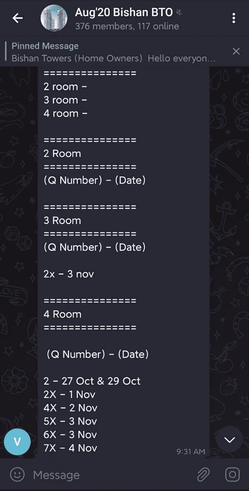
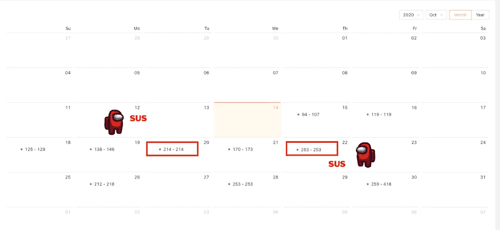
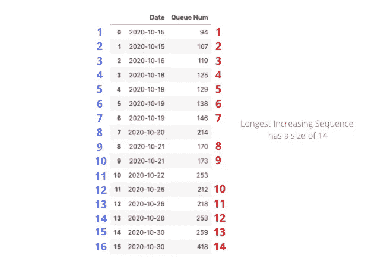
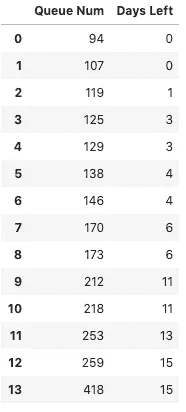
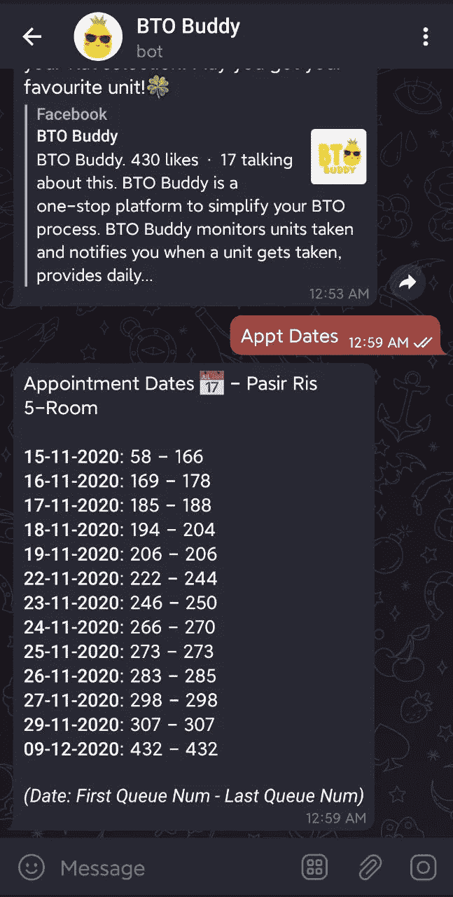
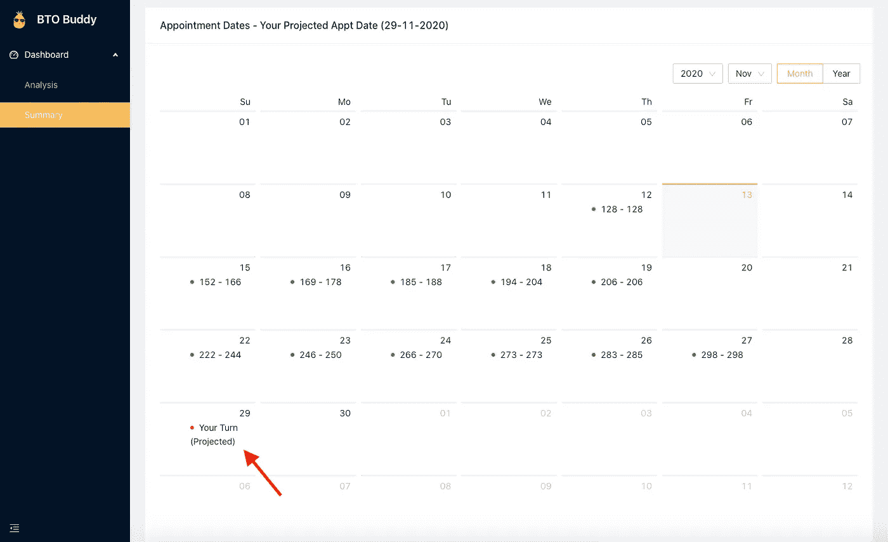
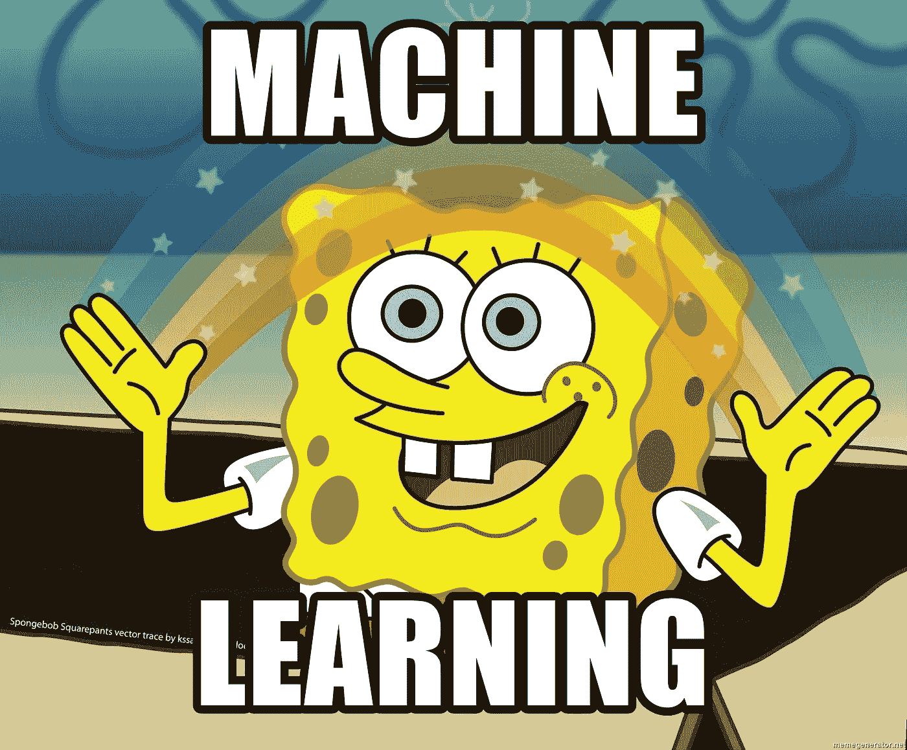

# Python 如何帮助我选择新家——第 3 部分

> 原文：<https://towardsdatascience.com/how-python-helped-select-my-new-home-part-3-220cd5af592b?source=collection_archive---------37----------------------->

照片由[克里斯蒂安·陈](https://unsplash.com/@christianchen?utm_source=medium&utm_medium=referral)在 [Unsplash](https://unsplash.com?utm_source=medium&utm_medium=referral)

如果你是这个系列的新手，我建议你先看看《T4》第一部和第二部。否则，欢迎回来！像每一集《网飞》一样，这里有一个对之前发生的事情的快速回顾。

> **提示闪回**

> 在我的按单生产(BTO)申请中，我想方设法得到了一个排队号来选择一个单元。在等待赴约的漫长过程中，我发现整个单位监控过程令人惊讶地**疲惫**和**低效**。因此，我创建了 BTO 巴迪，作为一个基本的电报机器人，它能为我自动进行搜集和监控。
> 
> 它很快在其他申请人中流行起来，这促使我开发了更多的功能，如识别受欢迎的单元、计算辍学率，甚至网站规划分析。
> 
> BTO 好友现在可以在 [Telegram](https://t.me/btobuddy_bot) 和 [Web](https://btobuddy.com/) 上找到。

截至 2020 年 11 月 11 日，BTO Buddy 已经拥有超过 7，000 名用户，日活跃用户(DAU)约为 1，000 名。🥳，我真心感谢迄今为止我所得到的所有支持！

在本文中，我将介绍我在开发预测约会日期的新功能时所面临的挑战之一。

# 背景故事

> “对于开发的每个功能，都必须有一些过去的痛苦”

一旦申请人成功收到一个排队号，他们必须等待的下一条信息就是他们的预约日期。他们的排队人数越多，等待的时间就越长。在这次约会中，他们将选择他们永远的家。

平均而言，申请人将在实际日期前两周收到预约日期。

*BTO 是一个等待的游戏——图片由* [*imgflip*](https://imgflip.com/memegenerator) 提供

在申请人收到他们的预约日期之前，没有官方途径了解现在发生了什么，也没有当前的排队号。因此，精明的申请人决定**众包**并在项目特定的电报组中分享他们的排队号和预约日期。

众包预约日期和排队号示例—图片由[作者](http://www.zhunhung.com)提供

这个巧妙的变通方法帮助许多其他人了解了每天的约会次数，并估计了他们可能收到约会日期的时间。然而，这种方法有两个问题**:**

1.  **不是每个人都愿意贡献，因为排队号是个人的事情。**
2.  **聊天会收到垃圾邮件，其中包含复制粘贴消息来“更新”列表。**

***你也许能明白我的意思..***

# **构建问题**

**希望你现在能想象他们被蒙在鼓里有多不舒服。鉴于 BTO 好友的用户注册过程收集了两个主要数据点:**队列号**和**预约日期**，我们可以解决这个问题并将其打包成一个特性。**

## **目标**

**#1 —提供可信、清晰的预约日期和排队号视图。**

**#2 —给定一个没有预约日期的队列号，预测预约日期。**

## **考虑**

*   **与众包方法不同，为了达到最佳效果，我们必须**利用每个用户的数据**，而不是在自愿的基础上。**
*   **确保用户的**匿名性**,这样队列编号就不会识别用户。在众包方法中，用户必须复制并粘贴信息来添加他们的详细信息。鉴于电报鼓励匿名，这可能会暴露他们自己的身份。**

# **挑战**

**每当我们处理用户贡献的数据时，很可能会有**噪音**。在我们的例子中，用户在注册过程中提供了队列号和预约日期。因此，很容易出现**恶作剧行为**。**

**以下是它在日历视图中的突出显示:**

****

**BTO 好友网站上的日历视图带有误导性数据—图片由[作者](http://www.zhunhung.com)提供**

**这阻碍了我们的两个目标，因为它不仅看起来不可靠，而且当我们试图预测约会日期时，它可能会扰乱我们的模型。因此，我们必须首先清理数据，使其可用。**

## **建立联系**

**为了使数据可用，我们需要删除不符合增长趋势的数据。在我们的例子中，我们需要检测并删除队列号 214 和 253。**

****

**表格视图:移除不流动的数字—图片由[作者](http://www.zhunhung.com)提供**

**如果你曾经在诸如[黑客排名](https://www.hackerrank.com/)或 [Leetcode](https://leetcode.com/) 的平台上练习算法问题(我很少这样做😬)，你可能会意识到这是现实生活中[最长增长序列](https://en.wikipedia.org/wiki/Longest_increasing_subsequence) (LIS)问题的一种表现🤯不知道是不是只有我，但当我知道这种联系时，我感到**疯狂** **满足**。我一直想知道在课堂上获得的理论知识如何应用到我们的日常生活中。**

**如果您仍然看不到链接，这里有一个关于 LIS 问题如何很好地适合我的上下文的简单解释:**

****

**图片由[作者](http://www.zhunhung.com)**

**给定用蓝色划分的 16 个队列号，我想识别出**不属于增长趋势**中的哪些队列号，并删除它们。在这种情况下，通过删除 214 和 253，我的数据现在按顺序运行。这在假设大部分数据都正确输入的情况下效果很好。**

**求解 LIS 的算法可以用**动态规划来完成。**为了保持这篇文章的简单，我将不讨论这个算法。如果你感兴趣，网上有很多解释和代码(例如 [GeeksForGeeks](https://www.geeksforgeeks.org/longest-increasing-subsequence-dp-3/) )。**

# ****预测****

**利用我们新清理的数据，我们对数据进行转换，以使我们将**队列号**作为独立变量(我们想要用来预测的变量)，将 *X* 和**预约天数**作为因变量(我们想要预测的变量)。**

**为此，我们使用当前日期作为基线。例如，如果我们在 2020 年 10 月 15 日进行预测，我们从*日期*字段中减去*2020–10–15*，以获得距约会还有 N **天，即剩余*天*。****

****

**图片作者[作者](http://www.zhunhung.com)**

**最后，我们剩下的就是将数据拟合到一个简单的线性回归模型中，并将预测的剩余天数添加到当前日期。**

**BTO 好友现在有了一个新功能✨**

# **正在运行的功能**

## **电报应用**

**用户可以点击“*Appt Dates”*按钮，查看与每天第一个和最后一个队列号配对的**匿名**预约日期列表。**

****

**目标 1 的解决方案—图片由[作者](http://www.zhunhung.com)提供**

## **Web 应用程序**

**没有预约日期的用户可以在 BTO 好友网站的日历界面上看到他们的计划预约日期。为了鼓励高级用户注册，这个特性只对高级用户可用😂**

****

**目标 2 的解决方案。(注:周六没有预约，因为 HDB 是休息日)——图片由[作者](http://www.zhunhung.com)提供**

**在上面的例子中，用户的队列号是 300，模型预测约会是在 2020 年 11 月 29 日。听起来差不多！**

# **包扎**

**您可能想知道预测是否准确，因为我使用的回归只有一个特征。令人惊讶的是，我收到了几个用户的反馈，说预计的日期是 HDB 安排的**确切日期**。由于数据很少，这可能是我能采用的最好的方法之一。毕竟简单是关键！**

**现在，我可以自豪地说，BTO 巴迪是由计算机视觉和…**

****

**线性回归仍然是一个 ML 算法好吧—*Image By*[*meme generator*](https://memegenerator.net/)**

**对于第 4 部分(可能是最后一部分)，我将探索预测单元被占用的顺序和理想地解释这些因素的主题。
敬请期待！**

****免责声明**:我基于上下文知识对预测结果做了进一步的后处理，以提高其可靠性。因此，如果你打算复制这项工作，它可能对你有用，也可能没用。**

***大喊到* [*丹尼斯*](https://dennisang.com/) *为李斯提示！***