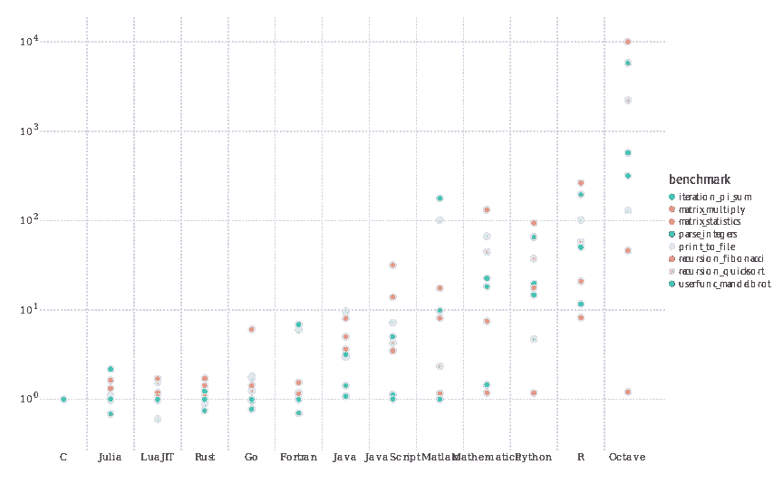

# Python 如何在机器学习方面超越 R

> 原文：<https://towardsdatascience.com/how-python-overtook-r-for-machine-learning-46be67fc19af?source=collection_archive---------19----------------------->

## 意见

## Python 如何超越 R 并成为数据科学的标准。

(python logo src =[http://python.org](http://python.org)，R logo src =[https://www.r-project.org/](https://www.r-project.org/)，tensor flow logo src =[https://www.tensorflow.org/](https://www.tensorflow.org/)，Numpy logo src =[http://numpy.org](http://numpy.org))

# 介绍

大约十年前，Pythonic 机器学习的想法在许多数据科学家眼中只是一闪而过。当时用于统计的最流行的语言之一是 R，它在机器学习的前沿也显示出了希望。然而，正如你很可能意识到的那样，这不再是事实，Python 不仅是机器学习最流行的语言，也是最流行的语言。

虽然 Python 和 R 都是平易近人的高级语言，但它们当然也有不同之处。其中一些差异可能归因于 Python 作为未来数据科学语言的崛起。

# 可用性

对于数据科学来说，从 R 到 Python 的转变有一个决定性的因素，那就是这两种语言的可用性。r 是一种主要的函数式语言，几乎完全是为科学计算而创建的。虽然在某种程度上它在许多方面都有能力，但 R 肯定不是一种通用的编程语言。

另一方面，Python 主要是一种面向对象的编程语言。这归功于 Python 相对于 R 的友好性，因为在很多方面，程序员可能会发现使用具有简单功能的对象比使用多态的系统化功能要容易得多。最重要的是，Python 最初并没有考虑统计计算，因此更适合通用编程。

虽然这些差异对于那些只做统计计算的人来说可能意义不大，但对于那些希望从更具技术性而非科学性的角度来研究机器学习的人来说可能意义重大。换句话说，Python 当然是一种更适合每一个程序员而不仅仅是统计学家的语言。

可用性的差异也不会因为使用和范例而停止。面对现实吧，

> Pip 优于 R 的“包管理器”

在 R 的辩护中，包管理器肯定不是它那个时代的特色。尽管如此，即使 R 现在推出了一个出色的软件包管理器，它也很可能无法与 Pip 的便利性相竞争。Pip 使得管理所有的 Python 库变得非常容易，这反过来也使得学习如何使用 Python 中的包变得更加简单。有人试图为 R 创建一个更好的包管理器，比如 pack rat——如果你喜欢用 R 编程的话，这是一个很好的工具。

 [## 个人信息管理程序

### 你还需要确保你的机器…

rstudio.github.io](https://rstudio.github.io/packrat/) 

在某种程度上，Packrat 就像 R 包管理器的 QuickLisp。当然，在这方面，R 成为了发布时间的牺牲品。

# 表演

谈论机器学习而不讨论性能是非常困难的。毕竟，深度学习计算机通常配备多个显卡和服务器处理器是有原因的。Python 可能没有世界上最好的性能，但肯定比 r 更上一层楼。下面是 Julia computing 完成的一些微基准测试，显示了这些语言在许多操作中的差异有多大:

(src =[https://julialang.org/benchmarks/](https://julialang.org/benchmarks/)

尽管确实存在 R 超过 Python 的情况，但在大多数情况下，Python 肯定是两者中表现更好的。当然，这归因于 R 编程语言内部机器学习的生存能力较低。虽然 R 和 Python 一样，肯定可以从调用其他语言(如 C 和 C++)中获益，但 Python 与 Python.h 头文件的紧密集成和易于访问性，使它成为那些希望用 C 创建高级接口的人的明确选择。

# 生态系统

如前所述，Python 当然是一种更有可能吸引普通程序员的语言。这可能就是为什么 Python 是开发 Scikit-Learn 和 Tensorflow 等包时使用的语言。用于机器学习的 Pythonic 生态系统绝对是一流的，无与伦比！

在 R 的另一边，虽然肯定有一些出色的包，但是当它们与 Python 拥有的所有通用选项相比时，毫无疑问。部分原因是，许多已经了解 Python 并希望进入机器学习领域的开发人员决定只使用该语言，而不是转换到 r 语言。由于 Python 与 C 语言的合作关系，很容易理解为什么这些包是为 Python 而不是 r 开发的。

# 两者都用

尽管 R 在这一点上已经完全让位于 Python，但 R 仍然被广泛用于统计分析、生物信息学，甚至机器学习。然而，似乎 R 更受科学和医学团体的欢迎，而 Python 更受技术影响。

这是我觉得很有意思的事情。为什么 R 在生物学家、医生和其他学科中的应用比普通开发人员、数据科学家和尝试机器学习的计算机科学家更广泛？对此一个合理的解释是，R 已经在这些行业立足了很长一段时间，以至于很难被取代。正如我之前谈到的，计算机科学家和来自编程世界而不是普通科学世界的人可能更喜欢使用 Python，而不是使用 70 年代的统计语言。当然，在 70 年代创造的不是 R 而是 S，但是 S 被广泛认为是 R 的前身——所以请记住这一点。

# 结论

我认为统计计算从使用 R 和 MATLAB 到 Python 的转变肯定是合理的。使用 Python 有很多优势，这些优势是你在其他地方无法获得的。Python 具有优越的性能，对于新开发人员来说更容易理解，也是世界上最流行的编程语言。所有这些因素无疑促成了 Python 的崛起，以及它现在在分析、统计以及最重要的机器学习领域的奇妙立足点。

虽然 R 肯定没有 Python 受欢迎，但它似乎已经在更科学、更少以计算机为中心的人群中找到了自己的家。看到某些语言如何在短短几年内被淘汰，以及一种新语言的能力如何在如此短的时间内被实现和利用，这是非常令人惊讶的。