# 流感疫情增长有多快？

> 原文：<https://towardsdatascience.com/how-quickly-does-an-influenza-epidemic-grow-7e95786115b3?source=collection_archive---------17----------------------->

## 病毒生长的数学模型

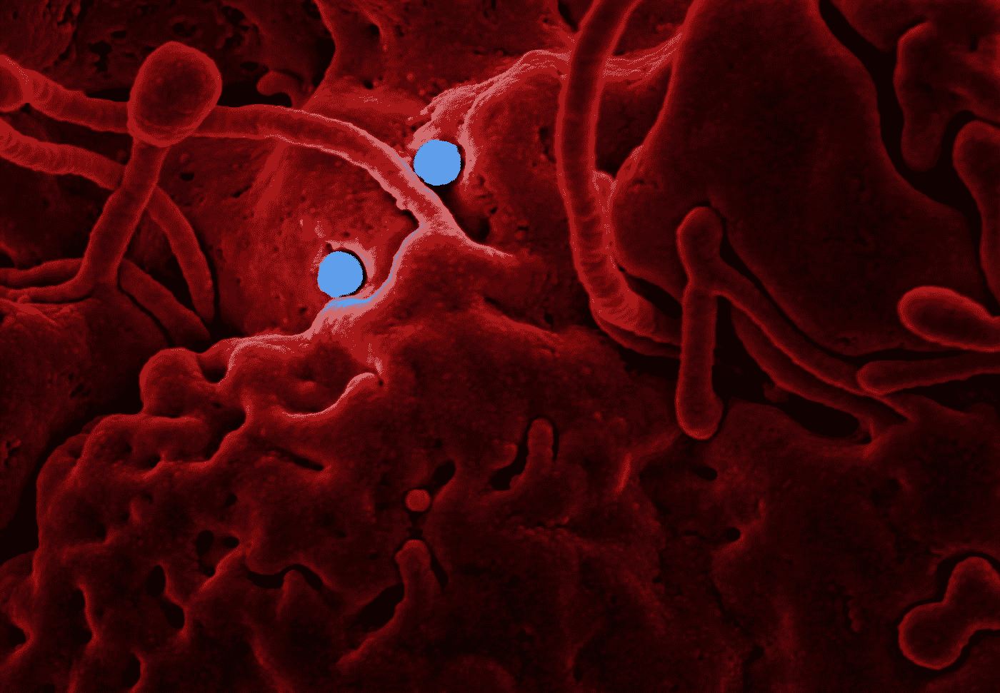

[疾控中心](https://unsplash.com/@cdc?utm_source=medium&utm_medium=referral)在 [Unsplash](https://unsplash.com?utm_source=medium&utm_medium=referral) 拍摄的照片

对冠状病毒的担忧现在无处不在。我经常坐飞机，在美国和欧洲的旅客身上几乎从来没有看到过呼吸面罩，然而在我们这里，看到[飞往中国的航班被取消](https://time.com/5774906/airlines-ground-flights-coronavirus/)，面罩在机场四处扩散。因此，流行病学——研究疾病的传播和传播——受到了越来越多的关注，并让我思考用来更好地理解疾病如何在人群中传播的模型。我将查看该领域的一个经典模型，并向您展示如何用 Python 实现它。

## TL；速度三角形定位法(dead reckoning)

我们看看 Kermack-McKendrick 流行病学模型，并展示如何用 Python 实现它；一个被设计用来描述 1905-06 年孟买爆发的流感传播的模型。

**免责声明:**我不是流行病学家或病毒学家，所以如果我有任何错误，请告诉我！

# 模拟流感爆发

[Kermack-McKendrick 模型](https://royalsocietypublishing.org/doi/10.1098/rspa.1927.0118) (KM)是早期的**房室模型**，这意味着它将人群分为三组:易感(S)、感染(I)和去除(R)。这些通常被称为 SIR 模型，其中 R 可以被移除，因为个体要么因为已经康复而现在免疫，要么因为已经死于感染而从群体中移除。

Kermack 和 McKendrick 建立了他们的模型，以加深他们对流行病的理解，即受感染的个体进入人群，突然开始传播疾病。他们假设人口保持不变(除了模型中由 R 项表示的死亡)，因此忽略出生、非疾病相关死亡、进出目标区域的迁移的任何影响。此外，所有的人都同样易感，所以在这个模型中，那些更健康或有更好卫生习惯的人没有加分。所有这些都是该模型的局限性，但也使它成为流行病学研究的一个很好的起点。按照这种思路，许多现代模型是建立在 Kermack 和 McKendrick 奠定的基础上的，所以理解这一点肯定会帮助你前进到更复杂的工作。

# 克马克-麦肯德里克模型

KM 模型是一组三个微分方程。我们可以将模型写成如下形式:

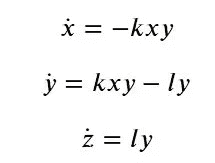

在这个公式中，𝑥代表我们的易感人群，𝑦代表受感染人群，𝑧代表我们的不再受感染(如死亡/康复)人群。

我们在模型中有两个常数，𝑙和𝑘，它们都是正的(𝑙,𝑘>0).这些常数分别代表平均恢复/死亡率和平均感染率。因此，如果我们看到𝑘疫情上升，那么我们预计疾病会传播得更快，而如果𝑙疫情上升

更高的话，这种疾病会很快传播并导致流行病。

Kermack 和 McKendrick 使用了这个比率:

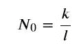

定义临界阈值，超过该阈值将发生流行病并在整个人群中传播。

如上述假设所述，人口 N 是常数，所以在任何时候我们都应保持如下关系:

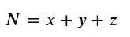

让我们转向模型的实现，然后我们可以进一步评论一些属性。

# 在 Python 中模拟模型

像这样模拟微分方程相当简单。它是以一阶形式写的，所以我们不需要太担心重写方程。如果你不熟悉如何对微分方程进行数值积分，看一看我写的一篇初学者文章，其中我展示了两个主要的方法和详细的推导。否则，让我们继续并导入我们的包。

```
import numpy as np
import matplotlib.pyplot as plt
```

我们将使用**半隐式欧拉方法**进行积分(在我的文章中解释了[)，这种方法实现和计算都很快。要做到这一点，我们需要找到 *𝑥* 、 *𝑦* 和 *𝑧* 的值，我们可以使用**泰勒级数**进行近似。我们将只讨论前两项，它们给出了合理的近似值。](https://www.datahubbs.com/simulating-dynamical-systems-with-python/)

前两项的形式如下:

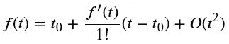

把它应用到我们的方程组中(用δ𝑡代替𝑡−𝑡_0 ),我们得到:

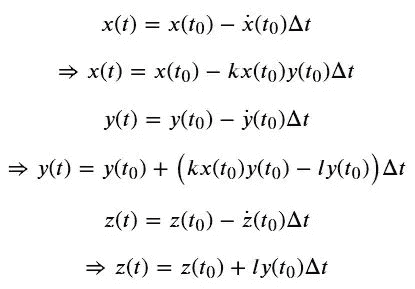

因为我们使用半隐式欧拉方法来获得更精确的结果，所以我们将更新后的值(𝑦(𝑡)代入𝑧，为我们提供以下模拟方程组:

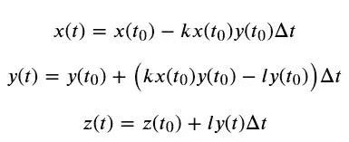

这是一个微妙的变化，但它通常会导致更好的近似。

在 Python 中，我们将所有这些打包到一个函数中，该函数将我们的初始值 *𝑥* 、 *𝑦* 和 *𝑧* 、我们的常数和时域作为参数。该函数将实现如上所示的半隐式欧拉方法，并返回三个变量的结果。

```
def km_model(init_vals, params, t):
    x_0, y_0, z_0 = init_vals
    x, y, z = [x_0], [y_0], [z_0]
    l, k = params
    dt = t[2] - t[1] # Assumes constant time steps
    for t_ in t[:-1]:
        next_x = x[-1] - (k * x[-1] * y[-1]) * dt
        next_y = y[-1] + (k * x[-1] * y[-1] - l * y[-1]) * dt
        next_z = z[-1] + (l * next_y) * dt
        x.append(next_x)
        y.append(next_y)
        z.append(next_z)

    return np.stack([x, y, z]).T
```

对于初始值，我们设置 *𝑥* _0=999、 *𝑦* _0=1、 *𝑧* _0=0。参数 *𝑙* 和 *𝑘* 分别为 0.1 和 0.001。

```
init_vals = [999, 1, 0]
params = [1e-1, 1e-3]t_max = 100
dt = 0.1
t = np.linspace(0, t_max, int(t_max/dt))km_results = km_model(init_vals, params, t)# Plot results
plt.figure(figsize=(12,8))
plt.plot(km_results)
plt.legend(['Susceptible', 'Sick', 'Recovered'])
plt.xlabel('Time Steps')
plt.show()
```

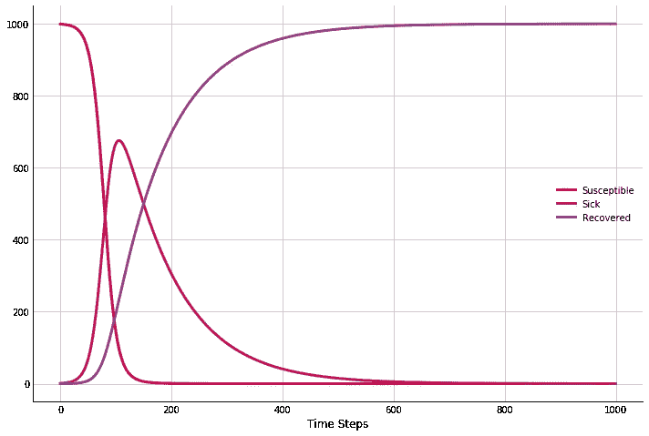

在这里，我们看到患病人数迅速上升，在恶化前最高为 675 人。请注意，这远远超过了人口的一半，并且发生在我们通过临界阈值之后的时间步长上，此时𝑥=𝑙/𝑘

从此，受感染的人数稳步下降。

我们也可以通过玩我们的参数𝑙和𝑘.来研究这一点让我们以更高的𝑙值重新运行它(回想一下，这是我们模型中的恢复率)。

```
params = [5e-1, 1e-3]
km_results = km_model(init_vals, params, t)plt.figure(figsize=(12,8))
plt.plot(km_results)
plt.legend(['Susceptible', 'Sick', 'Recovered'])
plt.xlabel('Time Steps')
plt.title(r'KM Model with $l={}$'.format(params[0]))
plt.show()
```

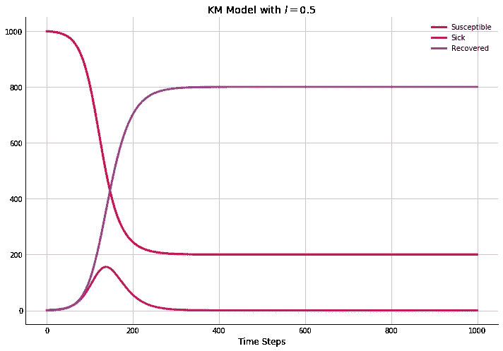

在这个修改的版本中，人们恢复得太快，以至于无法感染整个人群。在这种情况下，我们的临界阈值是 500，当𝑥达到这一点，疾病逆转。

让我们看另一个例子，我们将𝑙设置回原始值，然后将𝑘增加一个数量级到 0.01。

```
params = [1e-1, 1e-2]
km_results = km_model(init_vals, params, t)plt.figure(figsize=(12,8))
plt.plot(km_results)
plt.legend(['Susceptible', 'Sick', 'Recovered'])
plt.xlabel('Time Steps')
plt.title(r'KM Model with $k={}$'.format(params[1]))
plt.show()
```

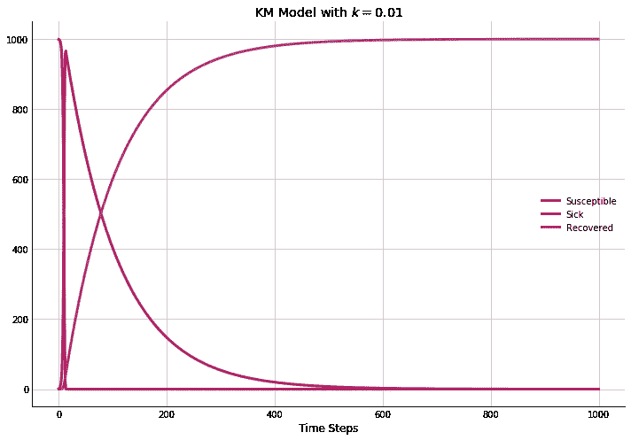

在这种情况下，感染会迅速传播并超过整个人口。

最好事先知道这种疾病是会导致流行病，还是只会导致少数孤立的病例。我们可以通过计算生殖率来做到这一点，𝑅_0.这是我们之前观察到的阈值密度值的人口调整值。其给出如下:

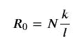

如果是𝑅_0>1，那么我们手上就有一种传染病，会感染很多人。小于 0，意味着疾病在有机会广泛传播之前就会逐渐消失。

到目前为止，我们研究的三种场景中每一种场景的𝑅_0 值是:

*   10
*   2
*   100

在每种情况下，我们都有不同程度的严重程度。我们可以调整我们的参数来显示当我们的生殖率下降到 1 或更低时会发生什么，方法是将𝑘减少到 0.0001。

```
params = [1e-1, 1e-4]
km_results = km_model(init_vals, params, t)plt.figure(figsize=(12,8))
plt.plot(km_results)
plt.legend(['Susceptible', 'Sick', 'Recovered'])
plt.xlabel('Time Steps')
plt.title(r'KM Model with $k={}$'.format(params[1]))
plt.show()print('R0 = {}'.format(sum(init_vals) * params[1] / params[0]))
```

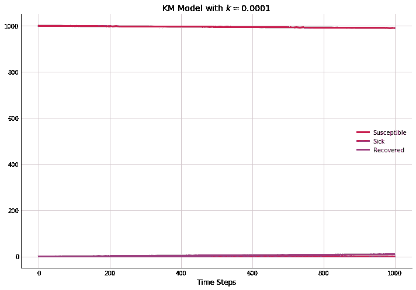

```
R0 = 1.0
```

在这种情况下，疾病传播速度太慢，无法感染许多人，从而使患病者在疾病传播之前得以康复。

# 疾病建模

知识管理模型是捕捉流行病动态的早期数学模型之一。它最初发表于 1927 年，但今天仍然具有相关性，构成了许多[现代流行病学模型](https://advancesindifferenceequations.springeropen.com/articles/10.1186/1687-1847-2014-278)的基线。这个简单的模型能够将额外的复杂性包括在内，例如疫苗、干预措施和其他效应的影响，以更好地了解病毒是如何在人群中传播的。