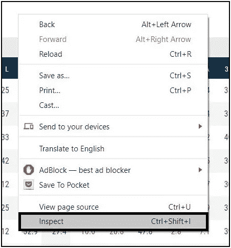
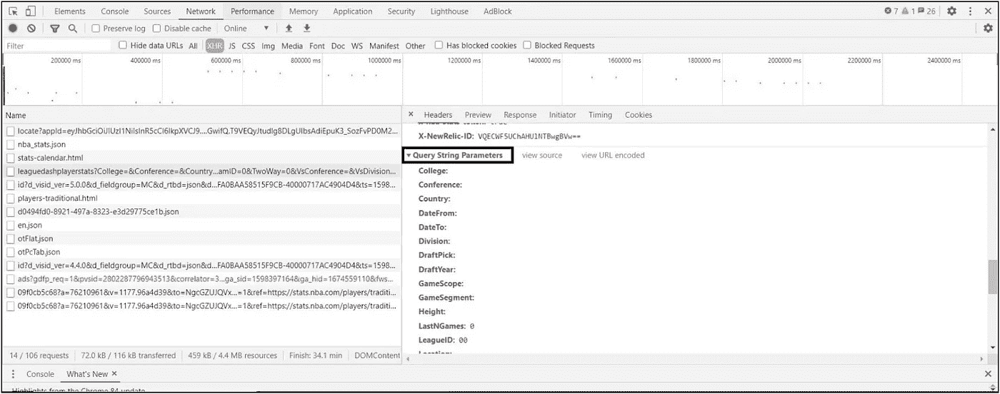

# 如何刮 NBA 的统计数据比迈克尔乔丹更酷

> 原文：<https://towardsdatascience.com/how-scraping-nba-stats-is-cooler-than-michael-jordan-49d7562ce3ef?source=collection_archive---------19----------------------->

## 寻找 API 端点和客户端 web 抓取

瓦列里·塞索耶夫在 [Unsplash](https://unsplash.com?utm_source=medium&utm_medium=referral) 上的照片

# 介绍

今年夏天，我有了一个跟踪 NBA 的新爱好，作为一个数据爱好者，我想了解这个赛季的 NBA 在理论上与前几个赛季有什么不同，因为这是在没有任何球迷的泡沫中进行的。

为了获取相关数据，我开始使用 python 库 beautiful soup。然而，令我惊讶的是，数据并没有存储在 HTML 源页面上。经过一番挖掘，我发现 NBA stats 网站是用 AngularJS 构建的，这意味着该网站是在客户端而不是服务器端呈现的。

## 什么是客户端渲染

呈现的 HTML 只是一个模板，它不包含任何数据，服务器响应中的 Javascript 从 API 获取数据，并使用它来创建客户端页面。

基本上，当你查看网页源代码时，你不会发现数据，而只是网页的一个模板。

[NBA 各州网站](https://stats.nba.com/players/traditional/?SeasonType=Regular%20Season&sort=PTS&dir=-1&Season=2019-20)

Ctrl + U 带您到页面源

# 我们开始吧

在本文中，我们将从 NBA 统计网站上搜集[联盟球员的统计数据。经过几个小时的研究，我决定采用一种比美丽的汤更简单的方法。](https://stats.nba.com/players/traditional/?SeasonType=Regular%20Season&sort=PTS&dir=-1&Season=2019-20)

## 从网站查找 API 端点

第一步，在你的网页浏览器(最好是谷歌 chrome 或者火狐)上打开你想要抓取的网页，打开开发者工具。为此，只需右键单击选择检查。

右键单击，然后检查

这将在页面的右侧或底部打开一个面板，选择网络和 XHR，然后重新加载页面。

检查面板

一旦我们重新加载页面，页面中的所有请求都将可见。此时，您应该做一些挖掘工作来找到您想要的请求。最有可能的是，端点会以你正在浏览的网页命名。

由于我们正在查看联盟球员的统计页面，端点可能会被命名为类似的名称。选择每个选项并预览结果以找到正确的端点。

选择并预览

一旦你找到了正确的终点，你就可以进入下一步了。

## 调用 API 端点来获取数据

为了调用 API，我们将利用[请求](https://requests.readthedocs.io/en/master/user/quickstart/#custom-headers) python 包。为此，我们需要 3 个组件作为下面请求语法的一部分。

第一部分是 URL，在我们的例子中，因为我们正在访问联赛球员统计数据，所以我们可以从上一步获得它。

在 Header 选项卡下，选择 general 并复制请求 URL 的第一部分。

请求 URL

接下来，我们需要请求标题，它也可以在同一个标题选项卡下找到，但是在“请求标题”子部分下。

请求标题

作为字典的页眉

我们需要的最后一个组件是参数，可以在 Header 选项卡下的“查询字符串参数”小节中找到。

因素

因素

现在我们有了所有的三个部分，调用 API 就很简单了。然后，可以将响应处理到数据框架中进行分析。

获取请求

最终的请求看起来像这样，

数据帧

# 谢谢大家！！

恭喜👏！！我们成功地抓取了 NBA 统计数据网站。

PS:这个过程对 stats.nba.com 的[绝对管用。这可能也适用于任何其他使用 AngularJS 等语言构建的客户端 web 框架的网站。如果你的目标网站是用服务器端框架和像 Django 或 Ruby on Rails 这样的语言构建的，那么我们的朋友 Beautiful Soup 会帮你一把。](https://stats.nba.com/)

祝你的网络抓取之旅好运！希望这个帖子有帮助。

如果你有任何问题，请随时通过 [Twitter](https://twitter.com/AshwinMuru) 或 [Linkedin](https://www.linkedin.com/in/ashwinmuthiah/) 联系我。