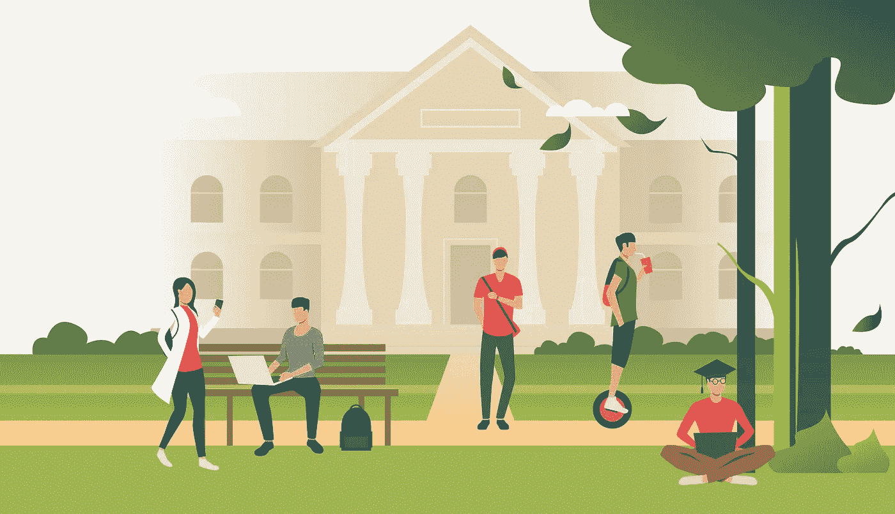
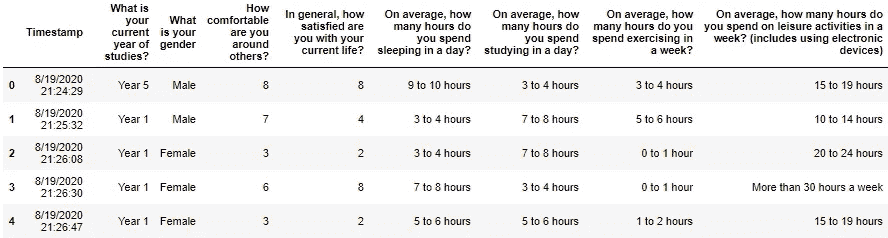
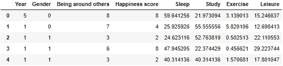
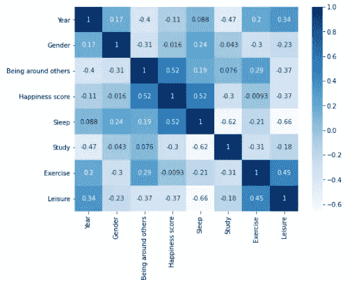
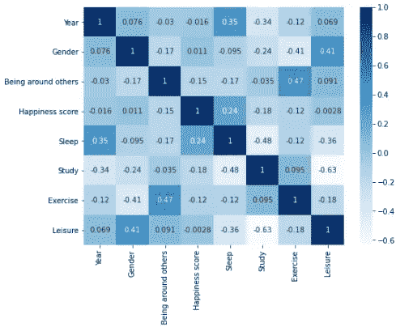
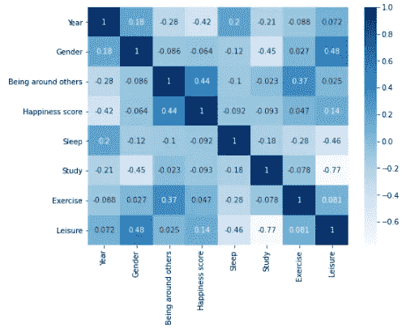
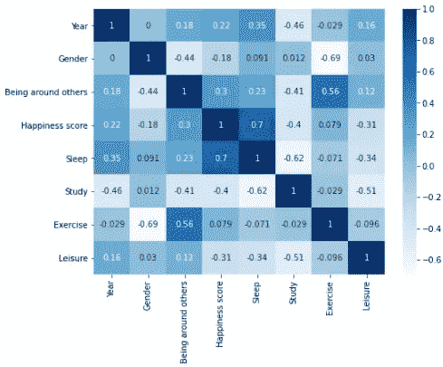
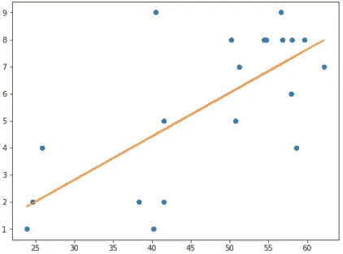

# 学生应该如何利用时间来提高自己的幸福感？

> 原文：<https://towardsdatascience.com/how-should-students-spend-their-time-to-improve-their-happiness-a8bab76fb3c4?source=collection_archive---------55----------------------->

## [变更数据](https://towardsdatascience.com/tagged/data-for-change)

## 用 Jupyter 笔记本分析调查数据。



学生们在校园里度过时光，由 katemangostar 在 www.freepik.co 的 T2 创作

关于睡眠、锻炼、休闲、学习和幸福之间的关系，已经有很多研究了。尽管人们对睡眠和幸福之间的关系存在争议，但结果往往与我们的预期十分相似。然而，我想知道我们是否可以从我们一般如何度过时间的角度来看待这个问题，看看在我们生活的不同方面花费时间的平衡是否会影响我们的幸福水平。

> 与其追求更多的睡眠或更多的锻炼，我们应该如何全面地利用时间来增加我们的幸福感呢？

作为一名新加坡的大学生，我决定对我的同龄人做一个简单的调查。

# 数据描述:

**回应数量** =45

**变量**，记住我是在问大学生:
—学习年限
—性别
—周围人的舒适程度(考虑到可能的性格差异)
—满意度(衡量幸福的一个好方法，因为它趋于稳定)
—睡眠时间(每天)
—学习时间(每天)
—锻炼时间(每周)
—休闲时间(每周)

接下来，我将通过 Jupyter Notebook 使用 Python 来做一些数据清理。从导入必要的包和查看数据开始。

```
import pandas as pd
import matplotlib.pyplot as plt
import seaborn as sns
import statsmodels.api as sm
import numpy as np
import math#loading the data
data=pd.read_csv("Happiness and how we spend our time (Responses) - Form Responses 1.csv")
data.head()
```



# 数据清理:

1)为简单起见，重命名列标题

```
data.columns=['Year','Gender','Being around others','Happiness score','Sleep','Study','Exercise','Leisure']
```

2)通过以下方式从分类转换为数字:

*   取数值范围的平均值，每个选项之间的间隔不变(注意:下次让回答者输入整数)。
*   将“男性”和“女性”替换为 1 和 0，将“第 1 年”到“第 5 年”替换为“1”到“5”。

```
data=data.replace({'Year 5':5, 'Year 4':4,'Year 3':3,'Year 2':2,'Year 1':1,'Male':0,'Female':1,'0 to 1 hour':0.5,'0 to 2 hours':1,'1 to 2 hours':1.5,'3 to 4 hours':3.5,'4 to 5 hours':4.5,'5 to 6 hours':5.5,'7 to 8 hours':7.5,'0 to 4 hours':2,'5 to 9 hours':7,'9 to 10 hours':9.5,'10 to 14 hours':12,'15 to 19 hours':17,'20 to 24 hours':22,'25 to 29 hours':27,'9 or more hours a week':9.5,'More than 30 hours a week':32})
```

3)删除“时间戳”列，并将“锻炼”和“休闲”值除以 7，得到每天的值

```
data=data.drop('Timestamp',axis=1)#make weekly hours to daily
data['Exercise']=data['Exercise']/7
data['Leisure']=data['Leisure']/7
data.head()
```

4)将睡眠、学习、运动、休闲换算成百分比。

```
#get the hours variables
dv=data
dv=dv.drop(['Year','Gender','Being around others','Happiness score'],axis=1)#sum of rows
sumv=dv.sum(axis=1)#making it into percentages
dv['Sleep']=100*dv['Sleep']/sumv
dv['Study']=100*dv['Study']/sumv
dv['Exercise']=100*dv['Exercise']/sumv
dv['Leisure']=100*dv['Leisure']/sumv#replacing the values
data['Sleep']=dv['Sleep']
data['Study']=dv['Study']
data['Exercise']=dv['Exercise']
data['Leisure']=dv['Leisure']#looking at data
data.head()
```



现在我们已经有了我们想要的形式的数据，我们可以开始创建数据可视化。我决定关注性格、时间百分比(睡眠、学习、锻炼和休闲)和幸福指数。

# 分析:

**性格与快乐:**

以下是那些认为自己在别人身边不太舒服的人的关联热图(‘在别人身边’<=5).

```
#set size
plt.rcParams['figure.figsize'] = (8, 6)#plot data desired
d = data.loc[lambda data: data['Being around others'] <= 5]
sns.heatmap(d.corr(), cmap = 'Blues', annot = True)
plt.show()
```



Correlation heat map for “Being around others” ≤ 5

Mean for sleep=42.11%, mean for leisure=13.98%, mean happiness score=4.92\. Notice that the correlation between happiness and sleep was the highest at **0.52**)，快乐和休闲的关联度为 **-0.37。**

相比之下，那些认为自己在别人身边更自在的人(“在别人身边”5 分)。



“与他人相处”的关联热图> 5

睡眠平均得分=45.64%，休闲平均得分=15.21%，幸福平均得分=6.81。幸福与睡眠的相关性在 **0.24 时最高，**幸福与闲暇的相关性为 **-0.0028** 。

其他所有的相关性都是惊人的负相关！虽然我认为睡眠与幸福有很大的关联，因为人们可能更喜欢独处，但休闲之类的活动与幸福有负相关是相当出乎意料的。这似乎表明，对于那些在别人身边不太舒服的人来说，他们更可能受到睡眠时间的影响，而其他因素似乎不是影响他们幸福的重要因素。与此同时，在休闲上花更多时间似乎与他们的幸福感呈负相关，尽管这一点在那些认为自己与他人相处更舒适的人身上可能并不突出。

如果我们看看锻炼和休闲的平均值，似乎花更多的时间在睡眠上可能对那些在周围不太舒服的人有好处。也许对人格的进一步剖析和检验会让我们对什么让我们快乐有更深入的了解。尽管如此，似乎幸福和个性似乎有某种关联。

> 与同龄人相比，对于那些在别人身边不太自在的人来说，睡眠是一个更重要的因素。

**平衡的时间和快乐:**

接下来，让我们看看如何花费不同比例的时间与幸福分数相关。
**平衡:所有组件< 50%**



平衡时间的关联热图

幸福得分:**均值=6.80，标准差=2.00** 。在别人身边和快乐的相关性= **0.44** 。

**不平衡:任一分量≥ 50%**



幸福指数:**均值=5.60，标准差=2.80。**睡眠与幸福的相关性= **0.7** ，学习与幸福的相关性= **-0.4。**
**进入不平衡组者因学习或睡眠≥ 50%*

从平均值来看，确保我们在 4 个因素上有一个平衡的时间分配似乎与更高的幸福水平相关。但是，我们来看看 **0.7** 相关性的不均衡时间的快乐和睡眠回归线！

```
#nbal is the data with only rows that are not balanced
x =  nbal['Sleep']
y =  nbal['Happiness score']
plt.plot(x, y, 'o')
m, b = np.polyfit(x, y, 1)
plt.plot(x, m*x + b)
```



幸福和睡眠的回归线(不平衡时间)

如果我只看那些“睡眠”时间≥ 50%的人的数据:
幸福度**均值=7.17，标准差=1.22**
也许我们都只是需要更高百分比的睡眠时间。当我把标准放宽到≥ 40%时，平均幸福分就降到了 6.49。此外，似乎是我们花了 50%的时间在学习上降低了平均值(学习时间≥ 50%的人的平均值= 3.4285，标准差=2.88)。

> 那些在“睡眠”、“学习”、“锻炼”、“休闲”中睡眠时间≥50%的人的幸福指数平均为 7.17。

# 结论:

如果你阅读了以上所有内容，那么非常感谢你，因为我花了很多时间试图编码并获得我分析所需的值！不然这里快速总结一下:
**我想回答的问题:**花在不同活动上的时间比例影响我们的幸福水平吗？

是的，它是！在各种活动中花费时间比例更均衡的学生似乎与幸福水平呈正相关。

调查结果:

1) **睡眠和快乐之间的正相关**贯穿整个
2) **性格**对与我们的快乐相关的活动类型有影响(例如睡眠和休闲)
3)那些拥有**更平衡的**时间分布的人似乎比那些拥有不平衡时间的人更快乐
4)那些拥有 **≥50%** 时间的人，在所有变量中， **花在睡觉上的时间**比花在学习上的时间多****比花在幸福上的时间**
多 **≥50%** 的人，幸福的平均分数**比花在学习上的时间**低**。

与其追求更多的睡眠或更多的锻炼，我们应该如何全面地利用时间来增加我们的幸福感呢？

*   花更多的时间睡觉。在竞争激烈/以工作为中心的环境中，听起来简单却很难。
*   或者，试着平衡我们花在不同活动上的时间(不要在一个活动上花太多时间！)

尽管如此，很高兴从这个迷你项目中学到了很多 python 和数据可视化知识，并试图从它试图告诉我的所有信息中汲取营养！请务必让我知道我是否可以关注其他领域或您对结果的看法！下次会尝试获取更大的数据集。